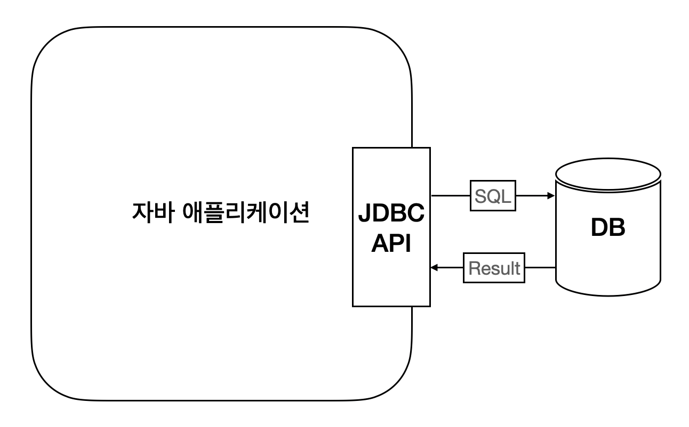
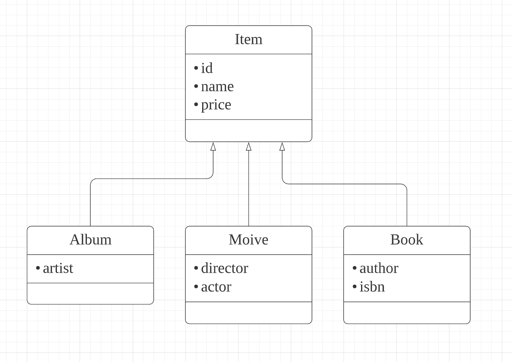
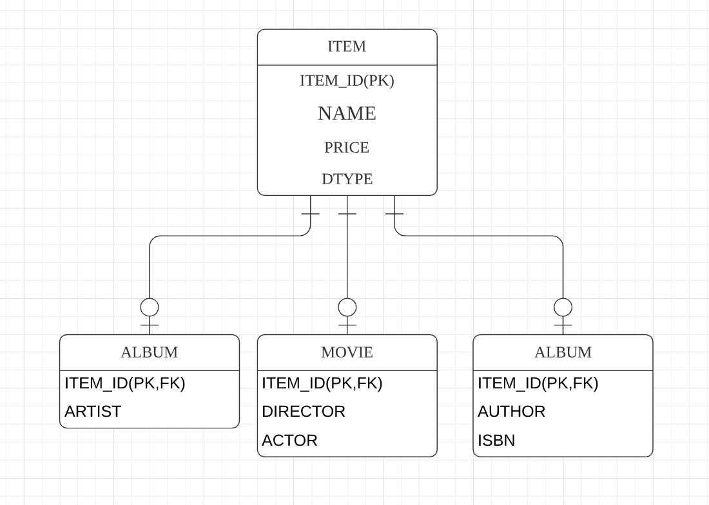
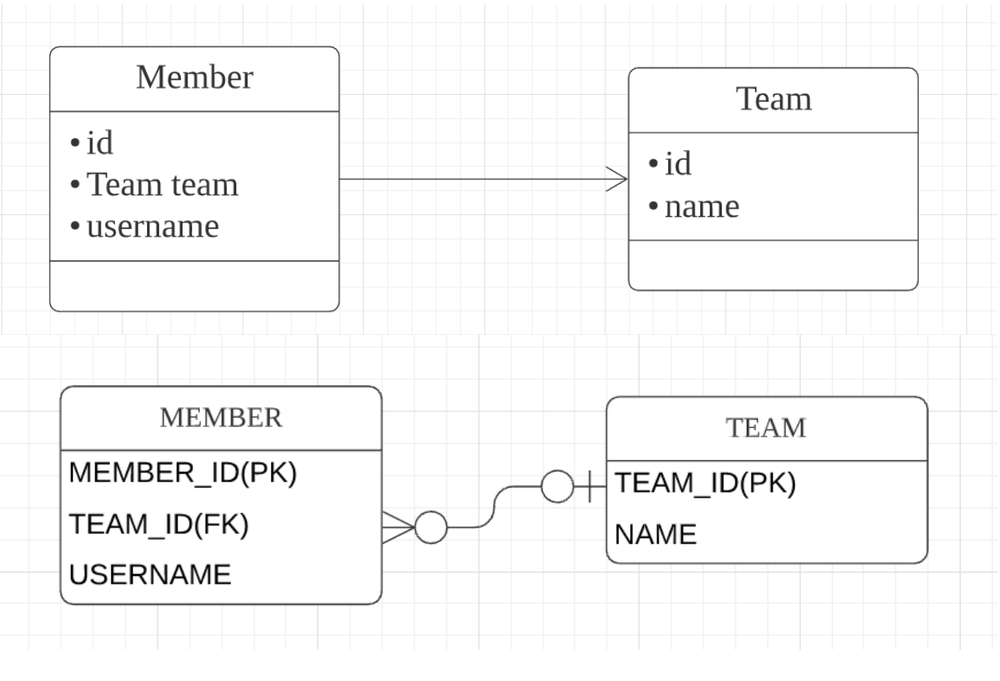
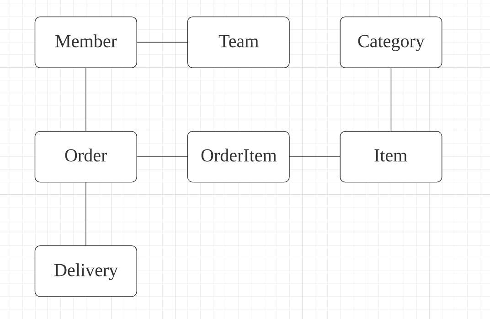
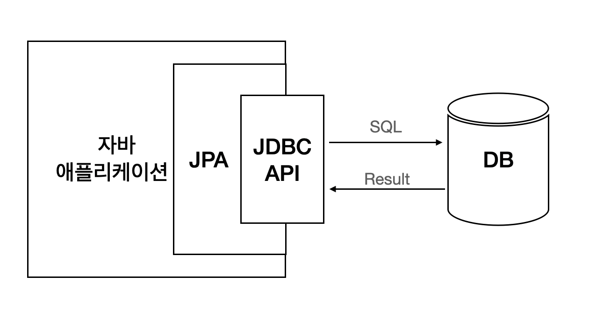

# 1. JPA 소개

**이 글은 자바 ORM 표준 JPA 프로그래밍 을 참고해서 쓴 글입니다.**

## 1.1 SQL을 직접 다룰 때 발생하는 문제점

관계형 데이터베이스는 가장 대중적이고 신뢰할만한 안전한 데이터 저장소이다. 그래서 자바로 개발하는 애플리케이션은 대부분 관계형 데이터베이스를 데이터 저장소로 사용한다. (그림 1.1)

데이터베이스의 데이터를 관리하려면 SQL 을 사용해야 한다. 자바는 JDBC API 를 사용해서 SQL을 데이터베이스에게 전달한다.

 그림 1.1 JDBC API와 SQL

### 1.1.1 반복, 반복 그리고 반복

SQL을 직접 다룰 때의 문제점을 알아보기 위해 회원 관리 기능을 살펴보자

먼저 회원을 조회하는 기능을 개발한다고 생각해보자. 다음과 같은 순서로 진행될것이다.

1. 회원 조회용 SQL을 작성한다.
2. JDBC API를 사용해서 SQL을 실행한다
3. 조회 결과를 Member 객체로 매핑한다.

```java
String sql = "SELECT * MEMBER_ID, NAME FROM MEMBER M WHERE MEMBER_ID = ?"
// set memberId
ResultSet rs = stmt.executeQuery(sql);
String memberId = rs.getString("MEMBER_ID");
String name = rs.getString("NAME");

Member member = new Member(memberId, name);
```

다음은 회원 등록 기능이다

1. 회원 등록용 SQL을 작성한다.
2. 회원 객체의 값을 꺼내서 등록 SQL에 전달한다.
3. JDBC API를 사용해서 SQL을 실행한다.

```java
String sql = "INSERT INTO MEMBER(MEMBER_ID, NAME) VALUES(?, ?)";
pstmt.setString(1, member.getMemberId());
pstmt.setString(2, member.getName());
pstmt.executeUpdate(sql);
```

추가로 회원 삭제, 수정하는 기능도 비슷하게 반복 개발을 진행해야 할것이다. 그런데 만일 회원 객체를 데이터베이스가 아닌 자바 컬레션에 보관한다면 어떻게 될까?

```java
list.add(member);
```

하지만 데이터베이스는 객체 구조와는 다른 데이터 중심의 구조를 가지므로 객체를 데이터베이스에 직접 저장하거나 조회할수는 없다. 따라서 개발자가 애플리케이션과 데이터베이스 중간에서 SQL과 JDBC API를 사용해서 변환 작업을 해주어야한다.

문제는 너무 많은 SQL과 JDBC API를 코드로 작성해야 한다는 점, 비슷한 일을 반복해야한다는 점이다.

### 1.1.2 SQL에 의존적인 개발

앞에서 만든 기능을 완성했다고 가정하자, 그런데 갑자기 회원의 연락처도 함께 저장해달리는 요구사항이 추가 되었다고 생각하자.

회원의 연락처를 추가하려면 회원 테이블에 컬럼을 추가하고, 객체에 필드를 추가하고, INSERT SQL 을 수정 등 수정사항이 많아진다. 당연히 조회, 삭제, 변경도 마찬가지 일것이다.

이번엔 회원이 어떤 한 팀에 필수로 소속되어야 한다는 요구사항이 추가되었고 팀 모듈을 전담하는 개발자가 코드를 커밋을 했고, 소속팀을 출력해본다고 생각하자.

```java
이름: member.getName();
소속 팀: member.getTeam().getTeamName();
```

코드를 실행해보니 값이 null이다. 회원과 연괸된 팀이 없을 것이라 생각하고 데이터베이스를 확인해보니 데이터에는 문제가 없었다.

문제를 확인해보니 회원만 조회하는 find() 메소드와 팀과 함께 조회하는 findWithTeam() 을 만든것이다. 결국 SQL을 확인해서야 find 대신 findWithTeam() 을 사용해야함을 알고 문제를 해결할수 있게 된것이다.

요약하면 SQL을 Data Access Object 에 숨겨도 쿼리를 확인해봐야 한다는 점이다.

Member, Team 처럼 비즈니스 요구사항을 모델링한 객체를 엔티티라 하는데, 지금처럼 SQL에 의존하는 상황에서는 개발자들이 엔티티를 신회하고 사용할 수 없다. 대신 DAO를 직접 확인해서 어떤 SQL이 실행되는지 어떤 객체들이 함께 조회되는지 다 확인해주어야 한다. 즉 논리적으로 엔티티와 SQL이 강한 의존관계를 가진것이다. 이런 강한 의존관계 때문에 엔티티 변경사항에 대해 많은 SQL을 수정해야하는 문제가 발생한다.

* 진정한 의미의 계층 분할이 어렵다.
* 엔티티를 신회할 수 없다.
* SQL에 의존적인 개발을 피하기 어렵다.

### 1.1.3 JPA와 문제 해결

그럼 JPA는 이런 문제를 어떻게 해결하는지 간단히 보자

JPA를 사용하면 객체를 데이터베이스에 저장하고 관리할 때, 개발자가 직접 SQL을 작성하는것이 아니라 JPA가 제공해주는 API를 사용하면 된다. 그러면 JPA가 SQL을 생성해서 DB에 전달해준다.

```java
// 저장 기능
jpa.persist(member);

// 조회 기능
Member member = jpa.find(Member.class, memberId);

// 수정 기능
// JPA 는 별도의 수정 메소드 대신 객체를 조회해서 값을 변경하면 트랜잭션 커밋할 때 적절히 UPDATE
Member member = jpa.find(Member.class, memberId);
member.setName('starlight');

// 연관된 객체 조회
Member member = jpa.find(Member.class, memberId);
Team team = member.getTeam();
```

## 1.2 패러다임의 불일치

객체지향 프로그래밍은 추상화, 캡슐화, 정보은닉, 상소그 다형성 등 시스템의 복잡성을 제어할 수 있는 다양한 장치를 제공해줘 현대의 복잡한 어플리케이션은 대부분 객체지향 언어로 개발한다. 비지니스 요구사항을 정의한 도메인 모델도 객체로 모델링하면 객체지향 언어가 가진 장점들을 활용할수 있는데, 문제는 영구보관을 할때 생긴다. 가장 현실적인 대안은 관계형 데이터베이스에 객체를 저장하는것인데, 이는 데이터 중심으로 구조화되어 있어서 객체를 저장하기에는 서로 목적과 기능 그리고 표현의 차이가 있는데 이를 객체와 관계형 데이터베이스의 패러타임 불일치 문제라 한다.

애플리케이션은 객체 지향 언어로 개발하고 데이터는 관계형 데이터베이스에 저장해야 한다면 개발자는 중간에서 패러다임 불일치 문제를 해결해주어야한다. 그런데 이는 너무 많은 시간과 코드를 소비하는데 있다.

### 1.2.1 상속

그림 1.2 처럼 객체는 상속이라는 기능이 있지만, 테이블은 상속이라는 기능이 없다.

 그림 1.2 객체 상속 모델

그나마 데이터베이스 모델링에서 슈퍼타입 서브타입 관계를 사용하면 유사하게 테이블을 설계할 수 있다. 그림 1.3 에서 ITEM 테이블의 DTYPE 컬럼을 사용해서 어떤 자식 테이블과 관계가 있는지 정의했다.

 그림 1.3 테이블 모델

만일 Album 객체를 저장하려면 다음 두 SQL을 만들어야 한다.

```sql
INSERT INTO ITEM ...
INSERT INTO ALBUM ...
```

JDBC API를 사용해서 이 코드를 완성하려면 부모 객체에서 부모 데이터만 꺼내서 ITEM용 INSERT SQL을 작성하고 자식 객체에서 자식 데이터만 꺼내서 ALBUM 용 INSERT SQL 을 작성해야 하고 자식 타입에 따라 DTYPE도 저장해야한다.

조회도 ITEM 과 ALBUM 테이블을 조인해서 조회한다음 그 결과로 Album 객체를 생성하야한다.

이런 과정이 패러다임의 불일치를 해결하려고 소모하는 비용이다.

#### 1.2.1.1 JPA와 상속

JPA는 상속과 관련된 패러다임의 불일치 문제를 대신 해결해준다. 개발자는 마치 자바 컬렉션에 객체를 저장하듯이 JPA에게 객체를 저장하면 된다.

JPA를 사용해서 Item을 상속한 Album 객체를 앞서 본 persist() 메소드를 사용해서 저장하면 된다

```java
jpa.persist(album);
```

JPA는 알아서 ITEM, ALBUM 테이블에 나누어서 저장한다.

조회도 앞서 사용한 find 메소드를 사용하면 JPA가 두 테이블을 조인해서 그 결과를 반환해준다.

### 1.2.2 연관관계

객체는 참조를 사용해서 다른 객체와 연관관계를 가지고 참조에 접근해서 연관된 객체를 조회하는 반면, 테이블은 외래 키를 사용해서 다른 테이블과 연관관계를 가지고 조인을 사용해서 연관된 테이블을 조회한다.

이 패러다임의 불일치는 객체지향 모델링을 포기하게 만들정도로 극복하게 어렵다. 그림 1.4와 예제를 통해 문제점을 파악해보자

 그림 1.4 연관 관계

Member 객체는 Member.team 필드에 Team 객체의 참조를 보관해서 Team 객체와 관계를 맺는다. 따라서 이 참조 필드에 접근하면 연관된 객체 조회를 할 수 있다.

```java
class Member {
    @Getter
    Team team;
}

class Team {
    // ...
}

member.getTeam(); // member -> team 접근
```

MEMBER 테이블은 MEMBER.TEAM_ID 외래 키 컬럼을 사용해서 TEAM 테이블과 관계를 맺는다. 이 외래 키를 사용해서 두 테이블을 조인하면 연관된 테이블을 조회할 수 있다.

```sql
SELECT M.* T.* FROM MEMBER M JOIN TEAM T ON M.TEAM_ID = T.TEAM_ID
```

추가로 객체는 참조가 있는 방향으로만 조회할 수 있지만, 테이블은 외래키만 있으면 반대 방향도 가능하다는 점이다.

#### 1.2.2.1 객체를 테이블에 맞추어 모델링

객체와 테이블의 차이를 알아보기 위해 다음 코드와 같이 객체를 단순히 테이블에 맞추어 모델링 해보자

```java
class Member {
    String id;
    Long teamId;
    String username;
}

class Team {
    Long id;
    String name;
}
```

MEMBER 테이블의 컬럼을 그대로 가져와서 Member 클래스를 만들었다. 이렇게 객체를 테이블에 맞추어 모델링 하면 객체를 저장하거나 조회할 때는 편리하다. 그러다 테이블의 경우 조인이라는 기능이 있어서 외래키를 그대로 보관하면 좋지만 객체는 참조기능이 없어진다. 즉, 객체지향의 특징을 잃어버리는 것이다.

#### 1.2.2.2 객체지향 모델링

객체는 참조를 통해서 관계를 맺츠므로 다음과 같이 모델링 해야한다.

```java
class Member {
    String id;
    Team team;
    String username;
}

class Team {
    Long id;
    String name;
}
```

Member.team 필드를 보면 연관된 Team의 참조를 보관하므로 객체 참조를 통해 팀을 조회할 수 있다.
하지만 이처럼 모델링하면 객체를 테이블에 저장하거나 조회하기가 쉽지 않다. 객체 모델은 필드로 연관관계를 맺지만, 테이블은 외래키로 연관관계를 맺기 때문이다. 개발자가 중간에서 변환 역활을 해주어야 한다.

먼저 저장을 살펴보면 객체를 데이터베이스에 저장하려면 team 필드를 TEAM_ID 외래 키 값으로 변환해 주어야 한다. 외래 키 값을 찾아서 INSERT SQL을 만들어야 하는데 MEMBER 테이블에 저장해야 할 TEAM_ID 외래 키는 TEAM 테이블의 기본 키 이므로 member.getTeam().getId() 로 구할 수 있다.

조회의 경우 TEAM_ID 외래 키 값을 Member 객체의 team 참조로 변환해서 객체에 보관해야 한다.
먼저 다음과 같은 SQL을 통해 MEMBER, TEAM 을 조회해야 한다.

```sql
SELECT M.*, T.* FROM MEMBER JOIN TEAM T ON M.TEAM_ID = T.TEAM_ID
```

SQL의 결가로 다음 코드처럼 연관관계를 설정해서 반환해주면 된다.

```java
public Member find(String memberId) {
    // SQL 실행
    Member member = new Member();
    // 조회한 회원 관련 정보를 set

    Team team = new Team();
    // 조회한 팀 관련 정보를 set

    member.setTeam(team);
    return member;
}
```

위 코드가 패러다임의 불일치를 해결하기 위해 소모하는 비용이다, 만약 자바 컬렉션에 회원 객체를 저장한다면 이런 비용이 전혀 들지 않는다.

#### 1.2.2.3 JPA와 연관관계

그럼 JPA는 어떻게 패러다임의 불일치 문제를 해결해주는지 보자

```java
member.setTeam(team); // 회원과 팀 연관관계를 설정
jpa.persist(member); // 회원과 연관관계를 함께 저장
```

개발자는 회원과 팀의 연관관계를 설정해주고 회원 객체를 저장하기만 하면 된다. JPA가 알아서 team의 참조를 외래 키로 변환해서 SQL을 만들어준다.

객체를 조회할 때 외래 키를 참조로 변환하는 일도 JPA가 해준다

```java
Member member = jpa.find(Member.class, memberId);
Team team = member.getTeam();
```

### 1.2.3 객체 그래프 탐색

객체에서 회원이 소속된 팀을 조회할 때 다음 처럼 참조를 사용해서 연관된 팀을 찾으면 되는데 이를 객체 그래프 탐색이라고 한다.

```java
Team team = member.getTeam();
```

객체 연관관계 그림 1.5와 같이 설계되어 있다고 가정해보자.

 그림 1.5 객체 연관관계

다음은 객체 그래프를 탐색 하는 코드다

```java
member.getOrder().getOrderItem(); // 자유로운 객체 그래프 탐색
```

객체는 객체 그래프를 마음껏 탐색할 수 있어야한다.

예를 들어 MemberDAO에서 member 객체를 조회할때 다음과 같은 SQL을 실행해서 데이터를 조회했다고 생각해보자

```sql
SELECT M.*, T.* FROM MEMBER M JOIN TEAM T ON M.TEAM_ID = T.TEAM_ID
```

그럼 member.getTeam()은 성공하겠지만 member.getOrder()은 데이터가 없으므로 null이 나오고 다음 그래프를 탐색할 수 없게 된다.

SQL을 직접 다루면 처음 실행하는 SQL에 따라 객체 그래프를 어디까지 탐색할 수 있는지 정해진다.
이 역시 앞에서 엔티티가 SQL에 논리적으로 종속되어 데이터 접근 계층인 DAO를 열어서 SQL을 직접 확인해야 하는 경우다. 그렇다고 항상 모든 객체 그래프를 메모리에 올리는것도 현실성이 없다. 즉, 상황에 따라 MemberDAO에 회원을 조회하는 여러 메소드를 만들어야한다.

#### 1.2.3.1 JPA와 객체 그래프 탐색

JPA를 사용하면 앞에서 생긴 문제를 걱정할 필요가 없다. JPA는 연관된 객체를 사용하는 시점에 적적한 SELECT SQL을 실행해서 문제없이 조회가 가능하다. 이 기능은 실제 객체를 사용하는 시점까지 데이터베이스 조회를 미룬다고 해서 지연 로딩 이라고 한다.

JPA는 이 기능을 옵션으로 주어 연관된 객체를 즉시 함께 조회 가능하도록 해준다.

### 1.2.4 비교

데이터베이스는 기본 키의 값으로 각 row를 구분한다. 반면 객체는 동일성과 동등성 비교라는 두 가지 비교 방법이 있다.

1. 동일성 비교는 == 비교다. 객체 인스턴스의 주소 값을 비교한다.
2. 동등성 비교는 equals() 메소드를 사용해서 객체 내부의 값을 비교한다.

따라서 테이블의 row를 구분하는 방법과 객체를 구분하는 방법에는 차이가 있다.

```java
class MemberDAO {
    public Member getMember(String memberId) {
        String sql = "SELECT * FROM MEMBER WHERE MEMBER_ID = ?";
        // JDBC API, SQL 실행
        return new Member(/*...*/);
    }
}

String memberId = "100";
Member member1 = memberDAO.getMember(memberID);
Member member2 = memberDAO.getMember(memberID);

member1 == member2; // 다르다
```

코드를 보면 기본 키 값이 같은 객체를 두 번 조회했다. 그런데 동일성 비교하면 false가 반환된다. 같은 row를 조회했지만, 객체 측면에서는 둘은 다른 인스턴스이기 때문이다. 만일 객체를 컬렉션에서 조회했다면 비교는 성공했을 것이다.

이런 패러다임의 불일치 문제를 해결하기 위해 데이터베이스의 같은 로우를 조회할 때마다 같은 인스턴스를 반환하도록 구현하는 것은 쉽지 않다. 여기에 여러 트랜잭션이 동시에 실행되는 상황까지 고려하면 문제는 더 어려워진다.

### 1.2.4.1 JPA와 비교

JPA는 같은 트랜잭션일 때 같은 객체가 조회되는 것을 보장한다.

```java
String memberId = "100";
Memeber member1 = jpa.find(Member.class, memberId);
Memeber member2 = jpa.find(Member.class, memberId);

member1 == member2 // true
```

객체 비교하기는 분산 환경이나 트랜잭션이 다른 상황까지 고려하면 더 복잡해진다. 이 부분은 차근차근 알아보자.

## 1.3 JPA란 무엇인가?

JPA는 자바 진영의 ORM 기술 표준이다. 그림 1.6 처럼 애플리케이션과 JDBC 사이에서 동작한다.

 그림 1.6 JPA

ORM은 객체와 관계형 데이터베이스를 매핑해주는 것으로 패러다임의 불일치 문제를 개발자 대신 해결해준다. 만일 객체를 데이터베이스에 저장할 때 INSERT SQL을 직접 작성하는것이 아니라 마지 자바 컬렉션에 저장하듯이 하면 ORM 프레임워크가 Entity분석 후 SQL을 생성해준다.

SQL을 생성해주는것 뿐만 아니라 패더다임 불일치 문제를 해결해줘 객체 측면에서 더 정교한 모델링을 할 수 있고 관계형 데이터베이스는 데이터베이스에 맞도록 모델링하면 된다.

### 1,3,1 JPA 소개

### 1.3.2 왜 JPA를 사용해야 하는가

1. 생산성 : 자바 컬렉션에 객체를 저장하듯이 JPA에게 저장할 객체를 전달해주면 된다. 또한 JPA는 CREATE TABLE 같은 DDL 문을 자동으로 생성해주는 기능도 있다.
2. 유지보수 : SQL을 직접다루면 엔티티에 필드 변경이 일어날시 JDBC API 코드를 모두 변경해주어야한다. 반면 JPA는 이런 과정을 대신 처리해주므로 유지보수 해야하는 코드 수가 줄어든다. 
또한 패러다임의 불일치 문제를 해결해주므로 객체지향 언어가 가진 장점을 활용해서 유연한 도메일 모델을 설계할 수 있다.
3. 패러다임의 불일치 해결 : 상속, 연관관계, 객체 그래프 탐색, 비교 와 같은 문제를 해결해준다.
4. 성능 : JPA는 애플리케이션과 데이터베이스 사이에서 성능 최적화 기회를 제공한다. 이렇게 애플리케이션과 데이터베이스 사이에 계층이 하나 더 있으면 최적화 관점에서 시도해 볼수 있는것들이 많다. 만일 같은 트랜잭션 안에서 같은 회원을 두 번 조회한다고 생각할 때, JDBC API는 요청할때 마다 쿼리가 날라가지만, JPA는 재사용 한다.
5. 데이터 접근 추상화와 벤더 독립성 : 관계형 데이터베이스는 벤더마다 다른 사용법이 있는 경우가 있는데, 이는 처음 선택한 데이터베이스에 종속되고 다른 데이터베이스로 변경하기 어려움을 가질수 있다. 반면 JPA는 추상화를 통해 특정 데이터베이스 기술에 종속되지 않도록 한다.
6. 표준 : JPA는 자바 진영의 ORM 기술 표준이다. 표준을 사용하면 다른 구현 기술로 손쉽게 변경할 수 있다.