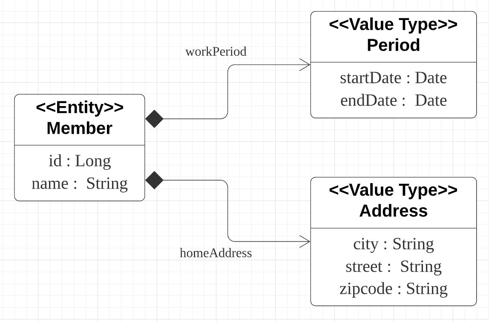
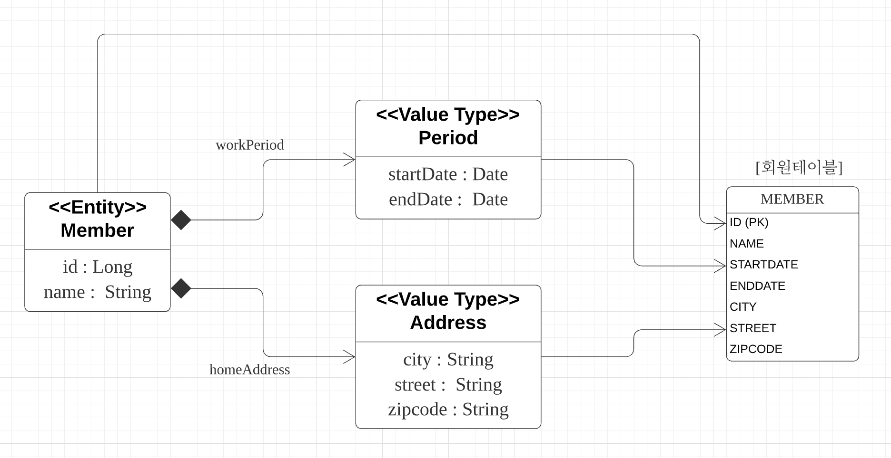
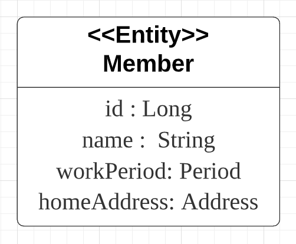
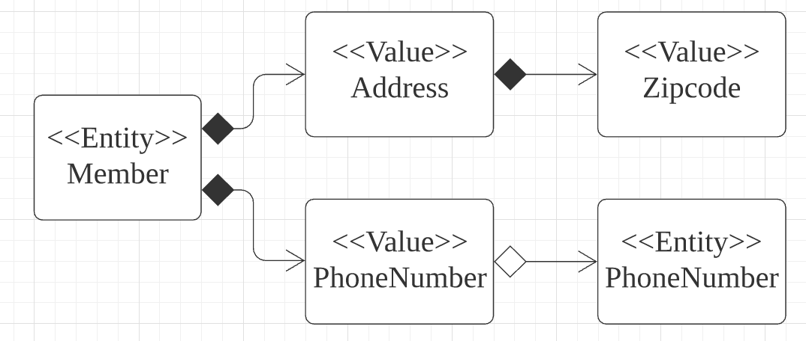
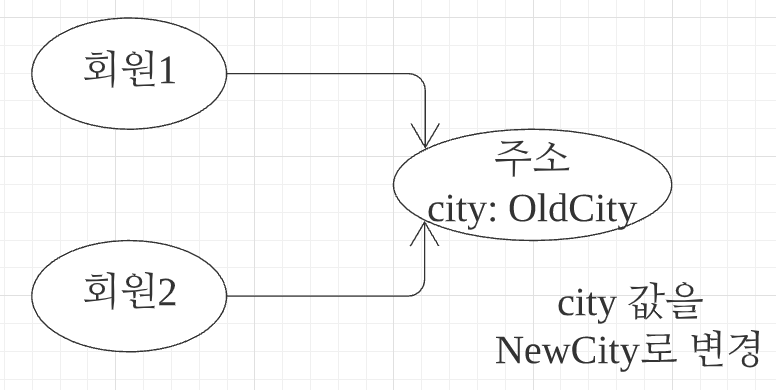
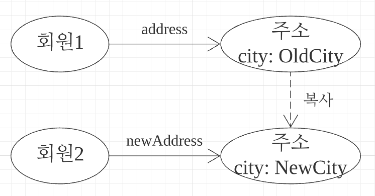
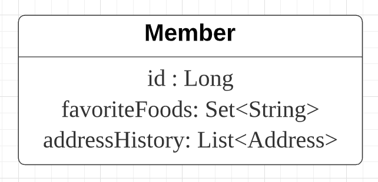
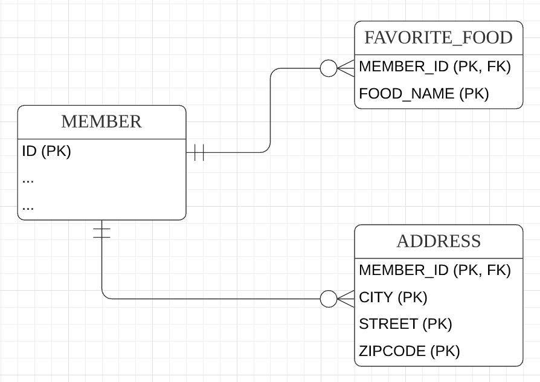

# 값 타입

**이 글은 자바 ORM 표준 JPA 프로그래밍 을 참고해서 쓴 글입니다.**

JPA의 데이터 타입을 가장 크게 분류하면 엔티티 타입과 값 타입으로 나눌 수 있다. 엔티티 타입은 @Entity로 정의하는 객체이고, 값 타입은 int, Integer, String처럼 단순히 값으로 사용하는 자바 기본 타입이나 객체를 말한다. 엔티티 타입은 식별자를 통해 지속해서 추적할 수 있지만, 값 타입은 식별자가 없고 숫자나 문자갑은 속성만 있으므로 추적할 수 없다. 예를 들어 회원 엔티티라는 것은 그 회원의 키나 나이 값을 변경해도 같은 회원이다. 심지어 그 회원의 모든 데이터를 변갱해도 식별자만 유지하면 같은 회원으로 인식할 수 있다. 반면에 숫자 값 100을 200우로 변경하면 완전히 다른 값으로 대체된다. 비유하자면 엔티티 타입은 살아있는 생물이고 값 타입은 단순한 수치 정보다.

값 타입은 다음 3가지로 나눌 수 있다

- 기본값 타입
  - 자바 기본 타입 (예: int, double)
  - 래퍼 클래스 (예: Integer)
  - String
- 임베디드 타입 (복합 값 타입)
- 컬렉션 값 타입

기본값 타입은 String, int처럼 자바가 제공하는 기본 데이터 타입이고 임베디드 타입은 JPA에서 사용자가 직접 정의한 값 타입이다. 마지막으로 컬렉션 값 타입은 하나 이상의 값 타입을 저장할 때 사용한다. 기본값 타입부터 순서대로 알아보자.

## 9.1 기본값 타입

```java
@Entity
public class Member {

    @Id @GeneratedValue
    private Long id;
    private String name;
    private int age;
}
```

Member에서 String, int가 값 타입이다. Member 엔티티는 id라는 식별자 값도 가지고 생명주기도 있지만 값 타입인 name, age 속성은 식별자 값도 없고 생명주기도 회원 엔티티에 의존한다. 따라서 회원 엔티티 인스턴스를 제거하면 name, age 값도 제거된다. 그리고 값 타입은 공유하면 안 된다. 예를 들어 다른 회원 엔티티의 이름을 변경한다고 해서 나의 이름 까지 변경되는 것은 상상하기도 싫을 것이다.

다음은 자바에서 제공하는 기본값 타입이 아닌 직접 값 타입을 정의해보자

_자바에서 int, double 같은 기본 타입은 절대 공유되지 않는다. 예를 들어 a=b 코드는 b의 값을 복사해서 a에 입력한다. 물론 Integer처럼 래퍼 클래스나 String 같은 특수한 클래스도 있다. 이것들은 객체지만 자바언어에서 기본 타입처럼 사용할 수 이쎅 지원하므로 기본값 타입으로 정의했다._

## 9.2 임베디드 타입 (복합 값 타입)

새로운 값 타입을 직접 정의해서 사용할 수 있는데, JPA에서는 이것을 임베디드 타입이라 한다. 중요한 것은 직접 정의한 임베디드 타입도 int, String 처럼 값 타입이라는 것이다.

```java
@Entity
public class Member {

    @Id @GeneratedValue
    private Long id;
    private String name;

    @Temporal(TemporalType.DATE) java.util.Date startDate;
    @Temporal(TemporalType.DATE) java.util.Date endDate;

    private Sting city;
    private String street;
    private String zipcode;
}
```

위 코드는 평번한 엔티티다. 누군가에게 이 엔티티를 설명하라면 이렇게 설명할 것이다.

- 회원 엔티티는 이름, 근무 시작일, 근무 종료일, 주소 도시, 주소 번지, 주소 우편 번호를 가진다.

이런 설명은 단순히 정보를 풀어둔 것뿐이다. 그리고 근무 시작일과 우편번호는 서로 아무 관련이 없다. 이것보단 다음처럼 설명하는 것이 더 명확하다.

- 회원 엔티티는 이름, 근무 기간, 집 주소를 가진다.

회원이 상세한 데이터를 그대로 가지고 있는 것은 객체지향적이지 않으며 응집력만 떨어뜨린다. 대신에 근무 기간, 주소 같은 타입이 있다면 코드가 더 명확해질 것이다. [근무기간, 집 주소]를 가지도록 임베디드 타입을 사용해보자.

```java
@Entity
public class Member {

    @Id @GeneratedValue
    private Long id;
    private String name;
    
    @Embedded 
    Period workPeriod

    @Embedded
    Address homeAddress
}

@Embeddable
public class Period {

    @Temporal(TemporalType.DATE) java.util.Date startDate;
    @Temporal(TemporalType.DATE) java.util.Date endDate;

    public boolean isWork(Date date) {
        // 값 타입을 위한 메소드를 정의할 수 있다.
    }
}

@Embeddable
public class Address {
    @Column(name = 'city')
    private String city;
    private String street;
    private String zipcode;
}
```

 그림 9.1 회원-컴포지션 관계 UML

---

코드를 보면 회원 엔티티가 더욱 의미 있고 응집력 있게 변한 것을 알 수 있다.

새로 정의한 값 타입들은 재사용할 수 있고 응집도도 아주 높다. 또한 Period.isWork()처럼 해당 값 타입만 사용하는 의미 있는 메소드도 만들 수 있다. 임베디드 타입을 사용하려면 다음 2가지 어노테이션이 필요한데, 둘 중 하나는 생략해도 된다.

- @Embeddable: 값 타입을 정의하는 곳에 표시
- @@Embedded: 값 타입을 사용하는 곳에 표시

그리고 임베디드 타입은 기본 생성자가 필수다. 임베디드 타입을 포함한 모든 값 타입은 엔티티의 생명주기에 의존하므로 엔티티와 임베디드 타입의 관계를 UML로 표현하면 컴포지션 관계가 된다.

_하이버네이트는 임베디드 타입을 컴포넌트라 한다._

### 9.2.1 임베디드 타입과 테이블 매핑

임베디드 타입을 데이터베이스 테이블에 어떻게 매핑하는지 그림 9.2를 통해 알아보자

 그림 9.2 회원-테이블 매핑

---

임베디드 타입은 엔티티의 값일 뿐이다. 따라서 값이 속한 엔티티의 테이블에 매핑한다. 예제에서 임베디드 타입을 사용하기 전과 후에 매핑하는 테이블은 같다.

임베디드 타입 덕분에 객체와 테이블을 아주 세밀하게 매핑하는 것이 가능하다. 잘 설계한 ORM 애플리케이션은 매핑한 테이블의 수보다 클래스의 수가 더 많다.

ORM을 사용하지 않고 개발하면 테이블 컬럼과 객체 필드를 대부분 1:1로 매핑한다. 주소나 근무 기간 같은 값 타입 클래스를 만들어서 더 객체지향적으로 개발 하고 싶어도 SQL을 직접 다루면 테이블 하나에 클래스 하나를 매핑하는 것도 고단한 작업인데 테이블 하나에 여러 클래스를 매핑하는 것은 상상하기도 싫을 것이다. 이런 지루한 반복 작업은 JPA에 맡기고 더 세밀한 객체지향 모델을 설계하는 데 집중하자.

UML에서 임베디드 값 타입은 그림 9.3처럼 기본 타입처럼 단순하게 표현하는 것이 편리하다.

 그림 9.3 회원-값타입 UML 단순한 표현

---

### 9.2.2 임베디드 타입과 연관관계

임베디드 타입은 값 타입을 포함하거나 엔티티를 참조할 수 있다. JPA 표준 명세가 제공하는 다음 코드와 그림 9.4로 임베디드 타입의 연관관계를 알아보자

_엔티티는 공윧힐 수 있으므로 참조한다고 표현하고, 값 타입은 특정 주인에 소속되고 논리적인 개념상 공유되지 않으므로 포함한다고 표현했다._

 그림 9.4 임베디드 타입과 연관관계

---

```java
@Entity
public class Member {

    @Embedded
    private Address address;

    @Embedded
    private PhoneNumber phoneNumber;
}

@Embeddable
public class Address {

    String street;
    String city;
    String state;

    @Embedded 
    private Zipcode zipcode;
}

@Embeddable
public class ZipCode {

    String zip;
    String plusFour;
}

@Embeddable
public class PhoneNumber {

    String areaCode;
    String localNumber;

    @ManyToOne
    private PhoneServiceProvider provider;
}

@Entity
public class PhoneServiceProvider {
    @Id
    private String name;
}
```

코드를 보면 값 타입인 Address가 값 타입인 Zipcode를 포함하고, 값 타입인 PhoneNumber가 엔티티 타입인 PhoneServiceProvider를 참조한다.

### 9.2.3 @AttributeOverride: 속성 재정의

임베디드 타입에 정의한 매핑정보를 재정의하려면 엔티티에 @AttributeOverride를 사용하면 된다. 예를 들어 회언에게 주소가 하나 더 필요하면 어떻게  해야 할까?

```java
@Entity
public class Member {

    @Id @GeneratedValue
    private Long id;
    private String name;

    @Embedded 
    private Address homeAddress;

    @Embedded 
    private Address companyAddress;
}
```

Member 엔티티를 보면 집 주소에 회사 주소를 하나 더 추가했다. 문제는 테이블에 매핑하는 컬럼명이 중복되는 것이다. 이때는 다음 코드와 같이 @AttributeOverride를 사용해서 매핑정보를 재정의해야 한다.

```java
@Entity
public class Member {

    @Id @GeneratedValue
    private Long id;
    private String name;

    @Embedded 
    private Address homeAddress;

    @Embedded
    @AttributeOverrides({
        @@AttributeOverride(name="city", column=@Column(name = "COMPANY_CITY")),@@AttributeOverride(name="street", column=@Column(name = "COMPANY_STREET")),@@AttributeOverride(name="zipcode", column=@Column(name = "COMPANY_ZIPCODE"))
    })
    private Address companyAddress;
}
```

```SQL
CREATE TABLE MEMBER {
    COMPANY_CITY varchar(255),
    COMPANY_STREET varchar(255),
    COMPANY_ZIPCODE varchar(255),
    city varchar(255),
    street varchar(255),
    zipcode varchar(255),
}
```

@AttributeOverride를 사용하면 어노테이션을 너무 많이 사용해서 엔티티 코드가 지저분해진다. 다행히도 한 엔티티에 같은 임베디드 타입을 중복해서 사용하는 일은 많지 않다.

_@AttributeOverrides는 엔티티에 설정해야 한다. 임베디드 타입이 임베디드 타입을 가지고 있어도 엔티티에 설정해야 한다._

### 9.2.4 임베디드 타입과 null

임베디드 타입이 null이면 매핑한 컬럼 값은 모두 null이 된다.

```java
member.setAddress(null);
em.persist(member);
```

회원 테이블의 주소와 관련된 CITY, STREET, ZIPCODE 컬럼 값은 모두 null이 된다.

## 9.3 값 타입과 불변 객체

값 타입은 복잡한 객체 세상을 조금이라도 단순화하려고 만든 개념이다. 따라서 값 타입은 단순하고 안전하게 다룰 수 있어야 한다.

### 9.3.1 값 타입 공유 참조

임베디드 타임 같은 값 타입을 여러 엔티티에서 공유하면 위험하다. 공우하면 어떤 문제가 발생하는지 알아보자

 그림 9.5 값 타임 공유 참조

---

그림 9,5의 상황을 코드로 나타내면 다음과 같다.

```java
public static void main() {
    // ...
    member1.setHomeAddress(new Address("OldCity"));
    Address address = member1.getHomeAddress();

    address.setCity("NewCity");
    member2.setHomeAddress(address);
}
```

회원2에 새로운 주소를 할당하려고 회원1의 주소를 그대로 참조해서 사용했다. 이 코드를 실행하면 어떻게 될까? 회원2의 주소만 "NewCity"로 변경되길 기대했지만 회원1의 주소도 "NewCity"로 변경되어 버린다. 그림 9.5를 보면 회원1과 회원2가 같은 address 인스턴스를 참조하기 때문이다. 영속성 컨텍스트는 회원1과 회원2 둘 다 city 속성이 변경된 것으로 판단해서 회원1, 회원2 각각 UPDATE SQL을 실행한다.

이러한 공유 참조로 인해 발생하는 버그는 정말 찾아내기 어렵다. 이렇듯 뭔가를 수정했는데 전혀 예상치 못한 곳에서 문제가 발생하는 것을 side effect라 한다. 이런 side effect를 막으려면 값을 복사해서 사용하면 된다.

### 9.3.2 값 타입 복사

값 타입의 실제 인스턴스인 값을 공유하는 것은 위험하다. 대신에 값을 복사해서 사용해야 한다.

 그림 9.6 값 타입 복사

---

그림 9.6의 상황을 코드로 나타내면 다음과 같다.

```java
public static void main() {
    // ...
    member1.setHomeAddress(new Address("OldCity"));
    Address address = member1.getHomeAddress();

    // 회원1의 address 값을 복사해서 새로운 newAddress 값을 생성
    Address newAddress = address.clone();

    newAddress.setCity("NewCity");
    member2.setHomeAddress(newAddress);
}
```

회원2에 새로운 주소를 할당하기 위해 clone() 메소드를 만들었는데, 이 메소드는 자신을 복사해서 반환하도록 구현했다. 따라서 그림 9.6을 보면 회원1의 주소 인스턴스를 복사해서 사용한다. 이 코드를 실행하면 의도한 대로 회원2의 주소만 "NewCity"로 변경한다. 그리고 영속성 컨텍스트는 회원2의 주소만 변경된 것으로 판단해서 회원2에 대해서만 UPDATE SQL을 실행한다.

이처럼 항상 값을 복사해서 사용하면 공유 참조로 인해 발생하는 부작용을 피할수 있다. 문제는 임베디드 타입처럼 직접 정의한 값 타입은 자바의 기본 타입이 아니라 객체 타입이라는 것이다. 자바는 기본 타입에 값을 대입하면 값을 복사해서 전달한다.

```java
int a = 10;
int b = a;
b = 4;
```

이 코드의 최종 결과는 a = 10, b = 4 다. b = a의 값 10을 복사해서 b에 넘겨준다. 따라서 a, b는 완전히 독립된 값을 가지고 부작용도 없다.

문제는 Address 같은 객체 타입이다. 자바는 객체에 값을 대입하면 항상 참조값을 전달한다.

```java
Address a = new Address("old");
Address b = a; // 객체 타입은 항상 참조 값을 전달한다.
b.setCity("New");
```

Address b = a 에서 a가 참조하는 인스턴스의 참조 값을 b에 넘겨준다. 따라서 a와 b는 같은 인스턴스를 공유 참조한다. 마지막 줄의 b.setCity("New") 의 의도는 b.city 값만 변경하려 했지만 공유 참조로 인해 부작용이 발생해서 a.city 값도 변경된다.

물론 객체를 대입할 때마다 인스턴스를 복사해서 대입하면 공유 참조를 피할 수 있다. 문제는 복사하지 않고 원본의 참조 값을 직접 넘기는 것을 막을 방법이 없다는 것이다. 자바는 대입하려는 것이 값 타입인지 아닌지는 신경 쓰지 않는다. 단지 자바 기본 타입이면 값을 복사해서 넘기고, 객체면 참조를 넘길 뿐이다.

```java
Address a = new Address("Old");
Address b = a.clone(); // 항상 복사해서 넘겨야 한다.
// Address b = a; // 이렇게 참조만 넘기면 부작용이 발생할 수 있다.
b.setCity("New");
```

객체의 공유 참조는 피할 수 없다. 따라서 근본적인 해결책이 필요한데 가장 단순한 방법은 객체의 값을 수정하지 못하게 막으면 된다. 예를 들어 Address 객체의 setCity() 같은 수정자 메소드를 모두 제거하자. 이렇게 하면 공유 참조를 해도 값을 변경하지 못하므로 부작용의 발생을 막을 수 있다.

### 9.3.3 불변 객체

값 타입은 부작용 걱정 없이 사용할 수 있어야 한다. 부작용이 일어나면 값 타입이라 할 수 없다. 객체를 불변하게 만들면 값을 수정할 수 없으므로 부작용을 원천 차단할 수 있다. 따라서 값 타입은 될 수 있으면 불변 객체로 설계해야 한다.

한 번 만들면 절대 변경할 수 없는 객체를 불변 객체라 한다. 불변 객체의 값은 조회할 수 있지만 수정할 수 없다. 불변 객체도 결국은 객체다. 따라서 인스턴스의 참조 값 공유를 피할 수 없다. 하지만 참조 값을 공유해도 인스턴스의 값을 수정할 수 없으므로 부작용이 발생하지 않는다.

불변 객체를 구현하는 다양한 방법이 있지만 가장 간단한 방법은 생성자로만 값을 설정하고 수정자를 만들지 않으면 된다. Address를 불변 객체로 만들어보자

```java
@Embeddable
@Getter
public class Address {
    private String city;

    protected Address() {} // JPA에서 기본 생성자는 필수다.

    // 생성자로 초기 값을 설정한다.
    public Address(String city) {
        this.city = city;
    }

}

public static void main() {
    // ...
    Address address = member1.getHomeAddress();
    // 회원1의 주소값을 조회해서 새로운 주소값을 생성
    Address newAddress = new Address(address.getCity());
    member2.setHomeAddress(newAddress);
}
```

Address는 이제 불변 객체다. 값을 수정할 수 없으므로 공유해도 부작용이 발생하지 않는다. 만약 값을 수정해야 하면 새로운 객체를 생성해서 사용해야 한다. 참고로 Integer, String은 자바가 제공하는 대표적인 불변 객체다. 즉, 불변이라는 작은 제약으로 부작용이라는 큰 재앙을 막을 수 있다.

## 9.4 값 타입의 비교

다음 예쩨를 통해 값 타입을 어떻게 비교하는지 알아보자

```java
int a = 10;
int b = 10;

Address a = new Address("서울시", "종로구", "1번지");
Address b = new Address("서울시", "종로구", "1번지");
```

- int a의 숫자 10과 int b의 숫자 10은 같다고 표현한다.
- Address a와 Address b는 같다고 표현한다.

자바가 제공하는 객체 비교는 2가지다.

- 동일성(Identity) 비교: 인스턴스의 참조 값을 비교, == 사용
- 동등성(Equivalence) 비교: 인스턴스의 값을 비교, equals() 사용

Address 값 타임을 a == b 로 동일성 비교하면 둘은 서로 다른 인스턴스이므로 결과는 거짓이다. 하지만 이것은 개다하는 결과가 아니다 값 타입은 비록 인스턴스가 달라도 그 안에 값이 같으면 같은 것으로 봐야 한다. 따라서 값 타입을 비교할 때는 a.equals(b)를 사용해서 동등성 비교를 해야 한다. 물론 Address의 equals() 메소드를 재정의해야 한다.

값 타입의 equals() 메소드를 재정의할 때는 보통 모든 필드의 값을 비교하도록 구현한다.

_자바에서 equals() 재정의하면 hashCode()도 재정의하는 것이 안전하다. 그렇지 않으면 해시를 사용하는 컬렉션(HashSet, HashMap)이 정상 동작하지 않는다. 자바 IDE에는 대부분 equals, hashCode 메소드를 자동으로 생성해주는 기능이 있다._

## 9.5 값 타입 컬렉션

값 타입을 하나 이상 저장하려면 컬렉션에 보관하고 @ElementCollection, @CollectionTable 어노테이션을 사용하면 된다.

```java
@Entity
public class Member {

    @Id @GeneratedValue
    private Long id;

    @Embedded
    private Address homeAddress;

    @ElementCollection
    @CollectionTable(name = 'FAVORITE_FOODS', joinColumns = @JoinColumn(name = "MEMBER_ID"))
    @Column(name = "FOOD_NAME")
    private Set<String> favoriteFodds = new HashSet<String>();

    @ElementCollection
    @CollectionTable(name = 'ADDRESS', joinColumns = @JoinColumn(name = "MEMBER_ID"))
    private List<Address> addressHistory = new ArrayList<Address>();
    // ...
}

@Embeddable
public class Address {
    
    @Column
    private Strint city;
    private String street;
    private String zipcode;
    // ...
}
```

 그림 9.7 값 타입 컬렉션 UML

---

 그림 9.8 값 타입 컬렉션 ERD

---

Member 엔티티를 보면 값 타입 컬렉션을 사용하는 favoriteFoods, addressHistory에 @ElementCollection을 지정했다. 그림 9.7은 객체의 UML을 표시했다.

favoriteFoods는 기본값 타입은 String을 컬렉션으로 가진다. 이것을 데이터베이스 테이블로 매핑해야 하는데 관계형 데이터베이스의 테이블은 컬럼안에 컬렉션을 포함할 수 없다. 따라서 그림 9.8처럼 별도의 테이블을 추가하고 @CollectionTable를 사용해서 추가한 테이블을 매핑해야 한다. 그리고 favoriteFoods 처럼 값으로 사용되는 컬럼이 하나면 @Column을 사용해서 컬럼명을 지정할 수 있다.

addressHistory는 임베디드 타입인 Address를 컬렉션으로 가진다. 이것도 마찬가지로 별도의 테이블을 사용해야 한다. 그리고 테이블 매핑정보는 @AttributeOverride를 사용해서 재정의할 수 있다.

_@CollectionTable를 생략하면 기본값을 사용해서 매핑한다. 기본값: {엔티티이름}_{컬렉션 속성 이름}. 예를 들어 Member 엔티티의 addressHistory는 Member_addressHistory 테이블과 매핑한다._

### 9.5.1 값 타임 컬렉션 사용

```java
public static void main() {
    Member member = new Member();

    // 임베디드 값 타입
    member.setHomeAddress(new Address("통영", "몽돌해수욕장", "660-123"));

    // 기본값 타입 컬렉션
    member.getFavoriteFoods().add("짬뽕");
    member.getFavoriteFoods().add("짜장");
    member.getFavoriteFoods().add("탕수육");

    // 임베디드 값 타입 컬렉션
    member.getAddressHistory().add(new Address("서울", "강남", "123-123"));
    member.getAddressHistory().add(new Address("서울", "강북", "000-000"));

    em.persist(member);
}
```

등록하는 코드를 보면 마지막에 member 엔티티만 영속화 했다. JPA는 이 때 member 엔티티의 값 타입도 함께 저장한다. 실제 데이터베이스에 실행되는 INSERT SQL은 다음과 같다.

- member: INSERT SQL 1번
- member.homeAddress: 컬렉션이 아닌 임베디드 값 타임이므로 회원테이블을 저장하는 SQL에 포함된다.
- member.favoriteFoods: INSERT SQL 3번
- member.addressHistory: INSERT SQL 2번

따라서 em.persist(member) 한 번 호출로 총 6번의 INSERT SQL을 실행한다.

```SQL
INSERT INTO MEMBER (ID, CITY, STREET, ZIPCODE) VALUES (1, '통영', '뭉돌해수욕장', '660-123')
INSERT INTO FAVORITE_FOODS (MEMBER_ID, FOOD_NAME) VALUES (1, "짬뽕")
INSERT INTO FAVORITE_FOODS (MEMBER_ID, FOOD_NAME) VALUES (1, "짜장")
INSERT INTO FAVORITE_FOODS (MEMBER_ID, FOOD_NAME) VALUES (1, "탕수육")
INSERT INTO ADDRESS (MEMBER_ID, CITY, STREET, ZIPCODE) VALUES (1, '서울', '강남', 
'123-123')
INSERT INTO ADDRESS (MEMBER_ID, CITY, STREET, ZIPCODE) VALUES (1, '서울', '강북', 
'000-000')
```

_값 타임 컬렉션은 영속성 전이(Cascade) + 고아 객체 제거(ORPHAN REMOVE) 기능을 필수로 가진다고 볼 수 있다._

값 타임 컬렉션도 조회할 때 페치 전략을 선택할 수 있는데 LAZY가 기본이다.

```java
@ElementCollection(fetch = FetchType.LAZY)
```

지연 로딩으로 모두 설정했다고 가정하고 다음 코드를 보자

```java
// SQL: SELECT ID, CITY, STREET, ZIPCODE FROM MEMBER WHERE ID = 1
Member member = em.find(Member.class, 1L); // 1. member

// 2. member.homeAddress
Address homeAddress = member.getHomeAddress();

// 3. member.favoriteFoods
Set<String> favoriteFoods = member.getFavoriteFoodes(); // LAZY

// SQL: SELECT MEMBER_ID, FOOD_NAME FROM FAVORITE_FOODS
// WHERE MEMVER_ID = 1
for (String favoriteFood : favoriteFoods) {
    System.out.println("favoriteFood = " + favoriteFood);
}

// 4. member.addressHistory
List<Address> addressHistory = member.getAddressHistory(); // LAZY

// SQL: SELECT MEMBER_ID, CITY, STREET, ZIPCODE FROM ADDRESS
// WHERE MEMBER_ID = 1
addressHistory.get(0);
```

호출하는 SELECT SQL은 다음과 같다.

- member: 회원만 조회한다. 이때 임베디드 값 타임인 homeAddress도 함께 조회한다. SELECT SQL을 1번 호출한다.
- member.homeAddress: 1번에서 회원을 조회할 때 같이 조회해 둔다.
- member.favoriteFoods: LAZY로 설정해서 실제 컬렉션을 사용할 때 SELECT SQL을 1번 호출한다.
- member.addressHistory: LAZY로 설정해서 실제 컬렉션을 사용할 때 SELECT SQL을 1번 호출한다.

이번에는 값 타입 컬렉션을 수정하면 어떻게 되는지 알아보자.

```java
Member member = em.find(Member.class, 1L);

// 1. 임베드디 값 타임 수정
member.setHomeAddress(new Address("새로운도시", "신도시1", "123456"));

// 2. 기본값 타임 컬렉션 수정
Set<String> favoriteFoods = member.getFavoriteFoods();
favoriteFoods.remove("탕수육");
favoriteFoods.add("치킨");

// 3. 임베디드 값 타입 컬렉션 수정
List<Address> addressHistory = member.getAddressHistory();
addressHistory.remove(new Address("서울", "기존 주소", "123-123"));
addressHistory.add(new Address("새로운 도시", "새로운 주소", "123-456"));
```

- 임베디드 값 타임 수정: homeAddress 임베디드 값 타임은 MEMBER 테이블과 매핑했으므로 MEMBER 테이블만 UPDATE한다. 사실 MEMBER 엔티티를 수정하는 것과 같다.
- 기본값 타입 컬렉션 수정: 탕수육을 치킨으로 변경하려면 탕수육을 제거하고 치킨을 추가해야 한다. 자바의 String 타입은 수정할 수 없다.
- 임베디드 값 타입 컬렉션 수정: 값 타입은 불변해야 한다. 따라서 컬렉션에서 기존 주소를 삭제하고 새로운 주소를 등록했다. 참고로 타입은 equals, hashcode를 꼭 구현해야 한다.

### 9.5.2 값 타입 컬렉션의 제약사항

엔티티는 식별자가 있으므로 엔티티의 값을 변경해도 식별자로 데이터베이스에 저장된 원본 데이터를 쉽게 찾아서 변경할 수 있다. 반면에 값 타입은 식별자라는 개념이 없고 단순한 값들의 모음이므로 값을 변경해버리면 데이터베이스에 저장된 원본 데이터를 찾기는 어렵다.

특정 엔티티 하나에 소속된 값 타입은 값이 변경되어도 자신이 소속된 엔티티를 데이터베이스에서 찾고 값을 변경하면 된다. 문제는 값 타입 컬렉션이다. 값 타입 컬렉션에 보관된 값 타입들은 별도의 테이블에 보관된다. 따라서 여기에 보관된 값 타입의 값이 변경되면 데이터베이스에 있는 원본 데이터를 찾기 어렵다는 문제가 있다.

이런 문제로 인해 JPA 구현체들은 값 타입 컬렉션에 변경 사항이 발생하면, 값 타입 컬렉션이 매핑된 테이블의 연관된 모든 데이터를 삭제하고, 현재 값 타입 컬렉션 객체에 있는 모든 값을 데이터베이스에 다시 저장한다.

예를 들어 식별자가 100번인 회원이 관리하는 주소 값 타입 컬렉션을 변경하면 다음 SQL 같이 테이블에서 회원 100번과 관련된 모든 주소 데이터를 삭제하고 현재 값 타입 컬렉션에 있는 값을 다시 저장한다. 여기서는 현재 값 타입 컬렉션에 주소가 2건 있어서 2번 INSERT되었다.

```SQL
DELETE FROM ADDRESS WHERE MEMBER_ID = 100
INSERT INTO ADDRESS (MEMBER_ID, CITY, STREET, ZIPCODE) VALUES (100, ...)
INSERT INTO ADDRESS (MEMBER_ID, CITY, STREET, ZIPCODE) VALUES (100, ...)
```

따라서 실무에서는 값 타입 컬렉션이 매핑된 테이블에 데이터가 많다면 값 타입 컬렉션 대신에 일대다 관계를 고려해야 한다.

추가로 값 타입 켈렉션을 매핑하는 테이블은 모든 컬럼을 묶어서 기본 키를 구성해야 한다. 따라서 데이터베이스 기본 키 제약 조건으로 인해 컬럼에 null을 입력할 수 없고, 값은 값을 중복해서 저장할 수 없는 제약도 있다.

지금까지 설명한 문제를 해결하려면 값 타입 컬렉션을 사용하는 대신에 다음 코드처럼 새로운 엔티티를 만들어서 일대다 관계로 설정하면 된다. 여기에 추가로 영속성 전이(Cascade) + 고아 객체 제거(ORPHAN REMOVE) 기능을 적용하면 값 타입 컬렉션처럼 사용할 수 있다.

```java
@Entity
public class AddressEntity {

    @Id @GeneratedValue
    private Long id;

    @Embedded Address address;

    // ...
}

@Entity
public class Member {
    // ...

    @OneToMany(cascade = CascadeType.ALL, orphanRemoval = true)
    @JoinColumn(name = "MEMBER_ID")
    private List<AddressEntity> addressHistory = new ArrayList<AddressEntity>();
}
```

_값 타입 컬렉션을 변경했을 때 JPA 구현체들은 테이블의 기본 키를 식별해서 변경된 내용만 반영하려고 노력한다. 하지만 사용하는 컬렉션이나 여러 조건에 따라 기본 키를 식별할 수도 있고 식별하지 못할 수도 있다. 따라서 값 타입 컬렉션을 사용할 때는 모두 삭제하고 다시 저장하는 최악의 시나리오를 고려하면서 사용해야 한다. 값 타입 컬렉션의 최적화에 관한 내용은 각 구현체의 설명서를 참고하자._

## 9.6 정리

엔티티 타입과 값 타입의 특징은 다음과 같다.

### 엔티티 타입의 특징

- 식별자(@Id)가 있다.
  - 엔티티 타입은 식별자가 있고 식별자로 구별할 수 있다.
- 생명 주기가 있다.
  - 생성하고, 영속화하고, 소멸하는 생명 주기가 있다.
  - em.persist(entity)로 영속화한다.
  - em.remove(entity)로 제거한다.
- 공유할 수 있다.
  - 참조 값을 공유할 수 있다. 이것을 공유 참조라 한다.
  - 예를 들어 회원 엔티티가 있다면 다른 엔티티에서 얼마든지 회원 엔티티를 참조할 수 있다.

### 값 타입의 특징

- 식별자가 없다
- 생명 주기를 엔티티에 의존한다.
  - 스스로 생명주기를 가지지 않고 엔티티에 의존한다. 의존하는 엔티티를 제거하면 같이 제거 된다.
- 공유하지 않는 것이 안전하다.
  - 엔티티 타입과는 다르게 공유하지 않는 것이 안전하다. 대신에 값을 복사해서 사용해야 한다.
  - 오직 하나의 주인만이 관리해야 한다.
  - 불변 객체로 만드는 것이 안전하다.

값 타입은 정말 값 타입이라 판단될 때만 사용해야 한다. 특히 엔티티와 값 타입을 혼동해서 엔티티를 값 타입으로 만들면 안된다. 식별자가 필요하고 지속해서 값을 추적하고 구분하고 변경해야 한다면 그것은 값 타입이 아닌 엔티티다.
