# 7. 고급매핑

**이 글은 자바 ORM 표준 JPA 프로그래밍 을 참고해서 쓴 글입니다.**

이 장에서 다룰 고급 매핑은 다음과 같다.

- 상속 관계 매핑: 객체의 상속 관계를 데이터베이스에 어떻게 매핑하는지 다룬다.
- @MappedSuperclass: 등록일, 수정일 같이 여러 엔티티에서 공통으로 사용하는 매핑 정보만 상속빋고 싶으면 이 기능을 사용하면 된다.
- 복합 키와 식별 관계 매핑: 데이터베이스의 식별자가 하나 이상일 때 매핑하는 방법을 다룬다. 여기서 식별 관계와 비식별 관계에 대해서도 다룬다.
- 조인 테이블: 테이블은 외래 키 하나로 연관관계를 맺을 수 있지만 연관관계를 관리하는 연결 테이블을 두는 방법도 있다. 여기서 이 연결 테이블을 매핑하는 방법을 다룬다.
- 엔티티 하나에 여러 테이블 매핑하기: 보통 엔티티 하나에 테이블 하나를 매핑하지만 엔티티 하나에 여러 테이블을 매핑하는 방법도 있다.

## 7.1 상속 관계 매핑

관계형 데이터베이스에는 객체지향 언어에서 다루는 상속이라는 개념이 없다. 대신 슈퍼타입 서브타입 관계 라는 모델링 기법이 객체의 상속 개념과 가장 유사하다. ORM에서 이야기하는 상속 관계 매핑은 객체의 상속 구조와 데이터베이스의 슈퍼타입 서브타입 관계를 매핑하는 것이다.

 그림 7.2 객체 상속 모델

슈퍼타입 서브타입 논리 모델을 실제 물리 모델인 테이블로 구현할 때는 3가지 방법을 선택할 수 있다.

- 각각의 테이블러 변환: 그림 7.3과 같이 각각을 모두 테이블로 만들고 조회할 때 조인을 사용한다. JPA에서는 조인 전력이라 한다.
- 통합 테이블러 변환: 그립 7.4와 같이 테이블을 하나만 사용해서 통합한다. JPA에서는 단일 테이블 전략이라 한다.
- 서브타입 테이블로 변환: 그림 7.5와 같이 서브 타입마다 하나의 테이블을 만든다. JPA에서는 구현 클래스마다 테이블 전략이라 한다.

### 7.1.1 조인 전략

조인 전략은 그림 7.3과 같이 엔티티 각각을 모두 테이블로 만들고 자식 테이블이 부모 테이블의 기본 키를 받아서 기본 키 + 외래 키로 사용하는 전략이다. 따라서 조회할 때 조인을 자주 사용한다. 이 전략의 주의할 점은 객체는 타입으로 구분할 수 있지만 테이블은 타입의 개념이 없다. 따라서 타입을 구분하는 컬럼을 추가해야 한다.

 그림 7.3 JOINED TALBE

```java
@Entity
@Inheritance(strategy = InheritanceType.JOINED)
@DiscriminatorColumn(name = "DTYPE")
public abstract class Item {
    @Id @GeneratedValue
    @Column(name = "ITEM_ID")
    private Long id;

    private String name;
    private int price;
}

@Entity
@DiscriminatorValue("A")
public class Album extends Item {
    private String artist;
}

@Entity
@DiscriminatorValue("M")
public class Movie extends Item {
    private String director;
    private String actor;
}
```

- @Inheritance(strategy = InheritanceType.JOINED): 상속 매핑은 부모 클래스에 @Inheritance를 사용해야한다. 그리고 매핑 전략을 지정해야하는데 조인전략이므로 InheritanceType.JOINED) 를 사용했다.
- @DiscriminatorColumn(name = "DTYPE"): 부모 클래스에 구분 컬럼을 지정한다. 이 컬럼으로 저장된 자식 테이블을 구분할 수 있다. 기본값이 DTYPE 이다.
- @DiscriminatorValue("M"): 엔티티를 저장할 때 구분 컬럼에 입력할 값을 지정한다. 만약 영화 엔티티를 저장하면 구분 컬럼인 DTYPE에 값 M이 저장된다.

기본값으로 자식 테이블은 부모 테이블의 ID 컬럼명을 그대로 사용하는데, 자식 테이블의 기본 키 컬럼명을 변경하고 싶으면 @PrimaryKeyJoinColumn을 사용하면 된다.

```java
@Entity
@DiscriminatorValue("B")
@PrimaryKeyJoinColumn(name = "BOOK_ID") // id 재정의
public class Book extends Item {
    private String author;
    private String isbn;
}
```

조인 전략을 정리하면

- 장점
  - 테이블이 정규화 된다.
  - 외래 키 참조 무결성 제약조건응ㄹ 활용할 수 있다.
  - 저장공간을 효율적으로 사용한다.
- 단점
  - 조회할 때 조인이 많이 사용되므로 성능이 저하될 수 있다.
  - 조회 쿼리가 복잡하다.
  - 데이터를 등록할때 INSERT SQL을 두 번 실행한다.
- 특징
  - JPA 표준 명세는 구분 컬럼을 사용하도록 하지만 하이버네이트를 포함한 몇몇 구현체는 구분 컬럼 없이도 동작한다.
- 관련 어노테이션
  - @PrimaryKeyJoinColumn, @DiscriminatorValue, @DiscriminatorColumn

### 7.1.2 단일 테이블 전략

단일 테이블 전략은 그림 7.4와 같이 테이블을 하나만 사용하고 구분 컬럼으로 어떤 자식 데이터가 저장되었는지 구분한다. 조회할 때 조인을 사용하지 않으므로 일반적으로 가장 빠르다.

 그림 7.4 SINGLE TABLE

이 전략을 사용할 때 주의할점은 자식 엔티티가 매핑한 컬럼은 모두 null을 허용해야 한다는 점이다.

```java
@Entity
@Inheritance(strategy = InheritanceType.SINGLE_TABLE)
@DiscriminatorColumn(name = "DTYPE")
public abstract class Item {
    @Id @GeneratedValue
    @Column(name = "ITEM_ID")
    private Long id;

    private String name;
    private int price;
}

@Entity
@DiscriminatorValue("A")
public class Album extends Item {}
```

단일 테이블 전략을 정리하면

- 장점
  - 조인이 필요 없으므로 일반적으로 조히 성능이 빠르다.
  - 조회 쿼리가 단순하다.
- 단점
  - 자식 엔티티가 매핑한 컬럼은 모두 null을 허용해야 한다.
  - 단일 테이블에 모든 것을 저장하므로 테이블이 커질 수 있다. 그러므로 상황에 따라서는 조회성능이 느려질 수 있다.
- 특징
  - 구분 컬럼을 꼭 사용해야한다. 따라서 @DiscriminatorColumn을 꼭 설정해야한다.
  - @DiscriminatorColumn를 지정하지 않으면 기본으로 엔티티 이름을 사용한다.

### 7.1.3 구현 클래스마다 테이블 전략

구현 클래스마다 테이블 전략은 그림 7.5와 같이 자삭 엔티티마다 테이블을 만들고, 자식 테이블 각각에 필요한 컬럼을 넣어준다.

 그림 7.5 CONCRETE TABLE

```java
@Entity
@Inheritance(strategy = InheritanceType.TABLE_PER_CLASS)
public abstract class Item {
    // ...
}
```

구현 클래스마다 테이블 전략을 정리하면

- 장점
  - 서브 타입을 구분해서 처리할 때 효과적이다.
  - not null 제약조건을 사용할 수 있다.
- 단점
  - 여러 자식 테이블을 함께 조회할 때 성능이 느리다. (SQL에 UNION을 사용해야 한다)
  - 자식 테이블을 통합해서 쿼리하기 어렵다.
- 특징
  - 구분 컬럼을 사용하지 않는다.

이 전략은 데이터베이스 설계자와 ORM 전문가 둘 다 추천하지 않는 전략이다. 조인이나 단일 테이블 전략을 고려하자.

## 7.2 @MappedSuperclass

지금까지 학습한 상속 관계 매핑은 부모 클래스와 자식 클래스를 모두 데이터베이스 테이블과 매핑했다. 부모 클래스는 테이블과 매핑하지 않고 부모 클래스를 상속받는 자식 클래스에게 매칭 정보만 제공하고 싶으면 @MappedSuperclass를 사용하면 된다.

@MappedSuperclass는 비유를 하면 추상 클래스와 비슷한데 @Entity는 실제 테이블과 매핑되지만 @MappedSuperclass는 실제 테이블과는 매핑되지 않는다. 이것은 단순히 상속할 목적으로만 사용된다.

 그림 7.6 @MappedSuperclass 설명 테이불
 그림 7.7 @MappedSuperclass 설명 객체

Member, Seller는 서로 관계가 없는 테이블과 엔티티다. 테이블은 그대로 두고 객체 모델의 id, name 두 공통 속성을 부모 클래스로 모으고 객체 상속 관계로 만들어보자

```java
@MappedSuperclass
public abstract class BaseEntity {
  @Id @GeneratedValue
  private Long id;
  private String name;
}

@Entity
public class Member extends BaseEntity {
  private String email;
}

@Entity
public class Seller extends BaseEntity {
  private String shopName;
}
```

BaseEntity에는 객체들이 주로 사용하는 공통 매핑 정보를 정의했다. 그리고 자식 엔티티들은 상속을 통해 BaseEntity의 매핑 정보를 물려받았다. 여기서 BaseEntity는 테이블과 매핑할 필요가 없고 자식 엔티티에게 공통으로 사용되는 매핑정보만 제공하면 되므로 @MappedSuperclass를 사용했다.

부모로부터 물려받은 매핑 정보를 재정의하려면 @AttributeOverrides 나 @AttributeOverride를 사용하고 연관관계를 재정의하려면 @AssociationOverrides 나 @AssociationOverride를 사용한다.

```java
@Entity
@AttributeOverride(name = "id", column = @Column(name = "MEMBER_ID"))
public class Member extends BaseEntity {}
```

부모에게 상속받은 id 속성의 컬럼명을 MEMBER_ID로 재정의했다.
둘 이상을 재정의 하려면 다음과 같이 하면 된다.

```java
@Entity
@AttributeOverrides({
  @AttributeOverrides(name = "id", column = @Column(name = "MEMBER_ID")),
  @AttributeOverrides(name = "name", column = @Column(name = "MEMBER_NAME")),
})
public class Member extends BaseEntity {}
```

@MappedSuperclass 의 특징을 정리해보면

- 테이블과 매핑되지 않고 자식 클래스에 엔티티의 매핑 정보를 상속하기 위해 사용한다.
- @MappedSuperclass로 지정한 클래스는 엔티티가 아니므로 em.find나 JPQL에서 사용할 수 없다.
- 이 클래스를 직접 생성해서 사용할 일은 거의 없으므로 추상 클래스로 만드는 것을 권장한다.

정리하자면 @MappedSuperclass는 테이블과는 관계가 없고 단순히 엔티티가 공통으로 사용하는 매핑 정보를 모아주는 역할을 할 뿐이다. ORM에서 이야기하는 진정한 상속 매핑은 이전에 학습한 객체 상속을 데이터베이스의 슈퍼타입 서브타입 괸계와 매핑하는 것이다.
@MappedSuperclass를 사용하면 등록일자, 수정일자, 등록자, 수정자 같은 여러 엔티티에서 공통으로 사용하는 속성을 효과적으로 관리할 수 있다.

_참고로 엔티티(@Entity)는 엔티티(@Entity)이거나 @MappedSuperclass로 지정한 클래스만 상속받을수 있다._

## 7.3 복합 키와 식별 관계 매핑

### 7.3.1 식별 관계 vs 비식별 관계

데이터베이스 테이블 사이에 관계는 외래 키가 기본 키에 포함되는지 여부에 따라 식별 관계와 비식별 관계로 구분한다.

#### 식별 관계

식별 관계는 부모 테이블의 기본 키를 내려받아서 자식 테이블의 기본 키 + 외래 키로 사용하는 관계다.

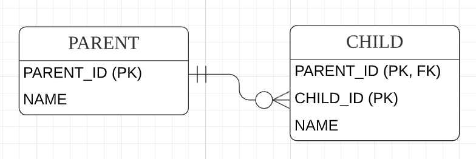 그림 7.8 식별 관계

그림 7.8을 보면 PARENT 테이블의 기본 키 PARENT_ID를 받아서 CHILD 테이블의 기본 키(PK) + 외래 키(FK)로 사용한다.

#### 비식별 관계

비식별 관계는 부모 테이블의 기본 키를 받아서 자식 테이블의 외래 키로만 사용하는 관계다.

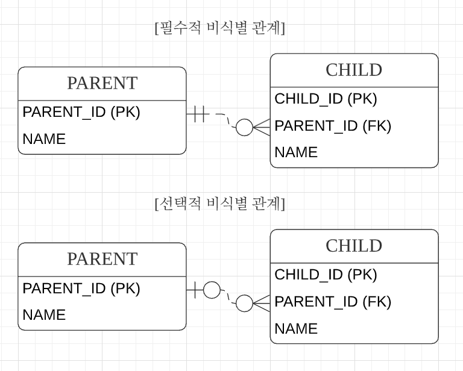 그림 7.9 비식별 관계

그림 7.9를 보면 PARENT 테이블의 기본 키 PARENT_ID를 받아서 CHILD 테이블의 외래 키(FK)로만 사욜한다.

비식별 관계는 외래 키에 NULL을 허용하는지에 따라 필수적 비식별 관계와 선택적 비식별 관계로 나눈다.

- 필수적 비식별 관계(Mandatory): 외래 키에 NULL을 허용하지 않는다. 연관관계를 필수적으로 맺어야 한다.
- 선택적 비식별 관계(Optional): 외래 키에 NULL을 허용한다. 연관관계를 맺을지 말지 선택할 수 있다.

데이터베이스 테이블을 설계할 때 식별 관계나 비식별 관계 중 하나를 선택해야 한다. 최근에는 비식별 관계를 주로 사용하고 꼭 필요한 곳에만 식별 관계를 사용하는 추세다. JPA는 식별 관계, 비식별 관계를 모두 지원한다.

### 7.3.2 복합 키: 비식별 관계 매핑

기본 키를 구성하는 컬럼이 하나면 다음처럼 단순하게 매핑한다.

```java
@Entity
public class Hello {
  @Id
  private String id;

  // @Id
  // privaet String id2; -- 실행 시점에 매핑 예외 발생
}
```

둘 이상의 컬럼으로 구성된 복합 기본키는 별도의 식별자 클래스를 만들어야 한다. (@Id 2개를 이용 못함)
JPA는 영속성 컨텓스트에 엔티티를 보관할 때 엔티티의 식별자를 키로 사용한다. 그리고 식별자를 구분하기 위해 equals와 hashCode를 사용해서 동등성 비교를 한다. 그런데 식별자 필드가 하나일 때는 보통 자바의 기본 타입을 사용하므로 문제가 없지만, 식별자 필드가 2개 이상이면 별도의 식별자 클래스를 만들고 그곳에 equals와 hashCode를 구현해야 한다.

JPA는 복합 키를 지원하기 위해 @IdClass와 @EmbeddedId 2가지 방법을 제공하는데 전자는 관계형 데이터베이스에 가까운, 후자는 객체지향에 가까운 방법이다.

#### @IdClass

그림 7.10 복합 키 테이블은 비식별 관계고 PARENT는 복합 기본 키를 사용한다. 참고로 여기서 부모 자식은 객체 상속과 무관하다. 단지 테이블의 키을 내려받은 것을 강조하려고 이름을 이렇게 지었다.

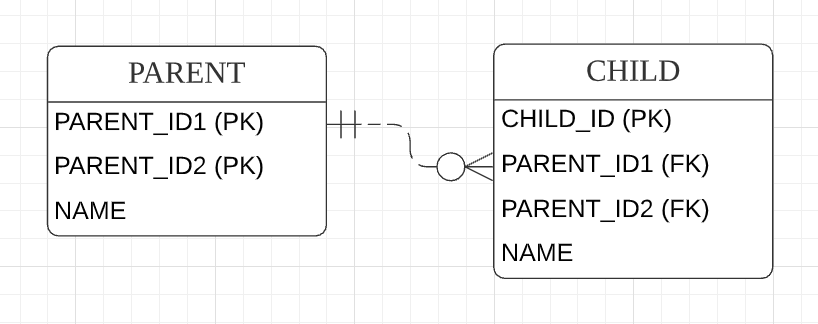 그림 7.10 복합 키 테이블

PARENT 테이블을 보면 기본 키를 PARENT_ID1, PARENT_ID2로 묶은 복합 키로 구성했다. 따라서 복합 키를 매핑하기 위해 식별자 클래스를 별도로 만들어야 한다.

```java
@Entity
@IdClass(ParentId.class)
public class Parent {
  @Id
  @Column(name = "PARENT_ID1")
  private String id1; // ParentId.id1과 연결

  @Id
  @Column(name = "PARENT_ID2")
  private String id1; // ParentId.id2과 연결

  private String name;
}

@NoArgsConstructor
@AllArgsConstructor
public class ParentId implements Serializable {
  private String id1; // Parent.id1 매핑
  private String id2; // Parent.id2 매핑

  @Override
  public boolean equals(Object o) {}

  @Override
  public int hashCode() {}
}
```

위 코드에서 각각 기본 키 컬럼을 @Id로 매핑했다. 그리고 @IdClass 를 사용해서 ParentId 클래스를 식별자 클래스로 지정했다.

@IdClass를 사용할 때 식별자 클래스는 다음 조건을 만족해야 한다.

- 식별자 클래스의 속성명과 엔티티에서 사용하는 식별자의 속성명이 같아야 한다.
- Serializable 인터페이스를 구현해야 한다.
- equals, hashCode를 구현해야 한다.
- 기본 생성자가 있어야 한다.
- 식별자 클래스는 public 이어야 한다.

다음은 실제로 복합키를 사용하는 엔티티를 저장하는 코드이다.

```java
Parent parent = new Parent();
parent.setId1("myId1");
parent.setId2("myId2")l
parent.setName("parentName");
em.persist(parent);
```

저장 코드를 보면 식별자 클래스인 ParentId가 보이지 않는데, em.persist()를 호출하면 영속성 컨텍스트에 엔티티를 등록하기 직전에 내부에서 Parent.id1, Parent.id2 값을 사용해서 식별자 클래스인 ParentId를 생성하고 영속성 컨텍스트의 키로 사용한다. 다음은 조회 코드 이다.

```java
ParentId parentId = new ParentId("myId1", "myId2");
Parent parent = em.find(Parent.class, parentId);
```

이제 자식 클래스에 추가해보자

```java
@Entity
public class Child {
  @Id
  private String id;

  @ManyToOne
  @JoinColumns({
    @JoinColumn(name = "PARENT_ID1", referencedColumnName = "PARENT_ID1"),
    @JoinColumn(name = "PARENT_ID2", referencedColumnName = "PARENT_ID2"),
  })
  private Parent parent;
}
```

부모 테이블의 기본 키 컬럼이 복합 키이므로 자식 테이블의 외래 키도 복합 키다. 따라서 외래 키 매핑 시 여러 컬럼을 매핑해야 하므오 JoinColumns 어노테이션을 사용하고 각각의 외래 키 컬럼을 @JoinColumn으로 매핑한다. 참고로 @Joinolumn의 name 속성과 referencedColumnName 속성의 값이 같으면 referencedColumnName은 생략해도 된다.

#### @EmbeddedId

@IdClass가 데이터베이스에 맞춘 방법이라면 @EmbeddedId는 좀 더 객체지향적인 방법이다.

```java
@Entity
public class Parent {

  @EmbeddedId
  private ParentId id;

  private String name;
}

@Embeddable
public class ParentId implements Serializable {
  @Column(name = "PARENT_ID1")
  private String id1;
  @Column(name = "PARENT_ID2")
  private String id2;

  // equals and hashCode
}
```

Parent 엔티티에서 식별자 클래스를 직접 사용하고 @EmbeddedId 어노테이션을 적어주면 된다.
@IdClass와는 다르게 @EmbeddedId를 적용한 식별자 클래스는 식별자 클래스에 기본 키를 직접 매핑한다.
@EmbeddedId는 다음 조건을 만족해야 한다.

- @EmbeddedId 어노테이션을 붙어주어야 한다.
- Serializable 인터페이스를 구현해야 한다.
- equals, hashCode를 구현해야 한다.
- 기본 생성자가 있어야 한다.
- 식별자 클래스는 public 이어야 한다.

다음은 엔티티를 저장, 조회하는 코드이다.

```java
// 저장
Parent parent = new Parent();
ParentId parentId = new ParentId("myId1", "myId2");
parent.setId(parentId);
parent.setName("parentName");
em.persist(parent);

// 조회
ParentId parentId = new ParentId("myId1", "myId2");
Parent parent = em.find(Parent.class, parentId);
```

#### 복합 키와 equals(), hashCode()

복합 키는 equals() 와 hashCode() 를 필수로 구현해야 한다. 다음 코드를 보면

```java
ParentId id1 = new ParentId("myId1", "myId2");
ParentId id2 = new ParentId("myId1", "myId2");

id1.equals(id2); // -> ???
```

id1.equals(id2) 는 참일까 거짓일까? 영속성 컨텍스트는 엔티티의 식별자를 키로 사용해서 엔티티을 관리한다. 그리고 식별자를 비교할 때 equals()와 hashCode() 를 사용한다. 따라서 객체의 동등성이 지켜지지 않으면 예상과 다른 엔티티가 조회되거나 엔티티를 찾을 수 없는 등 문제가 발생하므로 복합 키는 equals()와 hashCode()을 필수로 구현해야 한다. 식별자 클래스는 보통 equals() 와 hashCode() 를 구현할 때 모든 필드를 사용한다.

#### @IdClass vs @EmbeddedId

각각의 장단점이 있으므로 본인의 취향에 맞는 것을 일관성 있게 사용하면 된다. @EmbeddedId가 @IdClass와 비교해서 더 객체지향적이고 중복도 없어서 좋아보이긴 하지만 JPQL이 조금 더 길어질 수 있다.

```java
em.createQuery("select p.id.id1, p.id.id2 from Parent p"); // @EmbeddedId
em.createQuery("select p.id1, p.id2 from Parent p"); // @IdClass
```

_참고로 복합키에는 @GenerateValue를 사용할 수 없다. 복합 키를 구성하는 여러 컬럼 중 하나에도 사용할 수 없다._

### 7.3.3 복합 키: 식별 관계 매핑

복합 키와 식별 관계를 알아보자

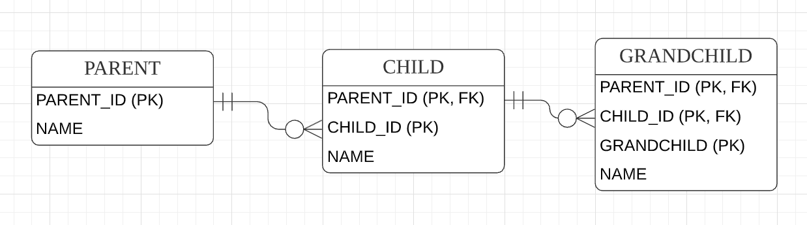 그림 7.11 식별 관계 구현

그림 7.11을 보면 부모, 자식, 손자까지 기본 키를 전달하는 식별 관계다. 식별 관계에서 자식 테이블은 부모 테이블의 기본 키를 포함해서 복합 키를 구성해야 하므오 @IdClass나 @EmbeddedId를 사용해서 식별자를 매핑해야 한다.

#### @IdClass와 식별 관계

```java
@Entity
@Getter
@Setter
public class Parent {
  @Id @Column(name = "PARENT_ID")
  private String id;
  private String name;
}

@Entity
@Getter
@Setter
@IdClass(ChildId.class)
public class Child {
  @Id
  @ManyToOne
  @JoinColumn(name = "PARENT_ID")
  public Parent parent;

  @Id @Column(name = "CHILD_ID")
  private String childId;
  private String name;
}

public class ChildId implements Serializable {
  private String parent; // Child.parent
  private String childId; // Child.childId

  // equals, hashCode
}

@Entity
@Getter
@Setter
@IdClass(GrandChildId.class)
public class GrandChild {
  @Id
  @ManyToOne
  @JoinColumns({
    @JoinColumn(name = "PARENT_ID"),
    @JoinColumn(name = "CHILD_ID")
  })
  private Child child;

  @Id @Column(name = "GRANDCHILD_ID")
  private String id;
  private String name;
}

public class GrandChildId implements Serializable {
  private ChildId childId; // GrandChild.child 매핑
  private String id; // GrandChild.id 매핑

  // equals, hashCode
}
```

식별 관계는 기본 키와 외래 키를 같이 매핑해야 한다. 따라서 식별자 매핑인 @Id와 연관관계 매핑인 @ManyToOne을 같이 사용하면 된다.

Child 엔티티의 parent 필드를 보면 @Id로 기본 키을 매핑하면서 @ManyToOne과 @JoinColumn으로 외래 키를 같이 매핑한다.

#### @EmbeddedId와 식별 관계

@EmbeddedId로 식별 관계를 구성할 떄는 @MapsId를 사용해야 한다. 우선 예제를 보자.

```java
@Entity
public class Parent {

  @Id @Column(name = "PARENT_ID")
  private String id;

  private String name;
}

@Entity
public class Child {
  
  @EmbeddedId
  private ChildId id;

  @MapsId("parentId") // ChildId.parentId 매핑
  @ManyToOne
  @JoinColumn(name = "PARENT_ID")
  public Parent parent;

  private String name;
}

@Embeddable
@EqualsAndHashCode
public class ChildId implements Serializable {
  
  private String parentId; // @MapsId("parentId")로 매핑

  @Column(name = "CHILD_ID")
  private String id;
}

@Entity
public class GrandChild {

  @EmbeddedId
  private GrandChildId id;

  @MapsId("childId") // GrandChildId.childId 매핑
  @ManyToOne
  @JoinColumns({
    @JoinColumn(name = "PARENT_ID"),
    @JoinColumn(name = "CHILD_ID")
  })
  private Child child;

  private String name;
}

@Embeddable
@EqualsAndHashCode
public class GrandChildId implements Serializable {

  private ChildId childId; // @MapsId("childId")로 매핑

  @Column(name = "GRANDCHILD_ID")
  private String id;
}
```

@EmbeddedId 는 식별 관계로 사용할 연관관계의 속성에 @MapsId를 사용하면 된다. Child 엔티티의 parent 필드를 보면 @IdClass와 다른 점은 @Id 대신에 @MapsId를 사용한 점이다. @MapsId의 속성 값은 @EmbeddedId를 사용한 식별자 클래스의 기본 키 필드를 지정하면 된다. 여기서는 ChildId의 parentId 필드를 선택했다.

### 7.3.4 비식별 관계로 구현

6.4절에서 식별 관계를 비식별 관계로 변경했던 예제처럼, 방금 예를 들었던 식별 관계 테이블을 그림 7.12와 같이 비식별 관계로 변경해보자.

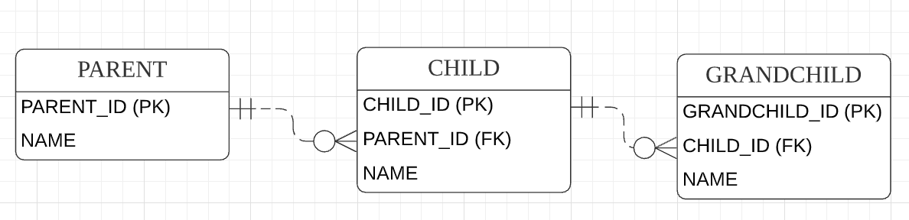 그림 7.12 비식별 관계로 변경

```java
@Entity
public class Parent {

  @Id @GeneratedValue
  @Column(name = "PARENT_ID")
  private Lond Id;
  private String name;
}

@Entity
public class Child {

  @Id @GeneratedValue
  @Column(name = "CHILD_ID")
  private Long Id;
  private String name;

  @ManyToOne
  @JoinColumn(name = "PARENT_ID")
  private Parent parent;
}

@Entity
public class GrandChild {

  @Id @GeneratedValue
  @Column(name = "GRANDCHILD_ID")
  private Long id;
  private String name;

  @ManyToOne
  @JoinColumn(name = "CHILD_ID")
  private Child child;
}
```

식별 관계의 복합 키를 사용한 코드와 비교하면 매핑도 쉽고 코드도 단순한다. 그리고 복합 키가 없으므로 복합 키 클래스를 만들지 않아도 된다.

### 7.3.5 일대일 식별 관계

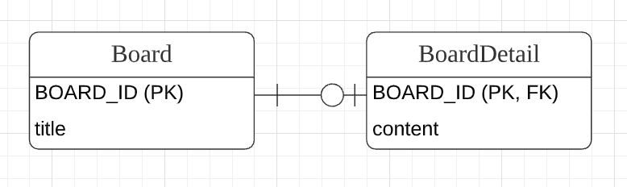 그림 7.13 식별 관계 일대일

그림 7.13을 보면 일대일 식별 관계는 자식 테이블의 기본 키 값으로 부모 테이블의 기본 키 값만 사용한다. 그래서 부모 테이블의 기본 키가 복합 키가 아니면 자식 테이블의 기본 키는 복합 키로 구성하지 않아도 된다.

```java
@Entity
public class Board {
  @Id @GeneratedValue
  @Column(name = "BOARD_ID")
  private Long id;

  private String title;

  @OneToOne(mappedBy = "board")
  private BoardDetail boardDetail;
}

@Entity
public class BoardDetail {
  @Id
  private Long boardId;

  @MapsId // BoardDetail.boardId 매핑
  @OneToOne
  @JoinColumn(name = "BOARD_ID")
  private Board board;

  private String content;
}
```

BoardDetail 처럼 식별자가 단순히 컬럼 하나면 @MapsId를 사용하고 속성 값은 비워두면 된다. 이때 @MapsId는 @Id를 사용해서 식별자로 지정한 BoardDetail.boardId와 매핑된다.

```java
public void save() {
  Board board = new Board();
  board.setTitle("제목");
  em.persist(board);

  BoardDetail boardDetail = new BoardDetail();
  boardDetail.setContent("내용");
  boardDetail.setBoard(board);
  em.persist(boardDetail);
}
```

### 7.3.6 식별, 비식별 관계의 장단점

데이터베이스 설계 관점에서 보면 다음과 같은 이유로 식별 관계보다는 비식별 관계를 선호한다.

- 식별 관계는 부모 테이블의 기본 키를 자식 테이블로 전파하면서 자식 테이블의 기본 키 컬럼이 점점 늘어난다. 예를 들어 부모 테이블은 기본 키 컬럼이 하나였지만 자식 테이블은 기본 키 컬럼이 2개, 손자 테이블은 기본 키 컬럼이 3개로 점점 늘어난다. 결국 조인할 때 SQL이 복잡해지고 기본 키 인덱스가 불필요하게 커질수 있다.
- 식별 관계는 2개 이상의 컬럼을 합해서 복합 기본 키를 만들어야 하는 경우가 많다.
- 식별 관계를 사용할 때 기본 키로 비즈니스 의미가 있는 자연 키 컬럼을 조합하는 경우가 많다. 반면에 비식별 관계의 기본 키는 비즈니스와 전혀 관계없는 대리 키를 주로 사용한다. 비즈니스 요구사항은 시간이 지남에 따라 언젠가는 변한다. 식별 관계의 자연 키 컬럼들이 자식에 손자까지 전파되면 변경하기 힘들다.
- 식별 관계는 부모 테이블의 기본 키를 자식 테이블의 기본 키로 사용하므로 비식별 관계보다 테이블 구조가 유연하지 못하다.

객체 관계 매핑의 관점에서 보면 다음과 같은 이유로 비식별 관계를 선호한다.

- 일대일 관계를 제외하고 식별 관계는 2개 이상의 컬럼을 묶은 복합 기본 키를 사용한다. JPA에서 복합 키는 별도의 복합 키 클래스를 만들어서 사용해야 한다. 따라서 컬럼이 하나인 기본 키를 매핑하는 것보다 많은 노력이 필요하다.
- 비식별 관계의 기본 키는 주로 대리 키를 사용하는데 JPA는 @GeneratedValue 처럼 대리 키를 생성하기 위한 편리한 방법을 제공한다.

물론 식별 관계가 가지는 장점도 있다. 기본 키 인덱스를 활용하기 좋고, 상위 테이블들의 기본 키 컬럼을 자식, 손자 테이블들이 가지고 있으므로 특정 상황에 조인 없이 하위 테이블만으로 검색을 완료할 수 있다.

기본 키 인덱스를 활용하는 예를 보자.

```SQL
-- 부모 아이디가 A인 모든 자식 조회
SELECT * FROM CHILD WHERE PARENT_ID = 'A'

-- 부모 아이디가 A고 자식 아이디가 B인 자식 조회
SELECT * FROM CHILD WHERE PARENT_ID = 'A' AND CHILD_ID = 'B'
```

두 경우 모두 CHILD 테이블의 기본 키 인덱스를 PARENT_ID + CHILD_ID로 구성하면 별도의 인덱스를 생성할 필요 없이 기본 키 인덱스만 사용해도 된다. 이처럼 식별 관계가 가지는 장점도 있으므로 꼭 필요한 곳에는 적절하게 사용하는 것이 데이터베이스 테이블 설계의 묘를 살리는 방법이다.

정리하면, ORM 신규 프로젝트 진행시 추전하는 방법은 될 수 있으면 비식별 관계를 사용하고 기본 키는 Long 타입의 대리 키를 사용하는 것이다. 대리 키는 비즈니스와 아무 관련이 없다. 따라서 비즈니스가 변경되어도 유연한 대처가 가능하다는 장점이 있다. JPA는 @GeneratedValue를 통해 간편하게 대리 키를 생성 할 수 있다. 그리고 식별자 컬럼이 하나여서 쉽게 매핑할 수 있다. 식별자의 데이터 타입은 Long을 추천하는데, 자바에서 Integer는 20억 정도면 끝나버리므로 데이터를 많이 저장하면 문제가 발생할 수 있다. 반면에 Long은 아주 커서(약 920억) 안전하다. 그리고 선택적 비식별 관계보다는 필수적 비식별 관계를 사용하는 것이 좋은데, 선택적인 비식별 관계는 NULL을 허용하므로 조인할 떄에 외부 조인을 사용해야 한다. 반면에 필수적 관계는 NOT NULL로 항상 관계가 있다는 것을 보장하므로 내부조인만 사용해도 된다.

## 7.4 조인 테이블

데이터베이스 테이블의 연관관계를 설계하는 방법은 크게 2가지이다.

- 조인 컬럼 사용(외래 키)
- 조인 테이븡 사용(테이블 사용)

### 조인 컬럼 사용

테이블 간에 관계는 주로 조인 컬럼이라 부르는 외래 키 컬럼을 사용해서 관리 한다.

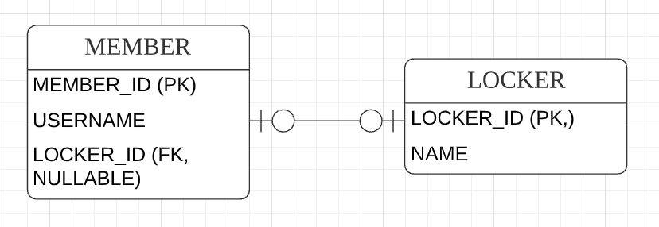 그림 7.14 조인 컬럼 사용

---

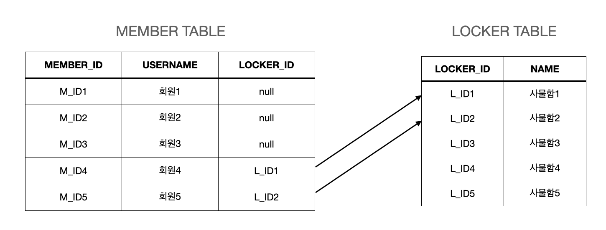 그림 7.15 조인 컬럼 테이블

---

그림 7.15를 보면 회원과 사물함이 있는데 각각 테이블에 데이터를 동록했다가 회원이 원할때 사물함을 선택할 수 있다고 가정해보자. 회원이 사물함을 사용하기 전까지는 아직 둘 사이에 관계가 없으므로 MEMBER 테이블의 LOCKER_ID 외래 키에 null을 입력해두어야 한다. 이렇게 외래 키에 null을 허용하는 관계를 선택적 비식별 관계라 한다.

그림 7.15를 보자. 선택적 비식별 관계는 외래 키에 null을 허용하므로 회원과 사물함을 조인할 때 외부 조인(OUTER JOIN) 을 사용해야 한다. 실수로 내부 조인응 사용하면 사물함과 관계가 없는 회원은 조회되지 않는다. 그리고 회원과 사물함이 아주 가끔 관계를 맺는다면 외래 키 값 대부분이 null로 저장되는 단점이 있다.

### 조인 테이블 사용

이번에는 조인 컬럼을 사용하는 대신에 조인 테이블을 사용해서 연관관계를 과니래보자.

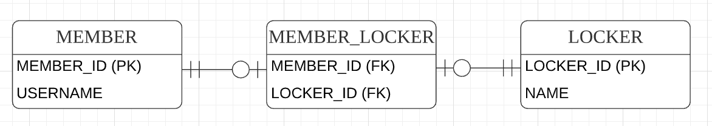 그림 7.16 조인 테이블 사용

---

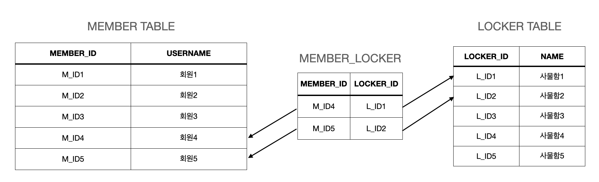 그림 7.17 조인 테이블 데이터

---

이 방법은 조인 테이블이라는 별도의 테이블을 사용해서 연관관계를 관리한다. 그림 7.14와 그림 7.16을 비교해보면 조인 컬럼을 사용하는 방법과 조인 테이블을 사용하는 방법의 차이를 알 수 있다. 조인 컬럼을 사용하는 방법은 단순히 외래 키 컬러만 추가해서 연관관계를 맺지만 조인 테이블을 사용하는 방법은 연관관계를 관리하는 조인 테이블(MEMBER_LOCKER)을 추가하고 여기서 두 테이블의 외래 키를 가지고 연관관계를 관리한다. 따라서 MEMBER와 LOCKER에는 연관관계를 관리하기 위한 외래 키 컬럼이 없다.

그림 7.17을 보면 회원과 사물함 데이터를 각각 등록했다가 회원이 원할 때 사물함을 선택하면 MEMBER_LOCKER 테이블에만 값을 추가하면 된다.

조인 테이블의 가장 큰 단점은 테이블을 하나 추가해야 한다는 점이다. 따라서 관리해야 하는 테이블이 늘어나고 회원과 사물함 두 테이블을 조인하려면 MEMBER_LOCKER 테이블까지 추가로 조인해야 한다. 따라서 기본 조인 컬럼을 사용하고 필요하다고 판단되면 조인 테이블을 사용하자.

조인 테이블에 대해 앞으로 설명할 내용은 다음과 같다.

- 객체와 테이블을 매핑할 때 조인 컬럼은 @JoinColumn으로 매핑하고 조인 테이블인 @JoinTable로 매핑한다.
- 조인 테이블은 주로 다대다 관계를 일대다, 다대일 관계로 풀어내기 위해 사용한다. 그렇지만 일대일, 일대다, 다대일 관계에서도 사용한다.

지금부터 일대일, 일대다, 다대일, 다대다 관계를 조인 테이블로 매핑해보자.

### 7.4.1 일대일 조인 테이블

그림 7.18 조인 테이블 일대일에서 조인 테이블을 보자. 일대일 관계를 만들려면 조인 테이블의 외래 키 컬럼 각각에 총 2개의 유니크 제약조건을 걸어야 한다(PARENT_ID는 기본 키이므로 유니크 제약조건이 걸려 있다.)

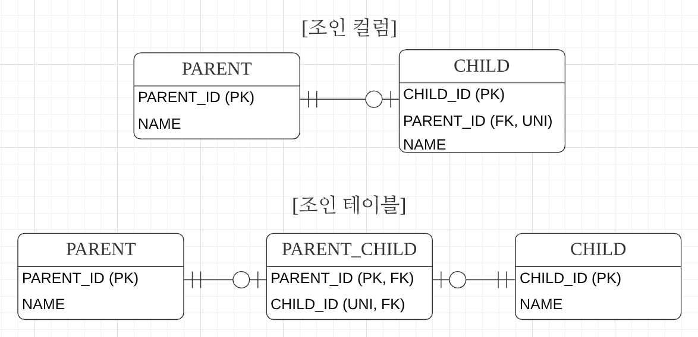 그림 7.18 조인 테이블 일대일

---

```java
@Entity
public class Parent {
  @Id @GeneratedValue
  @Column(name = "PARENT_ID")
  private Long id;
  private String name;

  @OneToOne
  @JoinTable(name = "PARENT_CHILD",
    joinCloumns = @JoinColumn(name = "PARENT_ID"),
    inverseJoinColumns = @JoinColumn(name = "CHILD_ID")
  )
  private Child child;
}

@Entity
public class Child {
  @Id @GeneratedValue
  @Column(name = 'CHILD_ID')
  private Long id;
  private String name;
}
```

부모 엔티티를 보면 @JoinColumn 대신에 @JoinTable을 사용했다. @JoinTalbe의 속성은 다음과 같다.

- name: 매핑할 조인 테이블 이름
- joinColumns: 현재 엔티티를 참조하는 외래 키
- inverseJoinColumns: 반대방향 엔티티를 참조하는 외래 키

양방향으로 매핑하려면 다음 코드를 추가하면 된다.

``` java
public class Child {
  //...
  @OneToOne(mappedBy="child")
  private Parent parent;
}
```

### 7.4.2 일대다 조인 테이블

그림 7.19는 일대다 관계다. 일대다 관계를 만들려면 조인 테이블의 컬럼 중 다(N)와 관련된 컬럼인 CHILD_ID에 유니크 제약조건을 걸어야 한다(CHILD_ID는 기본 키이므로 유니크 제약조건이 걸려있다.) 일대다 단방향 관계로 매핑해보자

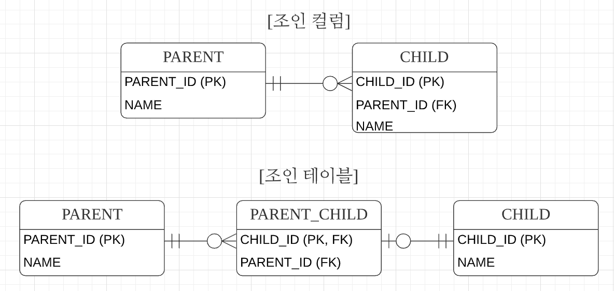 그림 7.19 조인 테이블 일대다, 다대일

---

```java
@Entity
public class Parent {
  @Id @GeneratedValue
  @Column(name = "PARENT_ID")
  private Long id;
  private String name;

  @OneToMany
  @JoinTable(name = "PARENT_CHILD"),
    joinColumns = @JoinColumn(name = "PARENT_ID"),
    inverseJoinColumn = @JoinColumn(name = "CHILD_ID")
  )
  private List<Child> child = new ArrayList<>();
}

@Entity
public class Child {
  @Id @GeneratedValue
  @Column(name = "CHILD_ID")
  private Long id;
  private String name;
}
```

### 7.4.3 다대일 조인 테이블

다대일은 일대다에서 방향만 반대이므로 조인 테이블 모양은 일대다에서 설명한 그림 7.19와 같다. 다대일, 일대다 양방향 관계로 매핑해보자.

```java
@Entity
public class Parent {
  @Id @GeneratedValue
  @Column(name = "PARENT_ID")
  private Long id;
  private String name;

  @OneToMany(mappedBy = "parent")
  private List<Child> child = new ArrayList<>();
}

@Entity
public class Child {
  @Id @GeneratedValue
  @Column(name = "CHILD_ID")
  private Long id;
  private String name;

  @ManyToOne(optional = false)
  @JoinTable(name = "PARENT_CHILD"),
    joinColumns = @JoinColumn(name = "CHILD_ID"),
    inverseJoinColumn = @JoinColumn(name = "PARENT_ID")
  )
  private Parent parent;
}
```

### 7.4.4 다대다 조인 테이블

그림 7.20은 다대다 관계다. 다대다 관계를 만들려면 조인 테이블의 두 컬럼을 합해서 하나의 복합 유니크 제약조건을 걸어야 한다(PARENT_ID, CHILD_ID는 복합 기본 키이므로 유니크 제약조건이 걸려 있다). 다대다 조인 테이블을 매핑해보자

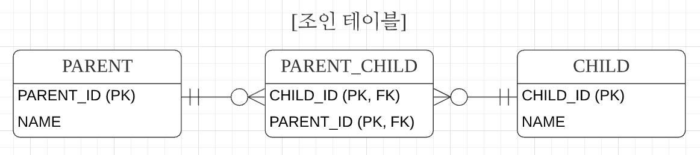 그림 7.20 조인 테이블 다대다

---

```java
@Entity
public class Parent {
  @Id @GeneratedValue
  @Column(name = "PARENT_ID")
  private Long id;
  private String name;

  @ManyToMany
  @JoinTable(name = "PARENT_CHILD",
    joinColumns = @JoinColumn(name = "PARENT_ID"),
    inverseJoinColumns = @JoinColumn(name = "CHILD_ID")
  )
  private List<Child> child = new ArrayList<>();
}

@Entity
public class Child {
  @Id @GeneratedValue
  @Column(name = "CHILD_ID")
  private Long id;
  private String name;
}
```

_조인 테이블에 컬럼을 추가하면 @JoinTable 전략을 사용할 수 없다. 대신에 새로운 엔티티를 만들어서 조인 테이블과 매핑해야 한다._

## 7.5 엔티티 하나에 여러 테이블 매핑

잘 사용하지는 않지만 @SecondaryTable을 사용하면 한 엔티티에 여러 테이블을 매핑할 수 있다.

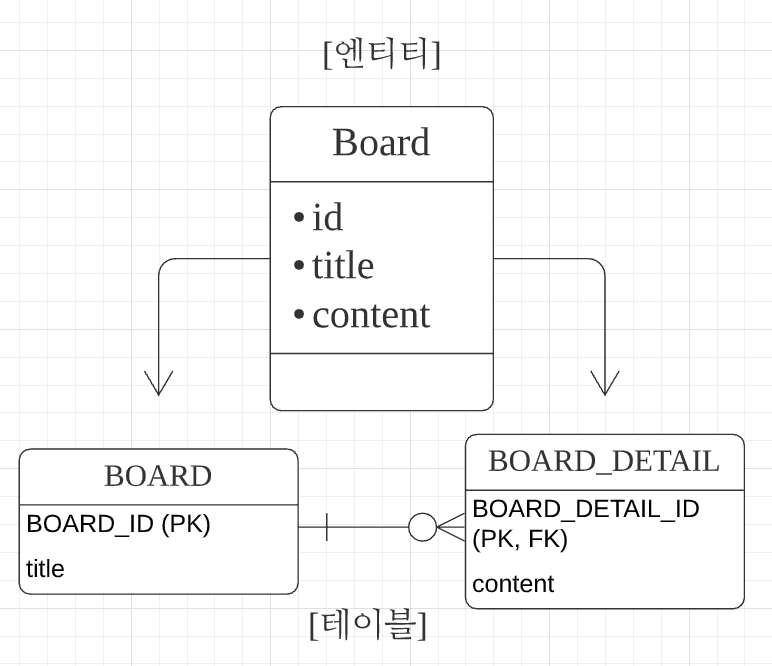 그림 7.21 하나의 엔티티에 여러 테이블 매핑하기

---

```java
@Entity
@Table(name = "BOARD")
@SecondaryTable(name = "BOARD_DETAIL", pkJoinColumns = @PrimaryKeyJoinColumn(name = "BOARD_DETAIL_ID"))
public class Board {
  @Id @GeneratedValue
  @Column(name = "BOARD_ID")
  private Long id;
  private String title;

  @Column(table = "BOARD_DETAIL")
  private String content
}
```

Board 엔티티는 @Table을 사용해서 BOARD 테이블과 매핑했다. 그리고 @SecondaryTable을 사용해서 BOARD_DETAIL 테이블을 추가로 매핑했다. @SecondaryTable 속성은 다음과 같다.

- @SecondaryTable.name: 매핑할 다른 테이블의 이름, 예제에서는 테이블명을 BOARD_DETAIL로 지정했다.
- @SecondaryTable.pkJoinColumns: 매핑할 다른 테이블의 기본 키 컬럼 속성, 예제에서는 기본 키 컬럼명을 BOARD_DETAIL_ID로 지정했다.

content 필드는 @Column(talbe = "BOARD_DETAIL")을 사용해서 BOARD_DETAIL 테이블의 컬럼에 매핑했다. title 필드처럼 테이블을 지정하지 않으면 기본 테이블인 BOARD에 매핑된다. 더 많은 테이블을 매핑하려면 @SecondaryTables를 사용하면 된다.

```java
@SecondaryTables({
  @SecondaryTable(name = "BOARD_DETAIL"),
  @SecondaryTable(name = "BOARD_FILE")
})
```

참고로 @SecondaryTable을 사용해서 두 테이블을 하난의 엔티티에 매핑하는 방법보다는 테이블당 엔티티를 각각 만들어서 일대일 매핑하는 것을 권장한다. 이 방법은 항상 두 테이블을 조회하므로 최적화하기 어렵다. 반면에 일대일 매핑은 원하는 부분만 조회할 수 있고 필요하면 둘을 함께 조회하면 된다.
