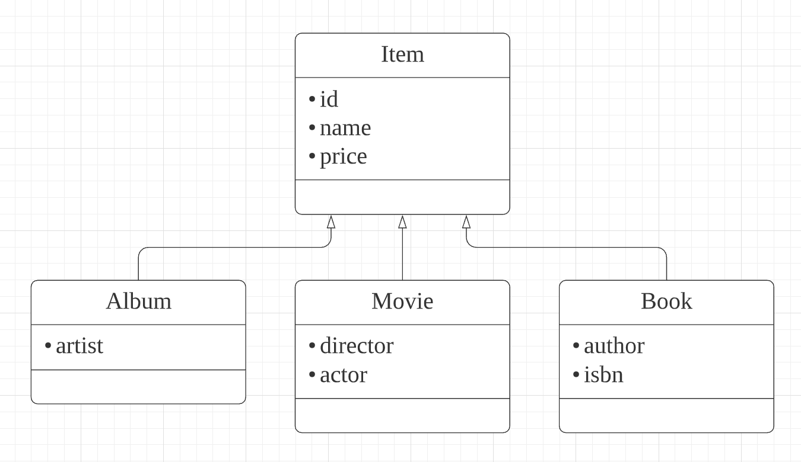
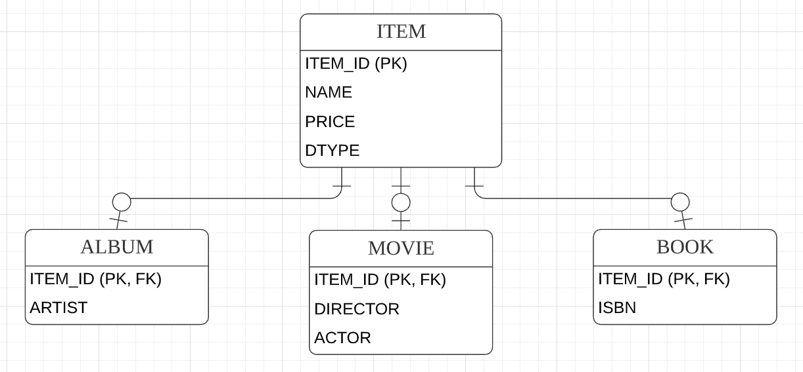
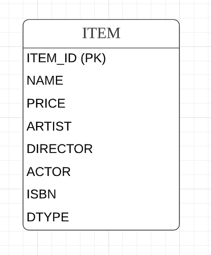
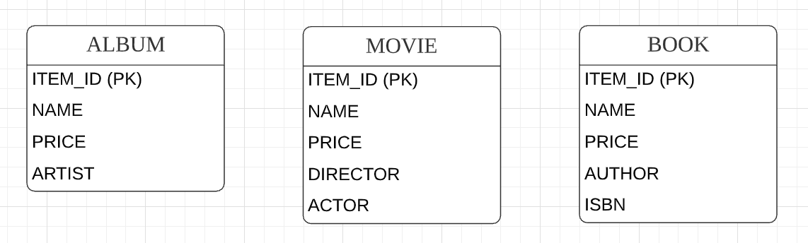
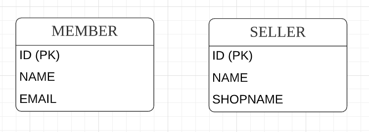
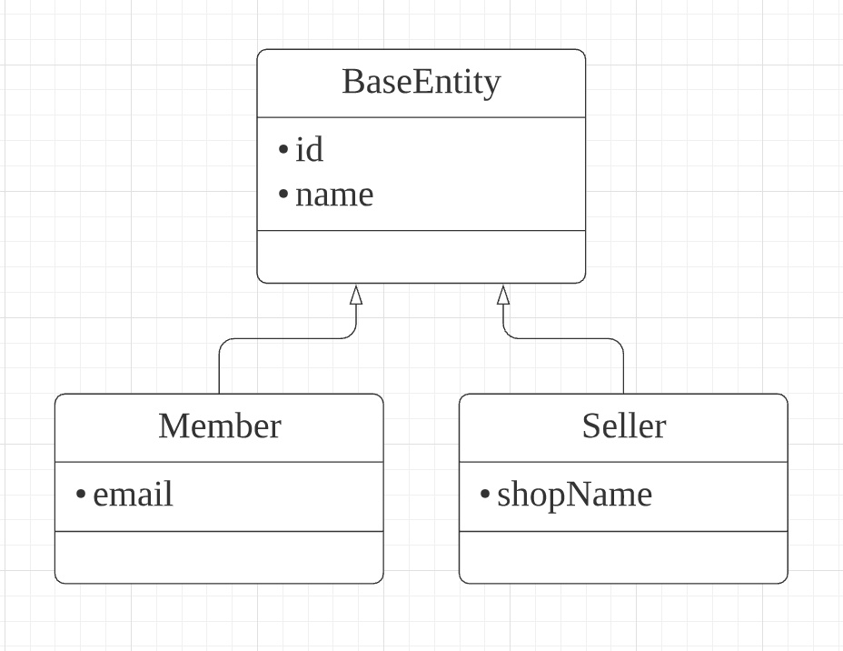

# 7. 고급매핑

**이 글은 자바 ORM 표준 JPA 프로그래밍 을 참고해서 쓴 글입니다.**

이 장에서 다룰 고급 매핑은 다음과 같다.

- 상속 관계 매핑: 객체의 상속 관계를 데이터베이스에 어떻게 매핑하는지 다룬다.
- @MappedSuperclass: 등록일, 수정일 같이 여러 엔티티에서 공통으로 사용하는 매핑 정보만 상속빋고 싶으면 이 기능을 사용하면 된다.
- 복합 키와 식별 관계 매핑: 데이터베이스의 식별자가 하나 이상일 때 매핑하는 방법을 다룬다. 여기서 식별 관계와 비식별 관계에 대해서도 다룬다.
- 조인 테이블: 테이블은 외래 키 하나로 연관관계를 맺을 수 있지만 연관관계를 관리하는 연결 테이블을 두는 방법도 있다. 여기서 이 연결 테이블을 매핑하는 방법을 다룬다.
- 엔티티 하나에 여러 테이블 매핑하기: 보통 엔티티 하나에 테이블 하나를 매핑하지만 엔티티 하나에 여러 테이블을 매핑하는 방법도 있다.

## 7.1 상속 관계 매핑

관계형 데이터베이스에는 객체지향 언어에서 다루는 상속이라는 개념이 없다. 대신 슈퍼타입 서브타입 관계 라는 모델링 기법이 객체의 상속 개념과 가장 유사하다. ORM에서 이야기하는 상속 관계 매핑은 객체의 상속 구조와 데이터베이스의 슈퍼타입 서브타입 관계를 매핑하는 것이다.

 그림 7.2 객체 상속 모델

슈퍼타입 서브타입 논리 모델을 실제 물리 모델인 테이블로 구현할 때는 3가지 방법을 선택할 수 있다.

- 각각의 테이블러 변환: 그림 7.3과 같이 각각을 모두 테이블로 만들고 조회할 때 조인을 사용한다. JPA에서는 조인 전력이라 한다.
- 통합 테이블러 변환: 그립 7.4와 같이 테이블을 하나만 사용해서 통합한다. JPA에서는 단일 테이블 전략이라 한다.
- 서브타입 테이블로 변환: 그림 7.5와 같이 서브 타입마다 하나의 테이블을 만든다. JPA에서는 구현 클래스마다 테이블 전략이라 한다.

### 7.1.1 조인 전략

조인 전략은 그림 7.3과 같이 엔티티 각각을 모두 테이블로 만들고 자식 테이블이 부모 테이블의 기본 키를 받아서 기본 키 + 외래 키로 사용하는 전략이다. 따라서 조회할 때 조인을 자주 사용한다. 이 전략의 주의할 점은 객체는 타입으로 구분할 수 있지만 테이블은 타입의 개념이 없다. 따라서 타입을 구분하는 컬럼을 추가해야 한다.

 그림 7.3 JOINED TALBE

```java
@Entity
@Inheritance(strategy = InheritanceType.JOINED)
@DiscriminatorColumn(name = "DTYPE")
public abstract class Item {
    @Id @GeneratedValue
    @Column(name = "ITEM_ID")
    private Long id;

    private String name;
    private int price;
}

@Entity
@DiscriminatorValue("A")
public class Album extends Item {
    private String artist;
}

@Entity
@DiscriminatorValue("M")
public class Movie extends Item {
    private String director;
    private String actor;
}
```

- @Inheritance(strategy = InheritanceType.JOINED): 상속 매핑은 부모 클래스에 @Inheritance를 사용해야한다. 그리고 매핑 전략을 지정해야하는데 조인전략이므로 InheritanceType.JOINED) 를 사용했다.
- @DiscriminatorColumn(name = "DTYPE"): 부모 클래스에 구분 컬럼을 지정한다. 이 컬럼으로 저장된 자식 테이블을 구분할 수 있다. 기본값이 DTYPE 이다.
- @DiscriminatorValue("M"): 엔티티를 저장할 때 구분 컬럼에 입력할 값을 지정한다. 만약 영화 엔티티를 저장하면 구분 컬럼인 DTYPE에 값 M이 저장된다.

기본값으로 자식 테이블은 부모 테이블의 ID 컬럼명을 그대로 사용하는데, 자식 테이블의 기본 키 컬럼명을 변경하고 싶으면 @PrimaryKeyJoinColumn을 사용하면 된다.

```java
@Entity
@DiscriminatorValue("B")
@PrimaryKeyJoinColumn(name = "BOOK_ID") // id 재정의
public class Book extends Item {
    private String author;
    private String isbn;
}
```

조인 전략을 정리하면

- 장점
  - 테이블이 정규화 된다.
  - 외래 키 참조 무결성 제약조건응ㄹ 활용할 수 있다.
  - 저장공간을 효율적으로 사용한다.
- 단점
  - 조회할 때 조인이 많이 사용되므로 성능이 저하될 수 있다.
  - 조회 쿼리가 복잡하다.
  - 데이터를 등록할때 INSERT SQL을 두 번 실행한다.
- 특징
  - JPA 표준 명세는 구분 컬럼을 사용하도록 하지만 하이버네이트를 포함한 몇몇 구현체는 구분 컬럼 없이도 동작한다.
- 관련 어노테이션
  - @PrimaryKeyJoinColumn, @DiscriminatorValue, @DiscriminatorColumn

### 7.1.2 단일 테이블 전략

단일 테이블 전략은 그림 7.4와 같이 테이블을 하나만 사용하고 구분 컬럼으로 어떤 자식 데이터가 저장되었는지 구분한다. 조회할 때 조인을 사용하지 않으므로 일반적으로 가장 빠르다.

 그림 7.4 SINGLE TABLE

이 전략을 사용할 때 주의할점은 자식 엔티티가 매핑한 컬럼은 모두 null을 허용해야 한다는 점이다.

```java
@Entity
@Inheritance(strategy = InheritanceType.SINGLE_TABLE)
@DiscriminatorColumn(name = "DTYPE")
public abstract class Item {
    @Id @GeneratedValue
    @Column(name = "ITEM_ID")
    private Long id;

    private String name;
    private int price;
}

@Entity
@DiscriminatorValue("A")
public class Album extends Item {}
```

단일 테이블 전략을 정리하면

- 장점
  - 조인이 필요 없으므로 일반적으로 조히 성능이 빠르다.
  - 조회 쿼리가 단순하다.
- 단점
  - 자식 엔티티가 매핑한 컬럼은 모두 null을 허용해야 한다.
  - 단일 테이블에 모든 것을 저장하므로 테이블이 커질 수 있다. 그러므로 상황에 따라서는 조회성능이 느려질 수 있다.
- 특징
  - 구분 컬럼을 꼭 사용해야한다. 따라서 @DiscriminatorColumn을 꼭 설정해야한다.
  - @DiscriminatorColumn를 지정하지 않으면 기본으로 엔티티 이름을 사용한다.

### 7.1.3 구현 클래스마다 테이블 전략

구현 클래스마다 테이블 전략은 그림 7.5와 같이 자삭 엔티티마다 테이블을 만들고, 자식 테이블 각각에 필요한 컬럼을 넣어준다.

 그림 7.5 CONCRETE TABLE

```java
@Entity
@Inheritance(strategy = InheritanceType.TABLE_PER_CLASS)
public abstract class Item {
    // ...
}
```

구현 클래스마다 테이블 전략을 정리하면

- 장점
  - 서브 타입을 구분해서 처리할 때 효과적이다.
  - not null 제약조건을 사용할 수 있다.
- 단점
  - 여러 자식 테이블을 함께 조회할 때 성능이 느리다. (SQL에 UNION을 사용해야 한다)
  - 자식 테이블을 통합해서 쿼리하기 어렵다.
- 특징
  - 구분 컬럼을 사용하지 않는다.

이 전략은 데이터베이스 설계자와 ORM 전문가 둘 다 추천하지 않는 전략이다. 조인이나 단일 테이블 전략을 고려하자.

## 7.2 @MappedSuperclass

지금까지 학습한 상속 관계 매핑은 부모 클래스와 자식 클래스를 모두 데이터베이스 테이블과 매핑했다. 부모 클래스는 테이블과 매핑하지 않고 부모 클래스를 상속받는 자식 클래스에게 매칭 정보만 제공하고 싶으면 @MappedSuperclass를 사용하면 된다.

@MappedSuperclass는 비유를 하면 추상 클래스와 비슷한데 @Entity는 실제 테이블과 매핑되지만 @MappedSuperclass는 실제 테이블과는 매핑되지 않는다. 이것은 단순히 상속할 목적으로만 사용된다.

 그림 7.6 @MappedSuperclass 설명 테이불
 그림 7.7 @MappedSuperclass 설명 객체

Member, Seller는 서로 관계가 없는 테이블과 엔티티다. 테이블은 그대로 두고 객체 모델의 id, name 두 공통 속성을 부모 클래스로 모으고 객체 상속 관계로 만들어보자

```java
@MappedSuperclass
public abstract class BaseEntity {
  @Id @GeneratedValue
  private Long id;
  private String name;
}

@Entity
public class Member extends BaseEntity {
  private String email;
}

@Entity
public class Seller extends BaseEntity {
  private String shopName;
}
```

BaseEntity에는 객체들이 주로 사용하는 공통 매핑 정보를 정의했다. 그리고 자식 엔티티들은 상속을 통해 BaseEntity의 매핑 정보를 물려받았다. 여기서 BaseEntity는 테이블과 매핑할 필요가 없고 자식 엔티티에게 공통으로 사용되는 매핑정보만 제공하면 되므로 @MappedSuperclass를 사용했다.

부모로부터 물려받은 매핑 정보를 재정의하려면 @AttributeOverrides 나 @AttributeOverride를 사용하고 연관관계를 재정의하려면 @AssociationOverrides 나 @AssociationOverride를 사용한다.

```java
@Entity
@AttributeOverride(name = "id", column = @Column(name = "MEMBER_ID"))
public class Member extends BaseEntity {}
```

부모에게 상속받은 id 속성의 컬럼명을 MEMBER_ID로 재정의했다.
둘 이상을 재정의 하려면 다음과 같이 하면 된다.

```java
@Entity
@AttributeOverrides({
  @AttributeOverrides(name = "id", column = @Column(name = "MEMBER_ID")),
  @AttributeOverrides(name = "name", column = @Column(name = "MEMBER_NAME")),
})
public class Member extends BaseEntity {}
```

@MappedSuperclass 의 특징을 정리해보면

- 테이블과 매핑되지 않고 자식 클래스에 엔티티의 매핑 정보를 상속하기 위해 사용한다.
- @MappedSuperclass로 지정한 클래스는 엔티티가 아니므로 em.find나 JPQL에서 사용할 수 없다.
- 이 클래스를 직접 생성해서 사용할 일은 거의 없으므로 추상 클래스로 만드는 것을 권장한다.

정리하자면 @MappedSuperclass는 테이블과는 관계가 없고 단순히 엔티티가 공통으로 사용하는 매핑 정보를 모아주는 역할을 할 뿐이다. ORM에서 이야기하는 진정한 상속 매핑은 이전에 학습한 객체 상속을 데이터베이스의 슈퍼타입 서브타입 괸계와 매핑하는 것이다.
@MappedSuperclass를 사용하면 등록일자, 수정일자, 등록자, 수정자 같은 여러 엔티티에서 공통으로 사용하는 속성을 효과적으로 관리할 수 있다.

_참고로 엔티티(@Entity)는 엔티티(@Entity)이거나 @MappedSuperclass로 지정한 클래스만 상속받을수 있다._
