# 고급 주제와 성능 최적화

**이 글은 자바 ORM 표준 JPA 프로그래밍 을 참고해서 쓴 글입니다.**

- 예외처리: JPA를 사용할 때 발생하는 다양한 예외와 예외에 따른 주의점을 설명한다.
- 엔티티 비교: 엔티티를 비교할 때 주의점과 해결 방법을 설명한다.
- 프록시 심화 주제: 프록시로 인해 발생하는 다양한 문제점과 해결 방법을 다룬다.
- 성능 최적회
  - N+1 문제: N+1 문제가 발생하면 한 번에 상당히 많은 SQL이 실행된다. N+1 문제가 발생하는 상황과 해결 방법을 다룬다.
  - 읽기 전용 쿼리의 성능 최적화: 엔티티를 단순히 조회만 하면 영속성 컨텍스트에 스냅샷을 유지할 필요도 없고 영속성 컨텍스트를 플러시할 필요도 없다. 엔티티를 읽기 전용으로 쿼리할 때 성능 최적화 방안을 다룬다.
  - 배치 처리: 수백만 건의 데이터를 처리해야 하는 배치 처리 상황에 JPA를 어떻게 사용할 수 있는지 다룬다.
  - SQL쿼리 힌트 사용: 하이버네이트를 통해 SQL 쿼리 힌트를 사용하는 방법을 다룬다.
  - 트랜잭션을 지원하는 쓰기 지연과 성능 최적화: 트랜잭션을 지원하는 쓰기 지연을 통해 성능을 최적화하는 방법을 다룬다.

## 15.1 예외 처리

### 15.1.1 JPA 표준 예외 정리

JPA 표준 예외들은 javax.persistence.PersistenceException의 자식 클래스다. 그리고 이 예외 클래스는 RuntimeException의 자식이다. 따라서 JPA 예외는 모두 언체크 예외다.

JPA 표준 예외는 크게 2가지로 나눌 수 있다.

- 트랜잭션 롤백을 표시하는 예외
- 트랜잭션 롤백을 표시하지 않는 예외

트랜잭션 롤백을 표시하는 예외는 심각한 예외이므로 복구해선 안 된다. 이 예외가 발생하면 트랜잭션을 강제로 커밋해도 트랜잭션이 커밋되지 않고 대신에 javax.persistence.RollbackException 예외가 발생한다. 반면에 트랜잭션 롤백을 표시하지 않는 예외는 심각한 예외가 아니다. 따라서 개발자가 트랜잭션을 커밋할지 롤백할지를 판단하면 된다.

다음은 트랜잭션 롤백을 표시하는 예외다.

| 트랜잭션 롤백을 표시하는 예외                  | 설명                                                                                                                              |
| ---------------------------------------------- | --------------------------------------------------------------------------------------------------------------------------------- |
| javax.persistence.EntityExistsException        | EntityManager.persist(...) 호출 시 이미 같은 엔티티가 있으면 발생한다.                                                            |
| javax.persistence.EntityNotFoundException      | EntityManager.getReference(...)를 호출했는데 실제 사용 시 엔티티가 존재하지 않으면 발생. refresh(...), lock(...) 에서도 발생한다. |
| javax.persistence.OptimisticLockException      | 낙관적 락 충동 시 발생한다.                                                                                                       |
| javax.persistence.PessimisticLockException     | 비관적 락 충돌시 발생한다.                                                                                                        |
| javax.persistence.RollbackException            | EntityTransaction.commit() 실패 시 발생, 롤백이 표시되어 있는 트랜잭션 커밋 시에도 발생한다.                                      |
| javax.persistence.TransactionRequiredException | 트랜잭션이 필요할 때 트랜잭션이 없으면 발생, 트랜잭션 없이 엔티티를 변경할 때 주로 발생한다.                                      |

다음은 트랜잭션 롤백을 표시하지 않는 예외다.

| 트랜잭션 롤백을 표시하지 않는 예외         | 설명                                                            |
| ------------------------------------------ | --------------------------------------------------------------- |
| javax.persistence.NoResultException        | Query.getSingleRedult() 호출 시 결과가 하나도 없을 때 발생한다. |
| javax.persistence.NonUniqueResultException | Query.getSingleResult() 호출 시 결과가 둘 이상일 때 발생한다.   |
| javax.persistence.LockTimeoutException     | 비관적 락에서 시간 초괴 시 발생한다.                            |
| javax.persistence.QueryTimeoutException    | 쿼리 실행 시간 초과 시 발생한다.                                |

### 15.1.2 스프링 프레임워크의 JPA 예외 변환

서비스 계층에서 데이터 접근 계층의 구현 기술에 직접 의존하는 것은 좋은 설계라 할 수 없다. 이것은 예외도 마찬가지인데, 예를 들어 서비스 계층에서 JPA예외를 직접 사용하면 JPA에 의존하게 된다. 스프링 프레임워크는 이런 문제를 해결하려고 데이터 접근 계층에 대한 예외를 추상화해서 개발자에게 제공한다. 다음 표에서 어떤 JPA가 예외가 어떤 스프링 예외로 변환되는지 보자

| JPA 예외                                       | 스프링 변환 예외                                                 |
| ---------------------------------------------- | ---------------------------------------------------------------- |
| javax.persistence.PersistenceException         | org.springframework.orm.jpa.JpaSystemException                   |
| javax.persistence.NoResultException            | org.springframework.dao.EmptyResultDataAccessException           |
| javax.persistence.NonUniqueResultException     | org.springframework.dao.IncorrectResultSizeDataAccessException   |
| javax.persistence.LockTimeoutException         | org.springframework.dao.CannotAcquireLockException               |
| javax.persistence.QueryTimeException           | org.springframework.dao.QueryTimeoutException                    |
| javax.persistence.EntityExistsException        | org.springframework.dao.DataIntegrityViolationException          |
| javax.persistence.EntityNotFoundException      | org.springframework.orm.jpa.JpaObjectRetrievalFailureException   |
| javax.persistence.OptimisticLockException      | org.springframework.orm.jpa.JpaOptimisticLockingFailureException |
| javax.persistence.PessimisticLockException     | org.springframework.dao.PessimisticLockingFailureException       |
| javax.persistence.TransactionRequiredException | org.springframework.dao.InvalidDataAccessApiUsageException       |
| javax.persistence.RollbackException            | org.springframework.transaction.TransactionSystemException       |

추가로 JPA 표준 명세상 발생할 수 있는 다음 두 예외도 추상화해서 제공한다.

| JPA 예외                           | 스프링 변환 예외                                           |
| ---------------------------------- | ---------------------------------------------------------- |
| java.lang.IllegalStateException    | org.springframework.dao.InvalidDataAccessApiUsageException |
| java.lang.IllegalArgumentException | org.springframework.dao.InvalidDataAccessApiUsageException |

### 15.1.3 스프링 프레임워크에 JPA 예외 변환기 적용

JPA 예외를 스프링 프레임워크가 제공하는 추상화된 예외로 변경하려면 PersistenceExceptionTranslationPostProcessor를 스프링 빈으로 등록하면 된다. 이것은 @Repository 어노테이션을 사용한 곳에 예외 변환 AOP를 적용해서 JPA 예외를 스프링 프레임워크가 추상화한 예외로 변환해준다.

```xml
<bean class="org.springframework.dao.annotation.PersistenceExceptionTranslationPostProcessor" />
```

```java
@Bean
public PersistenceExceptionTranslationPostProcessor exceptionTranslation() {
    return new PersistenceExceptionTranslationPostProcessor();
}
```

다음 예시를 보자

```java
@Repository
public class NoResultExceptionTestRepository {

    @PersistenceContext
    private EntityManager em;

    public Member findMember() {
        // 조회된 데이터가 없음
        return em.createQuery("SELECT m from Member m", Member.class).getSingleResult();
    }
}
```

findMember() 메소드는 엔티티를 조회하려고 getSingleResult() 메소드를 사용했다. 이 메소드는 조회된 결과가 없으면 javax.persistence.NoResultException이 발생한다. 이 예외가 findMember() 메소드를 빠져 나갈 때 PersistenceExceptionTranslationPostProcessor에서 등록한 AOP 인터셉터가 동작해서 해당 예외를 org.springframework.dao.EmptyResultDataAccessException 예외로 변환해서 반환한다. 따라서 이 메소드를 호출한 클라이언트는 스프링 프레임워크가 추상화한 예외를 받는다.

만약 예외를 반환하지 않고 그대로 반환하고 싶으면 다음처럼 throws 절에 그대로 반환할 JPA 예외나 JPA 예외의 부모 클래스를 직접 명시하면 된다. 예를 들어 다음 코드처럼 예외를 명시하면 해당 예외를 그대로 반환한다. 참고로 java.lang.Exception를 선언하면 모든 예외의 부모이므로 예외를 변환하지 않는다.

```java
@Repository
public class NoResultExceptionTestSercice {

    @PersistenceContext
    private EntityManager em;

    public Member findMember() throws javax.persistence.NoResultException {
        // 조회된 데이터가 없음
        return em.createQuery("SELECT m from Member m", Member.class).getSingleResult();
    }
}
```

### 15.1.4 트랜젹션 롤백 시 주의사항

트랜잭션을 롤백하는 것은 데이터베이스의 반영사항만 롤백하는 것이지 수정한 자바 객체까지 원상태로 복구해주지 않는다. 예를 들어 엔티티를 조회해서 수정하는 중에 문제가 있어서 트랜잭션을 롤백하면 데이터베이스의 데이터는 원래대로 복구되지만 객체는 수정된 상태로 영속성 컨텍스트에 남아 있다. 따라서 트랜잭션이 롤백된 영속성 컨텍스트를 그대로 사용하는 것은 위험하다. 새로운 영속성 컨텍스트를 생성해서 사용하고나 EntityManager.clear()를 호출해서 영속성 컨텍스트를 초기화한 다음에 사용해야 한다.

스프링 프레임워크는 이런 문제를 예방하기 위해 영속성 컨텍스트의 범위에 따라 다른 방법을 사용한다.

기본 전략인 트랜잭션당 영속성 컨텍스트 전략은 문제가 발생하면 트랜잭션 AOP 종료 시점에 트랜잭션을 롤백하면서 영속성 컨텍스트도 함께 종료하므로 문제가 발생하지 않는다. 문제는 OSIV처럼 영속성 컨텍스트의 범위를 트랜잭션 범위보다 넓게 사용해서 여러 트랜잭션이 하나의 영속성 컨텍스트를 사용할 때 발생한다. 이때는 트랜잭션을 롤백해서 영속성 컨텍스트에 이상이 발생해도 다른 트랜잭션에서 해당 영속성 컨텍스트를 그대로 사용하는 문제가 있다. 스프링 프레임워크는 영속성 컨텍스트의 범위를 트랜잭션의 범위보다 넓게 설정하면 트랜잭션 롤백시 영속성 컨텍스트를 초기화해서 잘못된 영속성 컨텍스트를 사용하는 문제를 예방한다.

더 자세한 내용은 org.springframework.orm.jpa.JpaTransactionManager 의 doRollback() 메소드를 참고하자.

## 15.2 엔티티 비교

영속성 컨텍스트 내부에는 엔티티 인스턴스를 보관하기 위한 1차 캐시가 있다. 이 1차 캐시는 영속성 컨텍스트와 생명주기를 같이 한다.

영속성 컨텍스트를 통해 데이터를 저장하거나 조회하면 1차 캐시에 엔티티가 저장된다. 이 1차 캐시 덕분에 변경 감지 기능도 동작하고, 이름 그대로 1차 캐시로 사용되어서 데이터베이스를 통하지 않고 데이터를 바로 조히할 수도 있다.

영속성 컨텍스트를 더 정확히 이해하기 위해서는 1차 캐시의 가장 큰 장점인 애플리케이션 수준의 반복 가능한 읽기를 이해해야 한다. 같은 영속성 컨텍스트에서 엔티티를 조회하면 다음 코드와 같이 항상 엔티티 인스턴스를 반환한다. 이것은 단순히 동등성(equals) 비교 수준이 아니라 정말 주소값이 같은 인스턴스를 반환한다.

```java
Member member1 = em.find(Member.class, "1L");
Member member2 = em.find(Member.class, "1L");

assertTrue(member1 == member2); // 둘은 같은 인스턴스다.
```

### 15.2.1 영속성 컨텍스트가 같을 때 엔티티 비교

회원가입 테스트 케이스로 트랜잭션 범위의 영속성 컨텍스트와 반복 가능한 읽기에 대해 더 자세히 알아보자.

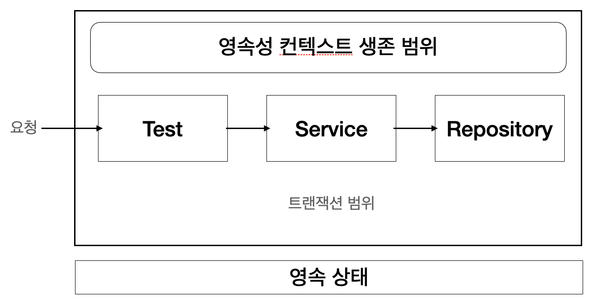 그림 15.1 테스트와 트랜잭션 범위

---

다음 코드의 테스트는 트랜잭션 안에서 시작하므로 테스트의 범위와 트랜잭션의 범위가 그림 15.1처럼 같다. 따라서 테스트 전체에서 같은 영속성 컨텍스트에 접근한다.

```java
@ContextConfiguration(locations = "classpath:appConfig.xml")
@Transactional // 트랜잭션 안에서 테스트를 실행한다.
public class MemberServiceTest {

    @Autowired
    private MemberSerivce memberService;

    @Autowired
    private MemberRepository memberRepository;

    @Test
    public void 회원가입() throws Exception {

        // Given
        Member member = new Member("kim");

        // When
        Long saveId = memberService.join(member);

        // Then
        Member findMember = memberRepository.findOne(saveId);
        assertTrue(member == findMember);
    }
}

@Transactional
public class MemberService {

    @Autowired MemberRepository memberRepository;

    public Long join(Member member) {
        memberRepository.save(member);
        return member.getId();
    }
}

@Repository
public class MemberRepository {

    @PersistenceContext
    private EntityManager em;

    public void save(Member member) {
        em.persist(member);
    }

    public Member findOne(Long id) {
        return em.find(Member.class, id);
    }
}
```

위 코드처럼 테스트 클래스에 @Transactional이 선언되어 있으면 트랜잭션을 먼저 시작하고 테스트 메소드를 실행한다. 따라서 테스트 메소드인 회원가입() 은 이미 트랜잭션 범위에 들어 있고 이 메소드가 끝나면 트랜잭션이 종료된다. 그러므로 회원가입() 에서 사요된 코드는 항상 같은 트랜잭션과 같은 영속성 컨텍스트에 접근한다.

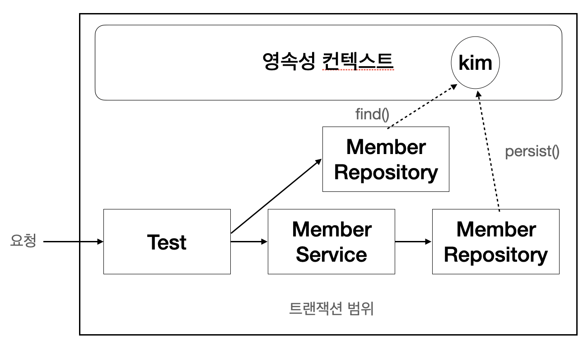 그림 15.2 테스트와 트랜잭션 범위 예제

---

코드를 보면 회원을 생성하고 memberRepository에서 em.persist(member)로 회원을 영속성 컨텍스트에 저장한다. 그리고 저장된 회원을 찾아서 저장한 회원과 비교한다.

```java
Member findMember = memberRepository.findOne(saveId);
assertTrue(member == findMember); // 참조값 비교
```

여기서 흥미로운 것은 저장한 회원과 회원 리포지토리에서 찾아온 엔티티가 완전히 같은 인스턴스라는 점이다. 그림 15.2를 보자. 이것은 같은 트랜잭션 범위에 있으므로 같은 영속성 컨텍스트를 사용하기 때문이다.

따라서 영속성 컨텍스트가 같으면 엔티티를 비교할 때 다음 3가지 조건을 모두 만족한다.

- 동일성(identical): == 비교가 같다.
- 동등성(equals): equals() 비교가 같다.
- 데이터베이스 동등성: @Id인 데이터베이스 식별자가 같다.

_테스트에도 @Transactional이 있고 서비스에도 @Transactional이 있다. 기본 전략은 먼저 시작된 트랜잭션이 있으면 그 트랜잭션을 그대로 이어 받아 사용하고 없으면 새로 시작한다. 만약 다른 전략을 사용하고 싶다면 propagation 속성을 변경하면 된다._

_테스트 클래스에 @Transactional을 적용하면 테스트가 끝날 때 트랜잭션을 커밋하지 않고 트랜잭션을 강제로 롤백한다. 그래야 데이터베이스에 영향을 주지 않고 테스트를 반복해서 할 수 있기 때문이다. 문제는 롤백시에는 영속성 컨텍스트를 플러시하지 않는다는 점이다. 플러시를 하지 않으므로 플러시 시점에 어떤 SQL이 실행되는지 콘솔 로그에 남지 않는다. 어떤 SQL이 실행되는지 콘솔을 통해 보고 싶으면 테스트 마지막에 em.flush()를 강제로 호출하면 된다._

### 15.2.2 영속성 컨텍스트가 다를 때 엔티티 비교

다음 코드와 같이 테스트 클래스에 @Transactional이 없고 서비스에만 @Transactional이 있으면 그림 15.3과 같은 트랜잭션 범위와 영속성 컨텍스트 범위를 가지게 된다.

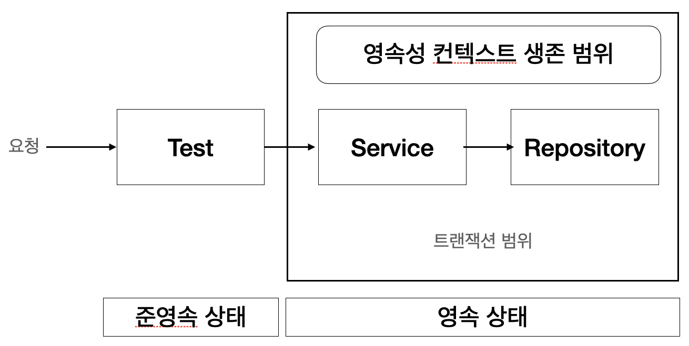 그림 15.3 테스트와 트랜잭션 - 준영속

```java
ContextConfiguration(locations = "classpath:appConfig.xml")
// @Transactional // 테스트에서 트랜잭션을 사용하지 않는다.
public class MemberServiceTest {

    @Autowired
    private MemberSerivce memberService;

    @Autowired
    private MemberRepository memberRepository;

    @Test
    public void 회원가입() throws Exception {

        // Given
        Member member = new Member("kim");

        // When
        Long saveId = memberService.join(member);

        // Then
        Member findMember = memberRepository.findOne(saveId);
        // findMember는 준영속 상태다.

        // 둘은 다른 주소값을 가진 인스턴스다. 테스트가 실패한다.
        assertTrue(member == findMember);
    }
}

@Transactional // 서비스 클래스에서 트랜잭션이 시작된다.
public class MemberService {

    @Autowired MemberRepository memberRepository;

    public Long join(Member member) {
        memberRepository.save(member);
        return member.getId();
    }
}

@Repository
@Transactional // 예제를 구성하기 위해 추가했다.
public class MemberRepository {

    @PersistenceContext
    private EntityManager em;

    public void save(Member member) {
        em.persist(member);
    }

    public Member findOne(Long id) {
        return em.find(Member.class, id);
    }
}
```

위 코드에서 테스트는 실패한다. 왜 실패하는지 이해했다면 영속성 컨텍스트의 생존 범위를 대부분 이해했다고 볼 수 있다.

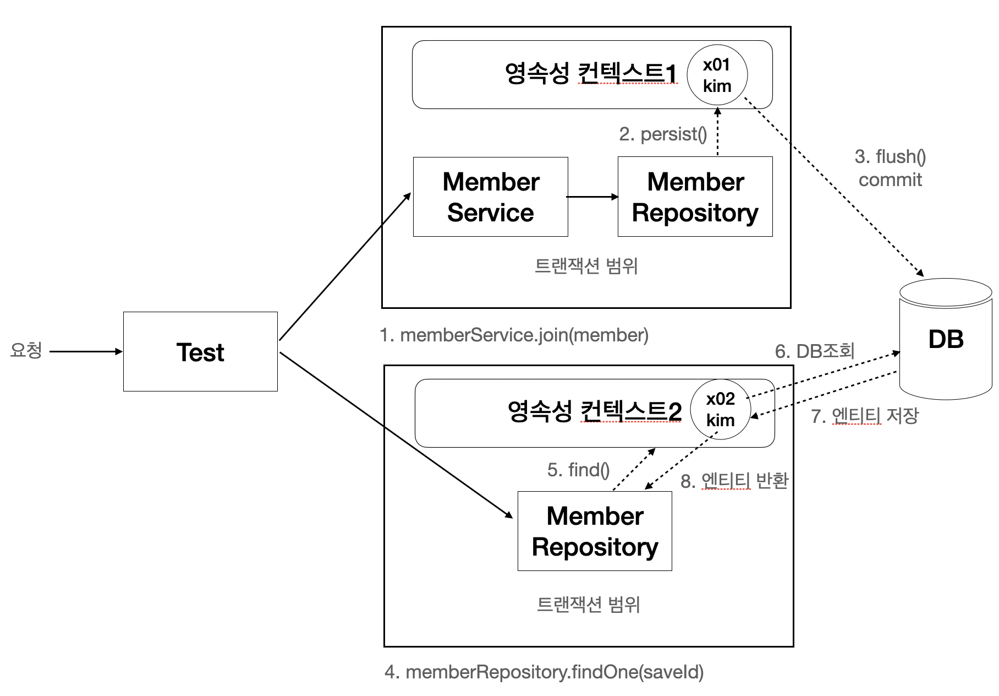 그림 15.4 테스트와 트랜잭션 - 준영속 예제

---

1. 테스트 코드에서 memberService.join(member) 를 호출해서 회원가입을 시도하면 서비스 계층에서 트랜잭션이 시작되고 영속성 컨텍스트1이 만들어 진다.
2. memberRepository에서 em.persist()를 호출해서 member 엔티티를 영속화 한다.
3. 서비스 계층이 끝날 때 트랜잭션이 커밋되면서 영속성 컨텍스트가 플러시된다. 이때 트랜잭션과 영속성 컨텍스트가 종료된다. 따라서 member 엔티티 인스턴스는 준영속 상태가 된다.
4. 테스트 코드에서 memberRepository.findOne(saveId)를 호출해서 저장한 엔티티를 조회하면 리포지토리 계층에서 새로운 트랜잭션이 시작되면서 새로운 영속성 컨텍스트2가 생성된다.
5. 저장된 회원을 조회하지만 새로 생성된 영속성 컨텍스트2에는 찾는 회원이 존재하지 않는다.
6. 따라서 데이터베이스에서 회원을 찾아온다.
7. 데이터베이스에서 조회된 회원 엔티티를 영속성 컨텍스트에 보관하고 반환한다.
8. memberRepository.findOne() 메소드가 끝나면서 트랜잭션이 종료되고 영속성 컨텍스트2도 종료된다.

member와 findMember는 각각 다른 영속성 컨텍스트에서 관리되었기 때문에 둘은 다른 인스턴스이므로 테스트가 실패한다.

하지만 member와 findMember는 인스턴스는 다르지만 같은 데이터베이스 로우를 가지르키고 있다. 따라서 사실상 같은 엔티티로 보아야 한다.

이처럼 영속성 컨텍스트가 다르면 동일성 비교에 실패한다. 영속성 컨텍스트가 다를 때 엔티티 비교는 다음과 같다.

- 동일성(identical): == 비교가 실패한다.
- 동등성(equals): equals() 비교가 만족한다. 단 equals()를 구현해야 한다. 보통 비즈니스 키로 구현한다.
- 데이터베이스 동등성: @Id인 데이터베이스 식별자가 같다.

앞서 보았듯이 같은 영속성 컨텍스트를 보장하면 동일성 비교만으로 충분하다. 따라서 OSIV처럼 요청의 시작부터 끝까지 같은 영속성 컨텍스트를 사용할 때는 동일성 비교가 성공한다. 하지만 지금처럼 영속성 컨텍스트가 달리지면 동일성 비교는 실패한다. 따라서 엔티티의 비교에 다른 방법을 사용해야 한다.

동일성 비교 대신에 데이터베이스 동등성 비교를 해보자

```java
member.getId().equals(findMember.getId()); // 데이터베이스 식별자 비교
```

데이터베이스 동등성 비교는 엔티티를 영속화해야 식별자를 얻을 수 있다는 문제가 있다. 엔티티를 영속화하기 전에는 식별자 값이 null이므로 정확한 비교를 할 수 없다. 물론 식별자 값을 직접 부여하는 방식을 사용할 때는 데이터베이스 식별자 비교도 가능하다. 하지만 항상 식별자를 먼저 부여하는 것을 보장하기는 쉽지않다.

남은 것은 equals()를 사용한 동등성 비교인데, 엔티티를 비교할 때는 비즈니스키를 활용한 동등성 비교를 권장한다.

동등성 비교를 위해 equals()를 오버라이딩할 때는 비즈니스 키가 되는 필드들을 선택하면 된다. 비즈니스 키가 되는 필드는 보통 중복되지 않고 거의 변하지 않는 데이터베이스 기본 키 후보들이 좋은 대상이다. 만약 주민등록번호가 있다면 중복되지 않고 거의 변경되지 않으므로 좋은 비즈니스 키 대상이다. 이것은 객체 상태에서만 비교하므로 유일성만 보장되면 가끔 있는 변경 정도는 허용한다. 따라서 데이터베이스 기본 키 같이 너무 딱딱하게 정하지 않아도 된다. 예를 들어 회원 엔티티에 이름과 연락처가 같은 회원이 없다면 회원의 이름과 연락처 정도만 조합해서 사용해도 된다.

정리하자면 동일성 비교는 같은 영속성 컨텍스트의 관리를 받는 영속 상태의 엔티티에만 적용할 수 있다. 그렇지 않을 때는 비즈니스 키를 사용한 동등성 비교를 해야 한다.

## 15.3 프록시 심화 주제

프록시는 원본 엔티티를 상속받아서 만들어지므로 엔티티를 사용하는 클라이언트는 엔티티가 프록시인지 아니면 원본 엔티티인지 구분하지 않고 사용할 수 있다. 따라서 원본 엔티티를 사용하다가 지연 로딩을 하려고 프록시로 변경해도 클라이언트의 비즈니스 로직을 수정하지 않아도 된다. 하지만 프록시를 사용하는 방식의 기술적인 한계로 인해 예상하지 못한 문제들이 발생하기도 하는데. 어떤 문제가 발생하고 어떻게 해결해야 하는지 알아보자.

### 15.3.1 영속성 컨텍스트와 프록시

영속성 컨텍스트는 자신이 관리하는 영속 엔티티의 동일성을 보장한다. 그럼 프록시로 조회한 엔티티의 동일성도 보장할까?

```java
@Test
public void 영속성컨텍스트와_프록시 {
    Member newMember = new Member("member1", "회원1");
    em.persist(newMember);
    em.flush();
    em.clear();

    Member refMember = em.getReference(Member.class, "member1");
    Member findMember = em.find(Member.class, "member1");

    System.out.println("refMember Type = " + refMember.getClass());
    System.out.println("findMember Type = " + findMember.getClass());

    // refMember Type = class Member_$$_jvst843_0
    // findMember Type = class Member_$$_jvst843_0

    Assert.assertTrue(refMember == findMember); // 성공
}
```

먼저 member1을 em.getReference() 메소드를 사용해서 프록시로 조회했다. 그리고 다음으로 같은 member1을 em.find()를 사용해서 조회했다. refMember는 프록시고 findMember는 원본 엔티티이므로 둘은 서로 다른 인스턴스로 생각할 수 있지만 이렇게 되면 영속성 컨텍스트가 영속 엔티티의 동일성을 보장하지 못하는 문제가 발생한다.

그래서 영속성 컨텍스트는 프록시로 조회된 엔티티에 대해서 같은 엔티티를 찾는 요청이 오면 원본 엔티티가 아닌 처음 조회된 프록시를 반환한다. 예제에서 member1 엔티티를 프록시로 처음 조회했기 때문에 이후에 em.find()를 사용해서 같은 member1 엔티티를 찾아도 영속성 컨텍스트는 원본이 아닌 프록시를 반환한다.

em.find()로 조회한 findMember의 타입을 출력한 결과를 보면 끝에 \$\$\_jvst843_0가 붙어있으므로 프록시로 조회된 것을 확인할 수 있다. 그리고 마지막에 assertTrue 검증 코드를 통해 refMember와 findMember가 같은 인스턴스인 것을 알 수 있다. 따라서 프록시로 조회해도 영속성 컨텍스트는 영속 엔티티의 동일성을 보장한다.

이는 반대로 원본 엔티티를 먼저 조회하고 나서 프록시를 조회해보자

```java
@Test
public void 영속성컨텍스트와_프록시 {
    Member newMember = new Member("member1", "회원1");
    em.persist(newMember);
    em.flush();
    em.clear();

    Member findMember = em.find(Member.class, "member1");
    Member refMember = em.getReference(Member.class, "member1");

    System.out.println("refMember Type = " + refMember.getClass());
    System.out.println("findMember Type = " + findMember.getClass());

    // refMember Type = class Member
    // findMember Type = class Member

    Assert.assertTrue(refMember == findMember); // 성공
}
```

원본 엔티티를 먼저 조회하면 영속성 컨텍스트는 원본 엔티티를 이미 데이터베이스에서 조회했으므로 프록시를 반환할 이유가 없다. 따라서 em.getReference()를 호출해도 프록시가 아닌 원본을 반환한다. 출력 결과를 보면 프록시가 아닌 원본 엔티티가 반환된 것을 확인할 수 있다. 물론 이 경우에도 영속성 컨텍스트는 자신이 관리하는 영속 엔티티의 동일성을 보장한다.

### 15.3.2 프록시 타입 비교

프록시는 원본 엔티티를 상속 받아서 만들어지므로 프록시로 조회한 엔티티의 타입을 비교할 때는 == 비교를 하면 안 되고 대신에 instanceof를 사용해야 한다.

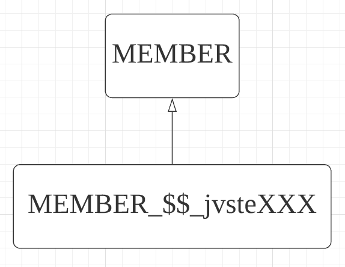 그림 15.5 프록시 타입 비교

---

```java
@Test
public void 프록시_타입비교 {
    Member newMember = new Member("member1", "회원1");
    em.persist(newMember);
    em.flush();
    em.clear();

    Member refMember = em.getReference(Member.class, "member1");

    System.out.println("refMember Type = " + refMember.getClass());

    // refMember Type = class Member_$$_jvsteXXX

    Assert.assertTrue(Member.class == refMember.getClass()); // false
    Assert.assertTrue(refMember instanceof Member.class); // true
}
```

refMember의 타입을 출력해보면 프록시로 조회했으므로 출력 결과 끝에 프록시라는 의미의 \_\$\$\_jvsteXXX가 붙어 있는 것을 확인할 수 있다.

Member.class == refMember.getClass() 비교는 부모 클래스와 자식 클래스를 == 비교한 것이 된다. 따라서 결과는 false다 프록시는 원본 엔티티의 자식 타입이므로 instanceof 연산을 사용하면 된다.

### 15.3.3 프록시 동등성 비교

엔티티의 동등성을 비교하려면 비즈니스 키를 사용해서 equals() 메소드를 오버라이딩하고 비교하면 된다. 그러나 IDE나 외부 라이브러리를 사용해서 구현한 equals() 메소드로 엔티티를 비교할 때 비교 대상이 원본 엔티티이면 문제가 없지만 프록시면 문제가 발생할 수 있다.

```java
@Entity
public class Member {

    @Id
    private String id;

    @Getter
    @Setter
    private String name;

    @Override
    public boolean equals(Object obj) {
        if (this == obj) return true;
        if (obj == null) return false;
        if (this.getClass() != obj.getClass()) return false; // 1

        Member member = (Member) obj;

        if (name != null ? !name.equals(member.name)
            : member.name != null) { // 2
            return false;
        }

        return true;
    }

    @Override
    public int hashCode() {
        return name != null ? name.hashCode() : 0;
    }
}
```

위 코드에서 회원 엔티티는 name 필드를 비즈니스 키로 사용해서 equals() 메소드를 오버라이딩 했다.

```java
@Test
public void 프록시와_동등성비교() {

    Member saveMember = new Member("member1", "회원1");
    em.persist(saveMember);
    em.flush();
    em.clear();

    Member newMember = new Member("member1", "회원1");
    Member refMember = em.getReference(Member.class, "member1");

    Assert.assertTrue(newMember.equals(refMember));
}
```

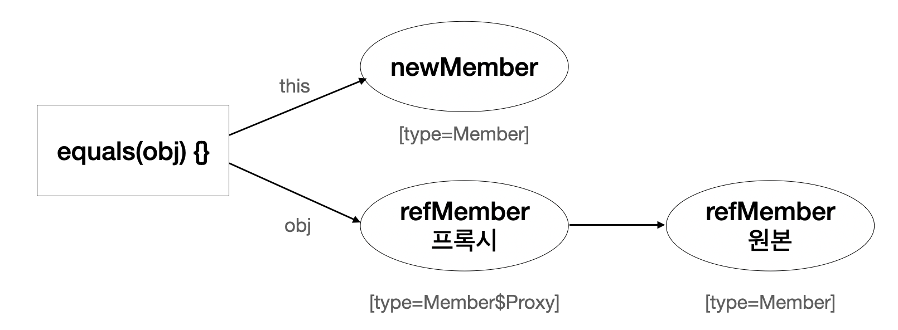 그림 15.6 프록시 동등성 비교

---

코드와 그림을 보자. 새로 생성한 회원 newMember와 프록시로 조회한 회원 refMember의 name 속성은 둘 다 회원1로 같으므로 동등성 비교를 하면 성공할 것 같다. 따라서 newMember.equals(refMember)의 결과는 true를 기대했지만 실행해보면 false가 나오면서 테스트가 실패한다. 참고로 이 테스트를 프록시가 아닌 원본 엔티티를 조회해서 비교하면 성공한다. 왜 이런 문제가 발생하는 것일까?

프록시와 equals() 비교를 할 때는 몆가지 주의점이 있다. 먼저 코드의 1번 부분을 보자

```java
if (this.getClass() != obj.getClass()) return false; // 1
```

여기서 this.getClass() != obj.getClass()로 타입을 동일성 비교한다. 앞서 이야기한데로 프록시는 원본을 상속받은 자식 타입이므로 프록시의 타입을 비교할 때는 == 비교가 아닌 instanceof를 사용해야 한다. 따라서 다음처럼 변경해야 한다.

```java
if (obj instanceof Member) return false; // 1
```

그리고 다음 문제는 equals() 메소드의 2번 부분에 있다.

```java
Member member = (Member) obj;

if (name != null ? !name.equals(member.name) : member.name != null) { // 2
    return false;
}
```

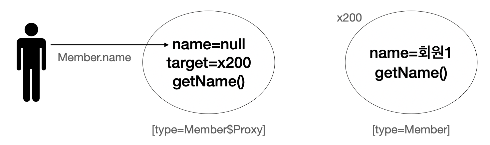 그림 15.7 프록시 필드 직접 접근

---

그림 15.7의 member.name을 보면 프록시의 멤버변수에 직접 접근하는데 이 부분을 주의깊게 봐야 한다. equals() 메소드를 구현할 때는 일반적으로 멤버변수를 직접 비교하는데, 프록시의 경우는 문제가 된다. 프록시는 실제 데이터를 가지고 있지 않다. 따라서 프록시의 멤버변수에 직접 접근하면 아무값도 조회할 수 없다. 따라서 member.name의 결과는 null이 반환되고 equals()는 false를 반환한다.

name 멤버변수가 private이므로 일반적인 상황에서는 프록시의 멤버변수에 직접 접근하는 문제가 발생하지 않지만 equals() 메소드는 자신을 비교하기 때문에 private 멤버변수에도 접근할 수 있다.

프록시의 데이터를 조회할 때는 그림 15.8처럼 접근자를 사용해야 한다. 접근자를 사용하도록 비교 코드를 수정해보자.

```java
Member member = (Member) obj;

if (name != null ? !name.equals(member.getName()) : member.getName() != null) {
    return false;
}
```

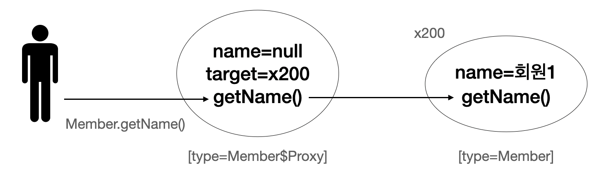 그림 15.8 프록시 접근자 사용

---

equals() 메소드를 수정한 전체 코드는 다음과 같다.

```java
@Override
    public boolean equals(Object obj) {
        if (this == obj) return true;
        if (obj == null) return false;
        if (obj instanceof Member) return false; // 1

        Member member = (Member) obj;

        if (name != null ? !name.equals(member.getName())
            : member.getName() != null) { // 2
            return false;
        }

        return true;
    }
```

수정한 코드로 테스트를 실행하면 newMember.equals(refMember)의 결과로 true가 반환되고 테스트가 성공한다.

정리하자면 프록시의 동등성을 비교할 때는 다음 사항을 주의해야 한다.

- 프록시의 타입 비교는 == 비교 대신에 instanceof를 사용해야 한다.
- 프록시의 멤버변수에 직접 접근하면 안 되고 대신에 접근자 메소드를 사용해야 한다.

### 15.3.4 상속관계와 프록시

상속관계를 프록시로 조회할 때 발생할 수 있는 문제점과 해결방안을 알아보자. 클래스 모델은 다음 그림과 같다.

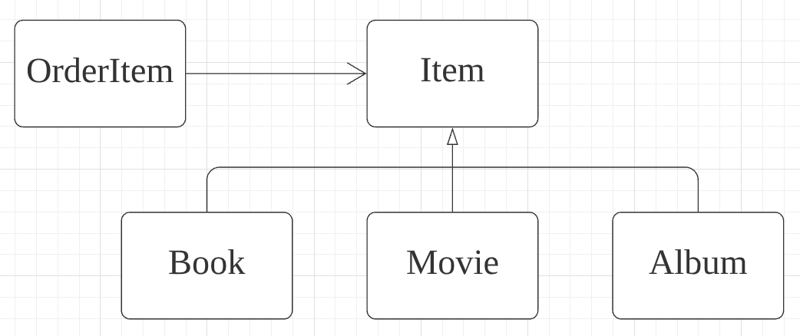 그림 15.9 상속관계와 프록시 1

---

프록시를 부모 타입으로 조회하면 문제가 발생한다.

```java
@Test
public void 부모타입으로_프록시조회() {
    // 테스트 데이터 준비
    Book saveBook = new Book();
    saveBook.setName("jpabook");
    saveBook.setAuthor("kim");
    em.persist(saveBook);

    em.flush();
    em.clear();

    // 테스트 시작
    Item proxyItem = em.getReference(Item.class, saveBook.getId());
    System.out.println("proxyItem = " + proxyItem.getClass());

    if (proxyItem instanceof Book) {
        System.out.println("proxyItem instanceof Book");
        Book book = (Book) proxyItem;
        System.out.println("book author = " + book.getAuthor());
    }

    // 결과 검증
    Assert.assertFalse(proxyItem.getClass() == Book.calss);
    Assert.assertFalse(proxyItem instanceof Book);
    Assert.assertTrue(proxyItem instanceof Item);
}
```

출력 결과는 다음과 같다.

```text
proxyItem = class Item_$$_jvstXXX
```

위 코드는 Item을 조회해서 Book 타입이면 저자 이름을 출력한다. 먼저 em.getReference() 메소드를 사용해서 Item 엔티티를 프록시로 조회했다. 그리고 instanceof 연산을 사용해서 proxyItem이 Book 클래스 타입인지 확인한다. Book 타입이면 다운캐스팅해서 Book 타입으로 변경하고 저자 이름을 출력한다. 그런데 출력 결과를 보면 기대와는 다르게 저자가 출력되지 않은 것을 알 수 있다. 그림 15.10을 통해 어떤 문제가 있는지 알아보자.

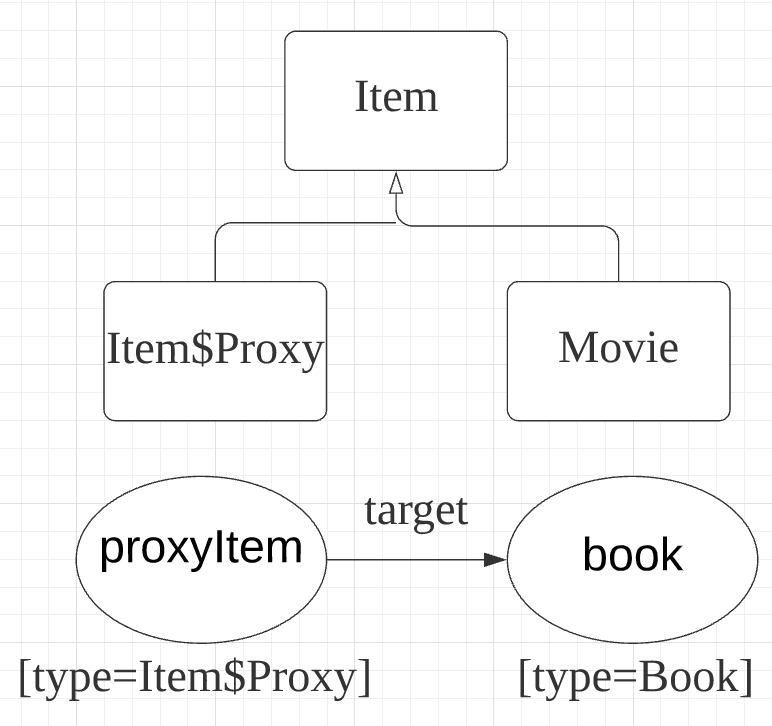 그림 15.10 상속관계와 프록시 2

코드에서 em.getReference() 메소드를 사용해서 Item 엔티티를 프록시로 조회했다. 이때 실제 조회된 엔티티는 Book이므로 Book 타입을 기반으로 원본 엔티티 인스턴스가 생성된다. 그런데 em.getReference() 메소드에서 Item 엔티티를 대상으로 조회했으므로 프록시인 proxyItem은 Item 타입을 기반으로 만들어진다. 이 프록시 클래스는 원본 엔티티로 Book 엔티티를 참조한다.

출력 결과와 그림 15.10을 보면 proxyItem이 Book이 아닌 Item 클래스를 기반으로 만들어진 것을 확인할 수 있다. 이런 이유로 다음 연산이 기대와 다르게 false를 반환한다. 왜냐하면 프록시인 proxyItem은 Item\$Proxy 타입이고 이 타입은 Book 타입과 관계가 없기 때문이다.

```java
proxyItem instanceof Book // false
```

따라서 직접 다운캐스팅을 해도 문제가 발생한다. if문을 제거하면 다음과 같은 에러가 발생한다.

```java
Book book = (Book) proxyItem; // java.lang.ClassCastException
```

proxyItem은 Book 타입이 아닌 Item 타입을 기반으로 한 Item\$Proxy 타입이다. 따라서 ClassCastException 예외가 발생한다.

즉, 프록시를 부모 타입으로 조회하면 부모의 타입을 기반으로 프록시가 생성되는 문제가 있다.

- instanceof 연산을 사용할 수 없다.
- 하위 타입으로 다운캐스팅을 할 수 없다.

프록시를 부모 타입으로 조회하는 문제는 주로 다음 코드와 같이 다형성을 다루는 도메인 모델에서 나타난다.

```java
@Entity
@Getter
@Setter
public class OrderItem {

    @Id @GeneratedValue
    private Long id;

    @ManyToOne(fetch = FetchType.LAZY)
    @JoinColumn(name = "ITEM_ID")
    private Item item;
}
```

OrderItem에서 Item을 지연 로딩으로 설정해서 item이 프록시로 조회된다.

```java
@Test
public void 상속관계와_프록시_도메인모델() {
    // 테스트 데이터 준비
    Book book = new Book();
    book.setName("jpabook");
    book.setAuthor("kim");
    em.persist(book);

    OrderItem saveOrderItem = new OrderItem();
    saveOrderItem.setItem(book);
    em.persist(saveOrderItem);

    em.flush();
    em.clear();

    // 테스트 시작
    OrderItem orderItem = em.find(OrderItem.class, saveOrderItem.getId());
    Item item = orderItem.getItem();

    System.out.println("item = " + item.getClass());

    // 결과 검증
    Assert.assertFalse(item.getClass() == Book.class);
    Assert.assertFalse(item instanceof Book);
    Assert.assertTrue(item instanceof Item);
}
```

출력 결과는 다음과 같다.

```java
item = class Item_$$_jvstffa_3
```

OrderItem과 연관된 Item을 지연 로딩으로 설정했으므로 출력 결과를 보면 item이 프록시로 조회된 것을 확인 할 수 있다. 따라서 item instanceof Book 연산도 false를 반환한다.

그렇다면 상속관계에서 발생하는 프록시 문제를 어떻게 해결해야 할까?

가장 간단한 방법은 다음과 같이 처음부터 자식 타입을 직접 조회해서 필요한 연산을 하면 된다. 물론 이 방법을 사용하면 다형성을 활용할 수 없다.

```java
Book jpqlBook = em.createQuery("select b from Book b where b.id=:bookId", Book.class).setParameter("bookId", item.getId()).getSingleResult();
```

다음 방법으로는 하이버네이트가 제공하는 기능을 사용하여 프록시에서 원본 엔티티를 가져오는 방법이다.

```java
Item item = orderItem.getItem();
Item unProxyItem = unProxy(item);

if (unProxyItem instanceof Book) {
    System.out.println("proxyItem instanceof Book");
    Book book = (Book) unProxyItem;
    System.out.println("책 저자 = " + book.getAuthor());
}

Assert.assertTrue(item != unProxyItem);

// 하이버네이트가 제공하는 프록시에서 원본 엔티티를 찾는 기능을 사용하는 메소드
public static <T> T unProxy(Object entity) {
    if (entity instanceof HibernateProxy) {
        entity = ((HibernateProxy) entity)
            .getHibernateLazyInitializer()
            .getImplementation();
    }
    return (T) entity;
}
```

출력 결과는 다음과 같다.

```text
proxyItem instanceof Book
책 저자 = shj
```

처음에 설명했듯이 영속성 컨텍스트는 한 번 프록시로 노출한 엔티티는 계속 프록시로 노출한다. 그래야 영속성 컨텍스트가 영속 엔티티의 동일성을 보장할 수 있고, 클라이언트는 조회한 엔티티가 프록시인지 아닌지 구분하지 않고 사용할 수 있다. 그런데 이 방법은 프록시에서 원본 엔티티를 직접 꺼내기 대문에 프록시와 원본 엔티티의 동일성 비교가 실패하는 문제점이 있다. 따라서 다음 연산의 결과는 false다.

```java
item == unProxyItem // false
```

이 방법을 사용할 때는 원본 엔티티가 꼭 필요한 곳에서 잠깐 사용하고 다른 곳에서 사용되지 않도록 하는 것이 중요하다. 참고로 원본 엔티티의 값을 직접 변경해도 변경 감지 기능은 동작한다.

다음 방법은 특정 기능을 제공하는 인터페이스를 사용하는 방법이다.

 그림 15.11 상속관계와 프록시 3

---

다음 클래스 다이어그램은 그림 15.11과 같다.

```java
public interface TitleView {
    String getTitle();
}

@Inheritance(strategy = InheritanceType.SINGLE_TABLE)
@DiscriminatorColumn(name = "DTYPE")
@Getter
@Setter
public abstract class Item implements TitleView {

    @Id @GeneratedValue
    @Column(name = "ITEM_ID")
    private Long id;

    private String name;
    private int price;
    private int stockQuantity;
}

@Entity
@DiscriminatorValue(name = "B")
public class Book extends Item {

    private String author;
    private String isbn;

    @Override
    public String getTitle() {
        return "[제목:]" + getName() + " 저자:" + author + "]";
    }
}

@Entity
@DiscriminatorValue(name = "M")
public class Movie extends Item {

    private String director;
    private String actor;

    @Override
    public String getTitle() {
        return "[제목:]" + getName() + " 감독:" + director + " 배우:" + actor + "]";
    }
}
```

TitleView라는 공통 인터페이스를 만들고 자식 클래스들은 인터페이스의 getTitle() 메소드를 각각 구현했다. 이제 다음 코드와 같이 OrderItem에서 Item의 getTitle()를 호출하면 된다.

```java
@Entity
public class OrderItem {

    @Id @GeneratedValue
    private Long id;

    @ManyToOne(fetch = FetchType.LAZY)
    @JoinColumn(name = "ITEM_ID")
    private Item item;

    public void printItem() {
        System.out.println("TITLE=" + item.getTitle()));
    }
}

public static void main() {
    OrerItem orderItem = em.find(OrderItem.class, saveOrderItem.getId());
    orderItem.getTitle();
}
```

위 코드의 결과로 Item의 구현체에 따라 각각 다른 getTitle() 메소드가 호출된다. 예를 들어 Book을 조회했으면 다음 결과가 출력된다.

```text
TITLE=[제목:jpabook 저자:kim]
```

이처럼 인터페이스를 제공하고 각각의 클래스가 자신에 맞는 기능을 구현하는 것은 다형성을 활용하는 좋은 방법이다. 이후 다양한 상품 타입이 추가되어도 Item을 사용하는 OrderItem의 코드는 수정하지 않아도 된다. 그리고 이 방법은 클라이언트 입장에서 대상 객체가 프록시인지 아닌지를 고민하지 않아도 되는 장점이 있다.

이 방법을 사용할 때는 프록시의 특징 때문에 프록시의 대상이 되는 타입에 인터페이스를 적용하야 한다. 여기서는 Item이 프록시의 대상이므로 Item이 인터페이스를 받아야한다.

마지막으로 비지터 패턴을 사용해서 상속관계와 프록시 문제를 해결해보자.

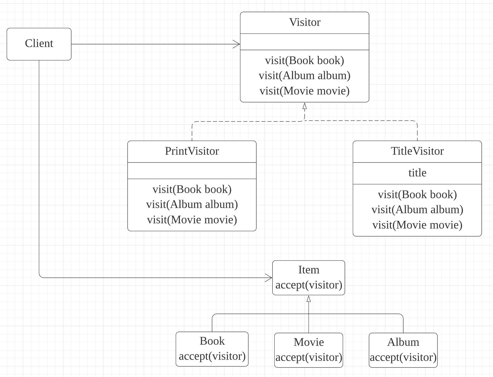 그림 15.12 상속관계와 프록시 4

---

그림 15.12를 보면 비지터 패턴은 Visitor와 Visitor를 받아들이는 대상 클래스로 구성된다. 여기서는 Itemdl accept(visitor) 메소드를 사용해서 Visitor를 받아들인다. 그리고 Item은 단순히 Visitor를 받아들이기만 하고 실제 로직은 Visitor가 처리한다.

```java
public interface Visitor {

    void visit(Book book);
    void visit(Album album);
    void visit(Movie movie);
}
```

Visitor에는 visit()라는 메소드를 정의하고 모든 대상 클래스를 받아들이도록 작성하면 된다. 여기서는 Book, Album, Movie를 대상 클래스로 사용한다.

```java
public class PrintVisitor implements Visitor {

    @Override
    public void visit(Book book) {
        // 넘어오는 book은 Proxy가 아닌 원본 엔티티다.
        System.out.println("book.class = " + book.getClass());
        System.out.println("[PrintVisitor] [제목:" + book.getName() + " 저자:" + book.getAuthor() + "]");
    }

    @Override
    public void visit(Movie movie) {}

    @Override
    public void visit(Album album) {}
}

public class TitleVisitor implements Visitor {

    @Getter
    private String title;

    @Override
    public void visit(Book book) {
        title = "[제목:" + book.getName() + " 저자:" + book.getAuthor() + ";";
    }

    @Override
    public void visit(Movie movie) {}

    @Override
    public void visit(Album album) {}
}
```

위 예제는 Visitor의 구현 클래스로 대상 클래스의 내용을 출력해주는 PrintVisitor와 대상 클래스의 제목을 보관하는 TitleVisitor를 작성했다.

다음 코드는 Item에 Visitor를 받아들일 수 있도록 accept(visitor) 메소드를 추가했다.

```java
@Entity
// ...
public abstract class Item {
    // ...
    public abstract void accept(Visitor visitor);
}

@Entity
// ...
public class Book extends Item {
    // ...
    @Override
    public void accept(Visitor visitor) {
        visitor.visit(this);
    }
}
```

각각의 자식 클래스들은 부모에 정의한 accept(visitor) 메소드를 구현했는데, 구현 내용은 단순히 파라미터로 넘어온 Visitor의 visit(this) 메소드를 호출하면서 자신을 파라미터로 넘기는 것이 전부다. 이렇게 해서 실제 로직 처리를 visitor에 위임한다.

```java
@Test
public void 상속관계와_프록시_VisitorPattern() {

    OrderItem orderItem = em.find(OrderItem.class, orderItemId);
    Item item = orderItem.getItem();

    // PrintVisitor
    item.accept(new PrintVisitor());
}
```

출력 결과는 다음과 같다

```text
book.class = class Book
[PrintVisitor] [제목:jpabook 저자:kim]
```

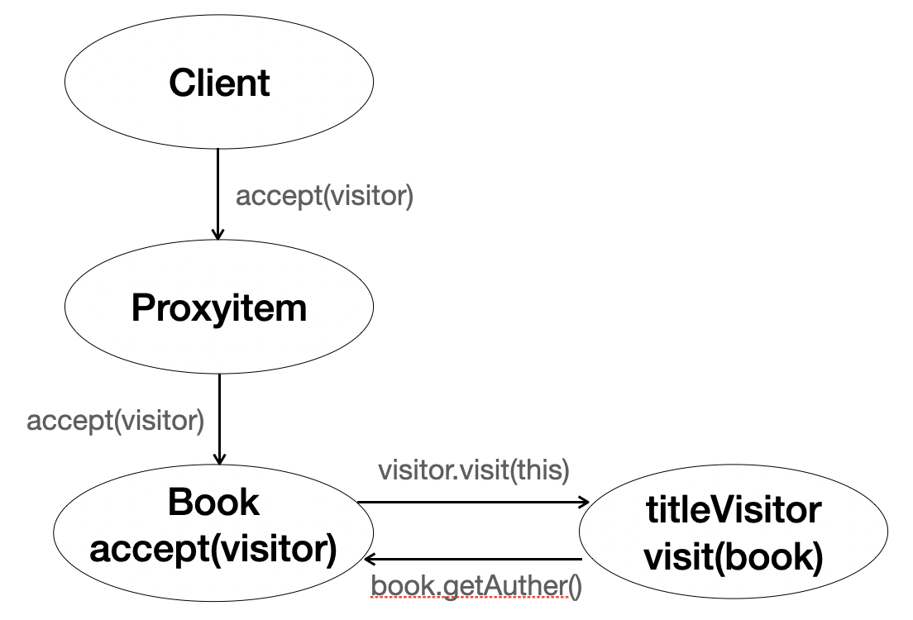 그림 15.13 상속관계와 프록시 5

코드를 그림 15.13을 통해 분석해보자. 먼저 item.accept() 메소드를 호출하면서 파라미터로 PrintVisitor를 넘겨주었다. item은 프록시이므로 먼저 프록시(ProxyItem)가 accept() 메소드를 받고 원본 엔티티(book)의 accept()를 실행한다. 원본 엔티티는 다음 코드를 실행해서 자신(this)을 visitor에 파라미터로 넘겨준다.

```java
public void accept(Visitor visitor) {
    visitor.accept(this) // this는 프록시가 아닌 원본이다.
}
```

visitor가 PrintVisitor 타입이므로 PrintVisitor.visit(this) 메소드가 실행되는데 이때 this가 Book 타입이므로 visit(Book book) 메소드가 실행된다.

```java
public class PrintVisitor implements Visitor {

    public void visit(Book book) {
        // 넘어오는 book은 Proxy가 아닌 원본 엔티티다.
        System.out.println("book.class = " + book.getClass());
        System.out.println("[PrintVisitor] [제목:]" + book.getName() + " 저자:" + book.getAuthor() + "]");
    }
    public void visit(Album album) {}
    public void visit(Movie movie) {}
}
```

다음 출력 결과를 보면 Visitor.visit()에서 파라미터로 넘어오는 엔티티는 프록시가 아니라 실제 원본 엔티티인 것을 확인할 수 있다.

```text
book.class = class Book
```

이렇게 비지터 패턴을 사용하면 프록시에 대한 걱정 없이 안전하게 원본 엔티티에 접근할 수 있고 instanceof나 타입캐스팅 없이 코드를 구현할 수 있는 장점이 있다.

비지터 패턴은 새로운 기능이 필요할 때 Visitor만 추가하면 된다. 따라서 기존 코드의 구조를 변경하지 않고 기능을 추가할 수 있는 장점이 있다.

장점은 다음과 같다.

- 프록시에 대한 걱정 없이 안전하게 원본 엔티티에 접근할 수 있다.
- instanceof와 타입캐스팅 없이 코드를 구현할 수 있다.
- 알고리즘과 객체 구조를 분리해서 구조를 수정하지 않고 새로운 동작을 추가할 수 있다.

단점은 다음과 같다.

- 너무 복잡하고 더블 디스패치를 사용하기 때문에 이해하기 어렵다
- 객체 구조가 변경되면 모든 Visitor를 수정해야 한다.

지금까지 상속관계에서 발생하는 프록시의 문제점과 다양한 해결방법을 알아보았다. 이 방법들은 조금씩 응용하면서 프록시로 인해 발생하는 문제는 어렵지 않게 해결할 수 있을 것이다.

## 15.4 성능 최적화

JPA로 애플리케이션을 개발할 때 발생하는 다양한 성능 문제와 해결 방안을 알아보자

### 15.4.1 N+1 문제

JPA로 애플리케이션을 개발할 때 성능상 가장 주의해야 하는 것이 N+1 문제다.

```java
@Entity
public class Member {

    @Id @GeneratedValue
    private Long id;

    @OneToMany(mappedBy = "member", fetch = FetchType.EAGER)
    private List<Order> orders = new ArrayList<Order>();
}

@Entity
@Table(name = "ORDERS")
public class Order {

    @Id @GeneratedValue
    private Long id;

    @ManyToOne
    private Member member;
}
```

회원과 주문정보는 1:N, N:1 양방향 연관관계다. 그리고 회원이 참조하는 주문정보인 Member.orders를 즉시 로딩으로 설정했다.

#### 15.4.1.1 즉시 로딩과 N+1

특정 회원 하나를 em.find() 메소드로 조회하면 즉시 로딩으로 설정한 주문정보도 함께 조회한다.

```java
em.find(Member.class ,id);
/*
SELECT M.*, O.* FROM MEMBER M ORDER JOIN ORDERS O ON M.ID = O.MEMBER_ID
*/
```

여기서 함께 조회하는 방법이 중요한데 SQL을 두 번 실행하는 것이 아니라 조인을 사용해서 한 번의 SQL로 회원과 주문정보를 함께 조회한다. 여기까지만 보면 즉시 로딩이 상당히 좋아보인다. 문제는 JPQL을 사용할 때 발생한다.

```java
List<Member> members = em.createQuery("select m from Member m", Member.class).getResultList();
```

JPQL을 실행하면 JPA는 이것을 분석해서 SQL을 생성한다. 이때는 즉시 로딩과 지연 로딩에 대해서 전혀 신경 쓰지 않고 JPQL만 사용해서 SQL을 생성한다. 따라서 다음과 같은 SQL이 실행된다.

```sql
SELECT * FROM MEMBER
```

SQL이 실행 결과로 먼저 회원 엔티티를 애플리케이션에 로딩한다. 그런데 회원 엔티티와 연관된 주문 컬렉션이 즉시 로딩으로 설정되어 있으므로 JPA는 주문 컬렉션을 즉시 로딩하려고 다음 SQL을 추가로 실행한다.

```sql
SELECT * FROM ORDERS WHERE MEMBER_ID=?
```

조회된 회원이 하나면 이렇게 총 2번의 SQL을 실행하지만 조회된 회원이 5명이면 어떻게 될까?

```sql
SELECT * FROM MEMBER; -- 1번 실행으로 회원 5명 조회
SELECT * FROM ORDERS WHERE MEMBER_ID=1; -- 회원과 연관된 주문
SELECT * FROM ORDERS WHERE MEMBER_ID=2; -- 회원과 연관된 주문
SELECT * FROM ORDERS WHERE MEMBER_ID=3; -- 회원과 연관된 주문
SELECT * FROM ORDERS WHERE MEMBER_ID=4; -- 회원과 연관된 주문
SELECT * FROM ORDERS WHERE MEMBER_ID=5; -- 회원과 연관된 주문
```

먼저 회원 조회 SQL로 5명의 회원 엔티티를 조회했다. 그리고 조회한 각각의 회원 엔티티와 연관된 주문 컬렉션을 즉시 조회하려고 총 5번의 SQL을 추가로 살행했다. 이 처럼 처음 실행한 SQL의 결과 수만큼 추가로 SQL을 실행하는 것을 N+1문제라 한다.

즉시 로딩은 JPQL을 실행할 때 N+1 문제가 발생할 수 있다.

#### 15.4.1.2 지연 로딩과 N+1

회원과 주문을 지연 로딩으로 설정하면 어떻게 될까? 방금 살펴본 즉시 로딩 시나리오를 지연 로딩으로 변경해도 N+1 문제에서 자우로울 수는 없다. 회원이 참조하는 주문정보를 FetchType.LAZY로 지정해서 지연 로딩으로 설정해보자.

```java
@Entity
public class Member {

    @Id @GeneratedValue
    private Long id;

    @OneToMany(mappedBy = "member", fetch = FetchType.LAZY)
    private List<Order> orders = new ArrayList<Order>();
}
```

지연 로딩으로 설정하면 JPQL에서는 N+1 문제가 발생하지 않는다.

```java
List<Member> members = em.createQuery("select m from Member m", Member.class).getResultList();
```

지연 로딩이므로 데이터베이스에서 회원만 조회된다. 따라서 다음 SQL만 실행되고 연관된 주문 컬렉션은 지연 로딩된다.

```sql
SELECT * FROM MEMBER
```

이후 비즈니스 로직에서 주문 컬렉션을 실제 사용할 때 지연 로딩이 발생한다.

```java
Member firstMemmber = members.get(0);
firstMember.getOrders().size(); // 지연 로딩 초기화
```

members.get(0)로 회원 하나만 조회해서 사용했기 때문에 firstMember.getOrders().size()를 호출하면서 실행되는 SQL은 다음과 같다.

```sql
SELECT * FROM ORDERS WHERE MEMBER_ID=?
```

문제는 다음처럼 모든 회원에 대해 연관된 주문 컬렉션을 사용할 때 발생한다.

```java
for (Member member : members) {
    // 지연 로딩 초기화
    System.out.println("member = " + member.getOrders().size());
}
```

주문 컬렉션을 초기화하는 수만큼 다음 SQL이 실행될 수 있다. 회원이 5명이면 회원에 따른 주문도 5번 조회된다.

```sql
SELECT * FROM ORDERS WHERE MEMBER_ID=1 -- 회원과 연관된 주문
SELECT * FROM ORDERS WHERE MEMBER_ID=2 -- 회원과 연관된 주문
SELECT * FROM ORDERS WHERE MEMBER_ID=3 -- 회원과 연관된 주문
SELECT * FROM ORDERS WHERE MEMBER_ID=4 -- 회원과 연관된 주문
SELECT * FROM ORDERS WHERE MEMBER_ID=5 -- 회원과 연관된 주문
```

이것도 결국 N+1 문제다. 지금까지 살펴본 것처럼 N+1 문제는 즉시 로딩과 지연 로딩일 때 모두 발생할 수 있다.

지금 부터는 N+1 문제를 피할 수 있는 다양한 방법을 알아보자.

#### 15.4.1.3 페치 조인 사용

N+1 문제를 해결하는 가장 일반적인 방법은 페치 조인을 사용하는 것이다. 페치 조인은 SQL 조인을 사용해서 연관된 엔티티를 함께 조회하므로 N+1 문제가 발생하지 않는다.

페치 조인을 사용하는 SQL을 보자

```sql
select m from Member m join fetch m.orders
/*
SELECT M.*, O.* FROM MEMBER M INNER JOIN ORDERS O ON M.ID=O.MEMBER_ID
*/
```

참고로 이 예제는 일대다 조인을 했으므로 결과가 늘어나서 중복된 결과가 나타날 수 있다. 따라서 JPQL의 DISTINCT를 사용해서 중복을 제거하는 것이 좋다.

#### 15.4.1.4 하이버네이트 @BatchSize

다음 예제와 같이 하이버네이트가 제공하는 org.hibernate.annotations.BatchSize 어노테이션을 사용하면 연관된 엔티티를 조회할 때 지정한 size만큼 SQL의 IN 절을 사용해서 조회한다. 만약 조회한 회원이 10명인데 size=5로 지정하면 2번의 SQL만 추가로 실행한다.

```java
@Entity
public class Member {

    @org.hibernate.annotations.BatchSize(size = 5)
    @OneToMany(mappedBy = "member", fetch = FetchType.LAZY)
    private List<Order> orders = new ArrayList<Order>();
}
```

즉시 로딩으로 설정하면 조회 시점에 10건의 데이터를 모두 조회해야 하므로 다음 SQL이 두 번 실행된다. 지연 로딩으로 설정하면 지연 로딩된 데이터를 최초 사용하는 시점에 다음 SQL을 실행해서 5건의 데이터를 미리 로딩한다. 그리고 6번째 데이터를 사용하면 다음 SQL을 추가로 실행한다.

```sql
SELECT * FROM ORDERS WHERE MEMBER_ID IN (?, ?, ?, ?, ?)
```

_hibernate.default_batch_fetch_size 속성을 사용하면 애플리케이션 전체에 기본으로 @BatchSize를 적용할 수 있다._

#### 15.4.1.5 하이버네이트 @Fetch(FetchMode.SUBSELECT)

다음 예제와 같이 하이버네이트가 제공하는 org.hibernate.annotations.Fetch 어노테이션에 FetchMode를 SUBSELECT로 사용하면 연관된 데이터를 조회할 때 서브 쿼리를 사용해서 N+1 문제를 해결한다.

```java
@Entity
public class Member {

    @org.hibernate.annotations.Fetch(FetchMode.SUBSELECT)
    @OneToMany(mappedBy = "member", fetch = FetchType.LAZY)
    private List<Order> orders = new ArrayList<Order>();
}
```

다음 JPQL로 회원 식별자 값이 10을 초과하는 회원을 모두 조회해보자.

```sql
select m from Member m where m.id > 10
```

즉시 로딩으로 설정하면 조회 시점에, 지연 로딩으로 설정하면 지연 로딩된 엔티티를 사용하는 시점에 다음 SQL이 실핸된다.

```sql
SELECT O FROM ORDERS O WHERE O.MEMBER_ID IN (SELECT M.ID FROM MEMBER M WHERE M.ID > 10)
```

#### 15.4.1.6 N+1 정리

즉시 로딩과 지연 로딩 중 추천하는 방법은 즉시 로딩은 사용하지 말고 지연 로딩만 사용하는 것이다. 즉시 로딩 전략은 그럴듯해 보이지만 N+1 문제는 물론이고 비즈니스 로직에 따라 필요하지 않은 엔티티를 로딩해야 하는 상황이 자주 발생한다. 그리고 즉시 로딩의 가장 큰 문제는 성능 최적화가 어렵다는 점이다. 엔티티를 조회하다보면 즉시 로딩이 연속으로 발생해서 전혀 예상하지 못한 SQL이 실행 될 수 있다. 따라서 모두 지연 로딩으로 설정하고 성능 최적화가 꼭 필요한 곳에는 JPQL 페치 조인을 사용하자.

JPA의 글로벌 페치 전략 기본값은 다음과 같다.

- @OneToOne, @ManyToOne: 기본 페치 전략은 즉시 로딩
- @OneToMany, @ManyToMany: 기본 페치 전략은 즉시 로딩

따라서 기본값이 즉시 로딩인 @OneToOne과 @ManyToOne은 fetch = FetchType.LAZY로 설정해서 지연 로딩 전략을 사용하도록 변경하자.

### 15.4.2 읽기 전용 쿼리의 성능 최적화

엔티티가 영속성 컨텍스트에 관리되면 1차 캐시부터 변경 감지까지 얻을 수 있는 혜택이 많다. 하지만 영속성 컨텍스트는 변경 감지를 위해 스냅샷 인스턴스를 보관하므로 더 많은 메모리를 사용하는 단점이 있다. 예를 들어 100건의 구매 내용을 출력하는 단순한 조회 화면이 있다고 가정해보자. 그리고 조회한 엔티티를 다시 조회할 일도 없고 수정할 일도 없이 딱 한 번만 읽어서 화면에 출력하면 된다. 이때는 읽기 전용으로 엔티티를 조회하면 메모리 사용량을 최적화할 수 있다.

다음 JPQL 쿼리를 최적화해보자.

```sql
select o from Order o
```

1. 스칼라 타입으로 조회

   가장 확실한 방법은 다음처럼 엔티티가 아닌 스칼라 타입으로 모튼 필드를 조회하는 것이다. 스칼라 타입은 영속성 컨텍스트가 결과를 관리하지 않는다.

   ```sql
   select o.id, o.name, o.price from Order p
   ```

2. 읽기 전용 쿼리 힌트 사용

   하이버네이트 전용 힌트인 org.hibernate.readOnly를 사용하면 엔티티를 읽기 전용으로 조회할 수 있다. 읽기 전용이므로 영속성 컨텍스트는 스냅샷을 보관하지 않는다. 따라서 메모리 사용량을 최적화할 수 있다. 단 스냅샷이 없으므로 엔티티를 수정해도 데이터베이스에 반영되지 않는다.

   ```java
   TypedQuery<Order> query = em.createQuery("select o from Order o", Order.class);
   query.setHint("org.hibernate.readOnly", true);
   ```

3. 읽기 전용 트랜잭션 사용

   스프링 프레임워크를 사용하면 트랜잭션을 읽기 전용 모드로 설정할 수 있다.

   ```java
   @Transactional(readOnly = true)
   ```

   트랜잭션에 readOnly=true 옵션을 주면 스프링 프레임워크가 하이버네이트 세션의 플러시 모드를 MANUAL로 설정한다. 이렇게 하면 강제로 플러시를 호출하지 않는 한 플러시가 일어나지 않는다. 따라서 트랜잭션을 커밋해도 영속성 컨텍스트를 플러시하지 않는다. 영속성 컨텍스트를 플러시하지 않으니 엔티티의 등록, 수정, 삭제는 당연히 동작하지 않는다. 하지만 플러시할 때 일어나는 스냅샷 비교와 같은 무거운 로직들을 수행하지 않으므로 성능이 향상된다. 물론 트랜잭션을 시작했으므로 트랜잭션 시작, 로직수행, 트랜잭션 커밋의 과정은 이루어는 진다. 단지 영속성 컨텍스트를 플러시하지 않을 뿐이다.

   _엔티티 매니저의 플러시 설정에는 AUTO, COMMIT 모드만 있고, MANUAL 모드가 없다. 반면에 하이버네이트 세션(org.hibernate.Session)의 플러시 설정에는 MANUAL 모드가 있다. MANUAL 모드는 강제로 플러시를 호출하지 않으면 절대 플러시가 발생하지 않는다. 참고로 하이버네이트 세션은 JPA 엔티티 매니저를 하이버네이트로 구현한 구현체다. 엔티티 매니저의 unwrap() 메소드를 호출하면 하이버네이트 세션을 수할 수 있다._

4. 트랜잭션 밖에서 읽기

   트랜잭션 밖에서 읽는다는 것은 트랜잭션 없이 엔티티를 조회한다는 뜻이다. 물론 JPA에서 데이터를 변경하려면 트랜잭션은 필수다. 따라서 조회가 목적일 때만 사용해야 한다.

   스프링 프레임워크를 사용하면 다음처럼 설정한다.

   ```java
   @Transactional(propagation = Propagation.NOT_SUPPORTED) // Spring
   ```

   이렇게 트랜잭션을 사용하지 않으면 플러시가 일어나지 않으므로 조회 성능이 향상된다.

   트랜잭션 밖에서 읽기를 조금 더 보충하자면 기본적으로 플러시 모드는 AUTO로 설정되어 있다. 따라서 트랜잭션을 커밋하거나 쿼리를 실행하면 플러시가 작동한다. 그런데 트랜잭션 자체가 존재하지 않으므로 트랜잭션을 커밋할 일이 없다. 그리고 JPQL 쿼리도 트랜잭션 없이 실행하면 플러시를 호출하지 않는다.

읽기 전용 데이터를 조회할 때, 메모리를 최적화하려면 스칼라 타입으로 조회하거나 하이버네이트가 제공하는 읽기 전용 쿼리 힌트를 사용하면 되고, 플러시 호출을 막아서 속도를 최적화하려면 읽기 전용 트랜잭션을 사용하거나 트랜잭션 밖에서 읽기를 사용하면 된다. 참고로 스프링 프레임워크를 사용하면 읽기 전용 트랜잭션을 사용하는 것이 편리하다.

따라서 다음 코드와 같이 읽기 전용 트랜잭션(또는 트랜잭션 밖에서 읽기)과 읽기 전용 쿼리 힌트(또는 스칼라 타입으로 조회)를 동시에 사용하는 것이 가장 효과적이다.

```java
@Transactional(readOnly = true) // 1. 읽기 전용 트랜잭션 사용: 플러스를 작동하지 않도록 해서 성능 향상
public List<DataEntity> findDatas() {
    return em.createQuery("select d from DataEntity d", DataEntity.class).setHint("org.hibernate.readOnly", true).getResultList();
    // 2. 읽기 전용 엔티티 사용: 엔티티를 읽기 전용으로 조회해서 메모리 절약
}
```

### 15.4.3 배치 처리

수백만 건의 데이터를 배치 처리해야 하는 상황이라 가정해보자. 일반적인 방식으로 엔티티를 계속 조회하면 영속성 컨텍스트에 아주 많은 엔티티가 쌓이면서 메모리 부족 오류가 발생한다. 따라서 이런 배치 처리는 적절한 단위로 영속성 컨텍스트를 초기화해야 한다. 또한, 2차 캐시를 사용하고 있다면 2차 캐시에 엔티티를 보관하지 않도록 주의해야 한다.

#### 15.4.3.1 JPA 등록 배치

수천에서 수만 건 이상의 엔티티를 한 번에 등록할 때 주의할 점은 영속성 컨텍스트에 엔티티가 계속 쌓이지 않도록 일정 단위마다 영속성 컨텍스트의 엔티티를 데이터베이스에 플러시하고 영속성 컨텍스트를 초기화해야 한다. 만약 이런 작업을 하지 않으면 영속성 컨텍스트에 너무 많은 엔티티가 저장되면서 메모리 부족 오류가 발생할 수 있다.

```java
EntityManager em = entityManagerFactory.createEntityManager();
EntityTransaction tx = em.getTransaction();
tx.begin();

for (int i=0; i < 100000; i++) {
    Product product = new Product("item" + i, 10000);
    em.persist(product);

    // 100건마다 플러시와 영속성 컨텍스트 초기화
    if (i % 100 == 0) {
        em.flush();
        em.clear();
    }
}

tx.commit();
em.close();
```

위 코드는 엔티티를 100건 저장할 때마다 플러시를 호출하고 영속성 컨텍스트를 초기화한다. 지금까지 등록 배치 처리를 알아보았다. 이번에는 수정 배치 처리를 알아보자.

배치 처리는 아주 많은 데이터를 조회해서 수정한다. 이때 수많은 데이터를 한번에 메모리에 올려둘 수 없어서 2가지 방법을 주로 사용한다.

- 페이징 처리: 데이터베이스 페이징 기능을 사용한다.
- 커서: 데이터베이스가 지원하는 커서 기능을 사용한다.

#### 15.4.3.2 JPA 페이징 배치 처리

```java
EntityManager em = entityManagerFactory.createEntityManager();
EntityTransaction tx = em.getTransaction();
tx.begin();

int pageSize = 100;
for (int i=0; i < 10; i++) {
    
    List<Product> resultList = em.createQuery("select p from Product p", Product.class).setFirstResult(i * pageSize).setMaxResult(pageSize).getResultList();

    // 비즈니스 로직 실행
    for (Product product : resultList) {
        product.setPrice(product.getPrice() + 100);
    }

    em.flush();
    em.clear();
    
}

tx.commit();
em.close();
```

한 번에 100건씩 페이징 쿼리로 조회하면서 상품의 가격을 100원씩 증가한다. 그리고 페이지 단위마다 영속성 컨텍스트를 플러시하고 초기화한다. 다음으로 커서를 사용하는 방법을 알아보자.

JPA는 JDBC 커서를 지원하지 않는다. 따라서 커서를 사용하려면 하이버네이트 세션을 사용해야 한다.

#### 15.4.3.3 하이버네이트 scroll 사용

하이버네이트는 scroll이라는 이름으로 JDBC 커서를 지원한다.

```java
EntityTransaction tx = em.getTransaction();
Session session = em.unwrap(Session.class);
tx.begin();
ScrollableResult scroll = session.createQuery("select p from Product p").setCacheMode(CacheMode.IGNORE).scroll(ScrollMode.FORWARD_ONLY);

int count = 0;

while(scroll.next()) {
    Product p = (Product) scroll.get(0);
    p.setPrice(p.getPrice() + 100);

    count++;
    if (count % 100 == 0) {
        session.flush();
        session.clear();
    }
}

tx.commit();
session.close();
```

scroll은 하이버네이트 전용 기능이므로 먼저 em.unwrap() 메소드를 사용해서 하이버네이트 세션을 구한다. 다음으로 쿼리를 조회하면서 scroll() 메소드로 ScrollableResults 객체를 반환받는다. 이 객체의 next() 메소드를 호출하면 엔티티를 하나씩 조회할 수 있다.

#### 15.4.3.4 하이버네이트 무상태 세션 사용

하이버네이트는 무상태 세션이라는 특별한 기능을 제공한다. 이름 그래도 무상태 세션은 영속성 컨텍스트를 만들지 않고 심지어 2차 캐시도 사용하지 않는다. 무상태 세션은 영속성 컨텍스트가 없다. 그리고 엔티티를 수정하려면 무상태 세션이 제공하는 update() 메소드를 직접 호출해야 한다.

```java
SessionFactory sessionFactory = entityManagerFactory.unwrap(SessionFactory.class);
StatelessSession session = sessionFactory.openStatelessSession();
Transaction tx = session.beginTransaction();
ScrollableResults scroll = session.createQuery("select p from Product p").scroll();

while (scroll.next()) {
    Product p = (Product) scroll.get(0);
    p.setPrice(p.getPrice() + 100);
    session.update(p); // 직접 update를 호출해야 한다.
}

tx.commit();
session.close();
```

### 15.4.4 SQL 쿼리 힌트 사용

JPA는 데이터베이스 SQL 힌트 기능을 제공하지 않는다. SQL 힌트를 사용하려면 하이버네이트를 직접 사용해야 한다. (참고로 여기서 말하는 SQL 힌트는 JPA 구현체에게 제공하는 힌트가 아니라 데이터베이스 벤더에게 제공하는 힌트다).

SQL 힌트는 하이버네이트 쿼리가 제공하는 addQueryHint() 메소드를 사용한다. 다음 예제는 오라클 데이터베이스에 SQL 힌트를 사용한 예이다.

```java
Session session = em.unwrap(Session.class);

List<Member> list = session.createQuery("select m from Member m").addQueryHint("FULL (MEMBER)").list();
```

실행된 SQL은 다음과 같다.

```sql
select /*+ FULL (MEMBER) */ m.id, m.name from Member m
```

현재 하이버네이트 4.3.10 버전에는 오라클 방언에만 힌트가 적용되어 있다. 다른 데이터베이스에서 SQL 힌트를 사용하려면 각 방언에서 org.hibernate.dialect.Dialect에 있는 다음 메소드를 오버라이딩해서 기능을 구현해야 한다.

```java
public String getQueryHintString(String query, List<String> hints) {
    return query;
}
```

### 15.4.5 트랜잭션을 지원하는 쓰기 지연과 성능 최적화

트랜잭션을 지원하는 쓰기 지연을 활용해서 애플리케이션 성능을 최적화하는 방법을 알아보자

#### 15.4.5.1 트랜잭션을 지원하는 쓰기 지연과 JDBC 배치

SQL을 직접 다루는 경우를 생각해보자.

```sql
insert(member1); -- INSERT INTO
insert(member2); -- INSERT INTO
insert(member3); -- INSERT INTO
insert(member4); -- INSERT INTO
insert(member5); -- INSERT INTO

commit();
```

네트워크 호출 한 번은 단순한 메소드를 수만법 호출하는 것보다 더 큰 비용이 든다. 이 코드는 5번의 INSERT SQL과 1번의 커밋으로 총 6번 데이터베이스와 통신한다. 이것을 최적화하려면 5번의 INSERT SQL을 모아서 한 번에 데이터베이스로 보내면 된다.

JDBC가 제공하는 SQL 배체 기능을 사용하면 SQL을 모아서 데이터베이스에 한번에 보낼 수 있다. 하지만 이 기능을 사용하려면 코드의 많은 부분을 수정해야 한다. 특히 비즈니스 로직이 복잡하게 얽혀 있는 곳에서 사용하기는 쉽지 않고 적용해도 코드가 상당히 지저분해진다. 그래서 보통은 수백 수천 건 이상의 데이터를 변경하는 특수한 상황에 SQL 배치 기능을 사용한다.

JPA는 플러시 기능이 있으므로 SQL 배치 기능을 효과적으로 사용할 수 있다.

참고로 SQL 배치 최적화 전략은 구현체마다 조금씩 다르다. 하이버네이트에서 SQL 배치를 적용하려면 다음과 같이 설정하면 된다. 이제부터 데이터를 등록, 수정, 삭제할 때 하이버네이트는 SQL 배치 기능을 사용한다.

```xml
<property name="hibernate.jdbc.batch_size", value="50">
```

hibernate.jdbc.batch_size 속성의 값을 50으로 주면 최대 50건씩 모아서 SQL 배치를 실행한다. 하지만 SQL 배치는 같은 SQL일 때만 유효하다. 중간에 다른 처리가 들어가면 SQL 배치를 다시 시작한다.

```java
em.persist(new Member()); // 1
em.persist(new Member()); // 2
em.persist(new Member()); // 3
em.persist(new Member()); // 4 
em.persist(new Child()); // 5, 다른 연산
em.persist(new Member()); // 6
em.persist(new Member()); // 7
```

이렇게 하면 1,2,3,4를 모아서 하나의 SQL 배치를 실행하고 5를 한 번 실행하고 6,7을 모아서 실행한다. 따라서 총 3번 SQL 배치를 실행한다.

_엔티티가 영속 상태가 되려면 식별자가 꼭 필요하다. 그런데 IDENTITY 식별자 생성 전략은 엔티티를 데이터베이스에 저장해야 식별자를 구할 수 있으므로 em.persist()를 호출하는 즉시 INSERT SQL이 데이터베이스에 전달된다. 따라서 쓰기 지연을 활용한 성능 최적화를 할 수 없다._

#### 15.4.5.2 트랜잭션을 지원하는 쓰기 지연과 애플리케이션 확장성

트랜잭션을 지원하는 쓰기 지연과 변경 감지 기능 덕분에 성능과 개발의 편의성이라는 두 마리 토끼를 모두 잡을 수 있었다. 하지만 진짜 장점은 데이터베이스 테이블 로우에 락이 걸리는 시간을 최소화한다는 점이다.

이 기능은 트랜잭션을 커밋해서 영속성 컨텍스트를 플러시하기 전까지 데이터베이스에 데이터를 등록, 수정, 삭제하지 않는다. 따라서 커밋 직전까지 데이터베이스 로우에 락을 걸지 않는다. 다음 로직을 보자.

```java
update(memberA) // UPDATE SQL A
비즈니스로직A(); // UPDATE SQL
비즈니스로직B(); // INSERT SQL
commit();
```

JPA를 사용하지 않고 SQL을 직접 다루면 update(memberA)를 호출할 때 UPDATE SQL을 실행하면서 데이터베이스 테이블 로우에 락을 건다. 이 락은 비즈니스로직A(), 비즈니스로직B()를 모두 수행하고 commit()을 호출할 때까지 유지된다. 트랜잭션 격리 수준에 따라 다르지만 보통 많이 사용하는 커밋된 읽기(Read Committed) 격리 수준이나 그 이상에서는 데이터베이스에 현재 수정 중인 데이터(로우)를 수정하려는 다른 트랜잭션은 락이 풀릴 때까지 대기한다.

JPA는 커밋을 해야 플러시를 호출하고 데이터베이스에 수정 쿼리를 보낸다. 예제에서 commit()을 호출할 때 UPDATE SQL을 실행하고 바로 데이터베이스 트랜잭션을 커밋한다. 쿼리를 보내고 바로 트랜잭션을 커밋하므로 결과적으로 데이터베이스에 락이 걸리는 시간을 최소화한다.

사용자가 증가하면 애플리케이션 서버를 더 증설하면 된다. 하지만 데이터베이스 락은 애플리케이션 서버 증설만으로는 해결할 수 없다. 오히려 애플리케이션 서버를 증설해서 트랜잭션이 증가할수록 더 많은 데이터베이스 락이 걸린다. JPA의 쓰기 지연 기능은 데이터베이스에 락이 걸리는 시간을 최소화해서 동시에 더 많은 트랜잭션을 처리할 수 있는 장점이 있다.

_update(memberA)를 호출할 때 즉시 락을 걸고 싶다면 JPA가 제공하는 락 기능을 사용하면 된다. _
