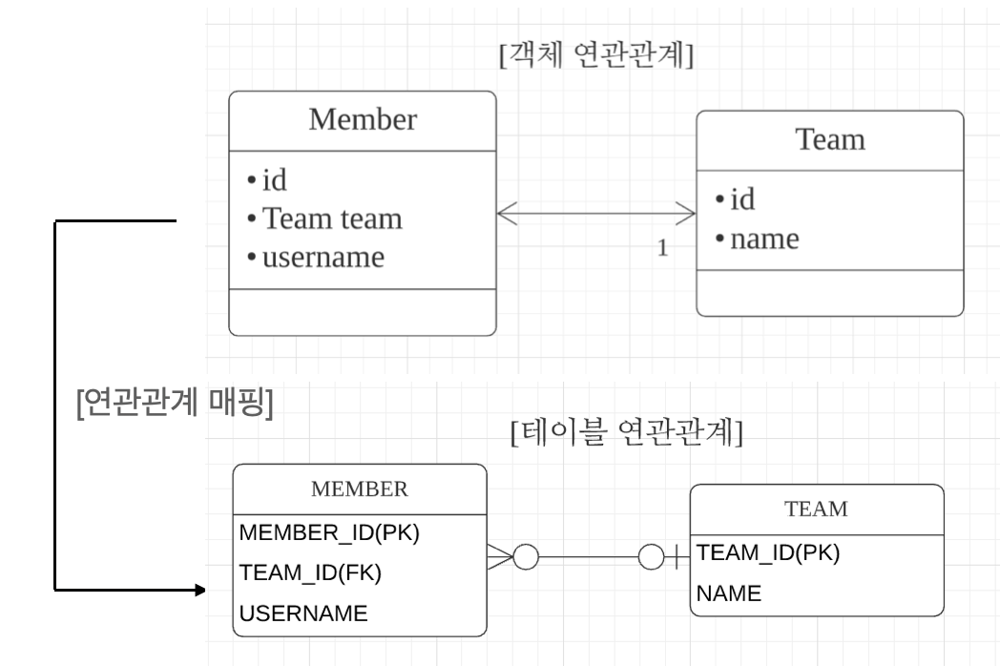
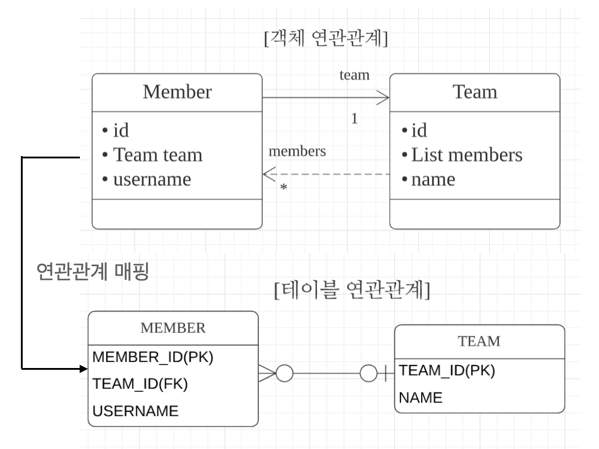
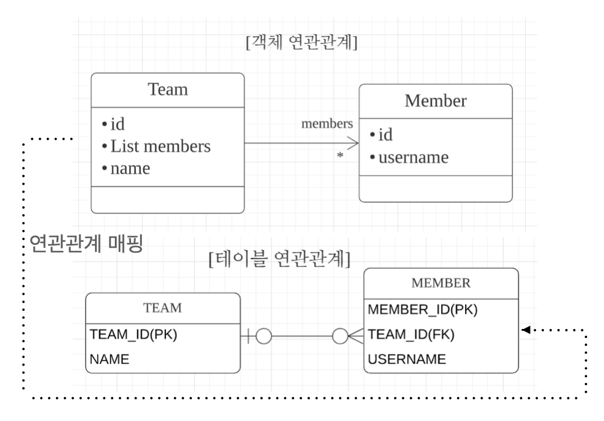
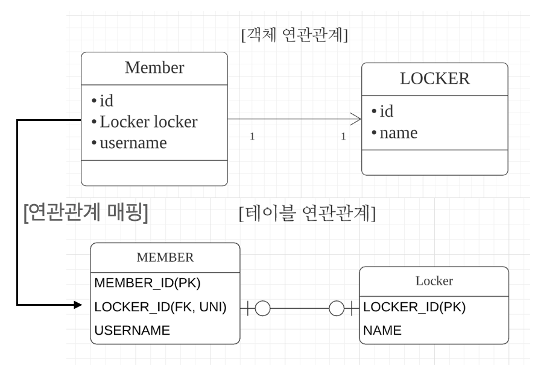
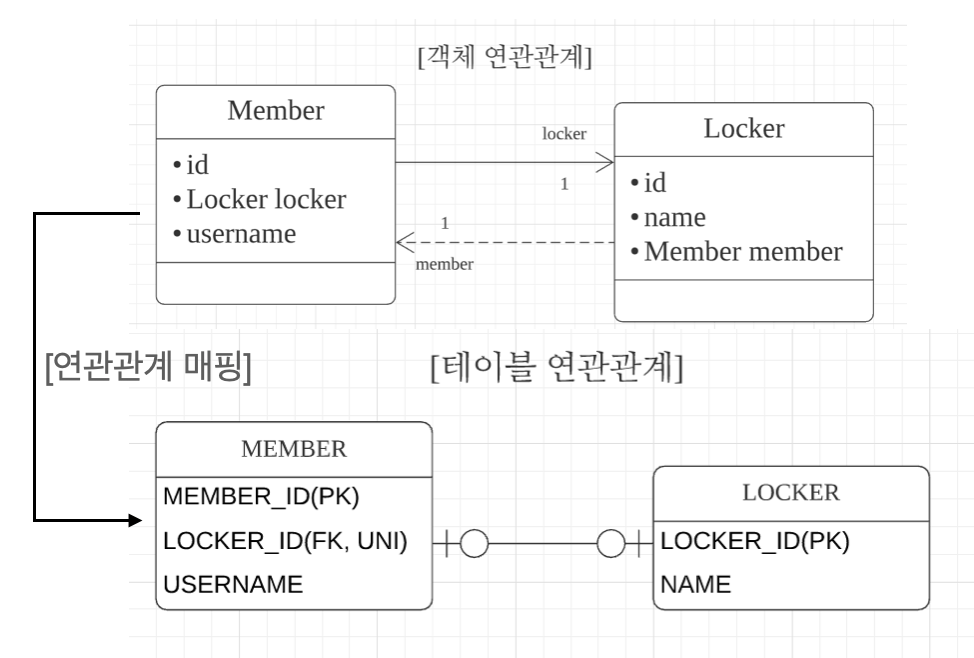
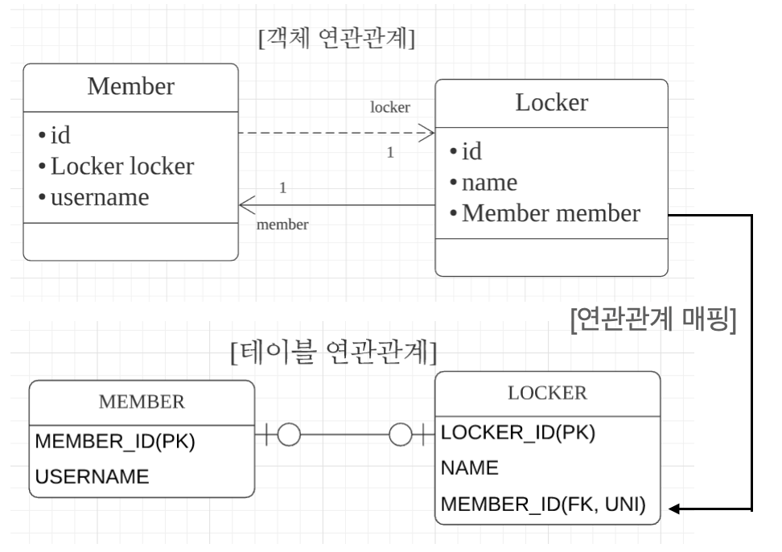
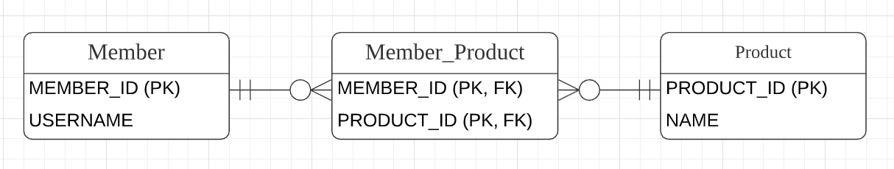
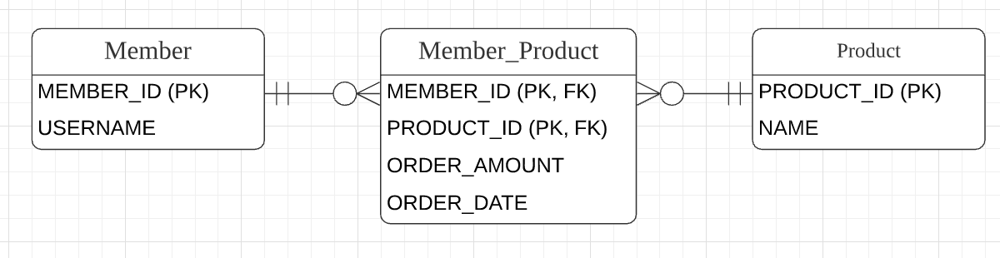
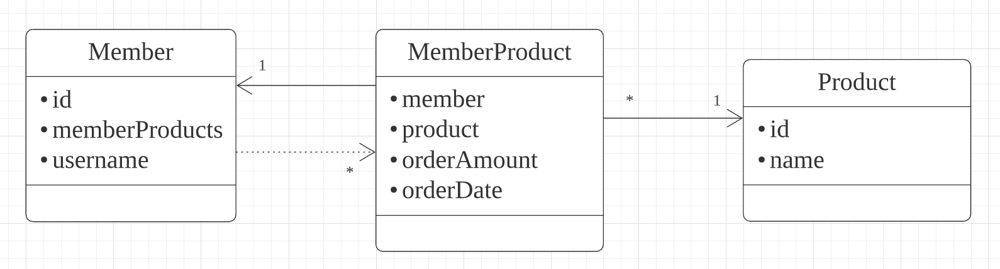

# 6. 다양한 연관관계 매핑

**이 글은 자바 ORM 표준 JPA 프로그래밍 을 참고해서 쓴 글입니다.**

엔티티의 연관관계를 매핑할 떄는 다음 3가지를 고려햐야한다.

1. 다중성 - 두 엔티티가 일대일 관계인지 일대다 관계인지
2. 단방향, 양방향 - 두 엔티티 중 한쪽만 참조하는지, 양쪽다 참조하는지
3. 연관관계의 주인 - 양뱡향이라면 연관관계의 주인을 정해야한다.

## 6.1 다대일

다대일 관계의 반대는 일대다 관계이고, 일대다 관계의 반대는 다대일 관계이다. 데이터베이스 테이블에서 외래 키는 항상 다(N) 쪽에 있다. 따라서 객체 양방향 관계에서 연관관계의 주인은 항상 다 쪽이다.

### 6.1.1 다대일 단방향 (N:1)

그럼 6.1과 회원 엔티티, 팀 엔티티 코드를 통해 다애일 단방향 연관관계를 알아보자.

 그림 6.1 다대일 단방향

```java
@Entity
@Getter
@Setter
public class Member {
    @Id @GeneratedValue
    @Column(name = "MEMBER_ID")
    private Long id;

    private String username;

    @ManyToOne
    @JoinColumn(name = "TEAM_ID")
    private Team team;
}

@Entity
@Getter
@Setter
public class Team {
    @Id @GeneratedValue
    @Column(name = "TEAM_ID")
    private Long id;

    private String name;
}
```

회원은 Member.team 으로 팀 엔티티를 참조할 수 있지만 반대로 팀에는 회원을 참조하는 필드가 없다. 따라서 회원과 팀은 다대일 단방향 연관관계다. @JoinColumn(name="TEAM_ID") 를 사용해서 Member.team 필드를 TEAM_ID 외래 키와 매핑했다. 따라서 Member.team 필드로 회원 테이블의 TEAM_ID 외래 키를 관리한다.

### 6.1.2 다대일 양방향 [N:1, 1:N]

그림 6.2 다대일 양방향의 객체 연관관계에서 실선이 연관관계의 주인이고 점선은 연관관계의 주인이 아니다.

 그림 6.2 다대일 양방향

```java
@Entity
public class Member {
    @Id @GeneratedValue
    @Column(name = "MEMBER_ID")
    private Long id;

    private String username;

    @ManyToOne
    @JoinColumn(name = "TEAM_ID")
    private Team team;

    public void setTeam(Team team) {
        this.team = team;
        // 무한루프 체크 필요
        if (!team.getMembers().contains(this)) {
            team.getMembers().add(this);
        }
    }
}

@Entity
public class Team {
    @Id @GeneratedValue
    @Column(name = "TEAM_ID")
    private Long id;

    private String name;

    @OneToMany(mappedBy = "team")
    private List<Member> members = new ArrayList<Member>();

    public void addMember(Member member) {
        this.members.add(member);
        // 무한루프 체크 필요
        if (member.getTeam() != this) {
            member.setTeam(this);
        }
    }
}
```

- 양방향은 외래 키가 있는 쪽이 연관관계의 주인이다
  - 일대다와 다대일 연관관계는 항상 다(N)에 외래 키가 있다. 여기서는 다쪽인 MEMBER 테이블이 외래 키를 가지고 있으므로 Member.team 이 연관관계의 주인이다. JPA는 외래 키를 관리할 때 연관관계의 주인만 사용한다. 주인이 아닌 Team.members는 조회를 위한 JPQL이나 객체 그래프를 탐색할 때 사용한다.

  - 양방향 연관관계는 항상 서로를 참조해야 한다.
    - 양방향 연관관계는 항상 서로 참조해야 한다. 어느 한쪽만 참조하면 양방향 연관관계가 성립하지 않는다. 항상 서로 참조하게 하려면 연관관계 편의 메소드를 작성하는 것이 좋은데  회원의 setTeam(), 팀의 addMember() 메소드가 이런 편의 메소드 들이다. 이는 한 곳에만 작성하거나 양쪽 다 작성할 수 있는데, 양쪽에 작성하면 무한루프에 빠지므로 주의해야 한다.

## 6.2 일대다

일대다 관계는 다대일 관계의 반대 방향이다. 일대다 관계는 엔티티를 하나 이상 참조할 수 있으므로 자바 컬렉션인 Collection, List, Set, Map 중에 하나를 사용해야 한다.

## 6.2.1 일대다 단방향 [1:N]

 그림 6.3 일대다 단방향

일대다 다방향 관계는 그림 6.3 처럼 팀 엔티티의 Team.members 로 회원 테이블의 TEAM_ID 외래 키를 관리한다. 보통 자신이 매핑한 테이블의 외래 키를 관리하는데, 이 매핑은 반대쪽 테이블에 있는 외래 키를 관리한다. 그럴 수밖에 없는 것이 일대다 관계에서 외래 키는 항상 다쪽 테이블에 있다. 하지만 다 쪽은 Member 엔티티에는 외래 키를 매핑할 참조 필드가 없으므로 반대편 테이블이 외래 키를 관리하는 모습이 나타난다.

```java
@Entity
public class Team extends BaseEntity {
    private String name;

    @OneToMany
    @JoinColumn(name = "TEAM_ID") // member 테이블의 TEAM_ID (FK)
    private List<Member> members = new ArrayList<Member>();
}

@Entity
public class Member extends BaseEntity {
    private String username;
}
```

일대다 단방향 관계를 매핑할 때는 @JoinColumn을 명시해야 한다. 그렇지 않으면 JPA는 연결 테이블을 중간에 두고 연관관계를 관리하는 조인 테이블 전략을 기본으로 매핑한다.

- 일대다 단방향 매핑의 단점
  - 일대다 단방향 매핑의 단점은 매핑한 객체가 관리하는 외래 키가 다른 테이블에 있다는 점이다. 본인 테이블에 외캐 키가 있으면 엔티티의 저장과 연관관계 처리를 INSERT SQL 한 번으로 끝낼 수 있지만, 다른 테이블에 외래 키가 있으면 연관관계 처리를 위한 UPDATE SQL을 추가로 실행해야 한다.

```java
public void testSave() {
    Member member1 = new Member("member1");
    Member member2 = new Member("member2");

    Team team1 = new Team("team1");
    team1.getMembers().add(member1);
    team1.getMembers().add(member2);

    em.persist(member1); // INSERT-member1
    em.persist(member2); // INSERT-member2
    em.persist(team1); // INSERT-team1, UPDATE-member1.fk, UPDATE-member2.fk

    transaction.commit();
}
```

Member 엔티티는 Team 엔티티를 모른다. 그리고 연관관계에 대한 정보는 Team 엔티티의 members 가 관리한다. 따라서 Member 엔티티를 저장할 때는 MEMBER 테이블의 TEAM_ID 외래 키에는 아무 값도 저장되지 않는다. 대신 Team 엔티티를 저장할 때 Team.members 의 참조 값을 확인해서 회원 테이블에 있는 TEAM_ID 외래 키를 업데이트 한다.

- 일대다 단방향 매핑보다는 다대일 양방향 매핑을 사용하자
  - 일대다 단방향 매핑을 사용하면 엔티티를 매핑한 테이블이 아닌 다른 테이블의 외래 키를 관리해야 한다. 이것은 성능 문제도 있지만 관리도 부담스럽다. 이는 다대일 양방향 매핑을 사용해 외래 키가 본인 테이블에 있도록 해 문제를 해결할수 있다. 상황에 따라 다르지만 다대일 양방향 매핑을 권장한다.

### 6.2.2 일대다 양방향 [1:N, N:1]

일대다 양방향 매핑은 존재하지 않는다. 대신 다대일 양방향 매핑을 사용해야 한다. 더 정확히 말하면 양방향 매핑에서 @OneToMany는 연관관계의 주인이 될 수 없다. 왜냐하면 관계형 데이터베이스의 특성상 일대다, 다대일 관계는 항상 다 쪽에 외래 키가 있다. 따라서 @OneToMany, @ManyToOne 둘 중에 연관관계의 주인은 항상 다 쪽인 @ManyToOne을 사용한 곳이다. 이런 이유로 @ManyToOne에는 mappedBy 속성이 없다. 물론 구현이 완전 불가능하지는 않다. 반대편인 다대일 쪽에 insertable = false, updatable = false 로 설정해 읽기만 가능하게 추가해줄수 있지만 추천하지 않는다.

## 6.3 일대일 [1:1]

일대일 관계는 양쪽이 서로 하나의 관계만 가진다. 예를 들어 회원은 하나의 사물함만 사용하고 사물함도 하나의 회원에 의해서만 사용된다.

- 일대일 관계는 그 반대도 일대일 관계이다.
- 테이블 관계에서 일대다, 다대일은 항상 다(N)쪽이 외래 키를 가진다. 반면 일대일 관계는 주 테이블이나 대상 테이블 둘 중 어느곳이나 외래 키를 가질 수 있다. 테이블은 주 테이블이든 대상 테이블이든 외래 키 하나만 있으면 양쪽으로 조회할 수 있다. 그리고 일대일 관계는 그 반대쪽도 일대일 관계다. 따라서 일대일 관계에서는 누가 외래 키를 가질지 선택해야 한다.

- 주 테이블에 외래 키
  - 주 객체가 대상 객체를 참조하는 것처럼 주 테이블에 외래 키를 두고 대상 테이블을 참조한다. 외래 키를 객체 참조와 비슷하게 사용할 수 있어서 객체지향 개발자들이 선호한다. 이 방법의 장점은 주 테이블이 외래 키를 가지고 있으므로 주 테이블만 확인해도 대상 테이블과 연관관계가 있는지 알 수 있다.
- 대상 테이블에 외래 키
  - 전통적인 데이터베이스 개발자들은 보통 대상 테이블에 외래 키를 두는 것을 선호한다. 이 방법의 장점은 테이블 관계를 일대일에서 일대다로 변경할 때 테이블구조를 그대로 유지할 수 있다.

### 6.3.1 주 테이블에 외래 키

일대일 관계를 구성할 때 객체지향 개발자들은 주 테이블에 외래 키가 있는 것을 선호한다. JPA도 주 테이블에 외래 키가 있으면 좀 더 편리하게 매핑할 수 있다.

먼저 단방향에 대해 알아보자

 그림 6.4 일대일 주 테이블에 외래 키 단방향

```java
@Entity
public class Member extends BaseEntity {
    private String username;

    @OneToOne
    @JoinCloumn(name = "LOCKER_ID")
    private Locker locker;
}

@Entity
public class Locker extends BaseEntity {
    private String name;
}
```

일대일 관계이므로 객체 매핑에 @OneToOne을 사용했고 데이터베이스에는 LOCKER_ID 외래 키에 유니크 제약 조건을 추가했다. 참고로 이 관계는 다대일 단방향과 거의 비슷하다.

다음으로는 양방향에 대해 알아보자

 그림 6.5 일대일 주 테이블에 외래 키, 양방향

```java
@Entity
public class Member {
    private String username;

    @OneToOne
    @JoinColumn(name = "LOCKER_ID")
    private Locker locker;
}

@Entity
public class Locker {
    private String name;

    @OneToOne(mappedBy = "locker")
    private Member member;
}
```

양방향이므로 연관관계의 주인을 정해야 한다. MEMBER 테이블이 외래 키를 가지고 있으므로 Member 엔티티에 있는 Member.locker가 연관관계의 주인이다. 따라서 반대 매핑인 사물함의 Locker.member는 mappedBy를 선언해서 연관관계의 주인이 아니라고 설정했다.

### 6.3.2 대상 테이블에 외래 키

일대일 관계중 대상 테이블에 외래 키가 있는 단방향 관계는 JPA에서 지원하지 않는다. 그러므로 양방향만 알아보자.

 그림 6.6 일대일 대상 테이블에 외래 키, 양방향

```java
@Entity
public class Member {
    private String username;

    @OneToOne(mappedBy = "member")
    private Locker locker;
}

@Entity
public class Locker {
    private String name;

    @OneToOne
    @JoinColumn(name = "MEMBER_ID")
    private Member member;
}
```

일대일 매핑에서 대상 테이블에 외래 키를 두고 싶으면 이렇게 양방향으로 매핑한다. 주 엔티티인 Member 엔티티 대신에 대상 엔티티인 Locker를 연관관계의 주인으로 만들어서 LOCKER 테이블의 외래 키를 관리하도록 했다.

추가로 주의할점은 프록시를 사용할 때 외래 키를 직접 관리하지 않는 일대일 관계는 지연 로딩으로 설정해도 즉시 로딩된다. 예를 들어 방금 본 예제에서 Locker.member 는 지연 로딩할 수 있지만, Member.locker는 지연 로딩으로 설정해도 즉시 로딩된다. 이것은 프록시의 한계 때문에 발생하는 문제인데, 프록시 대신에 bytecode instrumnentation을 사용하면 해결할수 있다.

## 6.4 다대다 [N:N]

관계형 데이터베이스는 정규화된 테이블 2개로 다대다 관계를 표현할 수 없다. 그래서 보통 다대다 관계를 일대다, 다대일 관계로 풀어내는 연결 테이블을 사용한다. 예를 들어 상품과 회원이 있다고 생각하자, 회원들은 상품을 주문하고 상품들은 회원들에 의해 주문된다. 둘은 다대다 관계로 두 테이블만으로 이 관계를 표현할수 없다.
그래서 그림 6.10 처럼 중간에 연결 테이블을 추가해야한다.

 그림 6.10 테이블, N:M 다대다 연결 테이블

그런데 객체는 테이블과 다르게 객체 2개로 다대다 관계를 만들 수 있다.

### 6.4.1 다대다: 단방향

다대다 단방향 관계인 회원과 상품 엔티티를 보자

```java
@Entity
public class Member {
    @Id @Column(name = "MEMBER_ID")
    private String id;

    private String username;

    @ManyToMany
    @JoinTable(name = "MEMBER_PRODUCT",
    joinColumns = @JoinColumn(name = "MEMBER_ID",
    inverseJoinColumns = @JoinColumn(name = "PRODUCT_ID"))
    private List<Product> products = new ArrayList<Product>();
}

@Entity
public class Product {
    @Id @Column(name = "PRODUCT_ID")
    private String id;

    private String name;
}
```

회원 엔티티와 상품 엔티티를 @ManyToMany로 매핑했다. 여기서 중요한 점은 @ManyToMany, @JoinTable을 사용해서 연결 테이블을 바로 매핑한 것이다. 따라서 회원과 상품을 연결하는 회원_상품 엔티티 없이 매핑을 완료할 수 있다.

연결 테이블을 매핑하는 @JoinTable의 속성을 정리하면

- @JoinTable.name: 연결테이블을 지정한다. 여기서는 MEMBER_PRODUCT 테이블을 선택했다.
- @JoinTable.joinColumns: 현재 방향인 회원과 매핑할 조인 컬럼 정보를 지정한다. MEMBER_ID로 지정했다.
- @JoinTalbe.inverseJoinColumns: 반대 방향인 상품과 매핑할 조인 컬럼 정보를 지정한다. PRODUCT_ID로 지정했다.

MEMBER_PRODUCT 테이블은 다대다 관계를 일대다, 다대일 관계로 풀어내기 위해 필요한 연결 테이블 뿐이다. @ManyToMany 로 매핑한 덕분에 이 테이블은 신경 쓰지 않아도 된다.

```java
public void save() {
    Product productA = new Product();
    productA.setId("productA");
    productA.setName("상품A");
    em.persist(productA);

    Member member1 = new Member();
    member1.setId("member1");
    member1.setUsername("회원1");
    member1.getProducts().add(productA);
    em.persist(member1);
}
```

이 코드를 실행하면 다음과 같은 SQL이 실행된다.

```sql
INSERT INTO PRODUCT ...
INSERT INTO MEMBER ...
INSERT INTO MEMBER_PRODUCT ...
```

```java
public void find() {
    Member member = em.find(Member.class, "member1");
    List<Product> products = member.getProducts();
    for (Product product : products) {
        System.out.println("product.name = " + product.getName());
    }
}
```

이 코드를 실행하면 다음과 같은 SQL이 실행된다.

```sql
SELECT * FROM MEMBER_PRODUCT MP INNER JOIN PRODUCT P ON MP.PRODUCT_ID=P.PRODUCT_ID WHERE MP.MEMBER_ID=?
```

실행된 SQL은 연결 테이블을 상품 테이블과 조인해서 상품을 조회한다. @ManyToMany 덕분에 복잡한 다대다 관계를 애플리케이션에서는 단순하게 사용할 수 있다.

### 6.4.2 다대다: 양방향

다대다 매핑이므로 역방향도 @ManyToMany를 사용한다. 그리고 양쪽 중 원하는 곳에 mappedBy로 연관관계의 주인을 지정한다.

```java
@Entity
public class Product {
    @Id
    private String id;

    @ManyToMany(mappedBy = "products")
    private List<Member> members;
}
```

양방향 연관관계는 연관관계 편의 메소드를 추가해서 관리하는 것이 편리하다.

### 6.4.3 다대다: 매핑의 한계와 극복, 연결 엔티티 사용

@ManyToMany를 사용하면 연결 테이블을 자동으로 처리해주므로 도메인 모델이 단순해지고 여러가지로 편리하지만 이 매핑을 실무에서 사용하기에는 한계가 있다. 예를 들어 회원이 상품을 주문하면 연결 테이블에 단순히 주문한 회원 아이디와 상품 아이디만 담고 끝나지 않는다. 보통은 연결 테이블에 주문 수량 컬럼이나 주문한 날짜 같은 컬럼이 더 필요하다.

 그림 6.12 테이블, 연결 테이블에 필드 추가

그림 6.12를 보면 연결 테이블에 주문 수량과 주문 날짜 컬럼을 추가했다. 이렇게 컬럼을 추가하면 더는 @ManyToMany를 사용할 수 없다. 왜냐하면 주문 엔티티나 상품 엔티티는 추가한 컬럼들을 매핑할 수 없기 때문이다. 결국 그림 6.13 처럼 연결 테이블을 매핑하는 연결 엔티티를 만들고 이곳에 추가한 컬럼들을 매핑해야 한다.

 그림 6.13 클래스, 다대다를 푸는 연결 엔티티

연결 테이블에 주문 수량과 주문 날짜컬럼을 추가했고 나머지 테이블은 기존과 같다.

```java
@Entity
public class Member {
    @Id @Column(name = "MEMBER_ID")
    private String id;

    @OneToMany(mappedBy = "member")
    private List<MemberProduct> memberProducts;
}

@Entity
public class Product {
    @Id @Column(name = "PRODUCT_ID")
    private String id;

    private String name;
}

@Entity
@IdClass(MemberProductId.class)
public class MemberProduct {
    @Id
    @ManyToOne
    @JoinColumn(name = "MEMBER_ID")
    private Member member;

    @Id
    @ManyToOne
    @JoinColumn(name = "PRODUCT_ID")
    private Product product;

    private int orderAmount;
}

public class MemberProductId implements Serializable {
    private String member;
    private String product;

    // hashCode and equals
}
```

회원상품 엔티티를 보면 기본 키를 매핑하는 @Id와 외래 키를 매핑하는 @JoinColumn을 동시에 사용해서 기본 키 + 외래 키를 한번에 매핑했다. 그리고 @IdClass를 사용하서 복합 기본 키를 매핑했다.

회원상품 엔티티는 기본 키가 MEMBER_ID 와 PRODUCT_ID로 이루어진 복합 기본키다. JPA에서 복합 키를 사용하려면 별도의 식별자 클래스를 만들어야하고, 엔티티에 @IdClass를 사용해서 식별자 클래스를 지정하면 된다.

복합 키를 위한 식별자 클래스는 다음과 같은 특징이 있다.

- 복합 키는 별도의 식별자 클래스로 만들어야 한다.
- Serializable을 구현해야 한다.
- equals와 hashCode 메소드를 구현해야 한다.
- 기본 생성자가 있어야 한다.
- 식별자 클래스는 public 이어야 한다.
- @IdClass를 사용하는 방법 외에 @EmbeddedId를 사용하는 방법도 있다.

회원상품은 회원과 상품의 기본 키를 받아서 자신의 기본 키로 사용한다. 이엏게 부모 테이블의 기본 키를 받아서 자신의 기본키 + 외래 키로 사용하는 것을 데이터베이스 용어로 식별 관계라 한다.

```java
public void save() {
    Member member1 = new Member();
    member1.setId("member1");
    member1.setUsername("회원1");
    em.persist(member1);

    Product productA = new Product();
    productA.setId("productA");
    productA.setName("상품1");
    em.persist(productA);

    MemberProduct memberProduct = new MemberProduct();
    memberProduct.setMember(member1);
    memberProduct.setProduct(productA);
    memberProduct.setOrderAmount(2);

    em.persist(memberProduct);
}

public void find() {
    MemberProductId memberProductId = new MemberProductId();
    memberProductId.setMember("member1");
    memberProductId.setProduct("productA");

    MemberProduct memberProduct = em.find(MemberProduct.class, memberProductId);

    Member member = memberProduct.getMember();
    Product product = memberProduct.getProduct();

    // ... Sout
}
```

지금까지 기본 키가 단순해서 기본 키를 위한 객체를 사용하는 일이 없었지만 복합 키가 되면 이야기가 달라진다. 복합 키는 항상 식별자 클래스를 만들어서 조회한다. 다음은 복합 키를 사용하지 않고 간단히 구현하는 방법을 알아보자

### 6.4.4 다대다: 새로운 기본 키 사용
