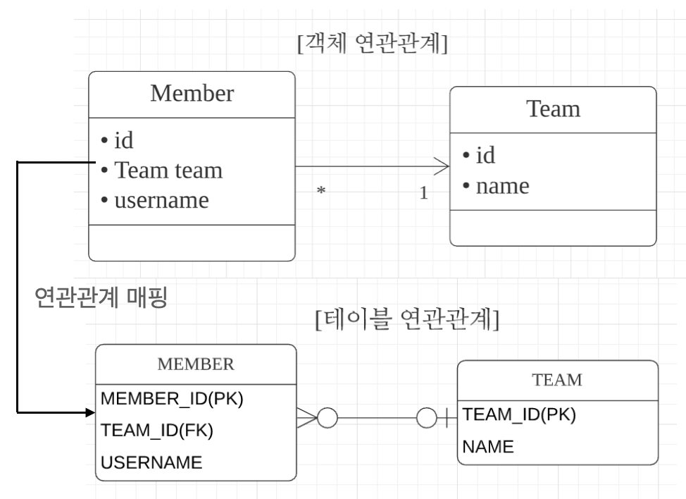

# 6. 다양한 연관관계 매핑

**이 글은 자바 ORM 표준 JPA 프로그래밍 을 참고해서 쓴 글입니다.**

엔티티의 연관관계를 매핑할 떄는 다음 3가지를 고려햐야한다.

1. 다중성 - 두 엔티티가 일대일 관계인지 일대다 관계인지
2. 단방향, 양방향 - 두 엔티티 중 한쪽만 참조하는지, 양쪽다 참조하는지
3. 연관관계의 주인 - 양뱡향이라면 연관관계의 주인을 정해야한다.

## 6.1 다대일

다대일 관계의 반대는 일대다 관계이고, 일대다 관계의 반대는 다대일 관계이다. 데이터베이스 테이블에서 외래 키는 항상 다(N) 쪽에 있다. 따라서 객체 양방향 관계에서 연관관계의 주인은 항상 다 쪽이다.

### 6.1.1 다대일 단방향 (N:1)

그럼 6.1과 회원 엥ㄴ티티, 팀 엔티티 코드를 통해 다애일 단방향 연관관계를 알아보자.

 그림 6.1 다대일 단방향

```java
@Entity
@Getter
@Setter
public class Member {
    @Id @GeneratedValue
    @Column(name = "MEMBER_ID")
    private Long id;

    private String username;

    @ManyToOne
    @JoinColumn(name = "TEAM_ID")
    private Team team;
}

@Entity
@Getter
@Setter
public class Team {
    @Id @GeneratedValue
    @Column(name = "TEAM_ID")
    private Long id;

    private String name;
}
```

회원은 Member.team 으로 팀 엔티티를 참조할 수 있지만 반대로 팀에는 회원을 참조하는 필드가 없다. 따라서 회원과 팀은 다대일 단방향 연관관계다. @JoinColumn(name="TEAM_ID") 를 사용해서 Member.team 필드를 TEAM_ID 외래 키와 매핑했다. 따라서 Member.team 필드로 회원 테이블의 TEAM_ID 외래 키를 관리한다.

### 6.1.2 다대일 양방향 [N:1, 1:N]