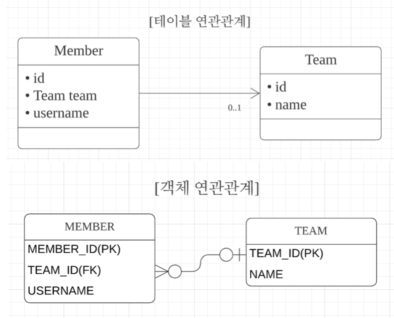
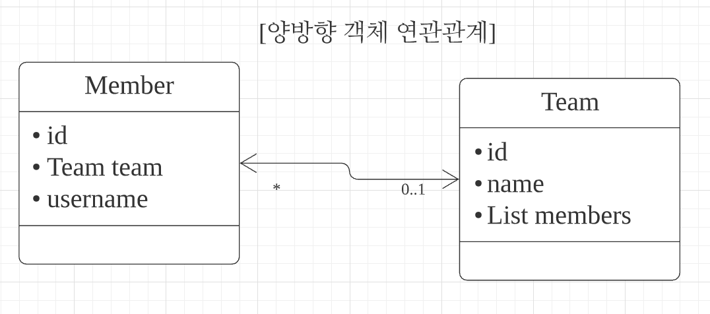

# 5. 연관관계 매핑 기초

**이 글은 자바 ORM 표준 JPA 프로그래밍 을 참고해서 쓴 글입니다.**

엔티티들은 대부분 다른 엔티티와 연관관계가 있다. 객체는 참조를 사용해서 관계를 맺고 테이블은 외래 키를 사용해서 관계를 맺는다. 객체 관계 매핑에서 가장 어려운 부분이 객체 연관관계와 테이블 연관관계를 매핑하는 일이다.

## 5.1 단방향 연관관계

회원과 팀의 관계를 통해 단방향 관계를 이해해보자

1. 회원과 팀이 있다.
2. 회원은 하나의 팀에만 소속될 수 있다.
3. 회원과 팀은 다대일 관계다.

 그림 5.1 다대일 연관관계 | 다대일(N:1), 단방향

- 객체 연관관계
  - 회원 객체는 Member.team 필드로 팀 객체와 연관관계를 맺는다.
  - 회원 객체와 팀 객체는 단방향 관계다. 회원 객에는 Member.team 필드를 통해서 팀을 알 수 있지만 반대로 팀은 회원을 알 수 없다.
- 테이블 연관관계
  - 회원 테이블은 TEAM_ID 외래 키로 팀 테이블과 연관관계를 맺는다.
  - 회원 테이블과 팀 테이블은 양방향 관계다. TEAM_ID 외래키 하나로 서로를 조인할수 있다.
  - 다음은 외래 키 하나로 회원과 팀을 조인하는 SQL 이다.

  ```SQL
  SELECT * FROM MEMBER M JOIN TEAM T ON M.TEAM_ID = T.TEAM_ID

  SELECT * FROM TEAM T JOIN MEMBER M ON M.TEAM_ID = T.TEAM_ID
  ```

- 객체 연관관계와 테이블 연관관계의 가장 큰 차이
  - 참조를 통한 연관관계는 언제나 단방향이다. 즉 양방향으로 만들려면 반대쪽에도 필드를 추가해서 참조를 보관해야한다. 이렇게 양쪽에서 서로 참조하는 것을 양방향 연관관계(서로 다른 단방향 관계 2개)라 한다.

  다음은 단방향 연관관계 이다.
  
  ```java
  class A {
      B b;
  }
  class B {}
  ```

  다음은 양방향 연관관계 이다.

  ```java
  class A {
      B b;
  }
  class B {
      A a;
  }
  ```

- 객체 연관관계 vs 테이블 연관관계 정리
  - 객체는 참조로 연관관계를 맺는다.
  - 테이블은 외래 키로 연관관계를 맺는다.

  이 둘은 비슷해 보이지만 객체는 참조, 테이블은 조인을 사용하여 연관된 데이터를 가져온다.
  - 참조를 사용하는 객체의 연관관계는 단방향이다.
    - A -> B (a.b)
  - 외래 키를 사용하는 테이블의 연관관계는 양방향이다.
    - A JOIN B 가 가능하면 반대인 B JOIN A 도 가능하다.
  - 객체를 양방향으로 참조하려면 단방향 연관관계를 2개 만들어야 한다.
    - A -> B (a.b)
    - B -> A (b.a)

### 5.1.1 순수한 객체 연관관계

다음은 JPA 를 사용하지 않은 순수한 회원과 팀 클래스의 코드다.

```java
@Getter
@Setter
public class Member {
    private String id;
    private String username;

    private Team team;
}

@Getter
@Setter
public class Team {
    private String id;
    private String name;
}

public static void main(String[] args) {
    Member member1 = new Member("member1", "회원1");
    Member member2 = new Member("member2", "회원2");
    Team team1 = new Team("team1", "팀1");

    member1.setTeam(team1);
    member2.setTeam(team2);
}
```

코드를 보면 회원1 과 회원2 는 팀1에 소속되어있다. 그리고 다음 코드로 회원1 이 속한 팀을 조회할 수  있다.

```java
Team findTeam = member1.getTeam();
```

이처럼 객체는 참조를 사용해 연관관계를 탐색할 수 있는데 이것을 객체 `그래프 탐색`이라 한다.

### 5.1.2 테이블 연관관계

이번에는 데이터베이스 테이블의 회원과 팀의 관계를 살펴보자.

```sql
CREATE TABLE MEMBER {
    MEMBER_ID VARCHAR(255) NOT NULL,
    TEAM_ID VARCHAR(255),
    USERNAME VARCHAR(255),
    PRIMARY KEY (MEMBER_ID)
}

CREATE TABLE TEAM {
    TEAM_ID VARCHAR(255) NOT NULL,
    NAME VARCHAR(255),
    PRIMARY KEY (TEAM_ID)
}

ALTER TABLE MEMBER ADD CONSTRAINT FK_MEMBER_TEAM FOREIGN KEY (TEMA_ID) REFERENCES TEAM
```

다음 SQL을 실행해서 회원1이 소속된 팀을 조회해보자.

```sql
SELECT T.* FROM MEMBER M JOIN TEAM T ON M.TEAM_ID = T.TEAM_ID WHERE M.MEMBER_ID = 'member1'
```

이처럼 데이터베이스는 외래 키를 사용해서 연관관계를 탐색할 수 있는데 이것을 `조인`이라 한다.

### 5.1.3 객체 관계 매핑

이제 JPA를 사용해서 둘을 매핑해보자

```java
@Entity
@Getter
@Setter
public class Member {
    @Id
    @Column(name="MEMBER_ID")
    private String id;

    private String username;

    @ManyToOne
    @JoinColumn(name = "TEAM_ID")
    private Team team;
}

@Entity
@Getter
@Setter
public class Team {
    @Id
    @Column(name = "TEAM_ID")
    private String id;

    private String name;
}
```

- @ManyToOne: 이름 그대로 다대일(N:1) 관계라는 매핑 정보다.
- @JoinColumn(name="TEAM_ID"): 조인컬럼은 외래 키를 매핑할 때 사용한다. 이 어노테이션은 생략할 수 있다.

### 5.1.4 @JoinColumn

@JoinColumn은 왜캐 키를 매핑할때 사용한다.

|속성|기능|기본값|
|--|--|---|
|name|매핑할 외래 키 이름|필드명 + _ + 참조하는 테이블의 기본 키 컬럼명|
|referencedColumnName|외래 키가 참조하는 대상 테이블의 컬럼명|참조하는 테이블의 기본키 컬럼명|
|foreignKey(DDL)|외래 키 제약조건을 직접 지정할 수 있다. 이 속성은 테이블 생성할 때만 사용||
|unique, nullable, insertable, updatable, columnDefinition, talbe|@Column의 속성과 동일||

- @JoinColumn 생략
  - @JoinColumn 생략하면 외래 키를 찾을 떄 기본 전략을 사용한다.
  - 기본 전략: 필드명 + _ + 참조하는 테이블의 컬럼명
  - ex) 필드명(team) + _(언더스코어) + 참조하는 테이블의 컬럼명(TEAM_ID) = team_TEAM_ID

### 5.1.5 @ManyToOne

|속성|기능|기본값|
|--|--|---|
|optional|false로 설정하면 연관된 엔티티가 항상 있어야한다.|true|
|fetch|글로벌 패치 전력을 설정한다.|@ManyToOne=FetchType.EAGER, @OneToMany=FetchType.LAZY|
|cascade|영속성 전이 기능을 사용한다.||
|targetEntity|연관된 엔티티의 정보를 설정한다. 거의 사용하지 않는다.||

## 5.2 연관관계 사용

### 5.2.1 저장

```java
public void testSave() {
    Team team1 = new Team("team1", "팀1");
    em.persist(team1); // 먼저 영속성 상태로 만들어준다.

    Member member1 = new Member("member1", "회원1");
    member.setTeam(team1); // 회원 -> 팀 참조
    em.persist(member1); // 저장

    Member member2 = new Member("member2", "회원2");
    member.setTeam(team1);
    em.persist(member2);
}
```

회원 엔티티는 팀 엔티티를 참조하고 저장했다. JPA는 참조한 팀의 식별자를 외래 키로 사용해서 적절한 등록  쿼리를 생성한다. 다음은 실행된 SQL이다.

```sql
INSERT INTO TEAM (TEAM_ID, NAME) VALUES ('team1', '팀1')
INSERT INTO MEMBER (MEMBER_ID, NAME, TEAM_ID) VALUES ('member1', '회원1', 'team1')
INSERT INTO MEMVER (MEMBER_ID, NAME, TEAM_ID) VALUES ('member2', '회원2', 'team1')
```

### 5.2.2 조회

연관관계가 있는 엔티티를 조회하는 방법은 크게 2가지이다.

1. 객체 그래프 탐색
2. 객체지향 쿼리 사용 (JPQL)

- 객체 그래프 탐색
  - member.getTeam() 을 사용해서 member와 연관된 team 엔티티를 조회할 수 있다.
- 객체지향 쿼리 사용
  - SQL은 연관된 테이블을 조인해서 검색조건을 사용하면 되는데 이를 JPQL로 사용하면 된다.

  ```java
  private static void queryJoin(EntityManager em) {
      String jpql = "select m from Member m join m.team t where t.name=:teamName";

      List<Member> resultList = em.createQuery(jpql, Member.class)
        .setParameter("teamName", "팀1");
        .getResultList();

      for(Member member: resultList) {
          System.out.println(member.getUserName());
      }
  }
  ```

  JPQL 을 통해 member와 team 을 조인했다. :로 시작하는것은 파라미터를 바인딩 받는 문법이다.
  다음은 실행되는 SQL이다.

  ```SQL
  SELECT M.* FROM MEMBER MEMBER INNER JOIN TEAM TEAM ON MEMBER.TEAM_ID = TEAM1_.ID WHERE TEAM1_.NAME='팀1'
  ```

### 5.2.3 수정

```java
private static void updateRelation(EntityManager em) {
    Team team2 = new Team("team2", "팀2");
    em.persist(team2);

    Member member = em.find(Member.class, "member1");
    member.setTeam(team2);
}
```

실행되는 SQL은 다음과 같다.

```SQL
UPDATE MEMBER SET TEAM_ID='team2' WHERE ID='member1'
```

불러온 엔티티의 값만 변경해두면 트랜잭션을 커밋할 때 플러시가 일어나면서 변경 감지 기능이 작동해 변경사항을 데이터베이스에 자동으로 반영한다.

### 5.2.4 연관관계 제거

```java
private static void deleteRelation(EntityManager em) {
    Member member = em.find(Memeber.class, "member1");
    member.setTeam(null); // 연관관계 제거
}
```

### 5.2.5 연관된 엔티티 삭제

연관된 엔티티를 삭제하려면 기존에 있던 연관관계를 먼저 제거하고 삭제해주어야한다. 그렇지 않으면 외래 키 제약조건으로 인해 데이터베이스에서 오루가 발생한다.

## 5.3 양방향 연관관계

이번에는 반대 방향인 팀에서 회원으로 접근하는 관계를 추가해보자

 그림 5.5 양방향 객체 연관관계

먼저 그림 5.5와 같이 회원과 팀은 다대일 관계, 팀에서 회원은 일대다 관계다. 일대다 관계는 여러 건과 연관관계를 맺을 수 있으므로 컬렉션을 사용해야 한다. Team.members 를 List 컬렉션으로 추가했다.
반면 테이블은 외래 키 하나로 양방향 조회가 가능하므로 데이터베이스는 추가할 내용이 없다.

### 5.3.1 양방향 연관관계 매핑

```java
@Entity
@Getter
@Setter
public class Member {
  @Id
  @Column(name="MEMBER_ID")
  private String id;

  private String username;

  @ManyToOne
  @JoinColumn(name="TEAM_ID")
  private Team team;
}

@Entity
@Getter
@Setter
public class Team {
  @Id
  @Column(name="TEAM_ID")
  private String id;

  private String name;

  @OneToMany(mappedBy="team")
  private List<Member> members = new ArrayList<Member>();
}
```

팀과 회원은 일대다 관계이므로 팀 엔티티에 컬렉션인 List 를 추가했고, @OneToMany 매핑 정보를 사용했다. 여기서 mappedBy 속성은 양방향 매핑일 때 사용하는데 반대쪽 매핑의 필드이름을 값으로 주면 된다.

### 5.3.2 일대다 컬렉션 조회

```java
public void biDirection() {
  Team team = em.find(Team.class, "team1");
  List<Member> members = team.getMembers();

  for (Member member : members) {
    System.out.println(member.getUsername());
  }
}
```

## 5.4 연관관계의 주인

@OneToMany는 직관적으로 이해가 될 것이다. 문제는 mappedBy 속성이다. 이거는 왜 필요할까?

객체에는 양방향 연관관계라는 개념이 없다. 서로 다른 단방향 연관관계 2개를 애플리케이션 로직으로 양방향인 것처럼 보이게 할 뿐이다. 반면 테이블은 외래 키 하나로 두 테이블의 연관관계를 관리한다. 이런 차이로 인해 외래 키를 관리할 연관관계를 정해야하는데 이것을 `연관관계의 주인` 이라 한다.

### 5.4.1 양뱡향 매핑의 구칙: 연관관계의 주인

양방향 연관관계 매핑시 두 연관관계중 하나를 연관관계의 주인으로 정해야하고, 연관관계의 주인만이 데이터베이스 연관관계와 매핑되고 외래 키(등록, 수정, 삭제)를 관리할 수 있다. 반면 주인이 아닌 쪽은 읽기만 할 수 있다. 주인은 mappedBy 속성을 사용하지 않지만, 주인이 아니면 mappedBy 속성을 사용해서 연관관계의 주인을 지정해야 한다.

연관관계의 주인을 정한다는 것은 외래 키 관리자를 선택하는 것이다.

### 5.4.2 연관관계의 주인은 외래 키가 있는 곳

회원 테이블이 외래 키를 가지고 있으므로 Member.team이 주인이 된다. 주인이 아닌 Team.members 에는 mappedBy="team" 속성을 사용해서 주인이 아님을 설정한다. 주인이 아닌 반대편은 읽기만 가능하고 외래 키를 변경하지는 못한다.

참고로 데이터베이스 테이블의 다대일, 일대다, 관계에서 항상 다 쪽이 외래 키를 가진다. 다 쪽인 @ManyToOne은 항상 연관관계의 주인이 되므로 mappedBy를 설정할 수 없다.

## 5.5 양방향 연관관계 저장

```java
public void testSave() {
  Team team1 = new Team("team1", "팀1");
  em.persist(team1);

  Member member1 = new Member("member1", "회원1");
  member1.setTeam(team1);
  em.persist(member1);

  Member member2 = new Member("member2", "회원1");
  member2.setTeam(team1);
  em.persist(member2);

  team1.getMembers().add(member1); // 무시 (연관관계의 주인이 아님)
  team1.getMembers().add(member2); // 무시 (연관관계의 주인이 아님)
}
```

이 코드는 단방향 연관관계에서 살펴본 코드와 완전히 같다. 양방향 연관관계는 연관관계의 주인이 외래 키를 관리하고, 주인이 아닌 방향은 값을 설정하지 않아도 데이터베이스에 외래 키 값이 정상 입력된다. 그러므로 팀에 멤버를 추가하는 코드는 영향을 주지 않으며. 데이터베이스에 저장할 때 무시 된다.

## 5.6 양방향 연관관계의 주의점

양방향 연관관계를 설정하고 가장 흔힐 하는 실수는 연관관계의 주인에는 값을 입력하지 않고, 주인이 아닌 곳에만 값을 입력하는 것이다. 데이터베이스에 외래 키값이 정상적으로 저장되지 않으면 이것부터 의심해보자.

```java
public void testSaveNonOwner() {
  Member member1 = new Member("member1", "회원1");
  em.persist(member1);

  Member member2 = new Member("member2", "회원2");
  em.persist(member2);

  Team team1 = new Team("team1", "팀1");
  // 주인이 아닌 곳만 연관관계 설정
  team1.getMembers().add(member1);
  team1.getMembers().add(member2);

  em.persist(team1);
}
```

이후 테이블을 조회하면 다음과 같다.

|MEMBER_ID|USERNAME|TEAM_ID|
|---|---|---|
|member1|회원1|null|
|member2|회원2|null|

외래 키 TEAM_ID에 team1이 아닌 null 값이 입력되어 있는데, 연관관계의 주인이 아닌 Team.members 에만 값을 저장했기 때문이다. 연관관계의 주인인 Member.teamdp 아무 값도 입력하지 않았으므로 외래 키의 값도 null 이 저장된다.

### 5.6.1 순수한 객체까지 고려한 양방향 연관관계

그렇다면 연관관계 주인에만 값을 저장하면 될까?

객체 관점에서는 양쪽 방향에 모두 값을 입력해주는 것이 가장 안전한다. 양쪽 방향 모두 값을 입력하지 않으면 JPA를 사용하지 않는 순수한 객체 상태에서 심각한 문제가 발생할 수 있다.

예를 들면 JPA를 사용하지 않고 엔티티에 대한 테스트 코드를 작성하는 경우, SQL이 실행되기 전 이므로 주인이 아닌 곳에서 연관관계에 접근할 때 원하는 결과가 안나올수 있다.

### 5.6.2 연관관계 편의 메소드

양방향 연관관계는 결국 양쪽 다 신경 써야 한다. 양방향 관계에서 두 코드는 하나인 것처럼 사용하는 것이 안전하다.

```java
public class Member {
  private Team team;
  public void setTeam(Team team) {
    this.team = team;
    team.getMembers().add(this);
  }
}
```

이렇게 한 번에 양방향 관계를 설정하는 메소드를 연관관계 편의 메소드라 한다.

### 5.6.3 연관관계 편의 메소드 작성 시 주의사항

사실 setTeam() 메소드에는 버그가 있다.

```java
public void test() {
  member1.setTeam(teamA);
  member1.setTeam(teamB);
  Member findMember = teamA.getMember(); // member1 이 여전히 조회된다.
}
```

teamB로 변경할 때 teamA -> member1 관계를 제거하지 않았다. 연관관계를 변경할 때는 기존 팀과 회원의 연관관계를 삭제하는 코드를 추가해야 한다.

```java
public void setTeam(Team team) {
  if (this.team != null) {
    this.team.getMembers().remove(this);
  }
  this.team = team;
  team.getMembers().add(this);
}
```

이 코드는 객체에서 서로 다른 단방향 연관관계 2개를 양방향인 것처럼 보이게 하려고 많은 고민과 수고가 필요한지를 보여준다.

참고로 삭제되지 않던 teamA -> member1 관계가 제거되지 않아도 데이터베이스 외래 키를 변경하는 데는 문제가 없다. 연관관계 주인이 아닌 객체를 수정했기 때문이다. 연관관계의 주인인 Memeber.team의 참조를 member1 -> teamB로 변경했으므로 데이터베이스에 외래 키는 teamB를 참조하도록 정상 반영된다. 그리고 이후에 새로운 영속성 컨텍스트에서 teamA를 조회해서 members 를 조회하면 아무것도 조회되지 않는다. 그러나 영속성 컨텍스트가 살아있는 상태에서 teamA의 members 를 조회하면 member1이 반환된다는 점을 주의해야 한다.

추가로 주의할점은 양방향 매핑 시에는 무한 루프에 빠지지 않게 조심해야 한다. 예를 들어 Member.toString()에서 getTeam()을 호출하고 Team.toString()에서 getMember()를 호출하면 무한 루프에 빠질 수 있다.
