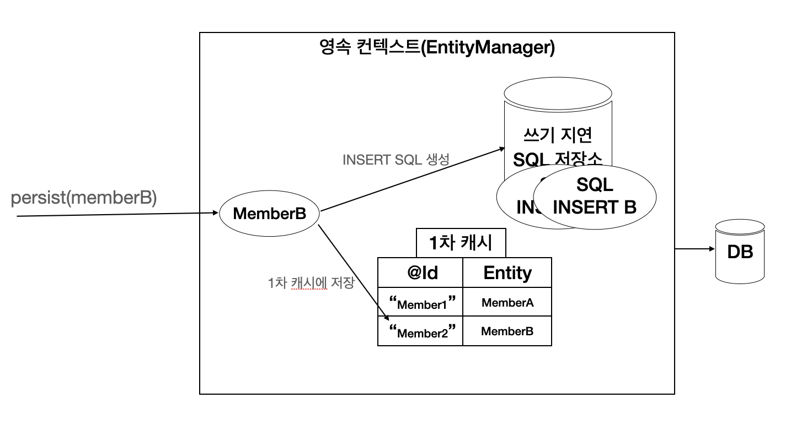

# 1. 영속성 관리

**이 글은 자바 ORM 표준 JPA 프로그래밍 을 참고해서 쓴 글입니다.**

JPA가 제공하는 기능은 크게 엔티티와 테이블을 매핑하는 설계 부분과 매핑한 엔티티를 실제 사용하는 부분으로 나눌 수 있다.

엔티티 매니저는 엔티티를 저장, 수정, 삭제, 조회 등 엔티티와 관련된 모든 일을 처리한다. 즉 엔티티를 관리하는 관리자다. 개발자 입장에서는 엔티티 매니저는 엔티티를 저장하는 가상의 데이터베이스로 생각하면 된다.

## 3.1 엔티티 메니저 팩토리와 엔티티 매니저

데이터베이스를 하나만 사용하는 애플리케이션은 일반적으로 EntityManagerFactory를 하나면 생성한다.

```java
EntityManagerFactory emf = Persistence.createEntityManagerFactory("name");
```

이는 META-INF/persistence.xml 에 있는 정보를 바탕으로 EntityMangerFactory를 생성한다.
이제부터는 필요할 때마다 엔티티 매니저 팩토리에서 엔티티 매니저를 생성하면 된다.

```java
EntityManager em = emf.createEntityManager();
```

엔티티 매니저 팩토리는 이름 그대로 엔티티 매니저를 만드는 공장인데, 공장을 만드는 비용이 상당히 크다. 따라서 한 개만 만들어서 애플리케이션 전체에서 공유하도록 설계되어 있다. 반면 엔티티 매니저를 생성하는 비용은 거의 들지 않는다.

추가로 엔티티 메니저 팩토리는 여러 스레드가 동시에 접근해도 안전하므로 서로 다른 스레드 간의 공유해도 되지만, 엔티티 매니저는 여러 스레드가 동시에 접근하면 동시성 문제가 발생하므로 스레드가 간에 절대 공유하면 안된다.

 그림 3.1 일반적인 웹 애플리케이션

그림 3.1을 보면 하나의 EntityManagerFactory에서 다수의 엔티티 매니저를 생성했다. EntityManager1은 아직 데이터베이스 커넥션을 사용ㄹ하지 않는데, 엔티티 매니저는 데이터베이스 연결이 꼭 필요한 시점까지 커넥션을 얻지 않는다. 예를 들면 트랜젝션을 시작할 때 커넥션을 흭득한다.

하이버네이트를 포함한 JPA 구현체들은 EntityManagerFactory를 생성할 때 커넥션풀도 만든다.

## 3.1 영속성 컨텍스트란

영속성이란 엔티티를 영구 저장하는 환경이다. 엔티티 매니저로 엔티티를 저장하거나 조회하면 앤티티 매니저는 영속성 컨텍스트에 엔티티를 보관하고 관리한다.

```java
em.persist(member);
```

지금까지 이 코드를 단순히 회원 엔티티를 저장한다고 했는데, 정확하게는 엔티티 매니저를 사용해서 회원 엔티티를 영속성 컨텍스트에 저장한다.

이는 논리적인 개념에 가까우며, 영속성 컨텍스트는 엔티티 매니저를 생성할 때 하나 만들어진다 그리고 엔티티 매니저를 통해서 영속성 컨텍스트에 접근할 수 있고, 영속성 컨텍스트를 관리할 수 있다.

## 3.3 엔티티의 생명주기

엔티티에는 4가지 상태가 존재한다.

1. 비영속(new/transient): 영속성 컨텍스트와 전혀 관계가 없는 상태
2. 영속(managed): 영속성 컨텍스트에 저장된 상태
3. 준영속(detached): 영속성 컨텍스트에 저장되었다가 분리된 상태
4. 삭제(removed): 삭제된 상태

그림 3.2는 엔티티의 생명 주기를 나타낸 그림이다.
 그림 3.2 생명 주기

### 3.3.1 비영속

엔티티 객체를 생성했다면, 순수한 객체 상태이며 아직 저장하지 않았다. 따라서 영속성 컨텍스트나 데이터베이스와는 전혀 관련이 없다. 이것을 비영속 상태라 한다.

### 3.3.2 영속

엔티티 매니저를 통해서 엔티티를 영속성 컨텍스트에 저장했다면, 영속성 컨텍스트가 관리하는 엔티티를 영속 상태라고 한다. 즉, 영속 상태라는것은 영속성 컨텍스트에 의해 관리된다는 뜻이다. 그리고 em.find() 나 JPQL을 사용해서 조회한 엔티티도 영속성 컨텍스트가 관리하는 영속 상태다

### 3.3.3 준영속

영속성 컨텍스트가 관리하던 영속 상태의 엔티티를 영속성 컨텍스트가 관리하지 않으면 준영속 상태가 된다. 특정 엔티티를 준영속 상태로 만들려면 em.detach()를 호출하면 된다. em.close()를 호출해서 영속성 컨텍스트를 닫거나 em.clear()를 호출해서 영속성 컨텍스트를 초기화해도 영속성 컨텍스트가 관리하던 영속 상태의 엔티티는 준영속 상태가 된다.

### 3.3.4 삭제

엔티티를 영속성 컨텍스트와 데이터베이스에서 삭제한다.

## 3.4 영속성 컨텍스트의 특징

1. 영속성 컨텍스트와 식별자 값: 영속성 컨텍스트는 엔티티를 식별자 값(@Id로 테이블의 기본 키와 매핑한 값)으로 구분한다. 따라서 영속 상태는 식별자 값이 반드시 있어야한다. 만들 없다면 예외가 발생한다.

2. 영속성 컨텍스트와 데이터베이스 저장: JPA는 보통 트랜잭션을 커밋하는 순간 영속성 컨텍스트에 새로 저장된 엔티티를 데이터베이스에 반영하는데 이것을 flush라 한다.

3. 영속성 컨텍스트가 엔티티를 관리하면 다음과 같은 장점이 있다. 1차 캐시, 동일성 보장, 트앤잭션을 지원하는 쓰기 지연, 변경 감지, 지연 로딩

지금부터 영속성 컨텍스트의 필요성과 이점을 CRUD 로 알아보자

### 3.4.1 엔티티 조회

영속성 컨텍스트는 내부에 캐시를 가지고 있는데 이것을 1차 캐시라 한다. 영속 상태의 엔티티는 모두 이곳에 저장되는데 영속성 컨텍스트 내부에 Map에 키는 @Id 값은 엔티티 인스턴스로 존재한다.

```java
Memeber member = new Member();
member.setId("member1");

em.persist(member);
```

위와 같은 코드를 실행하면 다음 그림 3.5처럼 1차 캐시에 회원 엔티티를 저장한다. 이때 아직 데이터베이스에는 저장하지 않는다.

 그림 3.5 영속성 컨텍스트 1차 캐시

1차 캐시의 키는 식별자 값이다. 그리고 식별자 값은 데이터베이스 기본 키와 매핑되어 있다. 따라서 영속성 컨텍스트에 데이터를 저장, 조회하는 모든 기준은 데이터베이스 기본 키 값이다.

em.find()를 호출하면 먼저 1차 캐시에서 엔티티를 조회하고 캐시에 없다면 데이터베이스에서 조회한다.

#### 3.4.1.1 1차 캐시에서 조회

그림 3.6을 보면 em.find()를 호출하면 우선 1차 캐시에서 식별자 값으로 엔티티를 찾고, 찾는 엔티티가 있다면 데이터베이스를 조회하지 않고 메모리에 있는 1차 캐시에서 엔티티를 조회한다.

 그림 3.6 1차 캐시에서 조회

다음과 같은 경우에 1차 캐시에서 조회한다.

```java
Memeber member = new Member();
member.setId("member1");
member.setUsername("user1");

// 1차 캐시에 저장
em.persist(member);

// 1차 캐시에서 조회
Member findMember = me.find(Member.class, "member1");
```

#### 3.4.1.2 데이터베이스에서 조회

만일 em.find()를 호출했는데 엔티티가 1차 캐시에 없으면 엔티티 매니저는 데이터베이스를 조회해서 엔티티를 생성한다. 그리고 1차 캐시에 저장한 후 영속 상태의 엔티티를 반환한다.

 그림 3.7 1차 캐시에 없어 데이터베이스 조회

그림 3.7을 보면

1. em.find(Memeber.class ,"member2") 를 실행한다.
2. member2가 1차 캐시에 없으므로 데이터베이스에서 조회한다.
3. 조회한 데이터로 member2 엔티티를 생성해서 1차 캐시에 저장한다(영속 상태)
4. 조회한 엔티티를 반환한다.

이제 member1, member2 엔티티 인스턴스는 1차 캐시에 있고, 엔티티를 조회하면 1차 캐시에서 바로 조회한다.

#### 3.4.1.3 영속 엔티티의 동일성 보장

다음 코드를 통해 식별자가 같은 엔티티 인스턴스를 조회해서 비교해보자

```java
Member a = em.find(Member.class, "member1");
Member b = em.find(Member.class, "member2");

System.out.println(a == b);
```

em.find() 를 반복해서 호출해도 영속성 컨텍스트는 1차 캐시에 있는 같은 엔티티 인스턴스를 반환하므로 해당 비교문은 참이다. 따라서 영속성 컨텍스트는 성능상 이점과 엔티티의 동일성을 보장한다.

### 3.4.2 엔티티 등록

다음 코드를 보자

```java
EntityManager em = emf.createEntityManager();
EntityTransaction transaction = em.getTransaction();

// 엔티티 매니저는 데이터 변경 시 트랜잭션을 시작해야 한다.
transaction.begin(); // 트랜잭션 시작

em.persist(memberA);
em.persist(memberB);
// 여기까지 INSERT SQL을 데이터베이스에 보내지 않는다.

// 커밋하는 순간 데이터베이스에 INSERT SQL을 보낸다.
transaction.commit(); // 트랜잭션 커밋
```

엔티티 매니저는 트랜잭션을 커밋하기 직전까지 데이터베이스에 엔티티를 저장하지 않고 내부 쿼리 저장소에 INSERT SQL을 차곡차곡 모아둔다. 그리고 트랜잭션을 커밋할 때 모아둔 쿼리를 데이터베이스에 보내는데 이것을 트랜잭션을 지원하는 쓰기 지연 이라고 한다.

 그림 3.8 쓰기 지연, 회원 A 영속

그림 3.8을 보면 먼저 회원 A를 영속화했다. 영속성 컨텍스트는 1차 캐시에 회원 엔티티를 저장하면서 동시에 회원 엔티티 정보로 등록 쿼리를 만든다. 그리고 만들어진 등록 쿼리를 쓰기 지연 SQL 저장소에 보관한다.

 그림 3.9 쓰기 지연, 회원 B 영속

그림 3.9를 보면 다음으로 회원 B를 영속화했다. 마찬가지로 회원 엔티티 정보로 등록 쿼리를 생성해서 쓰기 지연 SQL 저장소에 보관한다. 이제 쓰기 지연 SQL 저장소에는 등록 쿼리가 2건 저장되었다.

 그림 3.10 쓰기 지연, 커밋

그림 3.10을 보면 마지막으로 트랜잭션 커밋했다. 그러면 엔티티 매니저는 우선 영속성 컨텍스트를 플러시 한다. 플러시는 영속성 컨텍스트의 변경 내용을 데이터베이스에 동기화하는 작업인데, 이때 등록, 수정, 삭제한 엔티티를 데이터베이스에 반영한다. 즉, 쓰기 지연 SQL 저장소에 모인 쿼리를 데이터베이스에 보낸다. 이렇게 영속성 컨텍스트의 변경 내용을 데이터베이스에 동기화한 후에 실제 데이터베이스 트랜잭션 커밋을 한다.

#### 3.4.2.1 트랜잭션을 지원히는 쓰기 지연이 가능한 이유

다음 로직을 2가지 경우로 생각해보자

```java
begin();

save(A);
save(B);
save(C);

commit();
```

1. 데이터를 저장하는 즉시 등록 쿼리를 데이터베이스에 보낸다. 예제에서 save() 메소드를 호출할 때마다 즉시 데이터베이스에 등록 쿼리를 보낸다. 그리고 마지막에 트랜잭션 커밋한다.
2. 데이터를 저장하면 등록 쿼리를 데이터베이스에 보내지 않고 메모리에 모아둔다. 그리고 트랜잭션을 커밋할 때 모아둔 등록 쿼리를 데이터베이스에 보낸 후에 커밋한다.

트랜잭션 범위 안에서 실행하므로 둘의 결과는 같다. A, B, C 모두 트랜잭션을 커밋하면 함께 저장되고 롤백하면 함께 저장되지 않는다. 등록 쿼리는 그때 그때 데이터베이스에 전달해도 트랜잭션을 커밋하지 않으면 아무 소용이 없다. 어떻게든 커밋 직전에만 데이터베이스에 SQL을 전달하기만 하면 된다. 이게 트랜잭션을 지원하는 쓰기 지연이 가능한 이유다.

### 3.4.3 엔티티 수정

SQL을 사용하면 수정 쿼리를 직접 작성해야한다. 그런데 프로젝트가 점점 커지게 되면 수정 쿼리를 계속해서 추가해줘야한다. 이런 개발 방식은 수정 쿼리가 많아짐은 물론이고, 비지니스 로직을 분석하기 위해 SQL을 확인해야한다. 즉 SQL에 의존하게 된다.

그럼 JPA는 어떻게 할까? 다음 코드를 보자

```java
EntityManager em = emf.createEntityManager();
EntityTransaction transaction = em.getTransaction();
transaction.begin();

// 영속 엔티티 조회
Member memberA = em.find(Member.class, "memberA");

// 영속 엔티티 데이터 수정
memberA.setUsername("hi");
memberA.setAge(10);

// em.update(member) 이런 코드가 필요하지않을까?
transaction.commit();
```

JPA로 엔티티를 수정할 때는 단순히 엔티티를 조회해서 데이터만 변경하면 된다. 이는 엔티티의 변경사항을 데이터베이스에 자동으로 반영해주는데 이를 변경 감지(dirty checking) 라고 한다.

JPA는 엔티티를 영속성 컨텍스트에 보관할 때, 최초 상태를 복사해서 저장해두는데 이것을 스냅샷이라고 한다. 그리고 플러시 시점에 스냅샷과 엔티티를 비교해서 변경된 엔티티를 찾는다. 이를 순차적으로 보면

1. 트랙잭션을 커밋하면 엔티티 매니저 내부에서 먼저 플러시가 호출된다.
2. 엔티티와 스냅샷을 비교해서 변경된 엔티티를 찾는다.
3. 변경된 엔티티가 있으면 수정 쿼리를 생성해서 쓰기 지연 SQL 저장소에 보낸다.
4. 쓰기 지연 저장소의 SQL을 데이터베이스에 보낸다.
5. 데이터베이스 트랜잭션을 커밋한다.

변경 감지는 영속성 컨텍스트가 관리하는 영속 상태의 엔티티에만 적용된다. 비영속, 준영속 처럼 영속성 컨텍스트의 관리를 받지 못하는 엔티티는 변경 감지가 일어나지 않는다.

여기서 하나 짚고 넘어갈 점이 있다. 변경 감지로 인해 실행된 SQL은 엔티티의 모든 필드를 업데이트 한다. 이것은 데이터베이스에 보내는 데이터 전송량이 증가하는 단점이 있지만, 다음과 같은 장점때문에 모든 필드를 업데이트 한다.

1. 모든 필드를 사용하면 수정 쿼리가 항상 같고, 애플리케이션 로딩 시점에 수정 쿼리를 미리 생성해두고 재사용할 수 있다.
2. 데이터베이스에 동일한 쿼리를 보내면 데이터베이스는 이전에 한 번 파싱된 쿼리를 재사용할 수 있다.

만일 필드가 많아서 동적으로 SQL을 생성하고 싶다면 DynamicUpdate 어노테이션을 사용하면 된다.

### 3.4.4 엔티티 삭제

엔티티를 삭제하려면 먼저 삭제 대상 엔티티를 조회해야 한다. em.remove() 에 삭제 대상 엔티티를 넘겨주면 엔티티를 삭제하는데, 등록과 비슷하게 삭제 쿼리를 쓰기 지연 SQL 저장소에 등록하고 트랜잭션을 커밋해서 플러시를 호출할때 실제 데이터베이스에 삭제 쿼리를 전달한다. 참고로 em.remove()를 호출하는 순간 엔티티는 영속성 컨텍스트에서 제거되니, 재사용하지 말고 가비지 컬렉션의 대상이 되도록 두는 것이 좋다.

## 3.5 플러시

플러시는 영속성 컨텍스트의 변경 내용을 데이터베이스에 반영한다. 플러시를 실행하면 다음과 같은 일이 일어난다.

1. 변경 감지가 동작해서 영속성 컨텍스트에 있는 모든 엔티티를 스냅샷과 비교해서 수정된 엔티티를 찾는다. 수정된 엔티티는 수정 쿼리를 만들어 쓰기 지연 SQL 저장소에 등록한다.
2. 쓰기 지연 SQL 저장소의 쿼리를 데이터베이스에 전송한다.

영속성 컨텍스트를 플러시하는 방법은 3가지다.

1. em.flish()를 직접 호출
2. 트랜잭션 커밋 시 플러시가 자동 호출된다.
3. JPQL 쿼리 실행 시 플러시가 자동 호출된다.

엔티티 매니저의 flush() 메소드를 직접 호출해서 영속성 컨텍스트를 강제로 플러시한다. 테스트나 다른 프레임워크와 JPA를 함께 사용할 때를 제외하면 거의 사용하지 않는다.

데이터베이스에 변경 내용을 SQL에 전달하지 않고 트랜잭션만 커밋하면 어떤 데이터도 데이터베이스에 반영되지 않는다. 따라서 트랜잭션 커밋하기 전에 플러시를 호출해서 영속성 컨텍스트의 변경 내용을 데이터베이스에 반영해야 한다. JPA는 이런 문제를 예방하기 위해 트랜잭션 커밋할때 플러시를 자동으로 호출한다.

JPQL 같은 객체지향 쿼리르 호출할 때도 플러시가 호출된다. 이는 영속성 컨텍스트에 등록된 엔티티는 커밋전에 쿼리를 통해 조회되지 않기 때문이다. 따라서 쿼리를 실행하기 직전에 영속성 컨텍스트를 플러시해서 변경 내용을 데이터베이스에 반영해야 한다. 이것도 JPA에서 JPQL을 실행할 때 플러시를 자동으로 호출한다. 참고로 조회할때는 플러시가 일어나지 않는다.

### 3.5.1 플러시 모드 설정

엔티티 매니저에 플러시 모드를 직접지정하려면 javax.persistence.FlushModeType을 사용하면 된다.

* FlushModeType.AUTO: 커밋이나 쿼리를 실행할 때 플러시(기본값)
* FlushModeType.COMMIT: 커밋할 때만 플러시

플러시 모드를 따로 설정하지 않으면 AUTO로 동작한다. 따라서 트랜잭션 커밋이나 쿼리 실행 시에 플러시를 자동으로 호출한다.

혹시라도 플러시라는 이름으로 인해 영속성 컨텍스트에 보관된 엔티티를 지운다고 생각하면 안 된다. 플러시는 영속성 컨텍스트의 변경 내용을 데이터베이스에 동기화하는 것이 플러시다. 그리고 데이터베이스와 동기화를 늦추는 것이 가능한 이유는 트랜잭션이라는 작업 단위가 있기 때문이다. 트랜잭션 커밋 직전에만 변경 내용을 데이터베이스에 보내 동기화하면 된다.

## 3.6 준영속

영속성 컨텍스트가 관리하는 영속 상태의 엔티티가 영속성 컨텍스트에서 분리된것을 준영속 상태라 한다. 따라서 준영속 상태의 엔티티는 영속성 컨텍스트가 제공하는 기능을 사용할 수 없다.

영속 상태의 엔티티를 준영속 상태로 만드는 방법은 총 3가지 이다.

1. em.detach(entity): 특정 엔티티만 준영속 상태로 전환한다.
2. em.clear(): 영속성 컨텍스트를 완전히 초기화한다.
3. em.close(): 영속성 컨텍스트를 종료한다.

### 3.6.1 엔티티를 준영속 상태로 전횐: detach()

em.detach() 메소드는 특정 엔티티를 준영속 상태로 만든다.

```java
Member member = new Member();
member.setId('memberA');

em.persist(member);
em.detach(member);

transaction.commit();
```

em.detach() 메소드를 호출하는 순간 1차 캐시부터 쓰기 지연 SQL 저장소까지 해당 엔티티를 관리하기 위한 모든 정보가 제거된다. 즉 영속성 컨텍스트에서 모든 정보를 삭제해버린다.

### 3.6.2 영속성 컨텍스트 초기화: clear()

em.detach() 가 특정 엔티티 하나를 준영속 상태로 만들었다면 em.clear()는 영속성 컨텍스트를 초기화해서 해당 영속성 컨텍스트의 모든 엔티티를 준영속 상태로 만든다. 당연히 영속성 컨텍스트가 지원하는 변경 감지도 동작하지 않는다.

### 3.6.3 영속성 컨텍스트 종료: close()

영속성 컨텍스트를 종료하면 해당 영속성 컨텍스트가 관리하던 영속 상태의 엔티티가 모두 준영속 상태가 된다.

### 3.6.4 준영속 상태의 특징

1. 거의 비영속 상태에 가깝다:  영속성 컨텍스트가 관리하지 않으므로 1차 캐시, 쓰기 지연, 변경 감지, 지연 로등을 포함한 영속성 컨텍스트가 제공하는 어떠한 기능도 동작하지 않는다.
2. 식별자 값을 가지고 있다: 비영속 상태는 식별자 값이 없을 수도 있지만, 비영속 상태는 이미 한 번 영속 상태였으므로 반드시 식별자 값을 가지고 있다.
3. 지연 로딩을 할 수 없다: 지연 로딩은 실제 객체 대신 프록시 객체를 로딩해두고 해당 객체를 실제 사용할 때 영속성 컨텍스트를 통해 데이터를 불러오는 방법인데, 영속성 컨텍스트가 관리하지 않으므로 지연 로딩시 문제가 발생한다.

### 3.6.5 병함: merge()

준영속 상태의 엔티티를 다시 영속 상태로 변경하려면 병합을 사용하면 된다. merge() 메소드는 준영속 상태의 엔티티를 받아서 그 정보로 새로운 영속 상태의 엔티티를 반환한다.

```java
Member mergeMember = em.merge(member);
```

다음 코드를 통해 준영속 상태의 엔티티를 영속 상태로 변경해보자

```java
public class ExamMergeMain {
    static EntityManagerFactory emf = 
        Persistence.createEntityManagerFactory("name");
    
    public static void main(String args[]) {
        Member member = createMember("memberA", "user1");
        member.setUsername("username1"); // 준영속 상태에서 변경
        mergeMember(member);
    }

    static Member createMember(String id, String username) {
        // 영속성 컨텍스트1 시작
        EntityManager em1 = emf.createEntityManager();
        EntityTransaction tx1 = em1.getTransaction();
        tx1.begin();

        Member member = new Member(id, username);

        em1.persist(member);
        tx1.commit();

        em1.close(); // 영속성 컨텍스트 종료, member 엔티티는 준영속 상태가 된다.
        return member;
    }

    static void mergeMember(Member member) {
        // 영속성 컨텍스트2 시작
        EntityManager em2 = emf.createEntityManager();
        EntityTransaction tx2 = em2.getTransaction();
        tx2.begin();

        Member mergeMember = em2.merge(member);
        tx2.commit();

        // 준영속 상태
        System.out.println("member = " + member.getUsername);

        // 영속 상태
        System.out.println("mergeMember = " 
            + mergeMember.getUsername());
        System.out.println("em2 contains member = " 
            + em2.contains(member));
        System.out.println("em2 contains mergeMember = " 
            + em2.contains(mergeMember);

        em2.close();
    }
}
```

코드의 출력결과는 다음과 같다.

```text
member = username1
mergeMember = username1
em2 contains member = false
em2 contains mergeMember = true
```

1. member 엔티티는 createMember() 메소드의 영속성 컨텍스트1 에서 영속 상태였다가 영속성 컨텍스트1이 종료되면서 준영속 상태가 되었다. 따라서 해당 메소드는 준영속 상태의 member 엔티티를 반환한다.
2. main() 메소드에서 setUsername() 을 호출해서 회원 이름을 변경했지만 준영속 상태인 member 엔티티를 관리하는 영속성 컨텍스트가 더는 존재하지 않으므로 수정 사항을 데이터베이스에 반영할 수 없다.
3. 준영속 상태의 엔티티를 수정하려면 다시 영속 상태로 변경해야 하는데 이때 merge()를 호출했고, 트랜잭션 커밋을 할 때 수정했던 회원명이 데이터베이스에 반영된다.
4. merge() 를 실행하면 파라미터로 넘어온 준영속 엔티티의 식별자 값으로 1차 캐시에서 엔티티를 조히한다. 만일 1차 캐시에 없다면 데이터베이스에서 엔티티를 조회한다.
5. 조회한 영속 엔티티(mergeMember)에 member 엔티티의 값을 채워 넣는다. (member 엔티티의 모든 값을 mergeMember에 밀어 넣는다. 이때 mergeMember의 user1이 username1로 변경)

병합이 끝나고 tx2.commit()을 호출해서 트랜잭션을 커밋하면 mergeMember 의 이름이 user1 에서 username1 로 변경되었으므로 변경 감지 기능이 동작해서 데이터베이스에 반영한다.

파라미터로 넘어온 준영속 엔티티를 사용해서 새롭게 병합된 영속성 상태의 엔티티를 반환하는데, 파라미터로 넘어온 엔티티는 병합 후에도 준영속 상태로 남아 있다.

추가로 병합은 준영속, 비영속을 신경 쓰지 않으므로 비영속 엔티티를 파라미터로 넘어와도 식별자 값이 없으면 새로 생성해서 병합한다.
