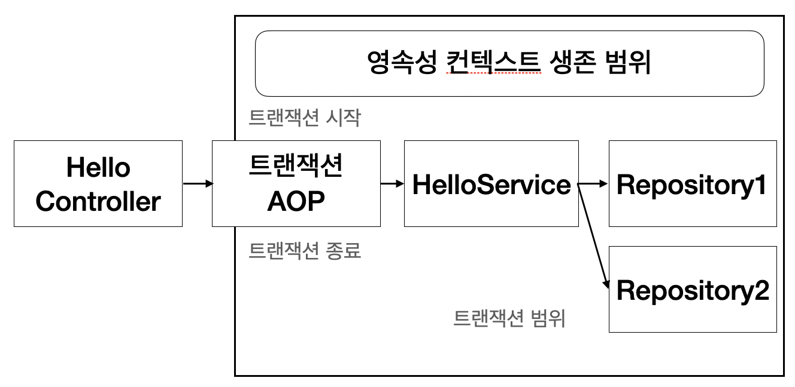

# 13. 웹 애플리케이션과 영속성 관리

**이 글은 자바 ORM 표준 JPA 프로그래밍 을 참고해서 쓴 글입니다.**

스프링이나 J2EE 컨테이너 환경에서 JPA를 사용하면 컨테이너가 트랜잭션 영속성 컨텍스트를 관리해주므로 애플리케이션을 손쉽게 개발할 수 있다. 하지만 컨테이터 환경에서 동작하는 JPA의 내부 동작 방식을 이해하지 못하면 문제가 발생할때 해결하기가 쉽지 않다.

## 13.1 트랜잭션 범위의 영속성 컨텍스트

순수한 J2SE 환경에서 JPA를 사용하면 개발자가 직접 엔티티 매니저를 생성하고 트랜잭션도 관리해야 한다. 하지만 스프링이나 J2EE 컨테이너 환경에서 JPA를 사용하면 컨테이너가 제공하는 전략을 따라야 한다.

* 13.1.1 스프링 컨테이너의 기본 전략

    스프링 컨테이너는 트앤잭션 범위의 영속성 컨텍스트 전략을 기본으로 사용한다. 이 전략은 이름 그대로 트랜잭션의 범위와 영속성 컨텍스트의 생존 범위가 같다는 뜻이다. 즉, 트랜잭션을 시작할 때 영속성 컨텍스틀르 생성하고 트랜잭션이 끝날 때 영속성 컨텍스트를 종료한다. 그리고 같은 트랜잭션 안에서는 항상 같은 영속성 컨텍스트에 접근한다.

 그림 13.1 트랜잭션 범위의 영속성 컨텍스트

---

스프링 프레임워크를 사용하면 보통 비즈니스 로직을 시작하는 서비스 계층에 @Transactional 어노테이션을 선언해서 트랜잭션을 시작한다. 외부에서는 단순히 서비스 계층의 메소드를 호출하는 것처럼 보이지만 이 어노테이션이 있으면 호출한 메소드를 실행하기 직전에 스프링의 트랜잭션 AOP가 먼저 동작한다.

그림 13.2를 보자. 스프링 트랜잭션 AOP는 대상 메소드를 호출하기 직전에 트랜잭션을 시작하고, 대상 메소드가 정상 종료되면 트랜잭션을 커밋하면서 종료한다. 이때 중요한 일이 일어나는데 트랜잭션을 커밋하면 JPA는 먼저 영속성 컨텍스트를 플러시해서 변경 내용을 데이터베이스에 반영한 후에 데이터베이스 트랜잭션을 커밋한다. 따라서 영속성 컨텍스트의 변경 내용이 데이터베이스에 정상 반영된다. 만약 예외가 발생하면 트랜잭션을 롤백하고 종료하는데 이때는 플러시를 호출하지 않는다.

 그림 13.2 트랜잭션 범위의 영속성 컨텍스트

---

트랜잭션 범위의 영속성 컨텍스트 전략을 예제 13.1로 분석해보자

```java
@Controller
@RequiredArgsConstructor
class HelloController {

    private final HelloService helloService;

    public void hello() {
        // 반환된 member 엔티티는 준영속 상태다. -- 4
        Member member = helloSerice.logic();
    }
}

@Service
@RequiredArgsConstructor
class HelloSerice {

    @PersistenceContext // 엔티티 매니저 주입
    private final EntityManager em;

    private final Repository1 repository1;

    private final Repository2 repository2;

    // 트랜잭션 시작 -- 1
    @Transactional
    public void logic() {
        repository1.hello();
        // member는 영속 상태다 -- 2
        Member member = repository2.findMember();
    }
    // 트랜잭션 종료 -- 3
}

@Repository
@RequiredArgsConstructor
class Repository1 {

    @PersistenceContext
    private final EntityManager em;

    public void hello() {
        em.xxx(); // A. 영속성 컨텍스트 접근 
    }
}

@Repository
@RequiredArgsConstructor
class Repository2 {

    @PersistenceContext
    private final EntityManager em;

    public Member findMember() {
        return em.find(Member.class, "id1"); // B. 영속성 컨텍스트 접근 
    }
}
```

javax.persistence.PersistenceContext 어노테이션을 사용하면 스프링 컨테이너가 엔티티 매니저를 주입해준다.

위 코드를 분석해보면

1. HelloService() 메소드에 @Transactional을 선언해서 메소드를 호출할 때 트랜잭션을 먼저 시작한다.
2. repository2.findMember()를 통해 조회한 member 엔티티는 트랜잭션 범위 안에 있으므로 영속성 컨텍스트의 관리를 받는다. 따라서 지금은 영속 상태다.
3. @Transactional을 선언한 메소드가 정상 종료되면 트랜잭션을 커밋하는데, 이때 영속성 컨텍스트를 종료한다. 영속성 컨텍스트가 사라졌으므로 조회한 엔티티는 이제부터 준영속 상태가 된다.
4. 서비스 메소드가 끝나면서 트랜잭션과 영속성 컨텍스트가 종료되었다. 따라서 컨트롤러에 반환된 member 엔티티는 준영속 상태다.

* 트랜잭션이 같으면 같은 영속성 컨텍스트를 사용한다

그림 13.3을 분석해보자. 트랜잭션 범위의 영속성 컨텍스트 전략은 다양한 위치에서 엔티티 매니저를 주입받아 사용해도 트랜잭션이 같으면 항상 같은 영속성 컨텍스트를 사용한다. 위 코드도 엔티티 매니저를 사용하는 A, B코드는 모두 같은 트랜잭션 범위에 있다. 따라서 엔티티 매니저는 달라도 같은 영속성 컨텍스트를 사용한다.

 그림 13.3 트랜잭션과 영속성 컨텍스트

---

### 13.1.1 트랜잭션이 다르면 다른 영속성 컨텍스트를 사용한다

그림 13.4와 같이 여러 스레드에서 동시에 요청이 와서 같은 엔티티 매니저를 사용해도 트랜잭션에 따라 접근하는 영속성 컨텍스트가 다르다. 조금 더 풀어서 이야기하면 스프링 컨테이너는 스레드마다 각각 다른 트랜잭션을 할당한다. 따라서 같은 엔티티 매니저를 호출해도 접근하는 영속성 컨텍스트가 다르므로 멀티스레드 상황에 안전하다.

 그림 13.4 스레드와 영속성 컨텍스트

---

스프링이나 J2EE 컨테이너의 가장 큰 장점은 트랜잭션과 복잡한 멀티 스레드 상황읋 컨테이너가 처리해준다는 점이다. 따라서 개발자는 싱글 스레드 애플리케이션처럼 단순하게 개발할 수 있다.

## 13.2 준영속 상태와 지연 로딩

그림 13.1을 보면. 스프링이나 J2EE 컨테이너는 트랜잭션 범위의 영속성 컨텍스트 전략을 기본으로 사용한다. 그리고 트랜잭션은 보통 서비스 계층에서 시작하므로 서비스 계층이 끝나는 시점에 트랜잭션이 종료되면서 영속성 컨텍스트도 함께 종료된다. 따라서 조회한 엔티티가 서비스와 리포지토리 계층에서는 영속성 컨텍스트에 관리되면서 영속 상태를 유지하지만 컨트롤러나 뷰 같은 프리젠테이션 계층에서는 준영속 상태가 된다.

```java
@Entity
public class Order extends BaseEntity {
    
    @ManyToOne(fetch = FetchType.LAZY)
    private Member member;
}
```

컨테이너 환경의 기본 전략인 트랜잭션 범위의 영속성 컨텍스트 전략응 사용하면 트랜잭션이 없는 프리젠테이션 계층에서 엔티티는 준영속 상태다. 따라서 변경감지와 지연 로딩이 동작하지 않는다. 다음 코드는 컨트롤러에 있는 로직인데 지연 로딩 시점에 예외가 발생한다.

```java
class OrderController {

    public String view(Long orderId) {
        Order order = orderService.findOne(orderId);
        Member member = order.getMember();
        member.getName(); // 지연 로딩 시 예외 발생
    }
}
```

* 13.2.1 준영속 상태와 변경 감지

  변경 감지 기능은 영속성 컨텍스트가 살아 있는 서비스 계층(트랜잭션 범위)까지만 동작하고 영속성 컨텍스트가 종료된 프리젠테이션 게층에서는 동작하지 않는다. 보통 변경 감지 기능은 서비스 계층에서 비즈니스 로직을 수행하면서 발생한다. 단순히 데이터를 보여주기만 하는 프리젠테이션 게층에서 데이터를 수정할 일은 거의 없다. 오히려 변경 감지 기능이 프리젠테이션 계층에서도 동작하면 애플리케이션 계층이 가지는 책임이 모호해지고, 데이터를 어디서 변경했는지 프리젠테이션 계층까지 다 찾아야 하므로 유지보수하기 어렵다. 비즈니스 로직은 서비스 계층에서 끝내고 프리젠테이션 계층은 데이터를 보여주는 데 집중해야 한다. 따라서 변경 감지 기능이 프리젠테이션 계층에서 동작하지 않는 것은 문제가 되지 않는다.

* 13.2.2 준영속 상태와 지연 로딩

  준영속 상태의 가장 큰 문제는 지연 로딩 기능이 동작하지 않는다는 것이다. 예를 들어 뷰를 렌더링할 때 연관된 엔티티도 함께 사용해야 하는데 연관된 엔티티를 지연 로딩으로 설정해서 프록시 객체로 조회했다고 가정하면 아직 초기화하지 않은 프록시 객체를 사용하면 실제 데이터를 불러오려고 초기화를 시도한다. 하지만 준영속 상태는 영속성 컨텍스트가 없으므로 지연 로딩을 할 수 없다. 이때 지연 로딩을 시도하면 예외가 발생한다. (하이버네이트 구현체 - org.hibernate.LazyInitializationException) 예외가 발생한다.

준영속 상태의 지연 로딩 문제를 해결하는 방법은 크게 2가지가 있다.

* 뷰가 필요한 엔티티를 미리 로딩해두는 방법
* OSIV를 사용해서 엔티티를 항상 영속 상태로 유지하는 방법

첫번째는 이름 그대로 영속성 컨텍스트가 살아 있을 때 뷰에 필요한 엔티티들을 미리 다 로딩하거나 초기화해서 반환하는 방법이다. 따라서 엔티티가 준영속 상태로 변해도 연관된 엔티티를 이미 다 로딩해두어 징녀 로딩이 발생하지 않는다. 뷰가 필요한 엔티티를 미리 로딩해두는 방법은 어디서 미리 로딩하느냐에 따라 3가지 방법이 있다.

* 글로벌 페치 전략 수정
* JPQL 페치 조인
* 강제로 초기화

### 13.2.1 글로벌 페치 전략 수정

가장 간단한 방법은 지연로딩에서 즉시 로딩으로 변경하면된다. 하지만 이는 2가지 단점을 가진다.

* 사용하지 않는 엔티티를 로딩한다.

    예를 들어 화면 A에서 order와 member 둘 다 필요해서 글로벌 전략을 즉시 로딩으로 설정했다. 반면 화면 B는 order 엔티티만 있으면 충분한다. 하지만 화면 B는 즉시 로딩 전략으로 인해 사용하지 않는 membere도 함꼐 조회하게 된다.

* N+1 문제가 발생한다.

    JPA를 사용하면서 성능상 가장 조시해야 하는 것이 바로 N+1문제다. em.find() 메소드로 엔티티를 조회할 때 연관된 엔티티를 로딩하는 전략이 즉시 로딩이면 데이터베이스에 JOIN 쿼리를 사용해서 한번에 연관된 엔티티까지 조회한다. 실행된 쿼리는 다음과 같다

    ```sql
    SELECT * o.*, m.* FROM Order o LEFT OUTER JOIN Member m on o.MEMBER_ID=m.MEMBER_ID WHERE o.id=1
    ```

    실행된 SQL을 보면 즉시 로딩으로 설정한 member 엔티티를 JOIN 쿼리로 함께 조회한다. 여기까지는 글로벌 즉시 로딩 전략이 좋아보이지만 문제는 JPQL을 사용할 때 발생한다.

    ```java
    List<Order> orders = em.createQuery("SELECT o FROM Orfer o", Order.class)
        .getResultList();
    ```

    실행된 SQL은 다음과 같다.

    ```sql
    SELECT * FROM Order -- JPQL로 실행된 SQL
    SELECT * FROM Member WHERE id=? -- EAGER로 싱행된 SQL
    SELECT * FROM Member WHERE id=? -- EAGER로 싱행된 SQL
    SELECT * FROM Member WHERE id=? -- EAGER로 싱행된 SQL
    SELECT * FROM Member WHERE id=? -- EAGER로 싱행된 SQL
    ```

    JPA가 JPQL을 분석해서 SQL을 생성할 때는 글로벌 페치 전략을 참고하지 않고 오직 JPQL 자체만 사용한다. 따라서 즉시 로딩이든 지연 로딩이든 구분하지 않고 JPQL 쿼리 자체에 충실하게 SQL을 만든다.

    1. SELECT \* FROM Order o JPQL을 분석해서 SELECT \* FROM Order SQL을 생성한다.
    2. 데이터베이스에서 결과를 받아 order 엔티티 인스턴스들을 생성한다.
    3. Order.member의 글로벌 페치 전략이 즉시 로딩이므로 order를 로딩하는 즉시 연관된 member도 로딩해야 한다.
    4. 연관된 member를 영속성 컨텍스트에서 찾는다.
    5. 만약 영속성 컨텍스트에 없으면 SELECT * FROM MEMBER WHERE id=? SQL을 조회한 order 엔티티 수만큼 실행한다.

    만약 조회한 order 엔티티가 10개이면 member를 조회하는 SQL도 10번 실행한다. 이처럼 처음 조회한 데이터 수만큼 다시 SQL을 사용해서 조회하는 것을 N+1 문제라 한다. 이는 SQL이 상당히 많이 호출되므로 조회 성능에 치명적이다. 이는 JPQL 페치 조인으로 해결할 수 있다.

### 13.2.2 JPQL 페치 조인

글로벌 페치 전략을 즉시 로딩으로 설정하면 애플리케이션 전체에 영향을 주므로 너무 비효율 적이다. 이번에는 JPQL을 호출하는 시점에 함께 로딩할 엔티티를 선택할 수 있는 페치 조인을 알아보자.

```sql
-- 페치 조인 사용 전
SELECT o FROM Order o -- JPQL
SELECT * FROM Order -- SQL

-- 페치 조인 사용 후
SELECT o FROM Order o JOIN FETCH o.member -- JPQL
SELECT o.*, m.* FROM Order o JOIN Member m ON o.MEMBER_ID=MEMBER_ID
```

페치 조인은 조인 명령어 마지막에 fetch를 넣어주면 된다. 이를 사용하면 SQL JOIN을 사용해서 페치 조인 대상까지 함께 조회한다. 따라서 N+1 문제가 발생하지 않는다. (연관된 엔티티를 이미 로딩했으므로 글로벌 페치 전략은 무의미하다.) 페치 조인은 N+1 문제를 해결하면서 화면에 필요한 엔티티를 미리 로딩하는 현실적인 방법이다.

페치 조인이 현실적인 대안이긴 하지만 무분별하게 사용하면 화면에 맞춘 리포지토리 메소드가 증가할 수 있다. 결국 프레젠테이션 계층이 데이터 접근 계층을 침범하는 것이다.

예를 들어 화면 A는 order 엔티티만 필요한 반면 화면 B는 order 엔티티와 연관된 member 엔티티 둘 다 필요하다. 결국 최적화를 위해 둘을 지연 로딩으로 설정하고 리포지토리에 다음 2가지 메소드를 만들어야한다.

* 화면 A를 위해 order만 조회하는 repository.findOrder() 메소드
* 화면 B를 위헤 order와 연관된 member를 페치 조인으로 조회하는 repository.findOrderWithMember() 메소드

이제 각각의 화면에서는 필요한 메소드를 호출하면 되는데 이는 최적화는 할 수 있지만, 뷰와 리포지토리 간에 논리적인 의존관계가 발생한다.

다른 대안은 repository.findOrder() 하나만 만들고 여기서 페치 조인으로 order와 member를 함께 로딩하는 것이다. 물론 order 엔티티만 필요한 화면 B는 약간의 로딩 시간이 증가하겠지만 JOIN을 사용해서 쿼리 한 번으로 조회하므로 성능에 미치는 영향은 미비하다. 무분별한 최적화로 프리젠테이션 계층과 데이터 접근 계층 간에 의존관계가 급격하게 증가하는 것보다는 적절한 타협점이 좋다.

### 13.2.3 강제로 초기화

강제로 초기화하기는 영속성 컨텍스트가 살아있을 때 프리젠테이션 계층이 필요한 엔티티를 강제로 초기화해서 반환하는 방법이다.

```java
class OrderService {

    @Transactional
    public Order findOrder(Long id) {
        Order order = orderRepository.findOrder(id);
        order.getMember().getName(); // 프록시 객체를 강제로 초기화한다.
        return order;
    }
}
```

굴로벌 페치 전략을 지연 로딩으로 설정하면 연관된 엔티티를 프록시 객체로 조회하는데 이는 실제 사용하는 시점에 초기화 된다. 예를 들어 order.getMember() 까지만 호출하면 프록시 객체만 반환하고 member.getName() 처럼 실제 값을 사용하는 시점에 초기화 한다.

위 코드처럼 프리젠테이션 계층에서 필요한 츠록시 객체를 영속성 컨텓스트가 살아 있을 때 강제로 초기화해서 반환하면 이미 초기화했으므로 준영속 상태에서도 사용할 수 있다.

만일 하이버네이트를 사용하면 initialize() 메소드를 사용해서 프록시를 강제로 초기화할 수 있다.

참고로 JPA 표준에는 프록시 초기화 메소드가 없고 여부만 확인할 수 있다.

```java
PersistenceUnitUtil persistenceUnitUtil = em.getEntityManagerFactory().getPersistenceUnitUtil();
boolean isLoaded = persistenceUnitUtil.isLoaded(order.getMember());
```

예제 처럼 프록시를 초기화하는 역할은 서비스 계층이 담당하면 뷰가 필요한 엔티티에 따라 서비스 계층의 로직을 변경해야 한다. 프리젠테이션 계층이 서비스 계층을 침범하는 상황이다. 서비스 계층은 비즈니스 로직을 담당해야지 프리젠테이션 계층을 위한 일까지 하는 것은 좋지 않다. 따라서 초기화 역할을 분리해야하는데 이는 FACADE 계층이 그 역할을 담당해줄 것이다.

### 13.2.4 FACADE 계층 추가

그림 13.5를 보자. 이것은 프리젠테이션 계층과 서비스 계층 사이에 FACADE 계층을 하나 더 두는 방법이다. 이제부터 뷰를 위한 프록시 초기화는 이곳에서 담당한다. 덕분에 서비스 계층은 프리젠테이션 계층을 위해 프록시를 초기화 하지 않아도 된다.

 그림 13.5 FACADE

---

프록시를 초괴화하려면 영속성 컨텍스트가 필요하므로 FACADE에서 트랜잭션을 시작해야 한다.

다음은 FACADE 계층의 역할과 특징이다.

* 프리젠테이션 계층과 도메인 모델 계층 간의 논리적 의존성을 분리해준다.
* 프리젠테이션 계층에서 필요한 프록시 객체를 초기화한다.
* 서비스 계층을 호출해서 비즈니스 로직을 실행한다.
* 리포지토리를 직접 호출해서 뷰가 요구하는 엔티티를 찾는다.

```java
@Component
@RequiredArgsConstructor
class OrderFacade {

    private final OrderService orderService;

    public Order findOrder(Long id) {
        Order order = orderSercice.findOrder(id);
        order.getMember().getName();
        return order;
    }
}

@Sercice
class OrderService {

    public Order findOrder(Long id) {
        return orderRepository.findOrder(id);
    }
}
```

OrderService에 있던 프록시 초기화 코드를 orderFacade로 이동했다.

FACADE 계층을 사용해서 서비스 계층과 프리젠테이션 계층 간에 논리적 의존 관계를 제거했다. 이제 서비스 계층은 비즈니스 로직에 집중하고 프리젠테이션 계층을 위한 초기화 코드는 모든 FACADE가 담당하면 된다. 하지만 실용적인 관점에서 최대 단점은 중간에 계층이 하나 더 끼어 든다는 점이다. 결국 더 많은 코드를 작성해야 하며, FACADE에는 단순히 서비스 계층을 호출만 하는 위임 코드가 상당히 많을 것이다.

### 13.2.5 준영속 상태와 지연 로딩의 문제점

지금까지 준영속 상태일 때 지연 로딩 문제를 극복하기 위해 글로벌 페치 전략도 수정하고 JPQL의 페치 조인도 사용하고, 강제로 초기화까지 하다가 결국 FACADE 계층까지 알아보았다.

뷰를 개발할 때 필요한 엔티티를 미리 초기화하는 방법은 생각보다 오류가 발생할 가능성이 높다. 왜냐하면 뷰를 개발할때 엔티티 클래스를 보고 개발하지 FACADE나 서비스 클래스까지 열어보는 것은 상당히 번거롭고 놓치기 쉽기 때문이다. 결국 영속성 컨텍스트가 없는 뷰에서 초기화하지 않은 프록시 엔티티를 조회하는 실수를 하게 되고 LazyInitializationException을 만나게 될 것이다.

그리거 애플리케이션 로직과 뷰가 물리적으로 나누어져 있지만 논리적으로는 서로 의존하는 문제가 있다. 물론 FACADE를 사용해서 이런 문제를 어느 정도 해소할 수는 있지만 상당히 번거롭다. 예를 들어 화면별로 최적화된 엔티티를 딱딱 맞아떨어지게 초기화해서 조회하려면 FACADE 계층에 여러 종류의 조회 메소드가 필요하다.

결국 모든 문제는 엔티티가 프리젠테이션 계층에서 준영속 상태이기 때문에 발생한다.

## 13.3 OSIV

OSIV(Open Session In View)는 영속성 컨텍스트를 뷰까지 열어둔다는 뜻이다. 영속성 컨텍스트가 살아있으면 엔티티는 영속 상태로 유지된다. 따라서 뷰에서도 지연 로딩을 사용할 수 있다.

### 13.3.1 과거 OSIV: 요청 당 트랜잭션

OSIV의 핵심은 뷰에서도 지연 로딩이 가능하도록 하는 것이다. 가장 단순한 구현 방법은 클라이언트의 요청이 들어오자마자 서블릿 필터나 스프링 인터셉터에서 트랜잭션을 시작하고 요청이 끝날 때 트랜잭션도 끝내는 것이다. 이것이 요청 당 트랜잭션 방식의 OSIV라 한다.

 그림 13.6 초창기 OSIV: 요청당 트랜잭션

---

그림 13.6에서 보는 것처럼 요청이 들어오자마자 서블릿 필터나 스프링 인터셉터에서 영속성 컨텍스트를 만들면서 트랜잭션을 시작하고 요청이 끝날 때 트랜잭션과 영속성 컨텍스트를 함께 종료한다. 이렇게 하면 영속성 컨텍스트가 처음부터 끝까지 살아있으므로 조회한 엔티티도 영속 상태를 유지한다. 이제 뷰에서도 지연 로딩을 할 수 있게 되면서 FACADE 계층 없이도 뷰에 독립적인 서비스 계층을 유지할 수 있다.

요청 당 트랜잭션 방식의 OSIV가 가지는 문제점은 컨트롤러나 뷰 같은 프리젠테이션 계층이 엔티티를 변경할 수 있다는 점이다. 예를 들어 다음 코드처럼 보안상의 이유로 고객 이름을 XXX로 변경해서 출력해야 한다고 가정하자

```java
class MemberController {
    
    public String viewMember(Long id) {
        Member member = memberService.getMember(id);
        member.setName("XXX");
        model.addAttribute("member", member);
    }
}
```

컨트롤러에서 고객 이름을 XXX로 변경해서 렌더링할 뷰에 넘겨주었다. 개발자의 의도는 단순히 뷰에 노출할 때만 고객 이름을 XXX로 변경하고 싶은 것이지 실제 데이터베이스에 있는 고객 이름까지 변경하고 싶은 것은 아니었다. 하지만 요청 당 트랜잭션 방식의 OSIV는 뷰를 렌더링한 후에 트랜잭션을 커밋한다. 트랜잭션을 커밋하면 용속성 컨텍스트를 플러시한다. 이때 변경 감지 기능이 작동해서 변경된 엔티티를 데이터베이스에 반영한다.

서비스 계층처럼 비즈니스 로직을 실행하는 곳에서 데이터를 변경하는 것은 당연하지만 프리젠테이션 계층에서 데이터를 잠시 변경했다고 실제 데이터베이스까지 변경 내용이 반여되면 어플리케이션을 유지보수하기 상당히 힘들어진다. 이런 문제를 해결하려면 프리젠테이션 계층에서 엔티티를 수정하지 못하게 막으면 된다.

* 엔티티를 읽기 전용 엔터페이스로 제공

    이 방법은 엔티티를 직접 노출하는 대신에 다음 코드처럼 읽기 전용 메소드만 제공하는 인터페이스를 프리젠테이션 계층에 제공하는 방법이다.

    ```java
    interface MemberView {
        public String getName();
    }

    @Entity
    class Member implements MemberView {}

    class MemberService {
        
        public MemberView getMember(Long id) {
            return memberRepository.findById(id);
        }
    }
    ```

    위 코드는 실제 회원 엔티티가 있지만 프리젠테이션 계층에는 Member 엔티티 대신에 읽기 전용 메소드만 있는 MemberView 인터페이스를 제공했다. 프리젠테이션 계층은 읽기 전용 메소드만 있는 인터페이스를 사용하므ㅗㄹ 엔티티를 변경할 수 없다.

* 엔티티 레핑

    이 방법은 다음 코드와 같이 엔티티의 읽기 전용 메소드만 가지고 있는 엔티티를 감싼 객체를 만들고 이를 프리젠테이션 계층에 반환하는 방법이다.

    ```java
    class MemberWrapper {

        private Member member;

        public MemberWrapper(Member member) {
            this.member = member;
        }

        public String getName() {
            return member.getName();
        }
    }
    ```

    member 엔티티를 감싸고 있는 MemberWrapper 객체를 만들었다. 이 객체는 member 엔티티의 읽기 메소드만 제공한다.

* DTO만 반환

    가장 전통적인 방법으로 프리젠테이션 계층에 엔티티 대신에 단순히 데이터만 전달하는 객체인 DTO를 생성해서 반환하는 것이다. 하지만 이 방법은 OSIV를 사용하는 장점을 살릴 수 없고 엔티티를 거의 복사한 듯한 DTO 클래스도 하나 더 만들어야 한다.

    ```java
    class MemberDTO {
        private String name;
    }

    MemberDTO memberDTO = new MemberDTO();
    memberDTO.setName(member.getName());
    return memberDTO;
    ```

지금까지 설명한 방법 모두 코드량이 증가하는 단점이 있어서 차라리 프리젠테이션 계층에서 엔티티를 수정하면 안 된다고 개발자끼리 합의하는 것이 실용적일 수 있다.

지금까지 설명한 OSIV는 요청 당 트랜잭션 방식의 OSIV다. 이것은 지금까지 설명했던 문제점들로 인해 최근에는 거의 사용하지 않는다. 최근에는 이런 문제점을 어느정도 보완해서 비즈니스 계층에서만 트랜잭션을 유지하는 방식의 OSIV를 사용한다. 스프링 프레임워크가 제공하는 OSIV가 이 방식이다.

### 13.3.2 스프링 OSIV: 비즈니스 계층 트랜잭션

스프링 프레임워크의 spring-orm.jar는 다양한 OSIV 클래스를 제공한다. OSIV를 서블릿 필터에서 적용할지 스프링 인터셉터에서 적용할지에 따라 원하는 클래스를 선택해서 사용하면 된다.

* 하이버네이트 OSIV 서블릿 필터: org.springframework.orm.hibernate4.support.OpenSessionInViewFilter
* 하이버네이트 OSIV 스프링 인터셉터: org.springframework.orm.hibernate4.support.OpenSessionInViewInterceptor
* JPA OEIV 서블릿 필터: org.springframework.orm.jpa.support.OpenEntityManagerInViewFilter
* JPA OEIV 스프링 인터셉터: org.springframework.orm.jpa.support.OpenEntityManagerInViewInterceptor

예를 들어 JPA를 사용하면서 서블릿 필터에 OSIV를 적용하려면 OpenEntityManagerInViewFilter를 서블릿 필터에 등록하면 되고 스프링 인터셉터에 OSIV를 적용하려면 OpenEntityManagerInViewInterceptor를 스프링 인터셉터에 등록하면 된다.

스프링 프레임워크가 제공하는 OSIV는 프리젠테이션 계층에서 데이터를 변경할 수 있는 문제를 어느정도 해결했다.

스프링 프레임워크가 제공하는 OSIV는 "비즈니스 계층에서 트랜잭션을 사용하는 OSIV"(그림 13.7) 이다. 이름 그대로 OSIV를 사용하기는 하지만 트랜잭션은 비즈니스 계층에서만 사용한다는 뜻이다.

 그림 13.7 스프링 OSIV - 비즈니스 계층 트랜잭션

---

동작 원리는 다음과 같다. 클라이언트의 요청이 들어오면 영속성 컨텍스트를 생성한다. 이때 트랜잭션은 시작하지 않는다. 서비스 계층에서 트랜잭션을 시작하면 앞에서 생성해둔 영속성 컨텍스트에 트랜잭션을 시작한다. 비즈니스 로직을 실행하고 서비스 계층이 끝나면 트랜잭션을 커밋하면서 영속성 컨텍스트를 플러시한다. 이때 트랜잭션만 종료하고 영속성 컨텍스트는 살려둔다. 이후 클라이언트의 요청이 끝날 때 영속성 컨텍스트를 종료한다.

1. 클라이언트의 요청이 들어오면 서블릿 필터나, 스프링 인터셉터에서 영속성 컨텍스트를 생성한다. 단 이때 트랜잭션은 시작하지 않는다.
2. 서비스 계층에서 @Transactional로 트랜잭션을 시작할 때 1번에서 미리 생성해둔 영속성 컨텍스트를 찾아와서 트랜잭션을 시작한다.
3. 서비스 계층이 끝나면 트랜잭션을 커밋하고 영속성 컨텍스트를 플러시한다. 이때 트랜잭션은 끝내지만 영속성 컨텍스트는 종료하지 않는다.
4. 컨트롤러와 뷰까지 영속성 컨텍스트가 유지되므로 조회한 엔티티는 영속 상태를 유지한다.
5. 서블릿 필터나, 스프링 인터셉터로 요청이 돌아오면 영속성 컨텍스트를 종료한다. 이때 플러시를 호출하지 않고 바로 죵료한다.

영속성 컨텍스트를 통한 모든 변경은 트랜잭션 안에서 이루어져야 한다. 만약 트랜잭션 없이 엔티티를 변경하고 영속성 컨텍스트를 플러시하면 javax.persistence.TransactionRequiredException 예외가 발생한다.

엔티티를 변경하지 않고 단순이 조회만 할 때는 트랜잭션이 없어도 되는데 이것을 트랜잭션 없이 읽기(Nontransactional reads)라 한다. 프록시를 초기화하는 지연 로딩도 조회 기능이므로 트랜잭션 없이 읽기가 가능하다.

* 영속성 컨텍스트는 트랜잭션 범위 안에서 엔티티를 조회하고 수정할 수 있다.
* 영속성 컨텍스트는 트랜잭션 범위 밖에서 엔티티를 조회만 할 수 있다. 이것을 트랜잭션 없이 읽기라 한다.

스프링이 제공하는 OSIV를 사용하면 프리젠테이션 계층에서는 트랜잭션이 없이므로 엔티티를 수정할 수 없다. 따라서 프리젠테이션 계층에서 엔티티를 수정할 수 있는 기존 OSIV의 단점을 보완했다. 그리고 트랜잭션 없이 읽기를 사용해서 프리젠테이션 계층에서 지연 로딩 기능을 사용할 수 있다.

정리해보면 스프링이 제공하는 비즈니스 계층 트랜잭션 OSIV는 다음과 같은 특징이 있다.

* 영속성 컨텍스트를 프리젠테이션 계층까지 유지한다.
* 프리젠테이션 계층에는 트랜잭션이 없으므로 엔티티를 수정할 수 없다.
* 프리젠테이션 계층이는 트랜잭션이 없지만 트랜잭션이 없이 읽기를 사용해서 지연 로딩을 할 수 있다.

다음 코드는 요청 당 트랜잭션 방식의 OSIV를 설명하면서 문제가 있던 예제다. 여기에 스프링이 제공하는 OSIV를 적용한 후 비교해보갰다.

```java
class MemberController {

    public String viewMember(Long id) {
        Member member = memberService.getMember(id);
        member.setName("XXX");
        model1.addAttribute("member", member);
    }
}
```

이 코드는 다음과 같은 이유로 플러시가 동작하지 않는다.

* 영속성 컨텍스트의 변경 내용을 데이터베이스에 반영하려면 영속성 컨텍스트를 플러시해야 한다. 하지만 트랜잭션을 사용하는 서비스 계층이 끝날 때 트랜잭션이 커밋되면서 이미 플러시해버렸다. 그리고 스프링이 제공하는 OSIV 서블릿 필터나 OSIV 스프링 인터셉터는 요청이 끝나면 플러시를 호출하지 않고 em.close()로 영속성 컨텍스트만 종료해 버리므로 플러시가 일어나지 않는다.
* 프리젠테이션 계층에서 em.flush()를 호출해서 강제로 플러시해도 트랜잭션 범위 밖이므로 데이터를 수정할 수 없다는 예외를 만난다. (javax.persistence.TransactionRequiredException: no transaction is in progress)

따라서 예제는 프리젠테이션 계층에서 영속 상태의 엔티티를 수정했지만, 수정 내용이 데이터베이스에는 반영되지 않는다.

스프링 OSIV를 사용하면 프리젠테이션 계층에서 엔티티를 수정해도 수정 내용을 데이터베이스에 반영하지 않는다. 그런데 한 가지 예외가 있다. 프리젠테이션 계층에서 엔티티를 수정한 직후에 트랜잭션을 시작하는 서비스 계층을 호출하면 문제가 생긴다.

```java
class MemberController {

    public String viewMember(Long id) {
        Member member = memberService.getMember(id);
        member.setName("XXX");
        
        memberService.biz(); // 비즈니스 로직
        return "view";
    }
}

class MemberService {

    @Transactional
    public void biz() {
        // ... 비즈니스 로직 실행
    }
}
```

 그림 13.8 스프링 OSIV 주의사항

---

그림 13.8을 분석해보면

1. 컨트롤러에서 회원 엔티티를 조회하고 이름을 member.setName("XXX")로 수정했다.
2. biz() 메소드를 실행해서 트랜잭션이 있는 비즈니스 로직을 실행했다.
3. 트랜잭션 AOP가 동작하면서 영속성 컨텍스트에 트랜잭션을 시작한다. 그리고 biz() 메소드를 실행한다.
4. biz() 메소드가 끝나면 트랜잭션 AOP는 트랜잭션을 커밋하고 영속성 컨텍스트를 플러시한다. 이떼 변경 감지가 동작하면서 회원 엔티티의 수정 사항을 데이터베이스에 반영한다.

컨트롤러에서 엔티티를 수정하고 즉시 뷰를 호출한 것이 아니라 트랜잭션이 동작하는 비즈니스 로직을 호출했으므로 이런 문제가 발생한다. 문제를 해결하는 단순한 방법은 트랜잭션이 있는 비즈니스 로직을 모두 호출하고 나서 엔티티를 변경하면 된다. 보통 컨트롤러는 비즈니스 로직을 먼저 호출하고 그 결과를 조회하는 순서로 실행하므로 이런 문제는 거의 발생하지 않는다.

```java
memberService.biz(); // 비즈니스 로직 먼저 실행
Member member = memberService.getMember(id);
member.setName("XXX");
```

스프링 OSIV는 같은 영속성 컨텍스트를 여러 트랜잭션이 공유할 수 있으므로 이런 문제가 발생한다. OSIV를 사용하지 않는 트랜잭션 범위의 영속성 컨텍스트 전략은 트랜잭션의 생명주기와 영속성 컨텍스트의 생명주기가 같으므로 이런 문제가 발생하지 않는다.

### 13.3.3 OSIV 정리

* 스프링 OSIV의 특징
  * OSIV는 클라이언트의 요청이 들어올 때 영속성 컨텍스트를 생성해서 요청이 끝날 때까지 같은 영속성 컨텍스트를 유지한다. 따라서 한 번 조회한 엔티티는 요청이 끝날 때까지 영속 상태를 유지한다.
  * 엔티티 수정은 트랜잭션이 있는 계층에서만 동작한다. 트랜잭션이 없는 프리젠테이션 계층은 지연 로딩을 포함해서 조회만 할 수 있다.
* 스프링 OSIV의 단점
  * OSIV를 적용하면 같은 영속성에 컨텍스트를 여러 트랜잭션이 공유할 수 있다는 점을 주의해야 한다. 특히 트랜잭션 롤백 시 주의해야 한다.
  * 앞서 스프링 OSIV 주의사항에서도 이야기했듯이 프리젠테이션 계층에서 엔티티를 수정하고나서 비즈니스 로직을 수행하면 엔티티가 수정될 수 있다.
  * 프리젠테이션 계층에서 지연 로딩에 의한 SQL이 실행된다. 따라서 성능 튜닝시 확인해야 할 부분이 넓다.
* OSIV vs FACADE vs DTO

  OSIV를 사용하지 않는 대안은 FACADE 계층이나 그것을 조금 변형해서 사용하는 다양한 방법이 있는데 어떤 방법을 사용하든 결국 준영속 상태가 되기 전에 프록시를 초기화해야 한다. 다른 방법은 엔티티를 직접 노출하지 않고 엔티티와 거의 비슷한 DTO를 만들어서 반환하는 것이다. 어떤 방법을 사용하든 OSIV를 사용하는 것과 비교해서 지루한 코드를 많이 작성해야 한다.

* OSIV를 사용하는 방법이 만능은 아니다

  OSIV를 사용하면 화면을 출력할 때 엔티티를 유지하면서 객체 그래프를 마음껏 탐색할 수 있다. 하지만 복잡한 화면을 구성할 때는 이 방법이 효과적이지 않은 경우가 많다. 예를 들어 복잡한 통계 화면은 엔티티로 조회하기보다는 처음부터 통계 데이터를 구상하기 위한 JPQL을 작성해서 DTO로 조회하는 것이 효과적이다. 그리고 수많은 테이블을 조인해서 보여주어야 하는 복잡한 관리자 화면도 객체 그래프로 표현하기 어려운 경우가 많다. 이때도 엔티티를 직접 조회하기보다는 JPQL로 필요한 데이터들만 조회해서 DTO로 반환하는 것이 더 나은 해결책일 수 있다.

* OSIV는 같은 JVM을 벗어난 원격 상황에서는 사용할 수 없다

  OSIV는 같은 JVM을 벗어난 원격 상황에서는 사용할 수 없다. 예를 들어 JSON이나 XML을 생성할 때는 지연 로딩을 사용할 수 있지만 원격지인 클라이언트에서 연관된 엔티티를 지연로딩하는 것은 불가능하다. 결국 클라이언트가 필요한 데이터를 모두 JSON으로 생성해서 반환해야 한다. 보통 Jackson이나 Gson 같은 라이브러리를 사용해서 객체를 JSON으로 변환하는데, 변환 대상 객체로 엔티티를 직접 노출하거나 또는 DTO를 사용해서 노출한다.

  이렇게 JSON으로 생성한 API는 한 번 정의하면 수정하기 어려운 외부 API와 언제든지 수정할 수 있는 내부 API로 나눌 수 있다.

  * 외부 API: 외부에 노출한다. 한 번 정의하면 변경이 어렵다. 서버와 클라이언트를 동시에 수정하기 어렵다. ex) 타팀과 협업하기 위한 API, 타 기업과 협업하는 API
  * 내부 API: 외부에 노출하지 않는다. 언제든지 변경할 수 있다. 서버와 클라이언트를 동시에 수정할 수 있다. ex) 같은 프로젝트에 있는 화면을 구성하기 위한 AJAX 호출

  엔티티는 생각보다 자주 변경된다. 엔티티를 JSON 변환 대상 객체로 사용하면 엔티티를 변경할 때 노출하는 JSON API도 함께 변경된다. 따라서 외부 API는 엔티티를 직접 노출하기보다는 엔티티를 변경해도 완충 역할을 할 수 있는 DTO로 변환해서 노출하는 것이 안전하다. 내부 API는 엔티티를 변경해도 클라이언트와 서버를 동시에 수정할 수 있어서 실용적인 관점에서 엔티티를 직접 노출하는 방법도 괜찮다고 생각한다.

## 13.4 너무 엄격한 계층

다음 코드는 컨트롤러에서 리포지토리를 직접 접근하는 예제이다,

```java
@RequiredArgsConstructor
class OrderController {
    
    private final OrderService orderService;
    private final OrderRepository orderRepository;

    public String orderRequest(Order order, Model model) {
        long id = orderService.order(order);
        // 리포지토리 직접 접근
        Order orderResult = orderRepository.findOne(id);
        model.addAttribute("order", orderResult);
    }

    // ...
}
```

OSIV를 사용하기 전에는 프리젠테이션 계층에서 사용할 지연 로딩된 엔티티를 미리 초기화해야 했다. 그리고 초기화는 아직 영속성 컨텍스트가 살아있는 서비스 계층이나 FACADE 계층이 담당했다. 하지만 OSIV를 사용하면 영속성 컨텍스트가 프리젠테이션 계층까지 살아있으므로 미리 초기화할 필요가 없다. 따라서 단순한 엔티티 조회는 컨트롤러에서 리포지토리를 직접 호출해도 아무런 문제가 없다(그림 13.9).

과거 EJB 시절에는 프리젠테이션 계층에 엔티티를 직접 반환하면 여러 가지 문제가 발생했다. 따라서 대부분 DTO를 만들어서 반환했고 엔티티가 계층을 뛰어넘는 것은 어려운 일이었다. OSIV를 사용하면 설명한 것처럼 좀 더 유연하고 실용적인 관점으로 접근하는 것도 좋은 방법이라 생각한다.

 그림 13.9 OSIV 리파지토리 직접 호출

---
