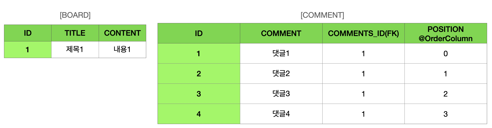

# 컬렉션과 부가 기눙

**이 글은 자바 ORM 표준 JPA 프로그래밍 을 참고해서 쓴 글입니다.**

JPA가 지원하는 컬렉션의 종류와 중요한 부가 기능에 대해 알아보자. 이 장에서 다룰 내용은 다음과 같다.

- 컬렉션: 다양한 컬렉션과 특징을 설명한다.
- 컨버터: 엔티티의 데이터를 변환해서 데이터베이스에 저장한다.
- 리스너: 엔티티에서 발생한 이벤트를 처리한다.
- 엔티티 그래프: 엔티티를 조회할 때 연관된 엔티티들을 선택해서 함께 조회한다.

## 14.1 컬렉션

JPA는 자바에서 기본으로 제공하는 Collection, List, Set, Map 컬렉션을 지원하고 다음 경우에 이 컬렉션을 사용할 수 있다. 그리고 이 컬렉션은 그림 14.1과 같은 구조를 가진다.

- @OneToMany, @ManyToMany를 사용해서 일대다나 다대다 엔티티 관계를 매핑할 때
- @ElementCollection을 사용해서 값 타입을 하나 이상 보관할 때

 그림 14.1 자바 컬렉션 구조

자바 컬렉션 인터페이스의 특징은 다음과 같다.

- Collection: 자바가 제공하는 최상위 컬렉션이다. 하이버네이트는 중복을 허용하고 순서를 보장하지 않는다고 가정한다.
- Set: 중복을 허용하지 않는 컬렉션이다. 순서를 보장하지 않는다.
- List: 순서가 있는 컬렉션이다. 순서를 보장하고 중복을 허용한다.
- Map: Key, Value 구조로 되어 있는 특수한 컬렉션이다.

JPA 명세에는 자바 컬렉션 인터페이스에 대한 특별한 언급이 없다. 따라서 JPA구현체에 따라서 제공하는 기능이 조금씩 다를 수 있다. 여기서는 하이버네이트 구현체를 기준으로 이야기하겠다.

_Map은 복잡한 매핑에 비해 활용도가 떨어지고 다른 컬렉션을 사용해도 충분하므로 생략했다. 참고로 Map는 @MapKey* 어노테이션으로 매핑할 수 있다,_

### 14.1.1 JPA와 컬렉션

하이버네이트는 엔티티를 영속 상태로 만들 때 컬렉션 필드를 하이버네이트에서 준비한 컬렉션으로 감싸서 사용한다.

```java
@Entity
public class Team {

    @Id
    private String id;

    @OneToMany
    @JoinColumn
    private Collection<Member> members = new ArrayList<Member>();
}
```

위 코드의 Team은 members 컬렉션을 필드로 가지고 있다. 다음 코드로 Team을 영속 상태로 만들어보자

```java
Team team = new Team();
System.out.println("before persist = " + team.getMembers().getClass());
em.persist(team);
System.out.println("after persist = " + team.getMembers().getClass());

// before persist = class java.util.ArrayList
// after persist = class org.hibernate.collection.internal.PersistentBag
```

출력 결과를 보면 원래 ArrayList 타입이었던 컬렉션이 엔티티를 영속 상태로 만든 직후에 하이버네이트가 제공하는 PersistentBag 타입으로 변경되었다. 하이버네이트는 컬렉션을 효율적으로 관리하기 위해 엔티티를 영속 상태로 만들 때 원본 컬렉션을 감싸고 있는 내장 컬렉션을 생성해서 이 내장 컬렉션을 사용하도록 참졸르 변경한다. 하이버네이트가 제공하는 내장 컬렉션은 원본 컬렉션을 감싸고 있어서 래퍼 컬렉션으로도 부른다.

하이버네이트는 이런 특징 때문에 컬렉션을 사용할 때 다음처럼 즉시 초기화해서 사용하는 것을 권장한다.

```java
Collection<Member> members = new ArrayList<Member>();
```

다음 코드를 통해 인터페이스에 따라 어떤 래퍼 컬렉션이 사용되는지 확인해보자

```java
// org.hibernate.collection.internal.PersistentBag
@OneToMany
Collection<Member> collection = new ArrayList<Member>();

// org.hibernate.collection.internal.Persistentag
@OneToMany
List<Member> list = new ArrayList<Member>();

// org.hibernate.collection.internal.PersistentSet
Set<Member> set = new HashSet<Member>();

// org.hibernate.collection.internal.PersistentList
@OneToMany @OrderColumn
List<Member> orderColumnList = new ArrayList<Member>();
```

|컬렉션 인터페이스|내장 컬렉션|중복 허용|순서 보관|
|---|---|---|---|
|Collection, List|PersistenceBag|O|X|
|Set|PersistenceSet|X|X|
|List + @OrderColumn|PersistentList|O|O|

### 14.1.2 Collection, List

Collection. List 인터페이스는 중복을 허용하는 컬렉션이고 PersistentBag을 래퍼 컬렉션으로 사용한다. 이 인터페이스는 ArrayList로 초기화하면 된다.

```java
@Entity
public class Parent {

    @Id @GeneratedValue
    private Long id;

    @OneToMany
    @JoinColumn
    private Collection<CollectionChild> collection 
        = new ArrayList<CollectionChild>();
    
    @OneToMany
    @JoinColumn
    private List<ListChild> list = new ArrayList<ListChild>();
}
```

Collection, List는 중복을 허용한다고 가정하므로 객체를 추가하는 add() 메소드는 내부에서 어떤 비교도 하지 않고 항상 true를 반환한다. 같은 엔티티가 있는지 찾거나 삭제할 때는 equals() 메소드를 사용한다.

```java
List<Comment> comments = new ArrayList<Comment>();

// 단순히 추가만 한다. 결과는 항상 true 다
boolean result = comments.add(data);

comments.contains(comment); // equals 비교
comments.remove(comment); // equals 비교
```

Collection. List는 엔티티를 추가할 때 중복된 엔티티가 있는지 비교하지 않고 단순히 저장만 하면 된다. 따라서 엔티티를 추가해도 지연 로딩된 컬렉션을 초기화하지 않는다.

### 14.1.3 Set

Set은 중복을 허용하지 않은 컬렉션이다. 하이버네이트는 PersistentSet을 컬렉션 래퍼로 사용한다. 이 인터페이스는 HashSet으로 초기화하면 된다.

```java
@Entity
public class Parent {

    @OneToMany
    @JoinColumn
    private Set<SetChild> set = new HashSet<SetChild>();
}
```

HashSet은 중복을 허용하지 않으므로 add() 메소드로 객체를 추가할 때 마다 equals() 메소드로 같은 객체가 있는지 비교한다. 같은 객체가 없으면 객체를 추가하고 true를 반환하고, 같은 객체가 이미 있어서 추가에 실패하면 false를 반환한다. 참고로 HashSet은 해시 알고리즘을 사용하므로 hashcode()도 함께 사용해서 비교한다.

```java
Set<comment> comments = new HashSet<Comment>();

boolean result = comments.add(data); // hashcode + equals 비교
comments.contains(comment); // hashcode + equals 비교
comments.remove(comment); // hashcode + equals 비교
```

Set은 엔티티를 추가할 때 중복된 엔티티가 있는지 비교해야 한다. 따라서 엔티티를 추가할 때 지연 로딩된 컬렉션을 초기화한다.

### 14.1.4 List + @OrderColumn

다음 코드와 같이 List 인터페이스에 @OrderColumn을 추가하면 순서가 있는 특수한 컬렉션으로 인식한다. 순서가 있다는 의미는 데이터베이스에 순서 값을 저장해서 조회할 때 사용한다는 의미다. 하이버네이트는 내부 컬렉션인 PersistentList를 사용한다.

```java
@Entity
public class Board {

    @Id @GeneratedValue
    private Long id;

    private String title;
    private String content;

    @OneToMany(mappedBy = "board")
    @OrderColumn(name = "POSITION")
    private List<Comment> comments = new ArrayList<Comment>();
}

@Entity
public class Comment {

    @Id @GeneratedValue
    private Long id;

    private String comment;

    @ManyToOne
    @JoinColumn(name = "BOARD_ID")
    private Board board;
}
```

Board.comments에 List 인터페이스를 사용하고 @OrderColumn을 추가했다. 따라서 Board.comments는 순서가 있는 컬렉션으로 인식된다.

자바가 제공하는 List 컬렉션은 내부에 위치 값을 가지고 있다. 따라서 다음 코드처럼 List의 위치 값을 활용할 수 있다.

```java
list.add(1, data1); // 1번 위치에 data1을 저장하라
list.get(10); // 10번 위치에 있는 값을 조회하라.
```

순서가 있는 컬렉션은 데이터베이스에 순서 값도 함께 관리한다. 여기서는 @OrderColumn의 name 속성에 POSITION이라는 값을 주었다. JPA는 List의 위치 값을 테이블의 POSITION 컬럼에 보관한다. 그런데 Board.comments 컬렉션은 Board 엔티티에 있지만 테이블의 일대다 관계의 특성상 위치 값은 다(N) 쪽에 저장해야 한다. 따라서 실제 POSITION 컬럼은 COMMENT 테이블에 매핑된다.

 그림 14.2 @OrderColumn Table

---

다음 코드를 통해 @OrderColumn을 사용하는 예를 보자

```java
Board board = new Baord("제목1", "내용1");
em.persist(board);

Comment comment1 = new Comment("댓글1");
comment1.setBoard(board);
board.getComments().add(comment1); // POSITION 0
em.persist(comment1);

Comment comment2 = new Comment("댓글2");
comment2.setBoard(board);
board.getComments().add(comment2); // POSITION 1
em.persist(comment2);

Comment comment3 = new Comment("댓글3");
comment3.setBoard(board);
board.getComments().add(comment3); // POSITION 2
em.persist(comment3);

Comment comment4 = new Comment("댓글4");
comment4.setBoard(board);
board.getComments().add(comment4); // POSITION 3
em.persist(comment4);
```

@OrderColumn을 사용해서 List의 위치 값을 보관하면 편리할 것 같지만 다음에서 설명하는 것처럼 실무에서 사용하기에는 단점이 많다. 따라서 @OrderColumn을 매핑하지 말고 개발자가 직접 POSITION 값을 관리하거나 다음에 설명하는 @OrderBy를 사용하길 권장한다.

@OrderColumn은 다음과 같은 단점들 때문에 실무에서 잘 사용하지 않는다.

- @OrderColumndmf Board 엔티티에서 매핑하므로 Comment는 POSITION의 값을 알 수 없다. 그래서 Comment 를 INSERT할 때는 POSITION 값이 저장되지 않는다. POSITION은 Board.comments의 위치 값이므로, 이 값을 사용해서 POSITION의 값을 UPDATE 하는 SQL이 추가로 발생한다.
- List를 변경하면 연관된 많은 위치 값을 변경해야 한다. 예를 들어 그림 14.2에서 댓글2를 삭제하면 댓글3, 댓글4의 POSITION 값을 각각 하나씩 줄이는 UPDATE SQL이 2번 추가로 실행된다.
- 중간에 POSITION 값이 없으면 조회한 List에는 null이 보관된다. 예를 들어 댓글2를 데이터에비스에서 강제로 삭제하고 다른 댓글들의 POSITION 값을 수정하지 않으면 데이터베이스의 POSITION 값은 [0,2,3]이 되어서 중간에 1 값이 없다. 이 경우 List를 조회하면 1번 위치에 null 값이 보관된다. 따라서 컬렉션을 순회할 때 NullPointerException이 발생한다.

### 14.1.5 @OrderBy

@OrderColumn이 데이터베이스에 순서용 컬럼을 매핑해서 관리했다면 @OrderBy는 데이터베이스의 ORDER BY절을 사용해서 컬렉션을 정렬한다. 따라서 순서용 컬럼을 매핑하지 않아도 된다. 그리고 @OrderBy는 모든 컬렉션에 사용할 수 있다. 다음 코드를 보자

```java
@Entity
public class Team {

    @Id @GeneratedValue
    private Long id;
    private String name;

    @OneToMany(mappedBy = "team")
    @OrderBy("username desc, id asc")
    private Set<Member> members = new HashSet<Member>();
}

@Entity
public class Member {

    @Id @GeneratedValue
    private Long id;

    @Column(name = "MEMBER_NAME")
    private String username;

    @ManyToOne
    private Team team;
}
```

Team.members를 보면 @OrderBy를 적용했다. 그리고 @OrderBy의 값으로 username desc, id asc를 사용해서 Member의 username 필드로 내림차순 정렬하고 id로 오름차순 정렬했다. @OrderBy의 값은 JPQL의 order by절 처럼 엔티티의 필드를 대상으로 한다.

```java
Team findteam = em.find(Team.class, team.getId());
findTeam.getMembers().size(); // 초기화
/* 다음과 같은 쿼리가 실행된다.
SELECT *
FROM
    MEMBER M
WHERE
    M.TEAM_ID=?
ORDER BY
    M.MEMBER_NAME DESC,
    M.ID ASC
*/
```

_하이버네이트는 Set에 @OrderBy를 적용해서 결과를 조회하면 순서를 유지하기 위해 HashSet대신에 LinkedHashSet을 내부에서 사용한다._

## 14.2 @Converter

컨버터(converter)를 사용하면 엔티티의 데이터를 변환해서 데이터베이스에 저장할 수 있다.

예를 들어 회원의 VIP 여부를 자바의 boolean 타입을 사용하고 싶다고 하자. JPA를 사용하면 자바의 boolean 타입은 방언에 따라 다르지만 데이터베이스에 저장될 때 0 또는 1인 숫자로 저장된다. 그런데 데이터베이스에 숫자 대신 문자 Y 또는 N 으로 저장하고 싶다면 컨버터를 사용하면 된다.

```sql
CREATE TABLE MEMBER (
    ID VARCHAR(255) NOT NULL,
    USERNAME VARCHAR(255),
    VIP VARCHAR(1) NOT NULL,
    PRIMARY KEY (ID)
)
```

```java
@Entity
public class Member {

    @Id
    private String id;
    private String username;

    @Convert(converter=BooleanToYNConverter.class)
    private boolean vip;
}
```

위 코드에 회원 엔티티의 vip 필드는 boolean 타입이다. @Convert를 적용해서 데이터베이스에 저장되기 직전에 BooleanToYNConberter 컨버터가 동작하도록 했다.

```java
@Converter
public class BooleanToYNConberter implements AttributeConverter<Boolean, String> {

    @Override
    public String convertToDatabaseColumn(Boolean attribute) {
        return (attribute != null && attribute) ? "Y" : "N";
    }

    @Override
    public Boolean convertToEntityAttribute(String dbData) {
        return "Y".equals(dbData);
    }
}
```

컨버터 클래스는 @Conberter 어노테이션을 사용하고 AttributeConverter 인터페이스를 구현해야 한다. 그리고 제네릭에 현재 타입과 변환할 타입을 지정해야 한다. 여기서는 <Boolean, String>을 지정해서 Boolean 타입을 String 타입으로 변환한다.

```java
public interface AttributeConverter<X,Y> {
    
    public Y convertToDatabaseColumn(X attribute);
    public X convertToEntityAttribute(Y dbData);
}
```

위 코드의 AttributeConverter 인터페이스에는 구현해야 할 다음 두 메소드가 있다.

- convertToDatabaseColumn(): 엔티티의 데이터를 데이터베이스 컬럼에 저장할 데이터로 변환한다. 이전 예제에서는 true 면 Y를 false면 N을 반환하도록 했다.
- convertToEntityAttribute(): 데이터베이스에서 조회한 컬럼 데이터를 엔티티의 데이터로 변환한다. 이전 예제에서는 문자 Y면 true를 아니면 false를 반환하도록 했다.

이제 회원 엔티티를 저장하면 데이터베이스의 VIP 컬럼에는 Y 또는 N이 저장된다.

컨버터는 다음 코드와 같이 클래스 레벨에도 설정할 수 있다. 단 이때는 attributeName속성을 사용해서 어떤 필드에 컨버터를 적용할지 명시해야 한다.

```java
@Entity
@Convert(conberter=BooleanToYNConverter.class, attributeName = "vip")
public class Member {}
```

### 14.2.1 글로벌 설정

모든 Boolean 타입에 컨버터를 적용하려면 다음 코드와 같이 @Converter(autoApply = true) 옵션을 적용하면 된다.

```java
@Converter(autoAppley = true)
public class BooleanToYNConberter implements AttributeConverter<Boolean, String> {}
```

이렇게 글로벌 설정을 하면 @Convert를 지정하지 않아도 모든 Boolean 타입에 대해 자동으로 컨버터가 적용된다.

|속성|기능|기본값|
|---|---|---|
|converter|사용할 컨버터를 지정한다.||
|attributeName|컨버터를 적용할 필드를 지정한다.||
|disableConversion|글로벌 컨버터나 상속 받은 컨버터를 사용하지 않는다.|false|

[컨버터에 대한 더 상세한 사용법](http://docs.oracle.com/javaee/7/api/index.html?persistence/Convert.html)

## 14.3 리스너

모든 엔티티를 대상으로 언제 어떤 사용자가 삭제를 요청했는지 모두 로그로 남겨야 하는 요구사항이 있다고 가정하자. 이때 어플리케이션 삭제 로직을 하나씩 찾아서 로그를 남기는 것은 비효율적이다. JPA 리스너 기능을 사용하면 엔티티의 생명주기에 따른 이벤트를 처리할 수 있다.

### 14.3.1 이벤ㅌ트 종류

이벤트의 종류와 발생 시점은 다음과 같다.

 그림 14.3 리스너 시점

---

1. PostLoad: 엔티티가 영속성 컨텍스트에 조화된 직후 또는 refresh를 호출한 후 (2차 캐시에 저장되어 있어도 호출된다.)
2. PrePersist: persist() 메소드를 호출해서 엔티티를 영속성 컨텍스트에 관리하기 직전에 호출된다. 식별자 생성 전략을 사용한 경우 엔티티에 식별자는 아직 존재하지 않는다. 사로운 인스턴스를 merge할 때도 수행된다.
3. PreUpdate: flush나 commit을 호출해서 엔티티를 데이터베이스에 수정하기 직전에 호출된다.
4. PreRemove: remove() 메소드를 호출해서 엔티티를 영속성 컨텍스트에서 삭제하기 직전에 호출된다. 또한 삭제 명령어로 영속성 전이가 일어날 대도 호출된다. orphanRemoval에 대해서는 flushsk commit 시에 호출된다.
5. PostPersist: flush나 commit을 호출해서 엔티티를 데이터베이스에 저장한 직후에 호출된다. 식별자가 항상 존재한다. 참고로 식별자 생성 전략이 IDENTITY면 식별자를 생성하기 위해 persist()를 호출하면서 데이터베이스에 해당 엔티티를 저장하므로 이때는 persist()를 호출한 직후에 바로 PostPersist가 호출된다.
6. PostUpdate: flush나 commit을 호출해서 엔티티를 데이터베이스에 수정한 직후에 호출된다.
7. PostRemove: flush나 commit을 호출해서 엔티티를 데이터베이스에 삭제한 직후에 호출된다.

### 14.3.2 이벤트 적용 위치

이벤트는 엔티티에서 직접 받거나 별도의 리스너를 등록해서 받을 수 있다.

- 엔티티에 직접 적용
- 별도의 리스너 등록
- 기본 리스너 사용

다음 예제는 이벤트를 엔티티에 직접 사용하는 예다.

```java
@Entity
public class Duck {

    @Id @GeneratedValue
    public Long id;

    private String name;

    @PrePersist
    public void prePersist() {
        System.out.println("Duck.prePersist id=" + id);
    }

    @PostPersist
    public void postPersist() {
        System.out.println("Duck.postPersist id=" + id);
    }

    @PostLoad
    public void postLoad() {
        System.out.println("Duck.postLoad");
    }

    @PrePremove
    public void preRemove() {
        System.out.println("Duck.preRemove");
    }

    @PostRemove
    public void postRemove() {
        System.out.println("Duck.postRemove");
    }
}
```

엔티티에 이벤트가 발생할 때마다 어노테이션으로 지정한 메소드가 실행된다. 예를 들어 엔티티를 저장하면 다음과 같이 출력된다.

```text
Duck.prePersist id=null (아이디가 생성되기 전에 호출된다.)
Duck.postPersist id=1 (아이디가 생성된 후에 호출된다.)
```

이렇게 엔티티에서 이벤트를 직접 받을 수도 있지만 이벤트를 처리할 별도의 리스너를 등록하는 방법도 있다.

별도의 리스너를 사용하는 예이다.

```java
@Entity
@EntityListeners(DuckListener.class)
public class Duck {}

public class DuckListener {

    @PrePersist
    //특정 타입이 확실하면 특정 타입을 받을 수 있다.
    private void prePersist(Object obj) {
        System.out.println("DuckListener.prePersist obj = [" + obj + "]");
    }

    @PostPersist
    //특정 타입이 확실하면 특정 타입을 받을 수 있다.
    private void postPersist(Object obj) {
        System.out.println("DuckListener.postPersist obj = [" + obj + "]");
    }
}
```

리스너는 대상 엔티티를 파라미터로 받을 수 있다. 반환 타입은 void로 설정해야 한다.

모든 엔티티의 이벤트를 처리하려면 다음 코드와 같이 META_INF/orm.xml에 기본 리스너로 등록하면 된다.

```xml
<?xml version="1.0" encoding="UTF-8"?>
<entity-mappiongs ...>
    <persistence-unit-metadata>
        <persistence-unit-defaults>
            <entity-listeners>
                <entity-listener class="jpabook.jpashop.domain.test.listener.DefaultListener">
            </entity-listeners>
        </persistence-unit-defaults>
    </persistence-unit-metadata>
</entity-mappgings>
```

여러 리스너를 등록했을 때 이벤트 호출 순서는 다음과 같다.

1. 기본 리스너
2. 부모 클래스 리스너
3. 리스너
4. 엔티티

더 세밀한 설정을 위한 어노테이션도 있다.

- javax.persistence.ExcludeDefaultListeners: 기본 리스너 무시
- java.persistence.ExcludeSuperclassListeners: 상위 클래스 이벤트 리스너 무시

```java
@Entity
@EntityListeners(DuckListener.class)
@ExcludeDefaultListeners
@ExcludeSuperclassListeners
public class Duck extends BaseEntity {
}
```

이벤트를 잘 활용하면 대부분의 엔티티에 공통으로 적용하는 등록 일자, 수정 일자 처리와 해당 엔티티를 누가 등록하고 수정했는지에 대한 기록을 리스너 하나로 처리할 수 있다.

## 14.4 엔티티 그래프

엔티티를 조회할 때 연관된 엔티티들을 함께 조회하려면 글로벌 fetch옵션을 FetchType.EAGER로 설정한다.

또는 다음처럼 JPQL에서 페치 조인을 사용하면 된다.

```sql
SELECT * FROM Order o JOIN FETCH o.member
```

글로벌 fetch 옵션은 애플리케이션 전체에 영향을 주고 변경할 수 없는 단점이 있다. 그래서 일반적으로 글로벌 fetch 옵션은 FetchType.LAZY를 사용하고, 엔티티를 조회할 때 연관된 엔티티를 함께 조회할 필요가 있으면 JPQL의 페치 조인을 사용한다.

그런데 페치 조인을 사용하면 같은 JPQL을 중복해서 작성하는 경우가 많다. 예를 들어 주문 상태를 검색조건으로 주문 엔티티를 조회하는 JPQL을 작성해보자

```sql
SELECT o FROM Order o WHERE o.status = ?
```

주문과 회원을 함꼐 조회할 필요가 있어서 다음 JPQL을 새로 추가했다.

```sql
SELECT o FROM Order o JOIN FETCH o.member WHERE o.status = ?
```

주문과 주문상품을 함께 조회하는 기능이 필요해서 다음 JPQL을 새로 추가했다.

```sql
SELECT o FROM Order o JOIN FETCH o.orderItems WHERE o.status = ?
```

3가지 JPQL 모두 주문을 조회하는 같은 JPQL이지만 함께 조회할 엔티티에 따라서 다른 JPQL을 사용해야 한다. 이것은 JPQL이 데이터를 조회하는 기능뿐만 아니라 연관된 엔티티를 함께 조회하는 기능도 제공하기 때문인데, 결국 JPQL이 두 가지 역할을 모두 수행해서 발생하는 문제다.

JPA 2.1에 추가된 엔티티 그래프 기능을 사용하면 엔티티를 조회하는 시점에 함께 조회할 연관된 엔티티를 선택할 수 있다. 따라서 JPQL은 데이털르 조회하는 기능만 수행하면 되고 연괸된 엔티티를 함께 조회하는 기능은 엔티티 그래프를 사용하면 된다. 그러므로 엔티티 그래프 기능을 적용하면 다음 JPQL만 사용하면 된다.

```sql
SELECT o FROM Order o WHERE o.status = ?
```

엔티티 그래프 기능은 엔티티 조회시점에 연관된 엔티티들을 함께 조회하는 기능이다. 엔티티 그래프는 정적으로 정의하는 Named 엔티티 그래프와 동적으로 정의하는 엔티티 그래프가 있다. 먼저 Named 엔티티 그래프를 알아보자

### 14.4.1 Named 엔티티 그래츠

다음 예제를 통해 주문을 조회할 때 연관된 회원도 함께 조회하는 엔티티 그래프를 사용해보자.

```java
@NamedEntityGraph(name = "Order.withMember", attributeNodes = {
    @NamedAttributeNode("member")
})
@Entity
@Table(name = "ORDERS")
public class Order {
    
    @Id @GeneratedValue
    @Column(name = "ORDER_ID")
    private Long id;

    @ManyToOne(fetch = FetchType.LAZY, optional = false)
    @JoinColumn(name = "MEMBER_ID")
    private Member member;
}
```

Named 엔티티 그래프는 @NamedEntityGraph로 정의한다.

- name: 엔티티 그래프의 이름을 정의한다.
- attributeNodes 함께 조회할 속성 선택한다. 이때 @NamedAttributeNode를 사용하고 그 값으로 함께 조회할 속성을 선택하면 된다.

Order.member가 지연 로딩으로 설정되어 있지만, 엔티티 그래프에서 함께 조회할 속성으로 member를 선택했으므로 이 엔티티 그래프를 사용하면 Order를 조회할 때 연관된 member도 함께 조회할 수 있다.

참고로 둘 이상 정의하려면 @NamedEntityGraphs를 사용하면 된다.

### 14.4.2 em.find()에서 엔티티 그래프 사용

다음 예제를 통해 엔티티 그래프를 사용하는 코드를 보자

```java
EntityGraph graph = em.getEntityGraph("Order.withMember");

Map hints = new HashMap();
hints.put("javax.persistence.fetchgraph", graph);

Order order = em.find(Order.class, orderId, hints);
```

Named 엔티티 그래프를 사용하려면 정의한 엔티티 그래프를 em.getEntityGraph("Order.withMember")를 통해서 찾아오면 된다. 엔티티 그래프는 JPA의 힌트 기능을 사용해서 동작하는 힌트의 키로 javax.persistence.fetchgraph를 사용하고 힌트의 값으로 찾아온 엔티티 그래프를 사용하면 된다.

em.find(Order.class, orderId, hints)로 Order 엔티티를 조회할 때 힌트 정보도 포함했다. 다음 예제에서 실행된 SQL을 보면 적용한 Order.withMember 엔티티 그래프를 사용해서 Order와 Member를 함께 조회한다.

```java
SELECT o.*, m.* FROM Orders o INERR JOIN Member m ON. o.MEMBER_ID = m.MEMBER_ID WHERE o.ORDER_ID=?
```

### 14.4.3 subgraph

이번에는 Order -> OrderItem -> Item까지 함께 조회해보자. Order -> OrderItem은 Order가 관리하는 필드지만 OrderItem -> Item은 Order가 관리하는 필드가 아니다. 이때는 다음 코드처럼 subgraph를 사용하면 된다.

```java
@NamedEntityGraph(name="Order.withAll", attributeNodes = {
    @NamedAttributeNode("member"),
    @NamedAttributeNode(value = "orderItems", subgraph = "orderItems")
},
subgraphs = @NamedSubgraph(name="orderItems", attributeNodes = {
    @NamedAttributeNode("item")
}))
@Entity
@Table(name = "ORDERS")
public class Order {

    @Id @GeneratedValue
    @Column(name = "ORDER_ID")
    private Long id;

    @ManyToOne(fetch = FetchType.LAZY, optional = false)
    @JoinColumn(name = "MEMBER_ID")
    private Member member;

    @OneToMany(mappedBy = "order", cascade = CascadeType.ALL)
    private List<OrderItem> orderItems = new ArrayList<OrderItem>();
}

@Entity
@Table(name = "ORDER_ITEM")
public class OrderItem {

    @Id @GeneratedValue
    @Column(name = "ORDER_ITEM_ID")
    private Long id;

    @ManyToOne(fetch = FetchType.LAZY)
    @JoinColumn(name = "ITEM_ID")
    private Item item;
}
```

Order.withAll 이라는 Named 엔티티 그래프를 정의했다. 이 엔티티 그래프는 Order -> Member, Order -> OrderItem, OrderItem -> Item의 객체 그래프를 함께 조회한다.

이때 OrderItem -> Item은 Order의 객체 그래프가 아니므로 subgraphs 속성으로 정의해야 한다. 이 속성은 @NamedSubgraph를 사용해서 서브 그래프를 정의한다. 여기서는 orderItems라는 이름의 서브 그래프가 item을 함께 조회하도록 정의했다. 사용 하는 코드를 보자.

```java
Map hints = new HashMap();
hints.put("javax.persistence.fetchgraph", em.getEntityGraph("Order.withAll"));

Order order = em.find(Order.class, orderId, hints);
```

Order.withAll이라는 Named 엔티티 그래프를 사용해서 Order 엔티티를 조회했다. 실행된 SQL을 보면 엔티티 그래프에서 지정한 엔티티들을 함께 조회한다.

```sql
SELECT o.*, m.*, oi.*, i.* FROM Orders o INNER JOIN Member m ON o.MEMBER_ID=m.MEMBER_ID LEFT OUTER JOIN Order_item oi ON o.ORDER_ID=oi.ORDER_ID LEFT OUTER JOIN Item i ON oi.ITEM_ID=i.ITEM_ID WHERE o.ORDER_ID=?
```

### 14.4.4 JPQL에서 엔티티 그래프 사용

JPQL에서 엔티티 그래프를 사용하는 방법은 em.find()와 동잉하게 힌트만 추가하면 된다.

```java
List<Order> resultList = em.createQuery("SELECT o FROM Order o WHERE o.id = :orderId", Order.class).setParameter("orderId", orderId).setHint("javax.persistence.fetchgraph", em.getEntityGraph("Order.withAll")).getResultList();
```

실행된 SQL을 보면 연관된 엔티티를 함께 조회한다.

```sql
SELECT o.*, m.*, oi.*, i.* FROM Orders o LEFT OUTER JOIN Member m ON o.MEMBER_ID=m.MEMBER_ID LEFT OUTER JOIN Order_item oi ON o.ORDER_ID=oi.ORDER_ID LEFT OUTER JOIN Item i ON oi.ITEM_ID=i.ITEM_ID WHERE o.ORDER_ID=?
```

_em.find()에서 엔티티 그래프를 사용하면 하이버네이트는 필수 관계를 고려해서 SQL 내부 조인을 사용하지만 JPQL에서 엔티티 그래프를 사용할때는 항상 SQL 외부 조인을 사용한다. 만약 SQL 내부 조인을 사용하려면 내부 조인("SELECT O FROM Order o JOIN FETCH o.MEMBER WHERE o.id = :orderId")을 명시해야 한다._

### 14.4.5 동적 엔티티 그래프

엔티티 그래프를 동적으로 구성하려면 createEntityGraph() 메소드를 사용하면 된다.

```java
public <T EntityGraph<T> createEntityGraph(Class<T> rootType);
```

```java
EntityGraph<Order> graph = em.createEntityGraph(Order.class);
graph.addAttributeNodes("member");

Map hints = new HashMap();
hints.put("javax.persistence.fetchgraph", graph);
Order order = em.find(Order.class, orderId, hints);
```

위 코드는 em.createEntityGraph(Order.class)를 사용해서 동적으로 엔티티 그래프를 만들었다. 그리고 graph.addAttributeNodes("member")를 사용해서 Order.member 속성을 엔티티 그래프에 포함했다. 다음 코드는 subgraph 기능을 동적으로 구성해보자.

```java
EntityGraph<Order> graph = em.createEntityGraph(Order.class);
graph.addAttributeNodes("member");
Subgraph<OrderItem> orderItems = graph.addSubgraph("orderItems");
orderItems.addAttributeNodes("item");

Map hints = new HashMap();
hints.put("javax.persistence.fetchgraph", graph);
Order order = em.find(Order.class, orderId, hints);
```

graph.addSubgraph("orderItems") 메소드를 사용해서 서브 그래프를 만들었고, 이 서브 그래프가 item 속성을 포함하도록 했다.

### 14.4.6 엔티티 그래프 정리

지금까지 엔티티 그래프를 알아보았다. 엔티티 그래프를 정리해보자.

- ROOT에서 시작

    엔티티 그래프는 항상 조회하는 엔티티의 ROOT에서 시작해야 한다. 당연한 이야기지만 Order 엔티티를 조회하는데 Member부터 시작하는 엔티티 그래프를 사용하면 안된다.

- 이미 로딩된 에닡티

    다음처럼 영속성 컨텍스트에 해당 엔티티가 이미 로딩되어 있으면 엔티티 그래프가 적용되지 않는다. (아직 초기화되지 않은 프록시에는 엔티티 그래프가 적용된다.)

    ```java
    Order order1 = em.find(Order.class, orderId); // 이미 조회
    hints.put("javax.persistence.fetchgraph", em.getEntityGraph("Order.withMember"));
    Order order2 = em.find(Order.class, orderId, hints);
    ```

    이 경우 조회된 order2에는 엔티티 그래프가 적용되지 않고 처음 조회한 order1과 같은 인스턴스가 반환된다.

- fetchgraph, loadgraph의 차이

    예제에서는 javax.persistence.fetchgraph 힌트를 사용해서 엔티티 그래프를 조회했다. 이것은 엔티티 그래프에 선택한 속성만 함께 조회한다. 반면에 javax.persistence.loadhgraph 속성은 엔티티 그래프에 선택한 속성뿐만 아니라 글로벌 fetch 모드가 FetchType.EAGER로 설정된 연관관계도 포함해서 함꼐 조회한다.

    _하이버네이트 4.3.10.Final 버전에서는 loadgraph 기능이 em.find()를 사용할 때는 정상 동작하지만 JPQL을 사용할 때는 정상 동작하지 않고 fetchgraph와 같은 방식으로 동작한다._

## 14.5 정리

이번 장에서 학습한 내용은 다음과 같다.

- JPA가 지원하는 컬렉션의 종류와 특징들을 알아보았다
- 컨버터를 사용하면 엔티티의 데이터를 변환해서 데이터베이스에 저장할 수 있다.
- 리스너를 사용하면 엔티티에서 발생한 이벤트를 받아서 처리할 수 있다.
- 페치 조인은 객체지향 쿼리를 사용해야 하지만 엔티티 그래프를 사용하면 객체 지향 쿼리를 사용하지 않아도 원하는 객체 그래프를 한 번에 조회할 수 있다.
