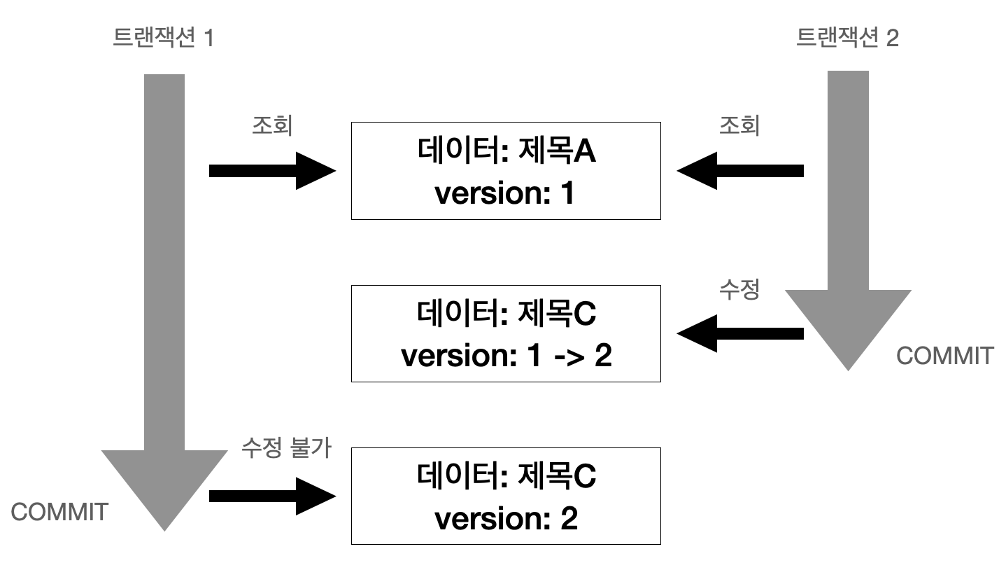
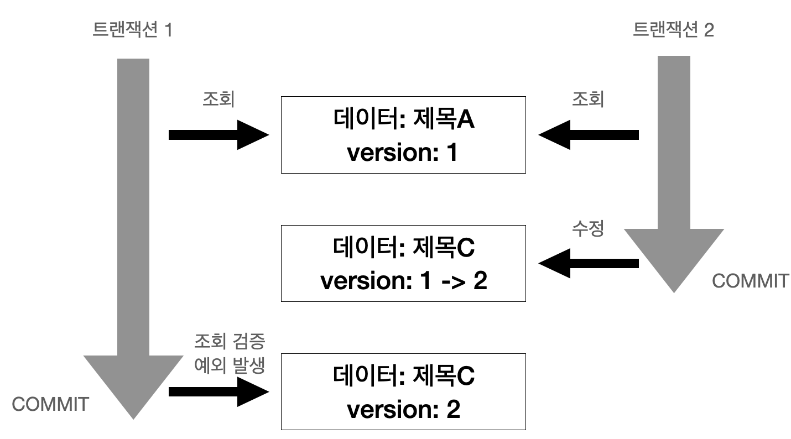
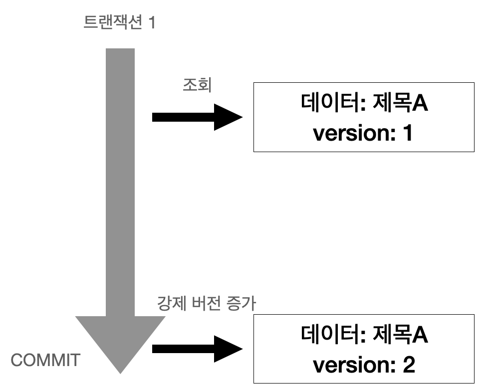
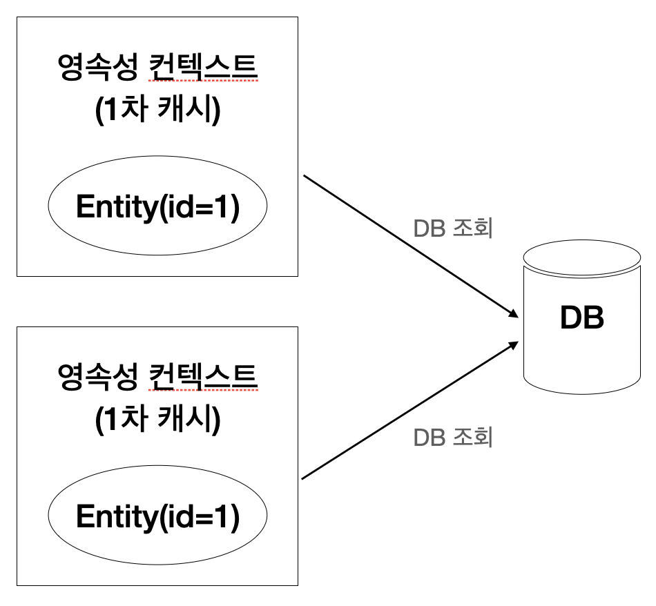
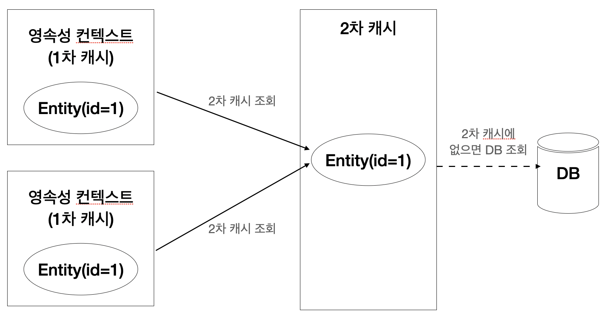
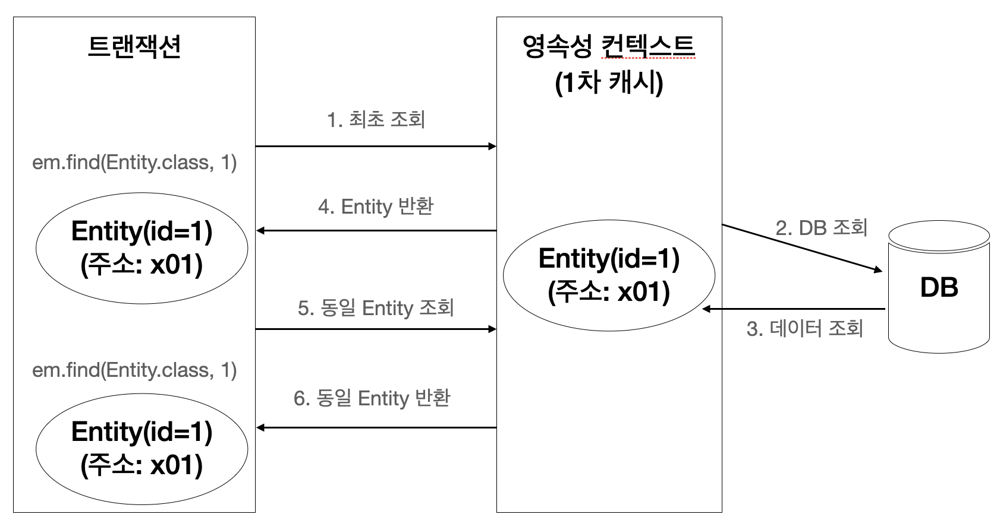
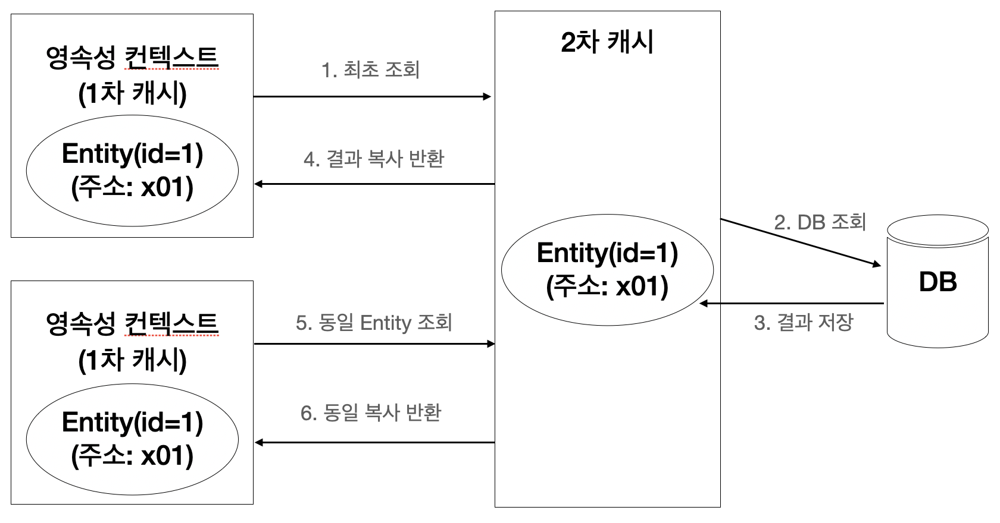

# 16. 트랜잭션과 락, 2차 캐시

**이 글은 자바 ORM 표준 JPA 프로그래밍 을 참고해서 쓴 글입니다.**

- 트랜잭션과 락: JPA가 제공하는 트랜잭션과 락 기능을 다룬다.
- 2차 캐시: JPA가 제공하는 애플리케이션 범위의 캐시를 다룬다.

## 16.1 트랜잭션과 락

트랜잭션 기초와 JPA가 제공하는 낙관적 락과 비관적 락에 대해 알아보자.

### 16.1.1 트랜잭션과 격리 수준

트랜잭션은 ACID 라 하는 원자성(Atomicity), 일관성(Consistency), 격리성(Isolation), 지속성(Durability)을 보장해야 한다.

- 원자성: 트랜잭션 내에서 실행한 작업들은 마치 하나의 작업인 것처럼 모두 성공하든가 모두 실패해야 한다.
- 일관성: 모든 트랜잭션은 일관성 있는 데이터베이스 상태를 유지해야 한다. 예를 들어 데이터베이스에서 정한 무결성 제약 조건을 항상 만족해야 한다.
- 격리성: 동시에 실행되는 트랜잭션들이 서로에게 영향을 미치지 않도록 격리한다. 예를 들어 동시에 같은 데이터를 수정하지 못하도록 해야 한다. 격리성은 동시성과 관련된 성능 이슈로 인해 격리 수준을 선택할 수 있다.
- 지속성: 트랜잭션을 성공적으로 끝내면 그 결과가 항상 기록되어야 한다. 중간에 시스템에 문제가 발생해도 데이터베이스 로그 등을 사용해서 성공한 트랜잭션 내용을 복구해야 한다.

트랜잭션은 원자성, 일관성, 격리성, 지속성을 보장한다. 문제는 격리성인데 트랜잭션 간에 격리성을 완벽히 보장하려면 트랜잭션을 거의 차례대로 실행해야 한다. 이렇게 하면 동시성 처리 성능이 매우 나빠진다. 이런 문제로 인해 ANSI 표준은 트랜잭션의 격리 수준을 4단계로 나누어 정의했다.

트랜잭션 격리 수준은 다음과 같다.

- READ UNCOMMITTED (커밋되지 않은 읽기)
- READ COMMITTED (커밋된 읽기)
- REPEATABLE READ (반복 가능한 읽기)
- SERIALIZABLE (직렬화 가능)

순서대로 READ UNCOMMITTED의 격리 수준이 가장 낮고 SERIALIZABLE의 격리 수준이 가장 높다. 격리 수준이 낮을수록 동시성은 증가하지만 격리 수준에 따른 다양한 문제가 발생한다. 다음은 트랜잭션 격리 수준에 따른 문제점을 정리했다.

|격리 수준|DIRTY READ|NON-REPEATABLE READ|PHANTOM READ|
|---|---|---|---|
|READ UNCOMMITTED|O|O|O|
|READ COMMITTED||O|O|
|REPEATABLE READ|||O|
|SERIALIZABLE||||

격리 수준에 따른 문제점은 다음과 같다.

- DIRTY READ
- NON-REPEATABLE READ (반복 불가능한 읽기)
- PHANTOM READ

격리 수준이 낮을수록 더 많은 문제가 발생한다. 트랜잭션 격리 수준에 따른 문제점을 알아보자.

- READ UNCOMMITTED: 커밋하지 않은 데이터를 읽을 수 있다. 예를 들어 트랜잭션1이 데이터를 수정하고 있는데 커밋하지 않아도 트랜잭션 2가 수정 중인 데이터를 조회할 수 있다. 이것을 DIRTY READ라 한다. 트랜잭션 2가 DIRTY READ한 데이터를 사용하는데 트랜잭션 1을 롤백하면 데이터 정합성에 심각한 문제가 발생할 수 있다. DIRTY READ를 허용하는 격리 수준을 READ UNCOMMITTED라 한다.
- READ COMMITTED: 커밋한 데이너만 읽을 수 있다. 따라서 DIRTY READ가 발생하지 않는다. 하지만 NON-REPEATABLE READ는 발생할 수 있다. 예를 들어 트랜잭션 1이 회원 A를 조회 중인데 갑자기 트랜잭션 2가 회원 A를 수정하고 커밋하면 트랜잭션 1이 다시 회원 A를 조회했을 때 수정된 데이터가 조회된다. 이 처럼 반복해서 같은 데이터를 읽을 수 없는 상태를 NON-REPEATABLE READ라 한다. DIRTY READ는 허용하지 않지만, NON-REPEATABLE READ는 허용하는 격리 수준을 READ COMMITTED라 한다.
- REPEATABLE READ: 한 번 조회한 데이터를 반복해서 조회해도 같은 데이터가 조회된다. 하지만 PHANTOM READ는 발생할 수 있다. 예를 들어 트랜잭션 1이 10살 이하의 회원을 조회했는데 트랜잭션 2가 5살 회원을 추가하고 커밋하면 트랜잭션 1이 다시 10살 이하의 회원을 조회했을 때 회원 하나가 추가된 상태로 조회된다. 이처럼 반복 조회 시 결과 집합이 달라지는 것을 PHANTOM READ라 한다. NON-REPEATABLE READ는 허용하지 않지만, PHANTOM READ는 허용하는 격리 수준을 REPEATABLE READ라 한다.
- SERIALIZABLE: 가장 엄격한 트랜잭션 격리 수준이다. 여기서는 PHANTOM READ가 발생하지 않는다. 하지만 동시성 처리 성능이 급격히 떨어질 수 있다.

애플리케이션 대부분은 동시성 처리가 중요하므로 데이터베이스들은 보통 READ COMMITTED 격리 수준을 기본으로 사용한다. 일부 중요한 비즈니스 로직에 더 높은 격리 수준이 필요하면 데이터베이스 트랜잭션이 제공하는 잠금 기능을 사용하면 된다.

_트랜잭션 격리 수준에 따른 동작 방식은 데이터베이스마다 조금씩 다르다. 최근에는 데이터베이스들이 더 많은 동시성 처리를 위해 락보다는 MVCC를 사용하므로 락을 사용하는 데이터베이스와 약간 다른 특성을 지닌다._

### 16.1.2 낙관적 락과 비관적 락 기초

JPA의 영속성 컨텍스트(1차 캐시)를 적절히 활용하면 데이터베이스 트랜잭션이 READ COMMITTED 격리 수준이어도 애플리케이션 레벨에서 REPEATABLE READ가 가능하다. 물론 엔티티가 아닌 스칼라 값을 직접 조회하면 영속성 컨텍스트의 관리를 받지 못하므로 반복 가능한 읽기를 할 수 없다.

JPA는 데이터베이스 트랜잭션 격리 수준을 READ COMMITTED 정도로 가정한다. 만약 일부 로직에 더 높은 격리 수준이 필요하면 낙관적 락과 비관적 락 중 하나를 사용하면 된다.

낙관적 락은 이름 그대로 트랜잭션 대부분은 충동이 발생하지 않는다고 낙관적으로 가정하는 방법이다. 이것은 데이터베이스가 제공하는 락 기능을 사용하는 것이 아니라 JPA가 제공하는 버전 관리 기능을 사용한다. 쉽게 이야기해서 애플리케이션이 제공하는 락이다. 낙관적 락은 트랜잭션을 커밋하기 전까지는 트랜잭션의 충돌을 알 수 없다는 특징이 있다.

비관적 락은 이름 그대로 트랜잭션의 충동이 발생한다고 가정하고 우선 락을 걸고 보는 방법이다. 이것은 데이터베이스가 제공하는 락 기능을 사용한다. 대표적으로 select for update 구문이 있다.

여기에 추가로 데이터베이스 트랜잭션 범위를 넘어서는 문제도 있다. 예를 들어 사용자 A와 B가 동시에 제목이 같은 공지사항을 수정한다고 생각해보자. 둘이 동시에 수정 화면을 열어서 내용을 수정하는 중에 사용자 A가 먼저 수정완료 버튼을 눌렀다. 잠시 후에 사용자 B가 수정완료 버튼을 눌렀다. 결과적으로 먼저 완료한 사용자 A의 수정사항은 사라지고 나중에 완료한 사용자 B의 수정사항만 남게 된다. 이것을 두 번의 갱실 분실 문제(second lost updates problem)라 한다.

두 번의 갱신 분실 문제는 데이터베이스 트랜잭션의 범위를 넘어선다. 따라서 트랜잭션만으로는 문제를 해결할 수 없다. 이때는 3가지 선택 방법이 있다.

- 마지막 커밋만 인정하기: 사용자 A의 내용은 무시하고 마지막에 커밋한 사용자 B의 내용만 인정한다.
- 최초 커밋만 인정하기: 사용자 A가 이미 수정을 완료했으므로 사용자 B가 수정을 완료할 때 오류가 발생한다.
- 충돌하는 갱신 내용 병합하기: 사용자 A와 사용자 B의 수정사항을 병합한다.

기본은 마지막 커밋한 인정하기가 사용된다. 하지만 상황에 따라 최초 커밋만 인정하기가 더 합리적일 수 있다. JPA가 제공하는 버전 관리 기능을 사용하면 손쉽게 최초 커밋만 인정하기를 구현할 수 있다. 충돌하는 갱신 내용 병합하기는 최초 커밋만 인정하기를 조금 더 우아하게 처리하는 방법인데 애플리케이션 개발자가 직접 사용자를 위해 병합 방법을 제공해야 한다.

### 16.1.3 @Version

낙관적 락과 비관적 락을 설명하기 전에 먼저 @Version을 알아보자. JPA가 제공하는 낙관적 락을 사용하려면 @Version 어노테이션을 사용해서 버전 관리 기능을 추가해야 한다.

@Version 적용 가능 타입은 다음과 같다.

- Long
- Interger
- Short
- Timestamp

```java
@Entity
public class Board {

    @Id
    private String id;
    private String tile;

    @Version
    private Integer version;
}
```

버전 관리 기능을 적용하려면 위 코드와 같이 엔티티에 버전 관리용 필드를 하나 추가하고 @Version을 붙이면 된다. 이제부터 엔티티를 수정할 때 마다 버전이 하나씩 자동으로 증가한다. 그리고 엔티티를 수정할 때 조회 시점의 버전과 수정 시점의 버전이 다르면 예외가 발생한다. 예를 들어 트랜잭션 1이 조회한 엔티티를 수정하고 있는데 트랜잭션 2에서 같은 엔티티를 수정하고 커밋해서 버전이 증가해버리면 트랜잭션 1이 커밋할 때 버전 정보가 다르므로 예외가 발생한다.

```java
// 트랜잭션 1 조회 title="제목A", version=1
Board board = em.find(Board.class, id);

// 트랜잭션 2에서 해당 개시물을 수정해서 title="제목C", version=2로 증가

board.setTitle("제목B"); // 트랜잭션 1 데이터 수정

save(board);
tx.commit(); // 예외 발생, 데이터베이스 version=2, 엔티티 version=1
```

 그림 16.1 Version

---

제목이 A이고 버전이 1인 게시물이 있다. 트랜잭션 1은 이것을 제목 B로 변경하려고 조회했다. 이때 트랜잭션 2가 해당 데이터를 조회해서 제목을 C로 수정하고 커밋해서 버전 정보가 2로 증가했다. 이후 트랜잭션 1이 데이터를 제목 B로 변경하고 트랜잭션을 커밋하는 순간 엔티티를 조회할 때 버전과 데이터베이스의 현재 버전 정보가 다르므로 예외가 발생한다. 따라서 버전 정보를 사용하면 최초 커밋만 인정하기가 적용된다.

JPA가 버전 정보를 비교하는 방법은 단순하다. 엔티티를 수정하고 트랜잭션을 커밋하면 영속성 컨텍스트를 플러시 하면서 다음 코드와 같은 UPDATE 쿼리를 실행한다. 이때 버전을 사용하는 엔티티면 검색 조건에 엔티티의 버전 정보를 추가한다.

```sql
UPDATE BOARD SET TITLE=?, VERSION=? WHERE ID=? AND VERSION=?
```

데이터베이스 버전과 엔티티 버전이 같으면 데이터를 수정하면서 동시에 버전도 하나 증가시킨다. 만약 데이터베이스에 버전이 이미 증가해서 수정 중인 엔티티의 버전과 다르면 UPDATE 쿼리의 WHERE 문에서 VERSION 값이 다르므로 수정할 대상이 없다. 이때는 버전이 이미 증가한 것으로 판단해서 JPA가 예외를 발생시킨다.

버전은 엔티티의 값을 변경하면 증가한다. 그리고 값 타입인 임베디드 타입과 값 타입 컬렉션은 논리적인 개념상 해당 엔티티의 값이므로 수정하면 엔티티의 버전이 증가한다. 단 연관관계 필드는 외래 키를 관리하는 연관관계의 주인 필드를 수정할 때만 버전이 증가한다.

@Version으로 추가한 버전 관리 필드는 JPA가 직접 관리하므로 개발자가 임의로 수정하면 안 된다. (벌크 연산 제외). 만약 버전 값을 강제로 증가하려면 특별한 락 옵션을 선택하면 된다.

_벌크 연산은 버전을 무시힌다. 벌크 연산에서 버전을 증가하려면 버전 필드를 강제로 증가시키면 된다._

### 16.1.4 JPA 락 사용

JPA가 제공하는 락을 어떻게 사용하는지 알아보자.

_JPA를 사용할 때 추천하는 전략은 READ COMMITTED 트랜잭션 격리 수준 + 난관적 버전 관리다. 두 번의 갱신 내역 분실 문제 예방을 해준다._

락은 다음 위치에 적용할 수 있다.

- EntityManager.lock(), EntityManager.find(), EntityManager.refresh()
- Query.setLockMode() (TypeQuery 포함)
- @NamedQuery

다음처럼 조회하면서 즉시 락을 걸 수도 있고

```java
Board board = em.find(Board.class, id, LockModelType.OPTIMISTIC);
```

다음처럼 필요할 때 락을 걸 수도 있다.

```java
Board board = em.find(Board.class, id);

em.lock(board, LockModeType.OPTIMISTIC);
```

JPA가 제공하는 락 옵션은 javax.persistence.LockModeType에 정의되어 있다. LockModeType의 자세한 속성은 표를 참고하자.

|락 모드|타입|설명|
|---|---|---|
|낙관적 락|OPTIMISTIC|낙관적 락을 사용한다.|
|낙관적 락|OPTIMISTIC_FORCE_INCREMENT|낙관적 락 + 버전정보를 강제로 증가한다.|
|비관적 락|PESSIMISTIC_READ|비관적 락, 읽기 락을 사용한다.|
|비관적 락|PESSIMISTIC_WRITE|비관적 락, 쓰기 락을 사용한다.|
|비관적 락|PESSIMISTIC_FORCE_INCREMENT|비관적 락 + 버전정보를 강제로 증가한다.|
|기타|NONE|락을 걸지 않는다.|
|기타|READ|JPA1.0 호환 기능이다. OPTIMISTIC과 같으므로 OPTIMISTIC을 사용하면 된다.|
|기타|WRITE|JPA1.0 호환 기능이다. OPTIMISTIC_FORCE_IMCREMENT와 같다.|

### 16.1.5 낙관적 락

JPA가 제공하는 낙관적 락은 버전(@Version)을 사용한다. 따라서 낙관적 락을 사용하려면 버전이 있어야 한다. 낙관적 락은 트랜잭션을 커밋하는 시점에 충돌을 알 수 있다는 특징이 있다.

낙관적 락에서 발생하는 예외는 다음과 같다.

- javax.persistence.OptimisticLockException(JPA 예외)
- org.hibernate.StaleObjectStateException(하이버네이트 예외)
- org.springframework.orm.ObjectOptimisticLockingFailureException(스프링 예외 추상화)

_일부 JPA 구현체 중에는 @Version 컬럼 없이 낙관적 락을 허용하기도 하지만 추천하지는 않는다._

참고로 락 옵션 없이 @Version만 있어도 낙관적 락이 적용된다. 락 옵션을 사용하면 락을 더 세밀하게 제어할 수 있다. 낙관적 락의 옵션에 따른 효과를 하나씩 알아보자.

#### 16.1.5.1 NONE

락 옵션을 적용하지 않아도 엔티티에 @Version이 적용된 필드만 있으면 낙관적 락이 적용된다. 자세한 내용은 앞의 @Version에서 이미 설명했다.

- 용도: 조회한 엔티티를 수정할 때 다른 트랜잭션에 의해 변경(삭제)되지 않아야 한다. 조회 시점부터 수정 시점까지를 보장한다.
- 동작: 엔티티를 수정할 때 버전을 체크하면서 버전을 증가한다(UPDATE 쿼리 사용). 이때 데이터베이스의 버전 값이 현재 버전이 아니면 예외가 발생한다.
- 이점: 두 번의 갱신 분실 문제를 예방한다.

#### 16.1.5.2 OPTIMISTIC

@Version만 적용했을 때는 엔티티를 수정해야 버전을 체크하지만 이 옵션을 추가하면 엔티티를 조회만 해도 버전을 체크한다. 쉽게 이야기해서 한 번 조회한 엔티티는 트랜잭션을 종료할 때까지 다른 트랜잭션에서 변경하지 않음을 보장한다.

- 용도: 조회한 엔티티는 트랜잭션이 끝날 때까지 다른 트랜잭션에 의해 변경되지 않아야 한다. 조회 시점부터 트랜잭션이 끝날 때까지 조회한 엔티티가 변경되지 않음을 보장한다.
- 동작: 트랜잭션을 커밋할 때 버전 정보를 조회해서(SELECT 쿼리 사용) 현재 엔티티의 버전과 같은지 검증한다. 만약 같지 않으면 예외가 발생한다.
- 이점: OPTIMISTIC 옵션은 DIRTY READ와 NON-REPEATABLE READ를 방지한다.

```java
// 트랜잭션 1 조회 title="제목A", version=1
Board board = em.find(Board.class, id, LockModeType.OPTIMISTIC);

// 중간에 트랜잭션 2에서 해당 게시물을 수정해서 title="제목C", version=2로 증가

// 트랜잭션 1 커밋 시점에 버전 정보 검증, 예외 발생
// (데이터베이스 version=2, 엔티티 version=1)
tx.commit();
```

 그림 16.2 OPTIMISTIC

---

그림 16.2를 보면 트랜잭션 1은 OPTIMISTIC 락으로 버전이 1인 데이터를 조회했다. 이후에 트랜잭션 2가 데이터를 수정해버렸고 버전은 2로 증가했다. 트랜잭션 1은 엔티티를 OPTIMISTIC 락으로 조회했으므로 트랜잭션을 커밋할 때 데이터베이스에 있는 버전 정보를 SELECT 쿼리로 조회해서 처음에 조회한 엔티티의 버전 정보와 비교한다. 이때 버전 정보가 다르면 예외가 발생한다.

락 옵션을 걸지 않고 @Version만 사용하면 엔티티를 수정해야 버전 정보를 확인하지만 OPTIMISTIC 옵션을 사용하면 엔티티를 수정하지 않고 단순히 조회만 해도 버전을 확인한다.

#### 16.1.5.3 OPTIMISTIC_FORCE_INCREMENT

낙관적 락을 사용하면서 버전 정보를 강제로 증가한다.

- 용도: 논리적인 단위의 엔티티 묶음을 관리할 수 있다. 예를 들어 게시물과 첨부파일이 일대다, 다대일의 양방향 연관관계이고 첨부파일이 연관관계의 주인이다. 게시물을 수정하는 데 단순히 첨부파일만 추가하면 게시물의 게시물의 버전은 증가하지 않는다. 해당 게시물은 물리적으로 변경되지 않았지만, 논리적으로는 변경되었다. 이때 게시물의 버전도 강제로 증가하려면 OPTIMISTIC_FORCE_INCREMENT를 사용하면 된다.
- 동작: 엔티티를 수정하지 않아도 트랜잭션을 커밋할 때 UPDATE 쿼리를 사용해서 버전 정보를 강제로 증가시킨다. 이때 데이터베이스의 버전이 엔티티의 버전과 다르면 예외가 발생한다. 추가로 엔티티를 수정하면 수정 시 버전 UPDATE가 발생한다. 따라서 총 2번의 버전 증가가 나타날 수 있다.
- 이점: 강제로 버전을 증가해서 논리적인 단위의 엔티티 묶음을 버전 관리할 수 있다.

_OPTIMISTIC_FORCE_INCREMENT는 Aggregate Root에 사용할 수 있다. 예를 들어 Aggregate Root는 수정하지 않았지만 Aggregate Root가 관리하는 엔티티를 수정했을 때 Aggregate Root의 버전을 강제로 증가시킬 수 있다._

```java
// 트랜잭션 1 조회 title="제목A", version=1
Board board = em.find(Board.class, id, LockModeTpye.OPTIMISTIC_FORCE_INCREMENT);

// 트랜잭션 1 커밋 시점에 버전 강제 증가
tx.commit();
```

 그림 16.3 OPTIMISTIC_FORCE_INCREMENT

### 16.1.6 JPA 비관적 락

JPA가 제공하는 비관적 락은 데이터베이스 트랜잭션 락 메커니즘에 의존하는 방법이다. 주로 SQL 쿼리에 select for update 구문을 사용하면서 시작하고 버전 정보는 사용하지 않는다. 비관적 락은 주로 PESSIMISTIC_WRITE 모드를 사용한다.

- 엔티티가 아닌 스칼라 타입을 조회할 때도 사용할 수 있다.
- 데이터를 수정하는 즉시 트랜잭션 충돌을 감지할 수 있다.

비관적 락에서 발생하는 예외는 다음과 같다.

- javax.persistence.PessimisticLockException(JPA 예외)
- org.springframework.dao.PessimisticLockingFailureException(스프링 예외 추상화)

#### 16.1.6.1 PESSIMISTIC_WRITE

비관적 락이라 하면 일반적으로 이 옵션을 뜻한다. 데이터베이스에 쓰기 락을 걸때 사용한다.

- 용도: 데이터베이스에 쓰기 락을 건다.
- 동작: 데이터베이스 select for update를 사용해서 락을 건다.
- 이점: NON-REPEATABLE READ를 방지한다. 락이 걸린 로우는 다른 트랜잭션이 수정할 수 없다.

#### 16.1.6.2 PESSIMISTIC_READ

데이터를 반복 읽기만 하고 수정하지 않는 용도로 락을 걸 때 사용한다. 일반적으로 잘 사용하지 않는다. 데이터베이스 대부분은 방언에 의해 PESSIMISTIC_WRITE 로 동작한다.

- MySQL: lock in share mode
- PostgreSQL: for share

#### 16.1.6.3 PESSIMISTIC_FORCE_INCREMENT

비관적 락중 유일하게 버전 정보를 사용한다. 비관적 락이지만 버전 정보를 강제로 증가시킨다. 하이버네이트는 nowait를 지원하는 데이터베이스에 대해서 for update nowait 옵션을 적용한다.

- 오라클: for update nowait
- PostgreSQL: for update nowait
- nowait를 지원하지 않으면 for update가 사용된다.

### 16.1.7 비관적 락과 타임아웃

비관적 락을 사용하면 락을 흭득할 때까지 트랜잭션이 대기한다. 무한정 기다릴 수는 없으므로 타임아웃 시간을 줄 수 있다. 다음 예제는 10초간 대기해서 응답이 없으면 javax.persistence.LockTimeoutException 예외가 발생한다.

```java
Map<String. Object> properties = new HashMap<String. Object>();

// 타임아웃 10초까지 대기 설정
properties.put("javax.persistence.lock.timeout", 10000);

Board board = em.find(Board.class, "boardId", LockModeType.PESSIMISTIC_WRITE, properties);
```

타임아웃은 데이터베이스 특성에 따라 동작하지 않을 수 있다.

## 16.2 2차 캐시

JPA가 제공하는 애플리케이션 범위의 캐시에 대해 알아보고 하이버네이트와 EHCACHE를 사용헤서 실제 캐시를 적용해보자

### 16.2.1 1차 캐시와 2차 캐시

네트워크를 통해 데이터베이스에 접근하는 시간 비용은 애플리케이션 서버에서 내부 메모리에 접근하는 시간 비용보다 수만에서 수십만 배 이상 비싸다. 따라서 조회한 데이터를 메모리에 캐시해서 데이터베이스 접근 횟수를 줄이면 애플리케이션 성능을 획기적으로 개선할 수 있다.

영속성 컨텍스트 내부에는 엔티티를 보관하는 저장소가 있는데 이것을 1차 캐시라 한다. 이것으로 얻을 수 있는 이점이 많지만, 일반적인 웹 애플리케이션 환경은 트랜잭션을 시작하고 종료할 때까지만 1차 캐시가 유효하다. OSIV를 사용해도 클라이언트의 요청이 들어올 때부터 끝날 때까지만 1차 캐시가 유효하다. 따라서 애플리케이션 전체로 보면 데이터베이스 접근 횟수를 획기적으로 줄이지는 못한다.

하이버네이트를 포함한 대부분의 JPA 구현체들은 애플리케이션 범위의 캐시를 지원하는데 이것을 공유 캐시 또는 2차 캐시라 한다. 이런 2차 캐시를 활용하면 애플리케이션 조회 성능응 향상할 수 있다. 그림 16.4는 2차 캐시 적용 전이고, 그림 16.5는 2차 캐시를 적용한 상태다.

 그림 16.4 2차 캐시 적용 전

---

 그림 16.5 2차 캐시 적용 후

---

#### 16.2.1.1 1차 캐시

1차 캐시는 영속성 컨텍스트 내부에 있다. 엔티티 매니저로 조회하거나 변경하는 모든 엔티티는 1차 캐시에 저장된다. 트랜잭션을 커밋하거나 플러시를 호출하면 1차 캐시에 있는 엔티티의 변경 내역을 데이터베이스에 동기화 한다.

JPA를 J2EE나 스프링 프레임워크 같은 컨테이너 위에서 실행하면 트랜잭션을 시작할 때 영속성 컨텍스트를 생성하고 트랜잭션을 종료할 때 영속성 컨텍스트도 종료한다. 물론 OSIV를 사용하면 요청(예를 들어 HTTP 요청)의 시작부터 끝까지 같은 영속성 컨텍스트를 유지한다.

1차 캐시는 끄고 켤 수 있는 옵션이 아니다. 영속성 컨텍스트 자체가 사실상 1차 캐시다.

 그림 16.6 1차 캐시 동작 방식

그림 16.6을 통해 1차 캐시의 동작 방식을 분석해보자.

1. 최초 조회할 때는 1차 캐시에 엔티티가 없으므로
2. 데이터베이스에서 엔티티를 조회해서
3. 1차 캐시에 보관하고
4. 1차 캐시에 보관한 결과를 반환한다.
5. 이후 같은 엔티티를 조회하면 1차 캐시에 같은 엔티티가 있으므로 데이터베이스를 조회하지 않고 1차 캐시의 엔티티를 그대로 반환한다.

1차 캐시의 특징은 다음과 같다.

- 1차 캐시는 같은 엔티티가 있으면 해당 엔티티를 그대로 반환한다. 따라서 1차 캐시는 객체 동일성(a == b)을 보장한다.
- 1차 캐시는 기본적으로 영속성 컨텍스트 범위의 캐시다(컨테이너 환경에서는 트랜잭션 범위의 캐시, OSIV를 적용하면 요청 범위의 캐시다).

#### 16.2.1.2 2차 캐시

애플리케이션에서 공유하는 캐시를 JPA는 공유 캐시라 하는데 일반적으로 2차 캐시라 부른다. 2차 캐시는 애플리케이션 범위의 캐시다. 따라서 애플리케이션을 종료할 때까지 캐시가 유지된다. 분산 캐시나 클러스터링 환경의 캐시는 애플리케이션보다 더 오래 유지될 수도 있다. 2차 캐시를 적용하면 엔티티 매니저를 통해 데이터를 조회할 때 우선 2차 캐시에서 찾고 없으면 데이터베이스에서 찾는다. 2차 캐시를 적절히 활용하면 데이터베이스 조회 횟구를 획기적으로 줄일 수 있다.

 그림 16.7 2차 캐시 동작 방식

---

그림 16.7을 통해 2차 캐시의 동작 방식을 분석해보자.

1. 영속성 컨텍스트는 엔티티가 필요하면 2차 캐시를 조회한다.
2. 2차 캐시에 엔티티가 없으면 데이터베이스를 조회해서
3. 결과를 2차 캐시에 보관한다.
4. 2차 캐시는 자신이 보관하고 있는 엔티티를 복사해서 반환한다.
5. 2차 캐시에 저장되어 있는 엔티티를 조회하면 복사본을 만들어 반환한다.

2차 캐시는 동시성을 극대화하려고 캐시한 객체를 직접 반환하지 않고 복사본을 만들어서 반환한다. 만약 캐시한 객체를 그대로 반환하면 여러 곳에서 같은 객체를 동시에 수정하는 문제가 발생할 수 있다. 이 문제를 해결하려면 객체에 락을 걸어야 하는데 이렇게 하면 동시성이 떨어질 수 있다. 락에 비하면 객체를 복사하는 비용은 아주 저렴하다. 따라서 2차 캐시는 원본 대신에 복사본을 반환한다.

2차 캐시의 특징은 다음과 같다.

- 2차 캐시는 영속성 유닛 범위의 캐시다.
- 2차 캐시는 조회한 객체를 그대로 반환하는 것이 아니라 복사본을 만들어서 반환한다.
- 2차 캐시는 데이터베이스 기본 키를 기준으로 캐시하지만 영속성 컨텍스트가 다르면 객체 동일성(a == b)를 보장하지 않는다.

### 16.2.2 JPA 2차 캐시 기능

지금부터 캐시라 하면 2차 캐시로 이해하자. 1차 캐시는 명확하게 1차 캐시라 하겠다.

JPA 구현체 대부분은 캐시 기능을 각자 지원했는데 JPA는 2.0에 와서야 캐시 표준을 정의 했다. JPA 캐시 표준은 여러 구현체가 공통으로 사용하는 부분만 표준화해서 세밀한 설정을 하려면 구현체에 의존적인 기능을 사용해야 한다. JPA 캐시 표준 기능을 알아보자.

2차 캐시를 사용하려면 다음 코드와 같이 엔티티에 javax.persistence.Cacheable 어노테이션을 사용하면 된다. @Cacheable은 @Cacheable(true), @Cacheable(false)를 설정할 수 있는데 기본값은 true다.

```java
@Cacheable
@Entity
public class Member {

    @Id @GeneratedValue
    private Long id;
}
```

다음으로 예제와 같이 persistence.xml에 shard-cache-mode를 설정해서 애플리케이션 전체에(정확히는 영속성 유닛 단위) 캐시를 어떻게 적용할지 옵션을 설정해야 한다.

```xml
<persistence-unit name="test">
    <shared-cache-mode>ENABLE_SELECTIVE</shared-cache-mode>
</persistence-unit>
```

스프링 프레임워크를 사용할 때 설정하는 방법은 다음 예제와 같다.

```xml
<bean id="entityManagerFactory" class="org.springframework.orm.jpa.LocalContainerEntityManagerFactoryBean">
    <property name="sharedCacheMode" value="ENABLE_SELECTIBE">
    ...
```

캐시 모드는 javax.persistence.SharedCacheMode에 정의되어 있다. 자세한 내용은 표를 참고하자. 보통 ENABLE_SELECTIVE를 사용한다.

|캐시 모드|설명|
|---|---|
|ALL|모든 엔티티를 캐시한다.|
|NONE|캐시를 사용하지 않는다.|
|ENABLE_SELECTIVE|Cacheable(true)로 설정된 엔티티만 캐시를 적용한다.|
|DISABLE_SELECTIVE|모든 엔티티를 캐시하는데 Cacheable(false)로 명시된 엔티티는 캐시하지 않는다.|
|UNSPECIFIED|JPA 구현체가 정의한 설정을 따른다.|

캐시를 무시하고 데이터베이스를 직접 조회하거나 캐시를 갱신하려면 캐시 조회 모드와 캐시 보관 모드를 사용하면 된다.

```java
em.setProperty("javax.persistence.cache.retrieveMode", CacheRetrieveMode.BYPASS);
```

캐시 조회 모드나 보관 모드에 따라 사용할 프로퍼티와 옵션이 다르다. 프로퍼티 이름은 다음과 같다.

- javax.persistence.cache.retrieveMode: 캐시 조회 모드 프로퍼티 이름
- javax.persistence.cache.storeMode: 캐시 보관 모드 프로퍼티 이름

옵션은 다음과 같다.

- javax.persistence.CacheRetrieveMode: 캐시 조회 모드 설정 옵션
- javax.persistence.CacheStoreMode: 캐시 보관 모드 설정 옵션

캐시 조회 모드는 다음과 같다.

```java
public enum CacheRetrieveMode {
    USE,
    BYPASS
}
```

- USE: 캐시에서 조회한다. 기본값이다.
- BYPASS: 캐시를 무시하고 데이터베이스에 직접 접근한다.

캐시 보관 모드는 다음과 같다.

```java
public enum CacheStoreMode {
    USE,
    BYPASS,
    REFRESH
}
```

- USE: 조회한 데이터를 캐시에 저장한다. 조회한 데이터가 이미 캐시에 있으면 캐시 데이트롤 최신 상태로 갱신하지 않는다. 트랜잭션을 커밋하면 등록 수정한 엔티티도 캐시에 저장한다. 기본값이다.
- BYPASS: 캐시에 저장하지 않는다.
- REFRESH: USE 전략에 추가로 데이터베이스에서 조회한 엔티티를 최산 상태로 다시 캐시한다.

캐시 모드는 다음 예제와 같이 EntityManager.setProperty()로 엔티티 매니저 단위로 설정하거나 더 세밀하게 EntityManager.find(), EntityManager.refresh()에 설정할 수 있다. 그리고 Query.setHint()(TypeQuery 포함)에 사용할 수 있다.

```java
// 엔티티 매니저 범위
em.setProperty("javax.persistence.cache.retrieveMode", CacheRetrieveMode.BYPASS);
em.setProperty("javax.persistence.cache.storeMode", CacheStoreMode.BYPASS);

// find()
Map<String, Object> param = new HashMap<String, Object>();
param.put("javax.persistence.cache.retrieveMode", CacheRetrieveMode.BYPASS);
param.put("javax.persistence.cache.storeMode", CacheStoreMode.BYPASS);

em.find(TestEntity.class, id, param);

// JPQL
em.createQuery("select e from TestEntity e where e.id = :id", TestEntiy.class).setParameter("id", id).setHint("javax.persistence.cache.retrieveMode", CacheRetrieveModel.BYPASS).setHint("javax.persistence.cache.stroeMode", CacheStoreMode.BYPASS).getSingleResult();
```

JPA는 캐시를 관리하기 위한 javax.persistence.Cache 인터페이스를 제공한다. 이것은 다음 예제와 같이 EntityManagerFactory에서 구할 수 있다.

```java
Cache cache = emf.getCache();
boolean contains = cache.contains(TestEntity.class, testEntity.getId());
System.out.println("contains = " + contains);
```

Cache 인터페이스의 자세한 기능은 다음 예제를 참고하자.

```java
public interface Cache {

    // 해당 엔티티가 캐시에 있는지 여부 확인
    public boolean contains(Class cls, Object primaryKey);

    // 해당 엔티티중 특정 식별자를 가진 엔티티를 캐시에서 제거
    public void evict(Class cls, Object primaryKey);

    // 해당 엔티티 전체를 캐시에서 제거
    public void evict(Class cls);

    // 모든 캐시 데이터 제거
    public void evictAll();

    // JPA Cache 구현체 주회
    public <T> T unwrap(Class<T> cls);
}
```

JPA가 표준화한 캐시 기능은 여기까지다. 실제 캐시를 적용하려면 구현체의 설명서를 읽어보아야 한다. 하이버네이트와 EHCACHE를 사용해서 실제 2차 캐시를 적용해보자.

### 16.2.3 하이버네이트와 EHCACHE 적용

하이버네이트와 EHCACHE(ehcache.org)를 사용해서 2차 캐시를 적용해보자.

하이버네이트가 지원하는 캐시는 크게 3가지가 있다.

1. 엔티티 캐시: 엔티티 단위로 캐시한다. 식별자로 엔티티를 조회하거나 컬렉션이 아닌 연관된 엔티티를 로딩할 때 사용한다.
2. 컬렉션 캐시: 엔티티와 연관된 컬렉션은 캐시한다. 컬렉션이 엔티티를 담고 있으면 식별자 값만 캐시한다(하이버네이트 기능).
3. 쿼리 캐시: 쿼리와 파라미터 정보를 키로 사용해서 캐시한다. 결과가 엔티티면 식별자 값만 캐시한다(하이버네이트 기능).

참고로 JPA 표준에는 엔티티 캐시만 정의되어 있다.

#### 16.2.3.1 환경 설정

하이버네이트에서 EHCACHE를 사용하려면 다음과 같이 hibernate-ehcache 라이브러리를 pom.xml에 추가해야한다.

```xml
<dependency>
    <groupId></groupId>
    <artifactId>hibernate-ehcache</artifactId>
    <version>4.3.10.Final</version>
</dependency>
```

hibernate-ehcache를 추가하면 net.sf.ehcache-core 라이브러리도 추가된다. EHCACHE는 다음 예제와 같이 ehcache.xml을 설정 파일로 사용한다. 이 설정파일은 캐시를 얼마만큼 보관할지, 얼마 동안 보관할지와 같은 캐시 정책을 정의하는 설정 파일이다. 자세한 내용은 EHCACHE 공식 문서를 참고하자. 이 파일은 클래스패스 루트인 src/main/resources에 두자.

```xml
<ehcache>
    <defaultCache
        maxElementsInMemory="10000"
        eternal="false"
        timeToIdleSeconds="1200"
        timeToLiveSeconds="1200"
        diskExpiryThreadIntervalSeconds="1200"
        memoryStoreEvictionPolicy="LRU"
    />
</ehcache>
```

다음으로 하이버네이트에 캐시 사용정보를 설정해야 한다. 다음 예제와 같이 persistence.xml에 캐시 정보를 추가하자.

```xml
<persistence-unit name="test">
    <shared-cache-mode>EABLE_SELECTIVE</shared-cache-mode>
    <properties>
        <property name="hibernate.cache.use_second_level_cache" value="true"/>
        <property name="hibernate.cache.use_query_cache" value="true"/>
        <property name="hibernate.cache.region.factory_class" value="org.hibernate.cache.ehcache.EhCacheRegionFactory"/>
        <property name="hibernate.generate_statistics" value="true"/>
    </properties>
</persistence-unit>
```

설정한 속성 정보는 다음과 같다.

- hibernate.cache.use_second_level_cache: 2차 캐시를 활성화 한다. 엔티티 캐시와 컬렉션 캐시를 사용할 수 있다.
- hibernate.cache.use_query_cache: 쿼리 캐시를 활성화 한다.
- hibernate.cache.region.factory_class: 2차 캐시를 처리할 클래스를 지정한다. 여기서 EHCACHE를 사용하므로 org.hibernate.cache.ehcache.EhCacheRegionFactory를 적용한다.
- hibernate.generate_statistics: 이 속성을 true로 설정하면 하이버네이트가 여러 통계정보를 출력해주는데 캐시 적용 여부를 확인할 수 있다(성능에 영향을 주므로 개발 환경에서만 적용하는 것이 좋다).

2차 캐시를 사용할 준비를 완료했다. 이제 캐시를 사용해보자.

#### 16.2.3.2 엔티티 캐시와 컬렉션 캐시

먼저 다음 예제를 통해 엔티티 캐시와 컬렉션 캐시를 알아보자.

```java
@Cacheable // 1.
@Cache(usage = CacheConcurrencyStrategy.READ_WRITE) // 2.
@Entity
public class ParentMember {

    @Id @GeneratedValue
    private Long id;
    private String name;

    @Cache(usage = CacheConcurrencyStrategy.READ_WRITE) // 3.
    @OneToMany(mappedBy = "parentMember", cascade = CascadeType.ALL)
    private List<ChildMember> childMembers = new ArrayList<ChildMember>();
}
```

- javax.persistence.Cacheable: 엔티티를 캐시하려면 1번 처럼 이 어노테이션을 적용하면 된다.
- org.hibernate.annotations.Cache: 이 어노테이션은 하이버네이트 전용이다. 2번 처럼 캐시와 관련된 더 세밀한 설정을 할 때 사용한다. 또한 3번처럼 컬렉션 캐시를 적용할 때도 사용한다.

하이버네이트 전용인 org.hibernate.annotations.Cache 어노테이션을 사용하면 세밀한 캐시 설정이 가능하다.

|속성|설명|
|---|---|
|usage|CacheConcurrencyStrategy를 사용해서 캐시 동시성 전략을 설정한다.|
|region|캐시 지역 설정|
|include|연관 객체를 캐시에 포함할지 선택한다. all, non-lazy 옵션을 선택할 수 있다. 기본값 all|

중요한 것은 캐시 동시성 전략을 설정할 수 있는 usage 속성이다. 다음 표를 통해 org.hibernate.annotations.CacheConcurrencyStrategy를 살펴보자

|속성|설명|
|---|---|
|NONE|캐시를 설정하지 않는다.|
|READ_ONLY|읽기 전용으로 설정한다. 등록, 삭제는 가능하지만 수정은 불가능하다. 참고로 읽기 전용인 불변 객체는 수정되지 않으므로 하이버네이트는 2차 캐시를 조회할 때 객체를 복사하지 않고 원복 객체를 반환한다.|
|NONSTRICT_READ_WRITE|엄격하지 않은 읽고 쓰기 전략이다. 동시에 같은 엔티티를 수정하면 데이터 일관성이 깨질 수 있다. EHCACHE는 데이터를 수정하면 캐시 데이터를 무효화한다.|
|READ_WRITE|읽기 쓰기가 가능하고 READ COMMITTED 정도의 격리 수준을 보장한다. EHCACHE는 데이터를 수정하면 캐시 데이터도 같이 수정한다.|
|TRANSACTIONAL|컨테이너 관리 환경에서 사용할 수 있다. 설정에 따라 REPEATABLE READ 정도의 격리 수준을 보장받을 수 있다.|

캐시 종류에 따른 동시성 전략 지원 여부는 하이버네이트 공식 문서가 제공하는 다음 표를 참고하자 여기서 ConcurrentHashMap은 개발 시에만 사용해야 한다.

|Cache|read-only|nonstrict-read-write|read-write|transactional|
|---|---|---|---|---|
|ConcurrentHashMap|yes|yes|yes||
|EHCache|yes|yes|yes|yes|yes|
|Infinispan|yes|||yes|

#### 16.2.3.3 캐시 영역

위에서 캐시를 적용한 코드는 다음 캐시 영역에 저장된다.

- 엔티티 캐시 영역: jpabook.jpashop.domain.test.cache.ParentMember
- 컬렉션 캐시 영역: jpabook.jpashop.domain.test.cache.ParentMember.childMembers

엔티티 캐시 영역은 기본값으로 [패키지 명 + 클래스 명]을 사용하고, 컬렉션 캐시 영역은 엔티티 캐시 영역 이름에 캐시한 컬렉션의 필드 명이 추가된다. 필요하다면 @Cache(region = "customRegion", ...)처럼 region 속성을 사용해서 캐시 영역을 직접 지정할 수 있다.

캐시 영역을 위한 접두사를 설정하려면 persistence.xml 설정에 hibernate.cache.region_prefix를 사용하면 된다. 예를 들어 core로 설정하면 core.jpabook.jpashoe... 으로 설정하면 된다.

캐시 영역이 정해져 있으므로 영역별로 세부 설정을 할 수 있다. 만약 ParentMember를 600초 마다 캐시에서 제거하고 싶으면 EHCACHE를 다음과 같이 설정하면 된다.

```xml
<ehcache>
    <defaultCache
        maxElementsInMemory="10000"
        eternal="false"
        timeToIdleSeconds="1200"
        timeToLiveSeconds="1200"
        diskExpiryThreadIntervalSeconds="1200"
        memoryStoreEvictionPolicy="LRU"
    />
    <cache
        name="jpabook.jpashop.domain.test.cache.ParentMember"
        maxElementsInMemory="10000"
        eternal="false"
        timeToIdleSeconds="600"
        timeToLiveSeconds="600"
        overflowToDisk="false"    
    />
</ehcache>
```

EHCACHE에 대한 자세한 내용은 공식 문서를 확인하자.

#### 16.2.3.4 쿼리 캐시

쿼리 캐시는 쿼리와 파라미터 정보를 키로 사용해서 쿼리 결과를 캐시하는 방법이다. 쿼리 캐시를 적용하려면 영속성 유닛을 설정에 hibernate.cache.use_query_cache 옵션을 꼭 true로 설정해야 한다. 그리고 다음 예제처럼 쿼리 캐시를 적용하려는 쿼리마다 org.hibernate.cacheable을 true로 설정하는 힌트를 주면 된다.

```java
em.createQuery("select i from Item i", Item.class).setHint("org.hibernate.cacheable", true).getResultList();
```

```java
@Entity
@NamedQuery(
    hints = @QueryHint(name = "org.hibernate.cacheable", value = "true")
    name = "Member.findByUsername"
    query = "select m.address from Member m where m.name = :username"
)
public class Member {}
```

#### 16.2.3.5 쿼리 캐시 영역

hibernate.cache.use_query_cache 옵션을 true로 설정해서 쿼리 캐시를 활성화하면 다음 두 캐시 영역이 추가된다.

- org.hibernate.cache.internal.StandardQueryCache: 쿼리 캐시를 저장하는 영역이다. 이곳에는 쿼리, 쿼리 결과 집합, 쿼리를 실행한 시점의 타임스탬프를 보관한다.

- org.hibernate.cache.spi.UpdateTimestampsCache: 쿼리 캐시가 유효한지 확인하기 위해 쿼리 대상 테이블의 가장 최근 변경(등록, 수정, 삭제) 시간을 저장하는 영역이다. 이곳에는 테이블 명과 해당 테이블의 최근 변경된 타임스탬프를 보관한다.

쿼리 캐시는 캐시한 데이터 집합을 최신 데이터로 유지하려고 쿼리 캐시를 실행하는 하는 시간과 쿼리 캐시가 사용하는 테이블들이 가장 최근에 변경된 시간을 비교한다. 쿼리 캐시를 적용하고 난 후에 쿼리 캐시가 사용하는 테이블에 조금이라도 변경이 있으면 데이터베이스에서 데이터를 읽어와서 쿼리 결과를 다시 캐시한다.

이제부터 엔티티를 변경하면 org.hibernate.cache.spi.UpdateTimestampsCache 캐시 영역에 해당 엔티티가 매핑한 테이블 이름으로 타임스탬프를 갱신한다.

예를들어 다음 예제와 같은 쿼리를 캐시한다고 가정해보자

```java
public List<ParentMember> findParentMembers() {
    return em.createQuery("select p from ParentMember p join p.childMembers c", ParentMember.class).setHint("org.hibernate.cacheable", true).getResultList();
}
```

위 예제에서는 쿼리에서 ParentMember와 ChildMember 엔티티를 사용한다.

쿼리를 실행하면 우선 StandardQueryCache 캐시 영역에서 타임스탬프를 조회한다. 그리고 쿼리가 사용하는 엔티티의 테이블인 PARENTMEMBER, CHILDMEMBER를 UpdateTimestampsCache 캐시 영역에서 조회해서 테이블들의 타임스탬프를 확인한다. 이때 만약 StandardQueryCache 캐시 영역의 타임스탬프가 더 오래되었으면 캐시가 유효하지 않은 것으로 보고 데이터베이스에서 데이터를 조회해서 다시 캐시한다.

쿼리 캐시를 잘 활용하면 극적인 성능 향상이 있지만 빈번하게 변경이 있는 테이블에 사용하면 오히려 성능이 더 저하된다. 따라서 수정이 거의 일어나지 않는 테이블에 사용해야 효과를 볼 수 있다.

_org.hibernate.cache.spi.UpdateTimestampsCache 쿼리 캐시 영역은 만료되지 않도록 설정해야 한다. 해당 영역이 만료되면 모든 쿼리 캐시가 무효화된다. EHCACHE의 eternal="true" 옵션을 사용하면 캐시에서 삭제되지 않는다._

#### 16.2.3.6 쿼리 캐시와 컬렉션 캐시의 주의점

엔티티 캐시를 사용해서 엔티티를 캐시하면 엔티티 정보를 모두 캐시하지만 쿼리 캐시와 컬렉션 캐시는 결과 집합의 식벼랒 값만 캐시한다. 따라서 쿼리 캐시와 컬렉션 캐시를 조회(캐시 히트)하면 그 안에는 사실 식별자 값만 들어 있다. 그리고 이 식별자 값을 하나씩 엔티티 캐시에서 조회해서 실제 엔티티를 찾는다.

문제는 쿼리 캐시나 컬렉션 캐시만 사용하고 대상 엔티티에 엔티티 캐시를 적용하지 않으면 성능상 심각한 문제가 발생할 수 있다. 예를 들어 보자.

1. select m from Member m 쿼리를 실행했는데 쿼리 캐시가 적용되어 있다. 결과 집합은 100건이다.
2. 결과 집합에는 식별자만 있으므로 한 건씩 엔티티 캐시 영역에서 조회한다.
3. Member 엔티티는 엔티티 캐시를 사용하지 않으므로 한 건씩 데이터베이스에서 조회한다.
4. 결국 100건의 SQL이 실행된다.

쿼리 캐시나 컬렉션 캐시만 사용하고 엔티티 캐시를 사용하지 않으면 최악의 상황에 결과 집합 수만큼 SQL이 실행된다. 따라서 쿼리 캐시나 컬렉션 캐시를 사용하면 결과 대상 엔티티에는 꼭 엔티티 캐시를 적용해야 한다.
