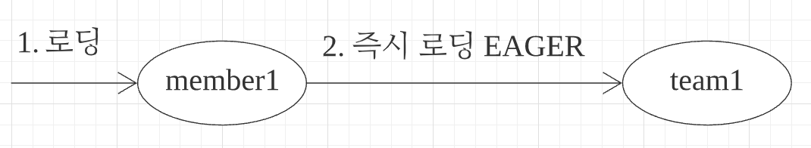

# 프록시와 연관관계 관리

**이 글은 자바 ORM 표준 JPA 프로그래밍 을 참고해서 쓴 글입니다.**

이 장에서 다룰 내용은 다음과 같다.

- 프록시와 즉시로딩, 지연로딩: 객체는 객체 그래프로 연관된 객체들을 탐색한다. 그런데 객체가 데이터베이스에 저장되어 있으므로 연관된 객체를 마음껏 탐색하기는 어렵다. JPA 구현체들은 이 문제를 츠록시라는 기술을 사용한다. 프록시를 사용하면 연관된 객체를 처음부터 데이터베이스에서 조회하는 것이 아니라, 실제 사용하는 시점에 데이터베이스에서 조회할 수 있다. 하지만 자주 함께 사용하는 객체들은 조인을 사용해서 함께 조회하는 것이 효과적이다. JPA는 즉시 로딩과 지연 로딩이란느 방법으로 둘을 모두 지원한다.
- 영속성 전이와 고아 객체: JPA는 연관된 객체를 함께 저장하거나 함께 삭제할 수 있는 영속성 전이와 고아 객체 제거라는 기능을 제공한다.

## 8.1 프록시

엔티티를 조회할 때 연관된 엔티티들이 항상 사용되는 것은 아니다. 예를 들어 회원 엔티티를 조회할 때 연관된 팀 엔티티는 비즈니스 로직에 따라 사용될 때도 있지만 그렇지 않을 때도 있다.

```java
@Entity
public class Team {
    // ...
    private String name;
}

@Entity
@Getter
public class Member {
    // ...
    private String username;
    @ManyToOne
    private Team team;
}

public void printUserAndTeam(String memberId) {
    Member member = em.find(Member.class, memberId);
    Team team = member.getTeam();
    System.out.println(member.getName());
    System.out.println(team.getName());
}

public void printUser(String memberId) {
    Member member = em.find(Member.class, memberId);
    System.out.println(member.getName());
}
```

printUserAndTeam() 메소드는 memberId로 회원 엔티티를 찾아서 회원은 물론이고 연관된 팀도 같이 출력한다. 반면 printUser() 메소드는 회원 엔티티만 출력하는 데 사용하고 팀 엔티티는 전려 사용하지 않는다.

printUser() 메소드는 회원 엔티티만 사용하므로 em.find()로 회원 엔티티를 조회할 때 회원과 연관된 팀 엔티티까지 데이터베이스에서 함께 조회해 두는 것은 효율적이지 않다.

JPA는 이런 문제를 해결하려고 엔티티가 실제 사용될 때까지 데이터베이스 조회를 지연하는 방법을 제공하는데 이것을 지연 로딩이라 한다. 쉽게 이야기 하면 team.getName() 처럼 팀 엔티티의 값을 실제 사용하는 시점에 데이터베이스에서 팀 엔티티에 필요한 데이터를 조회하는 것이다. 이 방법응 사용하면 printUser() 메소드는 회원 데이터만 데이터베이스에서 조회해도 된다. 그런데 지연 로딩 기능을 사용하려면 실제 엔티티 객체 대신에 데이터베이스 조회를 지연할 수 있는 가짜 객체가 필요한데 이것을 프록시 객체라 한다.

### 8.1.1 프록시 기초

JPA에서 식별자로 엔티티 하나를 조회할 때는 EntityManager.find()를 사용한다. 이 메소든느 영속성 컨텍스트에 엔티티가 없으면 데이터베이스를 조회한다.

```java
Member member = em.find(Member.class, "member1");
```

이렇게 엔티티를 직접 조회하면 조회한 엔티티를 실제 사용하든 사용하지 않든 데이터베이스를 조회하게 된다. 엔티티를 실제 사용하는 시점까지 데이터베이스 조회를 미루고 싶으면 EntityManager.getReference() 메소드를 사용하면 된다.

```java
Member member = em.getReference(Member.class, "member1");
```

이 메소드를 호출할 때 JPA는 데이터베이스를 조회하지 않고 실제 엔티티 객체도 생성하지 않는다. 대신에 데이터베이스 접근을 위임한 프록시 객체를 반환한다.

 그림 8.1 프록시 조회

---

#### 프록시의 구조

그림 8.2를 보자. 프록시 클래스는 실제 클래스를 상속 받아서 만들어지므로 실제 클래스와 겉 모양이 같다. 따라서 사용하는 입장에서는 이것이 진짜 객체인지 프록시 객체인지 구분하지 읺고 사용하면 된다.

 그림 8.2 프록시 구조

---

그림 8.3을 보자. 프록시 객체는 실제 객체에 대한 참조(target)을 보관한다. 그리고 프록시 객체의 메소드를 호출하면 프록시 객체는 실제 객체의 메소드를 호출한다.

 그림 8.3 프록시 위임

---

#### 프록시 객체의 초기화

프록시 객체는 member.getName() 처럼 실제 사용될 때 데이터베이스를 조회해서 실제 엔티티 객체를 생성하는데 이것을 프록시 객체의 초기화라 한다.

```java
public void useMember() {
    Member member = em.getReference(Member.class, "id1");
    member.getName(); // 1. getName()
}

class MemberProxy extends Member {
    Member target = null; // 실제 엔티티 참조

    public String getName() {
        if (target == null) {
            // 2. 초기화 요청
            // 3. DB 조회
            // 4. 실제 엔티티 생성 및 참조 보관
            this.target = ...;
        }

        // 5. target.getName();
        return target.getName();
    }
}
```

 그림 8.4 프록시 초기화

1. 프록시 객체에 member.getName()를 호출해서 실제 데이털르 조회한다.
2. 프록시 객체는 실제 엔티티가 생성되어 있지 않으면 영속성 컨텍스트에 실제 엔티티 생성을 요청하는데 이것을 초기화라 한다.
3. 영속성 컨텍스트는 데이터베이스를 조회해서 실제 엔티티 객체를 생성한다.
4. 프록시 객체는 생성된 실제 엔티티 객체의 참조를 Member target 멤버변수에 보관한다.
5. 프록시 객체는 실제 엔티티 객체의 getName()을 호출해서 결과를 반환한다.

#### 프록시의 특징

- 프록시 객체는 처음 사용할 때 한번만 초기화된다.
- 프록시 객체를 초기화한다고 프록시 객체가 실제 엔티티로 바뀌는 것은 아니다. 프록시 객체를 초기회되면 프록시 객체를 통해서 실제 엔티티에 접근할 수 있다.
- 프록시 객체는 원본 엔티티를 상속받은 객체이므로 타입 체크 시에 주의해서 사용해야 한다.
- 영속성 컨텍스트에 찾는 엔티티가 이미 있으면 테이터베이스를 조회할 필요가 없으므로 em.getReference()를 호출해도 프록시가 아닌 실제 엔티티를 반환한다.
- 초기화는 영속성 컨텍스트의 도움을 받아야 가능하다. 따라서 영속성 컨텍스트의 도움을 받을 수 없는 준영속 상태의 프록시를 초기화하면 문제가 발생한다. 하이버네이트는 org.hibernate.LazyInitializationException 예외를 발생시킨다.

#### 준영속 상태와 초가화

준영속 성태와 초기화에 관련된 코드는 다음과 같다.

```java
public void getMember() {
    // MemberProxy 반환
    Member member = em.getReference(Member.class, "id1");
    transaction.commit();
    em.close(); // 영속성 컨텍스트 종료
    member.getName(); // 준영속 상태 초기화 시도 -> LazyInitializationException 발생
}
```

이 코드를 보면 em.close() 메소드로 영속성 컨텍스트를 종료해서 member는 준영속 상태다. member.getName()을 호출하면 프록시를 초기화해야 하는데 영속성 컨텍스트가 없으므로 실제 엔티티를 조회할 수 없다. 실제 엔티티를 조회할 수 없다. 따라서 예외가 발생한다.

_JPA 표준 명세는 지연 로딩(프록시)에 대한 내용을 JPA 구현체에 맡겼다. 따라서 준영속 상태의 엔티티를 초기화할 때 어떤 일이 발생할지 표준 명세에는 정의되어 있지 않다. 하이버네이트를 사용하면 org.hibernate.LazyInitializationException 예외가 발생한다._

### 8.1.2 프록시와 식별자

엔티티를 프록시로 조회할 때 식별자(PK) 값을 파라미터로 전달하는데 프록시 객체는 이 식별자 값을 보관한다.

```java
Team team = em.getReference(Team.class, "team1"); // 식별자 보관
team.getId(); // 초기화되자 않음
```

프록시 객체는 식별자 값을 가지고 있으므로 식별자 값을 조회하는 team.getId()를 호출해도 프록시를 초기화하지 않는다. 단 엔티티 접근 방식을 프로퍼티(@Access(AccessType.PROPERTY))로 설정한 경우에만 초기화하지 않는다.
엔티티 접근 방식을 필드(@Access(AccessType.FILED))로 설정하면 JPA는 getId() 메소드가 id만 조회하는 메소드인지 다른 필드까지 활용해서 어떤 일을 하는 메소드인지 알지 못하므로 프록시 객체를 초기화한다.
프록시는 다음 코드처럼 연관관계를 설정할 때 유용하게 사용할 수 있다.

```java
Member member = em.find(Member.class, "member1");
Team team = em.getReference(Team.class, "team1"); // SQL을 실행하지 않음
member.setTeam(team);
```

연관관계를 설정할 때는 식별자 값만 사용하므로 프록시를 사용하면 데이터베이스 접근 횟수를 줄일 수 있다. 참고로 연관관계를 설정할 때는 엔티티 접근 방식을 필드로 설정해도 프록시를 초기화하지 않는다.

### 8.1.3 프록시 확인

JPA가 제공하는 PersistenceUnitUtil.isLoaded(Object entity) 메소드를 사용하면 프록시 인스턴스의 초기화 여부를 확인할 수 있다. 아직 초괴화되지 않은 프록시 인스턴스는 false를 반환한다. 이미 초괴화되었거나 프록시 인스턴스가 아니면 true를 반환한다.

```java
public void isLoad() {
    boolean isLoad = em.getEntityManagerFactory().getPersistenceUnitUtil().isLoaded(entity);
    System.out.println(isLoad);
}
```

조회한 엔티티가 진짜 엔티티인지 프록시로 조회한 것인지 확인하려면 클래스명을 직접 호출해보면 된다. 다음 예를 보면 클래스 명 뒤에 ..javassist.. 라 되어 있는데 이것으로 프록시인 것을 확인할 수 있다. 프록시를 생성하는 라이브러리에 따라 출력 결과는 달라질 수 있다.

```java
System.out.println(member.getClass().getName()); // domain.Member_$$_javassist_0
```

_프록시 강제 초기화: 하이버네이트의 initialize() 메소드를 사용하면 프록시를 강제로 초기화할 수 있다. JPA 표준에는 프록시 강제 초기화 메소드가 없으므로 강제로 초기화하려면 member.getName() 처럼 프록시의 메소드를 직접 호출하면 된다. JPA 표준은 단지 초기화 여부만 확인할 수 있다._

## 8.2 즉시 로딩과 지연 로딩

프록시 객체는 주로 연관된 엔티티를 지연 로딩할 때 사용한다. member1이 team1에 소속해 있다고 가정해보자.

```java
Member member = em.find(Member.class, "member1");
Team team = member.getTeam(); // 객체 그래프 탐석
System.out.println(team.getName()); // 팀 엔티티 사용
```

회원 엔티티를 조회할 때 연관된 팀 엔티티도 함께 데이터베이스에서 조회하는 것이 좋을까? 아니면 회원 엔티티만 조회해 두고 팀 엔티티는 실제 사용하는 시점에 데이터베이스에서 조회하는 것이 좋을까?
JPA는 개발자가 연관된 엔티티의 조회 시점을 선택할 수 있도록 다음 두 가지 방법을 제공한다.

- 즉시 로딩: 엔티티를 조회할 때 연관된 엔티티도 함께 조회한다.
  - ex) em.find(Member.class, "member1")를 호출할 때 회원 엔티티와 연관된 팀 엔티티도 함께 조회한다.
  - 설정 방법: @ManyToOne(fetch = FetchType.EAGER)
- 지연 로딩: 연관된 엔티티를 실제 사용할 때 조회한다.
  - ex) member.getTeam().getName()처럼 조회한 팀 엔티티를 실제 사용하는 시점에 JPA가 SQL을 호출해서 팀 엔티티를 조회한다.
  - 설정 방법: @ManyToOne(fetch = FetchType.LAZY)

### 8.2.1 즉시 로딩

즉시 로딩을 사용하려면 @ManyToOne의 fetch 속성을 FetchType.EAGER로 지정한다.

```java
@Entity
public class Member {
    // ...
    @ManyToOne(fetch = FetchType.EAGER)
    @JoinColumn(name = "TEAN_ID")
    private Team team;
}

public void static main() {
    Member member = em.find(Member.class, "member1");
    Team team = member.getTeam(); // 객체 그래프 탐색
}
```

 그림 8.5 즉시 로딩, 회원을 조회할 때 팀 즉시 로딩

---

코드를 보면 회원과 팀을 즉시 로딩으로 설정했다. 따라서 em.find(~)로 회원을 조회하는 순간 팀도 함께 조회한다. 이때 회원과 팀 두 테이블을 조회해야 하므로 쿼리를 2번 실행할 것 같지만, 대부분의 JPA 구현체는 즉시 로딩을 최적화하기 위해 가능하면 조인 쿼리를 사용한다. 여기서는 회원과 팀을 조인해서 쿼리 한 번으로 두 엔티티을 모두 조회한다.

```sql
SELECT 
  M.MEMBER_ID AS MEMBER_ID,
  M.TEAM_ID AS TEAM_ID,
  M.USERNAME AS USERNAME,
  T.TEAM_ID AS TEAM_ID,
  T.NAME AS NAME
FROM
  MEMBER M LEFT OUTER JOIN TEAM T
    ON M.TEAM_ID=T.TEAM_ID
WHERE
  M.MEMBER_ID='member1'
```

SQL을 분석해보면 회원과 팀을 조인해서 쿼리 한 번으로 조회한 것을 알 수 있다. 이후 member.getTeam()을 호출하면 이미 로딩된 팀1 엔티티를 반환한다.

#### NULL 제약조건과 JPA 조인 전략

즉시 로딩 실행 SQL에서 JPA가 내부 조인이 아닌 외부 조인을 사용한 것을 유심히 봐야 한다. 현재 회원 테이블에 TEAM_ID 외래 키는 NULL 값을 허용하고 있다. 따라서 팀에 소속되지 않은 회원이 있을 가능성이 있다. 팀에 소속하지 않은 회원과 팀을 내부 조인하면 팀은 물론이고 회원 데이터도 조회할 수 없다.

JPA는 이런 상황을 고려해서 외부 조인을 사용한다. 하지만 외부 조인보다 내부 조인이 성능과 최적화에서 더 유리하다. 그럼 내부 조인을 사용하려면 어떻게 해야 할까? 외래 키에 NOT NULL 제약 조건을 설정하면 값이 있는 것을 보장한다. 따라서 이때는 내부 조인만 사용해도 된다.

JPA에게도 이런 사실을 알려줘야 한다. 다음 코드처럼 @JoimColumn 에 nullable = false을 설정해서 이 외래 키는 NULL 값을 허용하지 않는다고 알려주면 JPA는 외부 조인 대신에 내부 조인을 사용한다.

- @JoinColumn(nullable = true): NULL 허용(기본값), 외부 조인 사용
- @JoinColumn(nullable = false): NULL 허용하지 않음. 내부 조인 사용

또는 다음처럼 @ManyToOne.optional = false로 설정해도 내부 조인을 사용한다.

정리하자면 JPA는 선택적 관계면 외부 조인을 사용하고 필수 관계면 내부 조인응 사용한다.

### 8.2.2 지연 로딩

지연 로딩을 사용하려면 @ManyToOne의 fetch 속성을 FetchType.LAZY로 지정한다.

```java
@Entity
public class Member {
    // ...
    @ManyToOne(fetch = FetchType.LAZY)
    @JoinColumn(name = "TEAM_ID")
    private Team team;
}

public static void main() {
    Member member = em.find(Member.class, "member1");
    Team team = member.getTeam(); // 객체 그래프 탐색 - 프록시 객체
    team.getName(); // 팀 객체 실제 사용
}
```

 그림 8.6 지연 로딩, 회원을 조회할 때 팀 지연 로딩

코드를 보면 회원과 팀을 지연 로딩으로 설정했다. 따라서 em.find(~)를 호출하면 회원만 조회하고 팀은 조회하지 않는다. 대신에 그림 8.6과 같이 조회한 회원의 team 멤버변수에 프록시 객체를 넣어둔다. 반환된 팀 객체는 프록시 객체다. 이 프록시 객체는 실제 사용될 때까지 데이터 로딩을 미룬다. 그래서 지연 로딩이라 한다.

이 처럼 실제 데이터가 필요한 순간이 되어서야 데이터베이스를 조회해서 프록시 객체를 초기화한다. em.find(~) 호출 시 실행되는 SQL은 다음과 같다.

```sql
SELECT * FROM MEMBER WHERE MEMBER_ID = 'member1';

-- team.getName() 호출시
SELECT * FROM TEAM WHERE TEAM_ID = 'team1';
```

### 8.2.3 즉시 로딩, 지연 로딩 정리

처음부터 연관된 엔티티를 모두 영속성 컨텍스트에 올려두는 것은 현실적이지 않고, 필요할 때마다 SQL을 실행해서 연관된 엔티티를 지연 로딩하는 것도 최적화 관점에서 보면 꼭 좋은 것만은 아니다. 예를 들어 애플리케이션 로직에서 회원과 팀 엔티티를 같이 사용한다면 SQL 조인을 사용해서 회원과 팀 엔티티를 한번에 조회하는 것이 효율적이다. 결국 연관된 엔티티를 즉시 로딩하는 것이 좋은지 아니면 실제 사용할 때 까지 지연해서 로딩하는 것이 좋은지는 상황에 따라 다르다.

- 지연 로딩: 연관된 엔티티를 프록시로 조회한다. 프록시를 실제 사용할 때 초기화하면서 데이터베이스를 조회한다.
- 즉시 로딩: 연관된 엔티티를 즉시 조회한다. 하이버네이트는 가능하면 SQL조인을 사용해서 한 번에 조회한다.

## 8.3 지연 로딩 활용

사내 주문 관리 시스템을 개발한다고 가정해보자.

 그림 8.7 클래스 모델

---

그림 8.7을 보고 예제에 사용할 모델을 분석해보자

- 회원은 팀하나에만 소속할수 있다. (N:1)
- 회원은 여러 주문내역을 가진다. (1:N)
- 주문내역은 하의 상품정보를 가진다. (N:1)

애플리케이션 로직을 분석해보니 다음과 같았다.

- Member와 연관된 Team은 자주 함꼐 사용되었다. 그래서 Member와 Team은 즉시 로딩으로 설정했다.
- Member와 연관된 Order는 가끔 사용되었다. 그래서 Member와 Order는 지연 로딩으로 설정했다.
- Order와 연관된 Product는 자주 함께 사용되었다. 그래서 Order와 Product는 즉시 로딩으로 설정했다.

```java
@Entity
@Getter
@Setter
public class Member {
    @Id
    private String id;
    private String username;
    private Integer age;

    @ManyToOne(fetch = FetchType.EAGER)
    private Team team;

    @OneToMany(mappedBy = "member", fetch = FetchType.LAZY)
    private List<Order> orders;
}
```

회원과 팀의 연관관계를 FetchType.EAGER로 설정했다. 따라서 회원 엔티티를 조회하면 연관된 팀 엔티티도 즉시 조회한다. 회원과 주문내역의 연관관계를 FetchType.LAZY로 설정했다. 따라서 회원 엔티티를 조회하면 연관된 주문내역 엔티티는 프록시로 조히해서 실제 사용될 때까지 로딩을 지연한다.

```java
Member member = em.find(Member.class, "member1");
```

회원 엔티티를 조회하면 그림 8.8처럼 엔티티를 로딩한다.

 그림 8.8 회원 조회

---

회원과 팀은 즉시 로딩으로 설정했다. 따라서 회원을 조회할때 연관된 teamA도 함께 조회한다. 회원 엔티티를 조회할 때 JPA가 실행한 SQL을 보자

```SQL
SELECT 
    MEMBER.ID AS MEMBERID,
    MEMBER.AGE AS AGE,
    MEMBER.TEAM_ID AS TEAM_ID,
    MEMBER.USERNAME AS USERNAME,
    TEAM.ID AS TEAMID,
    TEAM.NAME AS NAME
FROM
    MEMBER MEMBER
LEFT OUTER JOIN
    TEAM TEAM ON MEMBER.TEAM_ID=TEAM1_.ID
WHERE
    MEMBER0_.ID='member1'
```

회원과 팀은 FetchType.EAGER로 설정했으므로 하이버네이트는 조인 쿼리를 만들어 회원과 팀을 한 번에 조회한다. 반면에 회원과 주문내역은 FetchType.LAZY로 설정했으므로 결과를 프록시로 조회한다. 따라서 SQL이 나타나지 않는다. 회원을 조회한 후에 member.getTeam()을 호출하면 이미 로딩된 팀 엔티티를 반환한다.

### 8.3.1 프록시와 컬렉션 래퍼

그림 8.8을 보면 즉시 로딩한 teamA는 실선으로 표현했고 지연 로딩한 주문내역은 점선으로 표현했다. 이렇게 지연 로딩으로 설정하면 실제 엔티티 대신에 프록시 객체를 사용한다. 프록시 객체는 실제 자신이 사용될 때까지 데이터베이스를 조회하지 않는다.

```java
public void selectOrders() {
    Member member = em.find(Member.class, "member1");
    Order List<Order> orders = member.getOrders();
    System.out.println("orders = " + orders.getClass().getName());
    // 결과: orders = org.hibernate.collection.internal.PersistentBag
}
```

하이버네이트는 엔티티를 영속 상태로 만들 때 엔티티에 컬렉션이 있으면 컬렉션을 추적하고 관리할 목적으로 원본 컬렉션을 하이버네이트가 제공하는 내장 컬렉션으로 변경하는데 이것을 컬렉션 래퍼라 한다. 출력 결과를 보면 컬렉션 래퍼인 org.hibernate.collection.internal.PersistentBag이 반환된 것을 확인할 수 있다.

엔티티를 지연 로딩하면 프록시 객체를 사용해서 지연 로딩을 수행하지만 주문내역 같은 컬렉션은 컬렉션 래퍼가 지연 로딩을 처리해준다. 컬렉션 래퍼도 컬렉션에 대한 프록시 역할을 하므로 따로 구분하지 않고 프록시로 부르겠다.

참고로 member.getOrders()를 호출해도 컬렉션은 초기화되지 않는다. 컬렉션은 member.getOrders().get(0) 처럼 컬렉션에서 실제 데이터를 조회할 때 데이터베이스를 조회해서 초기화한다.

다음으로 member.getOrders().get(0)을 호출해서 연관된 주문내역을 조회하면 어떻게 될까? 그림 8.9를 보면 주문 내역과 상품의 로딩 방법을 FetchType.EAGER로 설정했다. 따라서 지연 로딩 상태인 주문내역을 초기화할 때 연관된 상품도 함꼐 로딩된다.

 그림 8.9 주문내역 조회

---

### 8.3.2 JPA 기본 페치 전략

fetch 속성의 기본 설정값은 다음과 같다.

- @ManyToOne, @OneToOne: 즉시 로딩(FetchType.EAGER)
- @ManyToMany, @OneToMany: 지연 로딩(FetchType.LAZY)

JPA의 기본 페치전략은 연관된 엔티티가 하나면 즉시 로딩을 컬렉션이면 지연 로딩을 사용한다. 컬렉션을 로딩하는 것은 비용이 많이 들고 잘못하면 너무 많은 데이터를 로딩할 수 있기 때문이다. 예를 들어 특정 회원이 연관된 컬렉션에 데이터를 수만 건 등록했는데, 설정한 페치 전략이 즉시 로딩이면 해당 회원을 로딩하는 순간 수만 건의 데이터도 함께 로딩된다. 반면에 연관된 엔티티가 하나면 즉시 로딩해도 큰 문제가 발생하지 않는다.

추천하는 방법은 모든 연관관계에 지연 로딩을 사용하는 것이다. 그리고 어플리케이션 개발이 어느 정도 완료단계에 왔을 때 실제 사용하는 상황을 보고 꼭 필요한 곳에만 즉시 로딩을 사용하도록 최적화하면 된다.

참고로 SQL을 직접 사용하면 이런 유연한 최적화가 어렵다. 예를 들어 SQL로 각각의 테이블을 조회해서 처리하다가 조인으로 한 번에 조회하도록 변경하려면 많은 SQL과 애플리케이션 코드를 수정해야 한다.

### 8.3.3. 컬렉션에 FetchType.EAGER 사용 시 주의점

컬렉션에 FetchType.EAGER를 사용할 경우에 주의할 점은 다음과 같다.

- 컬렉션을 하나 이상 즉시 로딩하는 것은 권장하지 않는다. 컬렉션과 조인한다는 것은 데이터베이스 테이블로 보면 일대다 조인이다. 일대다 조인은 결과 데이터가 다 쪽에 있는 수만큼 증가하게 된다. 문제는 서로 다른 컬렉션을 2개 이상 조인할 때 발생하는데 예를 들어 A 테이블을 N, M 두 테이블과 조인하면 SQL 실행 결과가 N*M이 되면서 너무 많은 데이터를 반환할 수 있고, 결과적으로 애플리케이션 성능이 저하될 수 있다. JPA는 이렇게 조회된 결과를 메모리에서 필터링해서 반환한다. 따라서 2개 이상의 컬렉션을 즉시 로딩으로 설정하는 것은 권장하지 않는다.
- 컬렉션 즉시 로딩은 항상 외부 조인을 사용한다. 예를 들어 다대일 관계인 회원 테이블과 팀 테이블을 조인할 때 회원 테이블의 외래 키에 not null 제약조건을 걸어두면 모든 회원은 팀에 소속되므로 항상 내부 조인을 사용해도 된다, 반대로 팀 테이블에서 회원 테이블로 일대다 관계를 조인할 때 회원이 한 명도 없는 팀을 내부 조인하면 팀까지 조회되지 않는 문제가 발생한다. 데이터베이스 제약조건으로 이런 상황을 막을 수는 없다 따라서 JPA는 일대다 관계를 즉시 로딩할 때 항상 외부 조인을 사용한다.

- @ManyToOne, @OneToOne
  - (optional = false): 내부 조인
  - (optional = true): 외부 조인
- @OneToMany, @ManyToMany
  - (optional = false): 외부 조인
  - (optional = true): 내부 조인

## 8.4 영속성 전이: CASCADE

특정 엔티티를 영속 상태로 만들 때 연관된 엔티티도 함께 영속 상태로 만들고 싶으면 영속성 전이기능을 사용하면 된다. JPA는 CASCADE 옵션으로 영속성 전이를 제공한다. 쉽게 말해서 영속성 전이를 사용하면 부모 엔티티를 저장할 때 자식 엔티티도 함계 저장할 수 있다. 그림 8.10과 예제로 알아보자.

 그림 8.10 CASCADE 예제

---

```java
@Entity
public class Parent {
    @Id @GeneratedValue
    private Long id;

    @OneToMany(mappedBy = "parent")
    private List<Child> children = new ArrayList<Child>();
}

@Entity
public class Child {
    @Id @GeneratedValue
    private Long id;

    @ManyToOne
    private Parent parent;
}
```

만약 부모 1명에 자식 2명을 저장한다면 다음과 같은 코드를 작성할 것이다.

```java
private void saveNoCascade(EntityManager em) {
    // 부모 저장
    Parent parent = new Parent();
    em.persist(parent);

    // 1번 자식 저장
    Child child1 = new Child();
    child1.setParent(parent); // 자식 -> 부모 연관관계 설정
    parent.getChildren().add(child1); // 부모 -> 자식
    em.persist(child1);

    // 2번 자식 저장
    Child child2 = new Child();
    child1.setParent(parent); // 자식 -> 부모 연관관계 설정
    parent.getChildren().add(child2); // 부모 -> 자식
    em.persist(child2);
}
```

JPA에서 엔티티를 저장할 때 연관된 모든 엔티티는 영속 상태여야 한다. 따라서 예제를 보면 부모 엔티티를 영속 상태로 만들고 자식 엔티티도 각각 영속 상태로 만든다. 이럴 때 영속성 전이를 사용하면 부모만 영속 상태로 만들면 연관된 자식까지 한 번에 영속 상태로 만들 수 있다.

### 8.4.1 영속성 전이: 저장

영속성 전이를 활성화하는 CASCADE 옵션을 적용해보자.

```java
@Entity
public class Parent {
    @OneToMany(mappedBy = "parent", cascade = CascadeType.PERSIST)
    private List<Child> children = new ArrayList<Child>();
}
```

부모를 영속화할 때 연관된 자식들도 함게 영속화하라고 cascade = CascadeType.PERSIST 옵션을 설정했다. 이 옵션을 적용하면 예제 8.17처럼 간편하게 부모와 자식 엔티티를 한 번에 영속화할 수 있다.

```java
private void saveWithCascade(EntityManager em) {
    Child child1 = new Child();
    Child child2 = new Child();

    Parent parent = new Parent();
    child1.setParent(parent); // 연관관계 추가
    child2.setParent(parent); // 연관관계 추가
    parent.getChildren().add(child1);
    parent.getChildren().add(child2);

    // 부모 저장, 연관된 자식들 저장
    em.persist(parent);
}
```

 그림 8.11 CASCADE 실행

부모만 영속화하면 CascadeType.PERSIST로 설정한 자식 엔티티까지 함꼐 영속화해서 저장한다(그림 8.11). 데이터베이스에 입력된 데이터를 확인해보면 정상적으로 2건 입력된 것을 확인할 수 있다.

영속성 전이는 연관관계를 매핑하는 것과는 아무 관련이 없다. 단지 엔티티를 영속화할 때 연관된 엔티티도 같이 영속화하는 편리함을 제공할 뿐이다. 그래서 예제 8.17을 보면 양방향 연관관계를 추가한 다음 영속 상태로 만든 것을 확인할 수 있다.

### 8.4.2 영속성 전이: 삭제

방금 저장한 부모와 자식 엔티티를 모두 제거하려면 다음 코드와 같이 각각의 엔티티를 하나씩 제거해야 한다.

```java
public void removeParent() {
    Parent findParent = em.find(Parent.class, 1L);
    Child findChild1 = em.find(Child.class, 1L);
    Child findChild2 = em.find(Child.class, 2L);

    em.remove(findParent);
    em.remove(findChild1);
    em.remove(findChild2);
}
```

영속성 전이는 엔티티를 삭제할 때도 사용할 수 있다. CascadeType.REMOVE로 설정하고 다음 코드처럼 부모 엔티티만 삭제하면 연관된 자식 엔티티도 함께 삭제된다.

```java
public void removeParent {
    Parent findParent = em.find(Parent.class, 1L);
    em.remove(findParent);
}
```

코드를 실행하면 DELETE SQL을 3번 실행하고 부모는 물론 연관된 자식도 모두 삭제한다. 삭제 순서는 외래 키 제약조건을 고려해서 자식을 먼저 삭제하고 부모를 삭제한다.

만약 CascadeType.REMOVE를 설정하지 않고 이 코드를 실행하면 어떻게 될까? 그러면 부모 엔티티만 삭제된다. 하지만 데이터베이스의 부모 로우를 삭제하는 순간 자식 테이블에 걸려 있는 외래 키 제약조건으로 인해, 데이터베이스에서 외래키 무결성 예외가 발생한다.

### 8.4.3 CASCADE의 종류

CascadeType 코드를 보면 다양한 옵션이 있는 것을 확인할 수 있다.

```java
public enum CascadeType {
    ALL, // 모두 적용
    PERSIST, // 영속
    MERGE, // 병합
    REMOVE, // 삭제
    REFRESH // REFRESH
    DETACH // DETACH
}
```

다음처럼 여러 속성을 같이 사용할 수 있다.

```java
cascade = {CascadeType.PERSIST, CascadeType.REMOVE}
```

ckarhfh CascadeType.PERSIST, CascadeType.REMOVE는 em.persist(), em.remove()를 실행할 때 바로 전이가 발생하지 않고 플러시를 호출할 때 전이가 발생한다.

## 8.5 고아 객체

JPA는 부모 엔티티와 연관관계가 끊어진 자식 엔티티를 자동으로 삭제하는 기능을 제공하는데 이것을 고아 객체(ORPHAN) 제거라 한다. 이 기능을 사용해서 부모 엔티티의 컬렉션에서 자식 엔티티의 참조만 제거하면 자식 엔티티가 자동으로 삭제되도록 해보자.

```java
@Entity
public class Parent {
    @Id @GeneratedValue
    private Long id;

    @OneToMany(mappedBy = "parent", orphanRemoval = true)
    private List<Child> children = new ArrayList<Child>();
}
```

코드를 보면 고아 객체 제거 기능을 활성화하기 위해 컬렉션에 orphanRemoval = true를 설정하자. 이제 컬럭센에서 제거한 엔티티는 자동으로 삭제된다.

```java
Parent parent1 = em.find(Parent.class, id);
parent1.getChildren().remove(0); // 자식 엔티티를 컬렉션에서 제거
```

실행 결과 SQL은 다음과 같다.

```SQL
DELETE FROM CHILD WHERE ID=?
```

사용 코드를 보면 컬렉션에서 첫 번째 자식을 제거했다. orphanRemoval = true 옵션으로 인해 컬렉션에서 엔티티를 제거하면 데이터베이스의 데이터도 삭제된다. 고아 객체 제거 기능은 영속성 컨텍스트를 플러시할 때 적용되므로 플러시 시점에 DELETE SQL이 실행된다.

모든 자식 엔티티를 제거하려면 다음 코드 처럼 컬렉션을 비우면 된다.

```java
parent1.getChildren().clear();
```

고아 객체를 정리해보자. 고아 객체 제거는 참조가 제거된 엔티티는 다른 곳에서 참조하지 않는 고아 객체로 보고 삭제하는 기능이다. 따라서 이 기능은 참조하는 곳이 하나일 때만 사용해야 한다. 쉽게 이야기해서 특정 엔티티가 개인 소유하는 엔티티에만 이 기능을 적용해야 한다. 만약 삭제한 엔티티를 다른 곳에서도 참조한다면 문제가 발생할 수 있다. 이런 이우로 orphanRemoval은 @OneToOne, @OneToMany에만 사용할 수 있다.

고아 객체 제거에는 기능이 하나 더 있는데 개념적으로 볼때 부모를 제거하면 자식은 고아가 된다. 따라서 부모를 제거하면 자식도 같이 제거된다. 이것은 CascadeType.REMOVE를 설정한 것과 같다.

## 8.6 영속성 전이 + 고아 객체, 생명 주기

CascadeType.ALL + orphanRemoval = true를 동시에 사용하면 어떻게 될까?
일반적으로 엔티티는 EntityManager.persist()를 통해 영속화되고 EntityManager.remove()를 통해 제거된다. 이것은 엔티티 스스로 생명주기를 관리한다는 뜻이다. 그런데 두 옵션을 모두 활성화하면 부모 엔티티를 통해서 자식의 생명주기를 관리할 수 있다.

자식을 저장하려면 부모에 등록만 하면 된다(CASCADE)

```java
Parent parent = em.find(Parent.class, parentId);
parent.addChild(child1);
```

자식을 삭제하려면 부모에서 제거하면 된다(orphanRemoval)

```java
Parent parent = em.find(Parent.class, parentId);
parent.getChildren().remove(removeObject);
```

_영속성 전이는 DDD의 Aggregate Root 개념을 구현할 때 사용하면 편리하다._

## 8.7 정리

지금까지 프록시의 동작 원리에 대해 알아보고 즉시 로딩과 지연 로딩에 관해서도 알아보았다. 그리고 영속성 전이와 고아 객체 제거 기능도 알아보았다.

- JPA 구현체들은 객체 그래프를 마음껏 탐색할 수 있도록 지원하는데 이때 프록시 기술을 사용한다.
- 객체를 조회할 때 연관된 객체를 즉시 로딩하는 방법을 즉시 로딩이라 하고, 연관된 객체를 지연해서 로딩하는 방법을 지연 로딩이라 한다.
- 객체를 저장하거나 삭제할 때 연관된 객체도 함께 저장하거나 삭제할 수 있는데 이것을 영속성 전이라 한다.
- 부모 엔티티와 연관관계가 끊어진 자식 엔티티를 자동으로 삭제하려면 고아 객체 제거 기능을 사용하면 된다.
