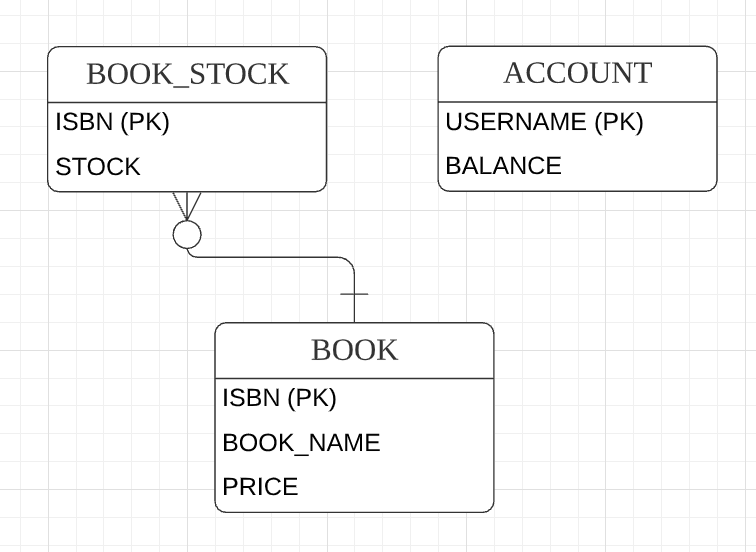

# 10. 스프링 트랜잭션 관리

***이 글은 스프링5 레시피 을 참고해서 쓴 글입니다.***

## 10.0 개요

트랜잭션 관리는 엔터프라이즈 애플리케이션에서 데이터 무결성과 일관성을 보장하는 데 필수 기법이다. 스프링은 다양한 트랜잭션 관리 API를 상위 레벨에서 추상화하여 제공해준다.

프로그램 방식의 트랜잭션 관리는 비지니스 메서드 중간에 트랜잭션 관리 코드를 삽입하여, 메서드가 정상 종료하면 커밋하고 예외가 발생하면 롤백한다. 하지만 일일일 트랜잭션을 제어하면 같은 코드가 반복되어 공통의 관심사라는 것을 알 수 있다.

선언적 트랜잭션 관리는 선언을 사용해 트랜잭션 관리 코드를 비즈니스 메서드와 떼어놓는 것으로, 스프링은 AOP 를 사용해 선언적 트랜잭션 관리를 지원해준다.

프로그램 방식의 트랜잭션 관리는 직접 코드를 명시하는 형태로 트랜잭션을 시작, 커밋, 병합할 수 있고 여러 속성값을 지정하면 아주 정교한 제어도 가능하다. 스프링은 전달 방식, 격리 수준, 롤백 규칙, 트랜잭션 타입아웃, 읽기 전용 트랜잭션 여부 등 다양한 속성을 지원하므로 원하는 트랜잭션 로직을 커스터마이징할 수 있다.

스프링 프록시를 추가하면 성능에 문제가 생길 수 있다고 여겨지다면, 네이티브 트랜잭션에 직접 접근해 수동으로 트랜잭션을 제어하고, 트랜잭션 경계가 시작 및 커밋되는 주변에 템플릿 메서드를 제공하는  TransactionTemplate 쿨래스를 이용해 스프링 프록시의 오버헤드를 방지할 수 있다.

## 10.1 트랜잭션 관리의 중요성

트랜잭션 관리는 엔터프라이즈 애플리케이션에서 데이터 무결성과 일관성을 보장하는 필수 기법이다. 동시성, 분산 환경에서는 예기치 않은 에러가 발생 시 데이터를 복원해야하므로 트랜잭션 관리는 매우 중요하다.

트랜잭션이란 쉽게 말해 연속된 여러 액션을 한 단위의 작업으로 뭉뚱그린 걸로, 이 액션 뭉치는 전체가 완전히 끝나던지, 아무런 영향도 끼지지 않아야 합니다. 즉, 모든 액션이 제대로 끝나면 영구 커밋되고, 하나라도 잘못되면 아무 일도 없었던 것처럼 초기상태로 롤백 됩니다.

트랜잭션의 속성은 ACID(원자성, 일관성, 격리성, 지속성)로 설명하는데,

* 원자성(Atomicity): 트랜잭션은 연속적인 액션들로 이루어진 원자성 작업으로, 트랜잭션의 액션은 전부 다 수행되거나 아무것도 수행되지 않다록 보장합니다.
* 일관성(Consistency): 트랜잭션의 액션이 모두 완료되면 커밋되고 데이터 및 리소스는 비즈니스 규칙에 맞게 일관된 상태를 유지합니다.
* 격리성(Isolation): 동일한 데이터를 여러 트랜잭션이 동시에 처리하는 경우 데이터가 변질되지 않게 하려면 각각의 트랜잭션을 격리해야 합니다.
* 지속성(Durability): 트랜잭션 완료 후 그 결과는 시스템이 실패(커밋도중 정전)하더라도 살아남아야 합니다. 보통 트랜잭션 결과물은 퍼시스턴스 저장소에 씌어집니다.

지금부터 온라인 서점 애플리케이션을 예로 들어보자.

 그림 10-1 온라인 서점 애플리케이션 ERD

트랜잭션의 본질을 보기위해 스프링 JDBC 기능 없이 보자.

```java
public class JdbcBookShop implements BookShop {
    private DataSource dataSource;

    @Override
    public void purchase(String isbn, String username) {
        Connection conn = null;
        try {
            conn = dataSource.getConnection();

            PreparedStatement stmt1 = conn.prepareStatement("SELECT PRICE FROM BOOK WHERE ISBN + ?");
            stmt1.setString(1, isbn);
            ResultSet rs = stmt1.executeQuery();
            rs.next();
            int price = rs.getInt("PRICE");
            stmt1.close();

            PreparedStatement stmt2 = conn.prepareStatement("UPDATE BOOK_STOCK SET STOCK + STOCK - 1" + "WHERE ISBN = ?");
            stmt2.setString(1, isbn);
            stmt2.executeUpdate();
            stmt2.close();

            PreparedStatement stmt3 = conn.prepareStatement("UPDATE ACCOUNT SET BALANCE + BALANCE - ?" + "WHERE USERNAME = ?");
            stmt3.setInt(1, price);
            stmt3.setString(2, username);
            stmt3.executeUpdate();
            stmt3.close();
        } catch (SQLException e) {
            throw new RuntimeException(e);
        } finally {
            if (conn != null) {
                try {
                    conn.close();
                } catch (SQLException) {}
            }
        }
    }
}
```

purchase() 메서드는 도서 단가를 조회하는 쿼리, 도서 재고 및 계정 잔고를 수정하는 쿼리 하나씩 모두 3개의 쿼리를 수행한다.

그럼 트랜잭션 관리를 안할때 어떻게 되는지 확인해보자

|ISNB|BOOK_NAME|PRICE|
|---|---|---|
|0001|The First Book|30|

|ISNB|STOCK|
|---|---|
|0001|10|

|USERNAME|BALANCE|
|---|---|
|user1|20|

user1 이 ISNB 0001 도서를 구입한다고 가정하고 Main 클래스를 작성하면 user1은 잔고가 20달라밖에 없어서 도서를 구입할 수 없다.

```java
public class Main {
    public static void main(String[] args) throws Throwable {
        ApplicationContext context = new AnnotationConfigApplicationContext(BookstoreConfiguration.class);

        BookShop bookshop = context.getBean(BookShop.class);
        bookShop.purchase("0001", "user1");
    }
}
```

이 클래스를 실행하면 ACCOUNT 테이블에 설정된 제약조건에 의해 SQLException이 발생합니다. 하지만 BOOK_STORE 테이블을 확인하면 이 유저가 구매를 하지 못했는데도 재고가 하나 줄었을 것이다. 이는 세 번째 SQL문을 실행하면서 예외가 발생하기 전, 이미 두 번째 SQL문이 실행되어 재고가 차감되었기 때문이다.

이처럼 트랜잭션을 제대로 관리하지 않으면 데이터가 꼬여버립니다. purchase() 메서드는 하나의 트랜잭션으로 실행해야하며, 하나라도 실패했을시 모두 롤백되어야 한다.

### 10.1.1 JDBC 커밋/롤백을 이용해 트랜잭션 관리하기

JDBC를 사용해 DB를 수정하면 실행이 끝난 SQL문은 바로 커밋되는 게 기본 동작입니다. 하지만 자동커밋하면 원하는 작업에 트랜잭션을 걸 수가 없으므로 기본 설정된 자동커밋을 끄고, 명시적으로 commit(), rollback() 매서드를 호출해야합니다.

```java
public class JdbcBookShop implements BookShop {
    public void purchase(String isbn, String username) {
        Connection conn = null;
        try {
            conn = dataSource.getConnection();
            conn.setAutoCommit(false);
            // ...
            conn.commit();
        } catch (SQLExcetpion e) {
            if (conn != null) {
                try {
                    conn.rollback();
                } catch (SQLException e) {}
            }
        } finally {
            if (conn != null) {
                try {
                    conn.close();
                } catch (SQLException e) {}
            }
        }
    }
}
```

그런데 이렇게 JDBC 접속을 분명하게 커밋/롤백해서 트랜잭션을 관리하는 방법은 메서드마다 판박이 코드가 지겹게 반복되는 모양새라 바람직하지 않고, JDBC에 종속되므로 나중에 데이터 액세스 기술을 변경하면 전체 코드를 변경해야하는 문제가 있습니다. 다행이 스프링은 간편하게 트랜잭션 관리 작업을 할 수 있도록 PlatformTransactionManager, TransactionTemplate, 트랜잭션 선언 등 지원합니다.

## 10.2 트랜잭션 관리자 구현체 선정하기
