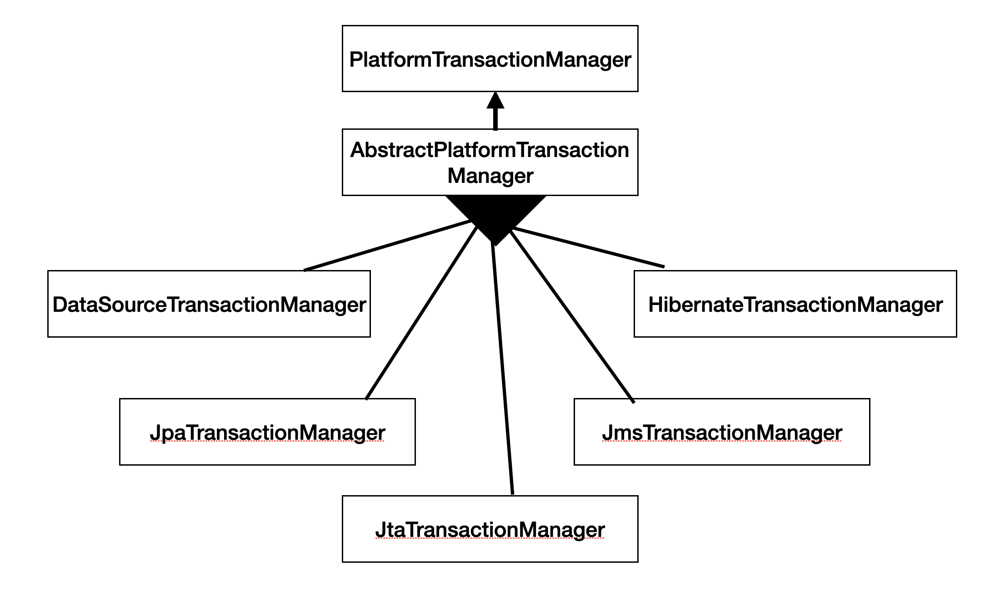
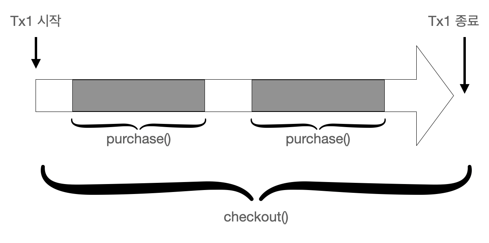
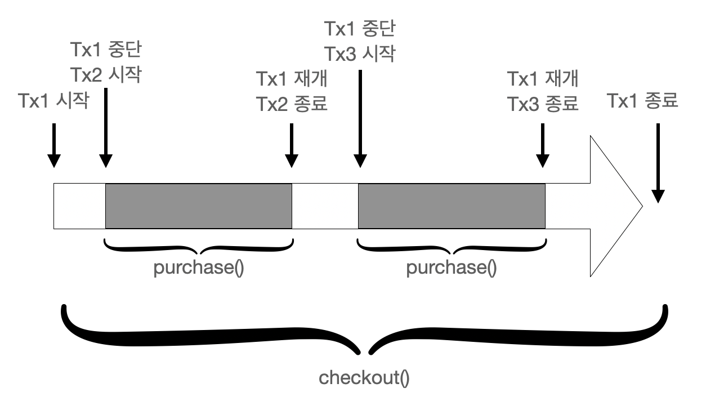

# 10. 스프링 트랜잭션 관리

***이 글은 스프링5 레시피 을 참고해서 쓴 글입니다.***

## 10.0 개요

트랜잭션 관리는 엔터프라이즈 애플리케이션에서 데이터 무결성과 일관성을 보장하는 데 필수 기법이다. 스프링은 다양한 트랜잭션 관리 API를 상위 레벨에서 추상화하여 제공해준다.

프로그램 방식의 트랜잭션 관리는 비지니스 메서드 중간에 트랜잭션 관리 코드를 삽입하여, 메서드가 정상 종료하면 커밋하고 예외가 발생하면 롤백한다. 하지만 일일일 트랜잭션을 제어하면 같은 코드가 반복되어 공통의 관심사라는 것을 알 수 있다.

선언적 트랜잭션 관리는 선언을 사용해 트랜잭션 관리 코드를 비즈니스 메서드와 떼어놓는 것으로, 스프링은 AOP 를 사용해 선언적 트랜잭션 관리를 지원해준다.

프로그램 방식의 트랜잭션 관리는 직접 코드를 명시하는 형태로 트랜잭션을 시작, 커밋, 병합할 수 있고 여러 속성값을 지정하면 아주 정교한 제어도 가능하다. 스프링은 전달 방식, 격리 수준, 롤백 규칙, 트랜잭션 타입아웃, 읽기 전용 트랜잭션 여부 등 다양한 속성을 지원하므로 원하는 트랜잭션 로직을 커스터마이징할 수 있다.

스프링 프록시를 추가하면 성능에 문제가 생길 수 있다고 여겨지다면, 네이티브 트랜잭션에 직접 접근해 수동으로 트랜잭션을 제어하고, 트랜잭션 경계가 시작 및 커밋되는 주변에 템플릿 메서드를 제공하는  TransactionTemplate 쿨래스를 이용해 스프링 프록시의 오버헤드를 방지할 수 있다.

## 10.1 트랜잭션 관리의 중요성

트랜잭션 관리는 엔터프라이즈 애플리케이션에서 데이터 무결성과 일관성을 보장하는 필수 기법이다. 동시성, 분산 환경에서는 예기치 않은 에러가 발생 시 데이터를 복원해야하므로 트랜잭션 관리는 매우 중요하다.

트랜잭션이란 쉽게 말해 연속된 여러 액션을 한 단위의 작업으로 뭉뚱그린 걸로, 이 액션 뭉치는 전체가 완전히 끝나던지, 아무런 영향도 끼지지 않아야 합니다. 즉, 모든 액션이 제대로 끝나면 영구 커밋되고, 하나라도 잘못되면 아무 일도 없었던 것처럼 초기상태로 롤백 됩니다.

트랜잭션의 속성은 ACID(원자성, 일관성, 격리성, 지속성)로 설명하는데,

* 원자성(Atomicity): 트랜잭션은 연속적인 액션들로 이루어진 원자성 작업으로, 트랜잭션의 액션은 전부 다 수행되거나 아무것도 수행되지 않다록 보장합니다.
* 일관성(Consistency): 트랜잭션의 액션이 모두 완료되면 커밋되고 데이터 및 리소스는 비즈니스 규칙에 맞게 일관된 상태를 유지합니다.
* 격리성(Isolation): 동일한 데이터를 여러 트랜잭션이 동시에 처리하는 경우 데이터가 변질되지 않게 하려면 각각의 트랜잭션을 격리해야 합니다.
* 지속성(Durability): 트랜잭션 완료 후 그 결과는 시스템이 실패(커밋도중 정전)하더라도 살아남아야 합니다. 보통 트랜잭션 결과물은 퍼시스턴스 저장소에 씌어집니다.

지금부터 온라인 서점 애플리케이션을 예로 들어보자.

 그림 10-1 온라인 서점 애플리케이션 ERD

트랜잭션의 본질을 보기위해 스프링 JDBC 기능 없이 보자.

```java
public class JdbcBookShop implements BookShop {
    private DataSource dataSource;

    @Override
    public void purchase(String isbn, String username) {
        Connection conn = null;
        try {
            conn = dataSource.getConnection();

            PreparedStatement stmt1 = conn.prepareStatement("SELECT PRICE FROM BOOK WHERE ISBN + ?");
            stmt1.setString(1, isbn);
            ResultSet rs = stmt1.executeQuery();
            rs.next();
            int price = rs.getInt("PRICE");
            stmt1.close();

            PreparedStatement stmt2 = conn.prepareStatement("UPDATE BOOK_STOCK SET STOCK + STOCK - 1" + "WHERE ISBN = ?");
            stmt2.setString(1, isbn);
            stmt2.executeUpdate();
            stmt2.close();

            PreparedStatement stmt3 = conn.prepareStatement("UPDATE ACCOUNT SET BALANCE + BALANCE - ?" + "WHERE USERNAME = ?");
            stmt3.setInt(1, price);
            stmt3.setString(2, username);
            stmt3.executeUpdate();
            stmt3.close();
        } catch (SQLException e) {
            throw new RuntimeException(e);
        } finally {
            if (conn != null) {
                try {
                    conn.close();
                } catch (SQLException) {}
            }
        }
    }
}
```

purchase() 메서드는 도서 단가를 조회하는 쿼리, 도서 재고 및 계정 잔고를 수정하는 쿼리 하나씩 모두 3개의 쿼리를 수행한다.

그럼 트랜잭션 관리를 안할때 어떻게 되는지 확인해보자

|ISNB|BOOK_NAME|PRICE|
|---|---|---|
|0001|The First Book|30|

|ISNB|STOCK|
|---|---|
|0001|10|

|USERNAME|BALANCE|
|---|---|
|user1|20|

user1 이 ISNB 0001 도서를 구입한다고 가정하고 Main 클래스를 작성하면 user1은 잔고가 20달라밖에 없어서 도서를 구입할 수 없다.

```java
public class Main {
    public static void main(String[] args) throws Throwable {
        ApplicationContext context = new AnnotationConfigApplicationContext(BookstoreConfiguration.class);

        BookShop bookshop = context.getBean(BookShop.class);
        bookShop.purchase("0001", "user1");
    }
}
```

이 클래스를 실행하면 ACCOUNT 테이블에 설정된 제약조건에 의해 SQLException이 발생합니다. 하지만 BOOK_STORE 테이블을 확인하면 이 유저가 구매를 하지 못했는데도 재고가 하나 줄었을 것이다. 이는 세 번째 SQL문을 실행하면서 예외가 발생하기 전, 이미 두 번째 SQL문이 실행되어 재고가 차감되었기 때문이다.

이처럼 트랜잭션을 제대로 관리하지 않으면 데이터가 꼬여버립니다. purchase() 메서드는 하나의 트랜잭션으로 실행해야하며, 하나라도 실패했을시 모두 롤백되어야 한다.

### 10.1.1 JDBC 커밋/롤백을 이용해 트랜잭션 관리하기

JDBC를 사용해 DB를 수정하면 실행이 끝난 SQL문은 바로 커밋되는 게 기본 동작입니다. 하지만 자동커밋하면 원하는 작업에 트랜잭션을 걸 수가 없으므로 기본 설정된 자동커밋을 끄고, 명시적으로 commit(), rollback() 매서드를 호출해야합니다.

```java
public class JdbcBookShop implements BookShop {
    public void purchase(String isbn, String username) {
        Connection conn = null;
        try {
            conn = dataSource.getConnection();
            conn.setAutoCommit(false);
            // ...
            conn.commit();
        } catch (SQLExcetpion e) {
            if (conn != null) {
                try {
                    conn.rollback();
                } catch (SQLException e) {}
            }
        } finally {
            if (conn != null) {
                try {
                    conn.close();
                } catch (SQLException e) {}
            }
        }
    }
}
```

그런데 이렇게 JDBC 접속을 분명하게 커밋/롤백해서 트랜잭션을 관리하는 방법은 메서드마다 판박이 코드가 지겹게 반복되는 모양새라 바람직하지 않고, JDBC에 종속되므로 나중에 데이터 액세스 기술을 변경하면 전체 코드를 변경해야하는 문제가 있습니다. 다행이 스프링은 간편하게 트랜잭션 관리 작업을 할 수 있도록 PlatformTransactionManager, TransactionTemplate, 트랜잭션 선언 등 지원합니다.

## 10.2 트랜잭션 관리자 구현체 선정하기

> 과제

데이터 소스가 하나뿐인 애플리케이션은 하나의 DB접속에 대해 commit(), rollback() 메소드를 호출하면 트랜잭션을 관리할수 있지만, 트랜잭션을 관리할 데이터 소스가 여럿이거나 자바 EE 애플리케이션 서버에 내장된 트랜잭션 관리 기능을 사용할 경우 Java Transaction API 사용을 고려해야합니다. JPA 같은 ORM 프레임워크마다 상이한 트랜잭션 API를 호출하는 경우도 있습니다. 이렇게 기술이 달라지만 트랜잭션 API도 달리 해야 하지만 다른 API로 전환하는 일이 녹록치 않다.

> 해결책

스프링은 여러 트랜잭션 관리 API 중에서 범용적인 트랜잭션 기능을 추상화했습니다. 덕분에 개발자는 하부 트랜잭션 API를 자세히 몰라도 스프링이 제공하는 트랜잭션 편의 기능을 이용할 수 있고, 특정 트랜잭션 기술에 구애받지 않아도 됩니다.

PlatformTransactionManager는 기술 독립적인 트랜잭션 관리 메서드를 캡슐화한 스랜잭션 관리 추상화의 핵심 인터페이스 입니다. 이 트랜잭션은 다음 세 작업 메서드를 제동해줍니다.

* TransactionStatus getTransaction(TransactionDefinition definition) throws TransactionException
* void commit(TransactionStatus status) throws TransactionException
* void rollback(TransactionStatus status) throws TransactionException

> 풀이

PlatformTransactionManager는 전체 스프링 트랜잭션 관리자를 포괄한 인터페이스오, 스프링에는 여러 가지 트랜잭션 관리 API에 적용 가능한, 이 인터페이스의 기본 구현체가 이미 탑재되어 있습니다.

하나의 데이터 소스를 JDBC로 액세스하는 애플리케이션은 DataSourceTransactionManager 정도면 충분합니다.

* 자바 EE 애플리케이션 서버에서 JTA로 트랜잭션을 관리할 경우, 서버에서 트랜잭션을 탐색하려면 JtaTransactionManager를 사용해야 합니다. 분산 트랜잭션(여러 리소스에 걸친 트랜잭션)을 구현할 때에도 JtaTransactionManager가 제격입니다. 대부분 JTA 트랜잭션 관리자를 이용해 애플리케이션 서버의 트랜잭션 관리자를 연계하지만 Atomikos 같은 단독형 JTA 트랜잭션 관리자도 얼마든지 이용 가능합니다.
* ORM 프레임워크로 DB에 액세스할 경우 HibernateTransactionManager나 JpaTransactionManager 등의 해당 프레임워크 트랜잭션 관리자를 선택합니다.

 그림 10-2 자주 쓰이는 PlatformTransactionManager 인터페이스 구현체

트랜잭션 관리자는 IoC 컨테이너에 일반 빈으로 선언합니다. 다음은 DataSourceTransactionManager 인스턴스를 빈으로 선언합니다. 다음은 DataSourceTransactionManager 인스턴스를 빈으로 구성한 코드입니다. 반드시 트랜잭션 관리에 필요한 dataSource 프로퍼티를 설정해야 이 데이터 소스로 접속된 트랜잭션을 관리할 수 있습니다.

```java
@Bean
public DataSourceTransactionManager transactionManager() {
    DataSourceTransactionManager transactionManager = new DataSourceTransactionManager();
    transactionManager.setDataSource(dataSource());
    return transactionManager;
}
```

## 10.3 트랜잭션 관리자 API를 이용해 프로그램 방식으로 트랜잭션 관리하기

> 과제

비즈니스 메서드에서 트랜잭션을 커밋/롤백하는 시점은 정교하게 제어해야 하나 하부 트랜잭션 API를 직접 다루고 싶지는 않습니다.

> 해결책

스프링 트랜잭션 관리자는 getTransaction() 메서드로 새 트랜잭션을 시작하고 commit(), rollback() 메서드로 트랜잭션을 관리하는, 기술 독립적인 API를 제공합니다. PlatformTransactionManager는 트랜잭션 관리를 추상화한 인터페이스라서 어떤 기술로 구현하든 잘 동작합니다.

> 해결책

```java
public class TransactionalJdbcBookShop extends JdbcDaoSupport implements BookShop {
    private PlatformTransactionManager transactionManager;

    public void setTransactionManager(PlatformTransactionManager transactionManager) {
        this.transactionManager = transactionManager;
    }

    @Override
    public void purchase(String isbn, String username) {
        TransactionDefinition def = new DefaultTransactionDefinition();
        TransactionStatus = transactionManager.getTransaction(def);

        try {
            int price = getJdbcTemplate().queryForObject("SELECT PRICE FROM BOOK WHERE ISBN = ?", Integer.class, isbn);

            getJdbcTemplate().update("UPDATE BOOK_STOCK SET STOCK = STOCK -1 WHERE ISBN = ?", isbn);

            getJdbcTemplate().update("UPDATE ACCOUNT SET BALANCE = BALANCE - ? WHERE USERNAME = ?", price, username);

            transactionManager.commit(status);
        } catch (DataAccessException e) {
            transactionManager.rollback(status);
            throw e;
        }
    }
}
```

새 트랜잭션을 시작하기 전에 TransactionDefinition형 트랜잭션 정의 객체에 속성을 설정합니다. 트랜잭션 정의 객체를 getTransaction() 메서드의 인수로 넣고 호출하여 트랜잭션 관리자에게 새 트랜잭션을 시작할 것을 요구합니다. 그러면 트랜잭션 관리자는 트랜잭션 상태 추적용 TransactionStatus 객체를 반환하고 SQL문이 모두 정상 실행되면 이 트랜잭션 상태를 넘겨 트랜잭션을 커밋하라고 트랜잭션 관리자에게 알립니다. 또 스프링 JDBC 템플릿에서 발생한 예외는 모두 DataAccessException 하위형 이므로 이런 종류의 예외가 나면 롤백하도록 설정합니다.

이 클래스의 트랜잭션 관리자 프로퍼티(transactionManager)는 일반형 PlatformTransactionManager로 선언했기 때문에 적절한 트랜잭션 관리자 구현체가 필요합니다. 이 예제는 하나의 데이터 소스로 JDBC를 사용해 액세스하는 경우이므로 DataSourceTransactionManager 가 적당합니다. 이 클래스는 JdbcDaoSupport의 하위 클래스라서 Source 객체도 연결해야 합니다.

```java
@Configuration
public class BookstoreConfiguration {
    @Bean
    public DataSourceTransactionManager transactionManager() {
        DataSourceTransactionManager transactionManager = new DataSourceTransactionManager();
        transactionManager.setDataSource(dataSource());
        return transactionManager;
    }

    @Bean
    public BookShop bookShop() {
        TransactionalJdbcBookShop bookShop = new TransactionalJdbcBookShop();
        bookShop.setDataSource(dataSource());
        bookShop.setTransactionManager(transactionManager());
        return bookShop;
    }
}
```

## 10.4 트랜잭션 템플릿을 이용해 프로그램 방식으로 트랜잭션 관리하기

> 과제

전체가 아닌 하나의 코드 블록에서 다음과 같은 트랜잭션 요건을 적용해야 하는 비즈니스 메서드가 있다고 합시다.

* 블록 시작 지점에서 트랜잭션을 새로 시작합니다.
* 정상 실행되면 트랜잭션을 커밋합니다.
* 예외가 발생하면 트랜잭션을 롤백합니다.

스프링 트랜잭션 관리자 API를 직접호출하면 트랜잭션 관리 코드는 구현 기술과 독립적으로 일반화할수 없습니다. 또 비슷한 코드 블록마다 판박이 코드를 반복하고 싶은 개발자도 없습니다.

> 해결책

스프링은 JDBC 템플릿과 유사한 트랜잭션 템플릿을 제공함으로써 전체 트랜잭션 관리 프로세스 및 예외 처리를 효과적으로 제어할 수 있게 지원합니다. TransactionCallback|&lt;T&gt; 인터페이스를 구현한 콜백 클래스에서 코드 블록을 캡슐화한 뒤 TransactionTemplate의 execute() 메서드에 전달하면 됩니다. 더 이상 트랜잭션을 관리하는 반복적인 코드는 없어도 됩니다. 스프링에 내장된 템플릿은 가벼운 객체여서 성능에 영향을 미치지 않으며 간단히 재생성/폐기할 수 있습니다. JDBC 템플릿을 간단히 DataSource를 참조해서 재생성할 수 있는 것처럼, TransactionTemplate도 트랜잭션 관리자를 참조할 수 있으면 얼마든지 다시 만들 수 있습니다. 물론, 스프링 애플리케이션 컨텍스트에 생성해도 됩니다.

> 풀이

데이터 소스가 있어야 JDBC 템플릿을 생성할 수 있듯 TransactionTemplate도 트랜잭션 관리자가 있어야 만들 수 있습니다. 트랜잭션 템플릿은 트랜잭션이 적용될 코드 블록을 캡슐화한 트랜잭션 콜백 객체를 실행합니다. 콜백 인터페치스는 별도 클래스 또는 내부 클래스 형태로 구현하는데. 내부 클래스로 구현할 경우에는 메서드 인수 앞에 final을 선언해야 합니다.

```java
public class TransactionalJdbcBookShop extends JdbcDaoSupport implements BookShop {
    @Setter
    private PlatformTransactionManager transactionManager;

    @Override
    public void purchase(final String isbn, final String username) {
        TransactionTemplate transactionTemplate = new TransactionTemplate(transactionManager);

        transactionTemplate.execute(new TransactionCallbackWithoutResult() {
            protected void doInTransactionWithoutResult(TransactionStatus status) {
                int price = getJdbcTemplate().queryForObject("SELECT PRICE FROM BOOK WHERE ISBN = ?", Integer.class, isbn);

                getJdbcTemplate().update("UPDATE BOOK_STOCK SET STOCK = STOCK -1 WHERE ISBN = ?", isbn);

                getJdbcTemplate().update("UPDATE ACCOUNT SET BALANCE = BALANCE - ? WHERE USERNAME = ?", price, username);
            }
        });
    }
}
```

TransactionTemplate은 TransactionCallback&lt;T&gt; 인터페이스를 구현한 트랜잭션 콜백 객체, 또는 이 인터페이스를 구현한 프레임워크 내장 객체 TransactionCallbackWithoutResult를 받습니다. 도서 재고 및 계정 잔고를 차감하는 purchase() 메서드는 반환값이 없으므로 TransactionCallbackWithoutResult 정도로 충분합니다. 어떤 값을 반환하는 코드 블록은 반드시 TransactionCallback&lt;T&gt; 인터페이스를 구현해야  하며 콜백 객체의 반환값은 템플릿에 있는 T execute() 메서드가 반환합니다. 트랜잭션을 직접 시작, 커밋/롤백해야 하는 부담에서 벗아난 것이 가장 큰 보람입니다.

콜백 객체를 실행하다가 언체크 예외(RuntimeException, DataAccessException)가 발생하거나 명시적으로 doInTransactionWithoutResult() 메서드의 TransactionStatus 인수에 대해 setRollbackOnly() 메서드를 호출하면 트랜잭션이 롤백됩니다. 그밖에는 콜백 객체 실행이 끝나자마자 트랜잭션이 커밋됩니다.

트랜잭션 템플릿을 직접 생성하지 말고 IoC 컨테이너가 대신 만들게 구성해도 됩니다.

```java
public class TransactionalJdbcBookShop extends JdbcDaoSupport implements BookShop {
    @Setter
    private TransactionTemplate transactionTemplate;
}
```

트랜잭션 템플릿은 스레드-안전한 객체여서 트랜잭션이 적용된 여러 빈에 두루 사용됩니다.

## 10.5 @Transactional을 붙여 선언적으로 트랜잭션 관리하기

> 과제

빈 구성 파일에 트랜잭션을 선언하려면 포인트컷, 어드바이스, 어드바이저 같은 AOP 지식이 필수입니다.

> 해결책

스프링에서는 각각 트랜잭션을 적용할 메서드에 @Transactional, 구성 클래스에는 @EnableTransactionManagement을 붙여 트랜잭션을 선언합니다.

> 풀이

메서드에 @Transactional만 붙이면 트랜잭션이 걸린 메서드로 선언됩니다. 주의할 점은 스프링 AOP가 프록시 기반으로 움직이는 한계 때문에 public 메서드에만 이런 방법이 통한다는 사실입니다.

_프록시를 사용해 @Transactional 메서드를 가져와 실행해야 하는데 private, protected 등 public 이외의 접근자를 붙이면 가져올 수가 없기 때문에 에러는 나지 않지만 조용히 무시됩니다._

```java
public class JdbcBookShop extends JdbcDaoSupport implements BookShop {

    @Transactional
    public void purchase(final String isbn, final String username) {
        int price = getJdbcTemplate().queryForObject("SELECT PRICE FROM BOOK WHERE ISBN = ?", Integer.class, isbn);

        getJdbcTemplate().update("UPDATE BOOK_STOCK SET STOCK = STOCK -1 WHERE ISBN = ?", isbn);

        getJdbcTemplate().update("UPDATE ACCOUNT SET BALANCE = BALANCE - ? WHERE USERNAME = ?", price, username);
    }
}
```

@Transactional은 메서드/클래스 레벨에 적용 가능한 애너테이션입니다. 클래스에 적용하려면 그 클래스의 모든 public 메서드에 트랜잭션이 걸립니다. 인터페이스도 클래스/메서드 레벨에 @Transactional을 붙일 순 있지만 클래스 기반 프록시(CGLIB 프록시)에서는 제대로 작동하지 않을 수 있으니 권장하지 않습니다.

자바 구성 클래스에는 @EnableTransactionManagement 하나만 붙이면 됩니다. 스프링은 IoC 컨테이너에 선언된 빈들을 찾아 @Transactional을 붙인 메서드 중에서 public 메서드를 가져와 어드바이스를 적용합니다. 이런 과정을 거쳐 스프링에서 트랜잭션을 관리할 수 있습니다.

```java
@Configuration
@EnableTransactionManagement
public class BookstoreConfiguration {}
```

## 10.6 트랜잭션 전당 속성 설정하기

> 과제

트랜잭션이 걸린 메서드를 다른 메서드가 호출할 경우엔 트랜잭션을 어떠헤 전달할지 지정할 필요가 있습니다. 이를테면 호출한 메서드 역시 기존 트랜잭션 내에서 실행하거나, 트랜잭션을 하나 더 생성해 자신만의 고유한 트랜잭션에서 실행하거나 해야겠죠.

> 해결책

트랜잭션 전달 방식은 propagation 트랜잭션 속서에 명시합니다. org.springframework.transaction.TransactionDefinition 인터ㅔ이스에는 모두 일곱 가지 전달 방식이 정의되어 있습니다. 모든 트랜잭션 관리자가 모두 지원하는 건 아니고, 하부 이소스에 따라 달라질 수도 있습니다. 가령 트랜잭션 관리자가 다양한 전달 방식을 지원한다 해도 DB가 지원하는 겨리 수준에 따라 영향을 받을 수밖에 없습니다.

|전달 속성|설명|
|------|-------------------|
|REQUIRED|진행 중인 트랜잭션이 있으면 현재 메서드를 그 트랜잭션에서 실행화되, 없으면 새 트랜잭션을 시작해서 실행합니다.
|REQUIRES_NEW|항상 새 트랜잭션을 시작해 현재 메서드를 실행하고 진행 중인 트랜잭션이 있으면 잠시 중단시킵니다.|
|SUPPORTS|진행 중인 트랜잭션이 있으면 현재 메서드를 그 트랜잭션 내에서 실행하되, 그렇지 않을 경우 트랜잭션 없이 실행합니다.|
|NOT_SUPPORTED|트랜잭션 없이 현재 메서드를 실행하고 진행 중인 트랜잭션이 있으면 잠시 중단시킵니다.|
|NEVER|반드시 트랜잭션 없이 현재 메서드를 실행하되 진행 중인 트랜잭션이 있으면 예외를 던집니다.|
|NESTED|진행 중인 트랜잭션이 있으면 현재 메서드를 이 트랜잭션의 중첩 트랜잭션 내에서 실행합니다. 진행 중인 트랜잭션이 없으면 새 트랜잭션응 시작해서 실행합니다. 이 방식은 스프링에서만 가능한데. 장시간 싱행되는 업무를 처리하면서 배치 실행 도중 끊어서 커밋하는 경우 유용합니다. 이를테면 일정 갯수 레코드당 한번씩 커밋하는 경우, 중간에 일이 잘못되어도 중첩 트랜잭션을 롤백하면 전체가 아닌 일정 갯수 레코드만 롤백됩니다.|

> 풀이

트랜잭션이 걸린 메서드를 다른 메서드가 호출하면 트랜잭션 전달이 일어납니다.
예를 들어, 서점 고객이 계산대에서 체크아웃하는 상황을 가정하면, 먼저 Cashier(계산대) 인터페이스를 다음과 같이 정의합니다. 이 인터페이스는 구매 작업을 bookshop 빈에 넘겨 purchase() 메서드를 여러 번 호출하는 식으로 구현할 수 있습니다. 당연히 checkout() 메서드엔 @Transactional을 붙여 트랜잭션을 걸어야 합니다.

```java
public interface Cashier {
    public void checkout(List<String> isbns, String username);
}

public class BookShopCashier implements Cashier {
    @Setter
    private BookShop bookShop;

    @Override
    @Transactional
    public void checkout(List<String> isbns, String username) {
        for (String isbn : isbns) {
            bookShop.purchase(isbn, username);
        }
    }
}
```

서점 DB에 테스트 데이터를 입력해서 트랜잭션 전달 과정을 살펴봅시다

|ISBN|BOOK_NAME|PRICE|
|---|---|---|
|0001|The First Book|30|
|0002|The Second Book|50|

|ISBN|STOCK|
|---|---|
|0001|10|
|0002|10|

|USERNAME|BALANCE|
|---|---|
|user1|40|

### REQUIRED 전달 속성

user1 유저가 도서 2권을 계산대에서 체크아웃할 때 이 유저의 잔고 사정상 첫 번째 도서는 구매할 수 있지만 두 번째 도서는 구매하기 부족하다고 합시다.

```java
public class Main {
    public static void main(String[] args) {
        Cashier cashier = context.getBean(Cashier.class);
        List<String> isbnList = Arrays.asList(new String[] {"0001","0002"});
        cashier.checkout(isbnList, "user1");
    }
}
```

bookshop 빈의 purchase() 메서드를 checkout() 처럼 다른 트랜잭션이 걸려 있는 메서드가 호출하면 기존 트랜잭션에서 실행하는 것이 기본인데, 이것이 기본 전달 방식인 REQUIRED의 로직입니다. 즉 checkout() 메서드의 시작, 종료 지점을 경계로 그 안에선 오직  하나의 트랜잭션만 존재하다가 메서드가 끝나면 커밋됩니다. 결국 user1 유저는 도서를 한 권도 구입하지 못합니다.

 그림 10-3 REQUIRED 트랜잭션 전달 속성

purchase() 메서드를 호출한 메서드가 @Transactional 메서드가 아니라서 적용된 트랜잭션이 없다면 새 트랜잭션을 만들어 시작하고 그 트랜잭션으로 메서드를 실행합니다. 트랜잭션 전달 방식은 @Transactional의 propagation 속성에 지정합니다. REQUIRED는 기본 전달 방식이라서 굳이 명시하지 않아도 됩니다.

```java
public class JdbcBookShop extends JdbcDaoSupport implements BookShop {
    @Transactional(propagation = Propagation.REQUIRED)
    public void purchase(String isbn, String username) {
        // ...
    }
}
```

### REQUIRES_NEW 전달 속성

무조건 트랜잭션을 새로 시작해 그 트랜잭션 안에서 메서드를 실행시키는 REQUIRES_NEW도 자주 쓰이는 전달 방식입니다. 진행 중인 트랜잭션이 있으면 잠깐 중단시킵니다. 따라서 BookShopCashier의 checkout() 메서드는 REQUIRED 방식으로 전달합니다.

```java
public class JdbcBookShop extends JdbcDaoSupport implements BookShop {
    @Transactional(propagation = Propagation.REQUIRES_NEW)
    public void purchase(String isbn, String username) {
        // ...
    }
}
```

여기서는 모두 세 차례 트랜잭션이 시작됩니다. 첫 번째 트랜잭션은 checkout() 메서드에서 시작하지만 이 메서드가 첫 번째 purchase() 메서드를 호출하면 첫 번째 트랜잭션은 잠시 중단되고 새 트랜잭션이 시작됩니다. 새 트랜잭션은 첫 번째 purchase() 메서드가 끝나면 커밋됩니다. 두 번째 purchase() 메서드가 호출되면 또 다른 새 트랜잭션이 시작되지만 이 트랜잭션은 결국 실패하면서 롤백됩니다. 결국 첫 번째 도서는 구매 처리되지만 두 번째 도서는 도중에 실패합니다.

 그림 10-4 REQUIRES_NEW 전달 방식의 처리 로직

## 10.7 트랜잭션 격리 속성 설정하기
